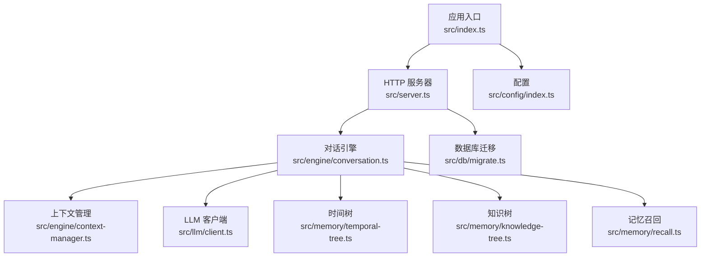
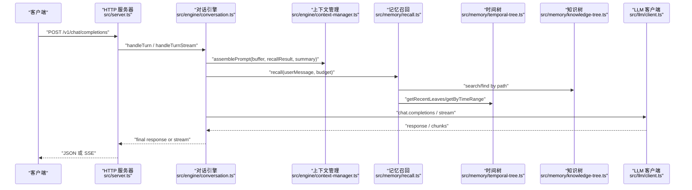
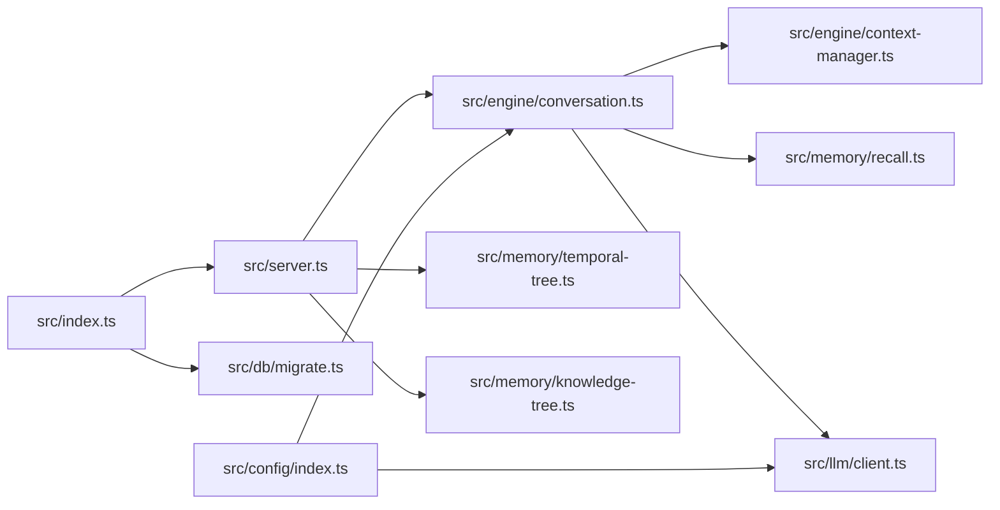
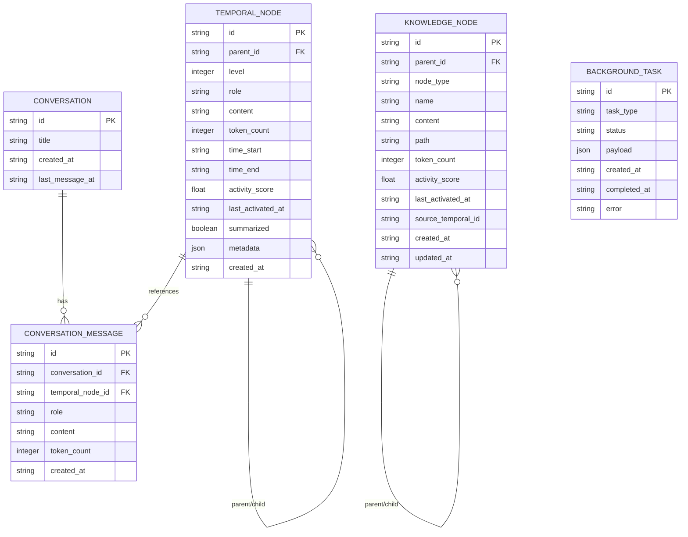

# API 参考

<cite>
**本文引用的文件**
- [src/server.ts](file://src/server.ts)
- [src/index.ts](file://src/index.ts)
- [src/config/index.ts](file://src/config/index.ts)
- [src/engine/conversation.ts](file://src/engine/conversation.ts)
- [src/engine/context-manager.ts](file://src/engine/context-manager.ts)
- [src/memory/knowledge-tree.ts](file://src/memory/knowledge-tree.ts)
- [src/memory/temporal-tree.ts](file://src/memory/temporal-tree.ts)
- [src/memory/recall.ts](file://src/memory/recall.ts)
- [src/memory/types.ts](file://src/memory/types.ts)
- [src/db/migrate.ts](file://src/db/migrate.ts)
- [src/llm/client.ts](file://src/llm/client.ts)
- [package.json](file://package.json)
- [src/utils/logger.ts](file://src/utils/logger.ts)
</cite>

## 目录
1. [简介](#简介)
2. [项目结构](#项目结构)
3. [核心组件](#核心组件)
4. [架构总览](#架构总览)
5. [详细组件分析](#详细组件分析)
6. [依赖关系分析](#依赖关系分析)
7. [性能考量](#性能考量)
8. [故障排查指南](#故障排查指南)
9. [结论](#结论)
10. [附录](#附录)

## 简介
本文件为 TreeMemory 的 HTTP API 参考文档，覆盖聊天接口、记忆查询、会话管理与健康检查等全部公开端点。文档提供每个端点的完整规范（方法、路径、请求头、请求体、响应结构）、认证与安全建议、错误码与异常处理、速率限制与配额策略、版本控制与兼容性说明，以及客户端集成示例与最佳实践。

## 项目结构
- 启动入口负责初始化数据库、后台调度器，并根据参数选择 CLI 或 HTTP 服务器模式启动。
- HTTP 服务器基于 Fastify，提供 OpenAI 兼容聊天接口、记忆检索接口、会话管理接口与健康检查。
- 引擎层负责对话回合处理、上下文组装与提示词构建。
- 记忆层包含时间树与知识树，支持按时间范围检索、关键词检索、路径检索与上下文拼接。
- 数据库迁移脚本定义初始表结构与索引。
- 配置模块从环境变量读取 LLM 基础地址、API Key、模型名、端口等运行参数。

图表来源
- [src/index.ts:1-36](file://src/index.ts#L1-L36)
- [src/server.ts:1-165](file://src/server.ts#L1-L165)
- [src/engine/conversation.ts:1-280](file://src/engine/conversation.ts#L1-L280)
- [src/engine/context-manager.ts:1-105](file://src/engine/context-manager.ts#L1-L105)
- [src/memory/temporal-tree.ts:1-362](file://src/memory/temporal-tree.ts#L1-L362)
- [src/memory/knowledge-tree.ts:1-239](file://src/memory/knowledge-tree.ts#L1-L239)
- [src/memory/recall.ts:1-168](file://src/memory/recall.ts#L1-L168)
- [src/db/migrate.ts:1-88](file://src/db/migrate.ts#L1-L88)
- [src/config/index.ts:1-30](file://src/config/index.ts#L1-L30)

章节来源
- [src/index.ts:1-36](file://src/index.ts#L1-L36)
- [src/server.ts:1-165](file://src/server.ts#L1-L165)
- [src/config/index.ts:1-30](file://src/config/index.ts#L1-L30)

## 核心组件
- HTTP 服务器：提供 REST 接口，采用 OpenAI 兼容风格的聊天完成端点，支持流式与非流式响应；提供记忆检索与知识树写入端点；提供会话列表、消息查询与删除端点；提供健康检查端点。
- 对话引擎：负责会话状态管理、消息持久化、摘要触发、记忆召回、提示词组装与 LLM 调用。
- 记忆系统：时间树按时间层级组织消息与摘要；知识树按路径组织类别与事实节点，支持关键词与路径检索。
- 配置系统：从环境变量加载 LLM 基础地址、API Key、模型名、端口、上下文令牌上限等。
- 数据库：通过迁移脚本创建时间树、知识树、会话、消息与后台任务表。

章节来源
- [src/server.ts:15-165](file://src/server.ts#L15-L165)
- [src/engine/conversation.ts:18-280](file://src/engine/conversation.ts#L18-L280)
- [src/memory/temporal-tree.ts:27-362](file://src/memory/temporal-tree.ts#L27-L362)
- [src/memory/knowledge-tree.ts:27-239](file://src/memory/knowledge-tree.ts#L27-L239)
- [src/db/migrate.ts:4-87](file://src/db/migrate.ts#L4-L87)
- [src/config/index.ts:5-30](file://src/config/index.ts#L5-L30)

## 架构总览
下图展示 HTTP 请求进入后，到对话处理与记忆检索的关键调用链路。

图表来源
- [src/server.ts:19-109](file://src/server.ts#L19-L109)
- [src/engine/conversation.ts:103-218](file://src/engine/conversation.ts#L103-L218)
- [src/engine/context-manager.ts:53-104](file://src/engine/context-manager.ts#L53-L104)
- [src/memory/recall.ts:95-167](file://src/memory/recall.ts#L95-L167)
- [src/memory/knowledge-tree.ts:138-238](file://src/memory/knowledge-tree.ts#L138-L238)
- [src/memory/temporal-tree.ts:66-296](file://src/memory/temporal-tree.ts#L66-L296)
- [src/llm/client.ts:20-55](file://src/llm/client.ts#L20-L55)

## 详细组件分析

### 聊天接口
- OpenAI 兼容聊天完成（非流式）
  - 方法与路径：POST /v1/chat/completions
  - 请求头：Content-Type: application/json
  - 请求体字段：
    - messages: 数组，元素包含 role 与 content，至少包含一条用户消息
    - model: 字符串，可选
    - stream: 布尔，可选（默认 false）
    - conversation_id: 字符串，可选
  - 成功响应字段：
    - id: 字符串，响应标识
    - object: 字符串，固定为 chat.completion
    - created: 整数，Unix 秒时间戳
    - model: 字符串，使用的模型名
    - conversation_id: 字符串，会话标识
    - choices: 数组，包含一个元素
      - index: 整数，索引
      - message: 对象，包含 role 与 content
      - finish_reason: 字符串，结束原因
    - usage: 对象，包含 prompt_tokens、completion_tokens、total_tokens
  - 错误响应：
    - 400：当 messages 缺失或为空，或未找到用户消息时返回错误对象
  - 示例：
    - 请求体示例路径：[请求体示例:20-25](file://src/server.ts#L20-L25)
    - 成功响应示例路径：[非流式响应结构:90-108](file://src/server.ts#L90-L108)
    - 错误响应示例路径：[400 错误:27-34](file://src/server.ts#L27-L34)

- OpenAI 兼容聊天完成（流式，SSE）
  - 方法与路径：POST /v1/chat/completions
  - 请求头：Content-Type: application/json
  - 请求体字段：同上，stream 设置为 true
  - 流式响应：
    - Content-Type: text/event-stream
    - Cache-Control: no-cache
    - Connection: keep-alive
    - 数据帧：choices[index].delta.content 连续片段
    - 结束帧：choices[index].finish_reason 为 stop，随后发送 data: [DONE]
  - 示例：
    - 流式响应示例路径：[SSE 写入:46-84](file://src/server.ts#L46-L84)

章节来源
- [src/server.ts:19-109](file://src/server.ts#L19-L109)

### 记忆查询接口
- 时间树查询（最近叶子或指定时间范围）
  - 方法与路径：GET /v1/memory/temporal
  - 查询参数：
    - from: ISO 时间字符串，可选
    - to: ISO 时间字符串，可选
    - level: 字符串，可选
  - 行为：
    - 若提供 from 与 to：返回该时间范围内的节点
    - 否则：返回最近叶子节点（默认限制 50）
  - 响应：节点数组
  - 示例：
    - 参数解析路径：[查询参数解析:112-118](file://src/server.ts#L112-L118)
    - 时间范围查询路径：[按时间范围查询:288-296](file://src/memory/temporal-tree.ts#L288-L296)
    - 最近叶子查询路径：[最近叶子查询:66-75](file://src/memory/temporal-tree.ts#L66-L75)

- 知识树查询（关键词搜索、路径查询、全量）
  - 方法与路径：GET /v1/memory/knowledge
  - 查询参数：
    - path: 字符串，路径前缀，可选
    - q: 字符串，关键词，可选
  - 行为：
    - 若提供 q：执行关键词搜索，返回高分节点
    - 若提供 path：按路径前缀返回节点
    - 否则：返回所有节点
  - 响应：节点数组
  - 示例：
    - 参数解析路径：[查询参数解析:120-129](file://src/server.ts#L120-L129)
    - 关键词搜索路径：[关键词搜索:138-164](file://src/memory/knowledge-tree.ts#L138-L164)
    - 路径查询路径：[路径查询:125-133](file://src/memory/knowledge-tree.ts#L125-L133)

- 知识树写入（Upsert）
  - 方法与路径：POST /v1/memory/knowledge
  - 请求头：Content-Type: application/json
  - 请求体字段：
    - path: 字符串数组，如 ["Work", "Company"]
    - content: 字符串，事实内容
  - 行为：沿路径创建类别节点，最终事实节点若存在则更新内容
  - 响应：写入的节点对象
  - 示例：
    - 请求体校验与写入路径：[写入逻辑:131-137](file://src/server.ts#L131-L137), [upsertPath:55-120](file://src/memory/knowledge-tree.ts#L55-L120)

章节来源
- [src/server.ts:112-137](file://src/server.ts#L112-L137)
- [src/memory/temporal-tree.ts:66-296](file://src/memory/temporal-tree.ts#L66-L296)
- [src/memory/knowledge-tree.ts:125-164](file://src/memory/knowledge-tree.ts#L125-L164)

### 会话管理接口
- 列出会话
  - 方法与路径：GET /v1/conversations
  - 响应：会话数组，包含 id、title、createdAt、lastMessageAt
  - 示例：
    - 实现路径：[列出会话:238-249](file://src/engine/conversation.ts#L238-L249)

- 获取会话消息
  - 方法与路径：GET /v1/conversations/:id
  - 路径参数：id: 会话标识
  - 响应：消息数组，包含 role、content、createdAt
  - 示例：
    - 实现路径：[获取消息:254-268](file://src/engine/conversation.ts#L254-L268)

- 删除会话
  - 方法与路径：DELETE /v1/conversations/:id
  - 路径参数：id: 会话标识
  - 响应：{ success: true }
  - 示例：
    - 实现路径：[删除会话:273-279](file://src/engine/conversation.ts#L273-L279)

章节来源
- [src/server.ts:139-153](file://src/server.ts#L139-L153)
- [src/engine/conversation.ts:238-279](file://src/engine/conversation.ts#L238-L279)

### 健康检查接口
- 方法与路径：GET /health
- 响应：{ status: 'ok' }

章节来源
- [src/server.ts:155-156](file://src/server.ts#L155-L156)

### 认证机制与安全考虑
- 当前实现未内置认证中间件，所有公开端点均无需鉴权即可访问。
- 建议在网关或反向代理层启用 API Key 管理与访问控制，例如：
  - 在反向代理中设置自定义请求头（如 X-API-Key），由上游服务校验
  - 使用网关的配额与速率限制功能
- LLM 凭据通过环境变量注入，避免硬编码在源码中。

章节来源
- [src/config/index.ts:18-29](file://src/config/index.ts#L18-L29)

### 错误码与异常处理
- 通用错误响应结构：包含 error 对象，其中 message 为错误描述
- 典型错误：
  - 400：messages 缺失或为空，或未找到用户消息
  - 5xx：内部错误（如 LLM 调用失败、数据库异常）
- 建议客户端：
  - 对 400 做输入校验与重试策略
  - 对 5xx 做指数退避重试与告警

章节来源
- [src/server.ts:27-34](file://src/server.ts#L27-L34)

### 速率限制与配额管理
- 当前实现未内置速率限制与配额控制。
- 建议方案：
  - 在反向代理或网关层配置每 IP/Key 的 QPS 与并发限制
  - 对长文本与流式接口单独限流
  - 结合业务维度（用户、租户）进行配额管理

[本节为通用建议，不直接分析具体文件]

### API 版本控制与向后兼容
- 当前使用 /v1 前缀，便于未来演进
- 建议策略：
  - 新增端点优先在 /v1 下扩展
  - 修改现有行为时保持默认语义不变，必要时引入可选参数
  - 重大变更发布新版本前缀（如 /v2）

[本节为通用建议，不直接分析具体文件]

### 客户端集成示例与最佳实践
- 非流式聊天：
  - 发送 POST /v1/chat/completions，设置 messages 与可选 model
  - 解析 choices[0].message.content 获取回复
- 流式聊天：
  - 设置 stream=true，逐段读取 SSE 数据帧
  - 收到 finish_reason 为 stop 且 [DONE] 后结束
- 记忆检索：
  - GET /v1/memory/temporal 可传 from/to 或仅获取最近叶子
  - GET /v1/memory/knowledge 可传 q 或 path
- 会话管理：
  - GET /v1/conversations 获取会话列表
  - GET /v1/conversations/:id 获取消息
  - DELETE /v1/conversations/:id 删除会话
- 最佳实践：
  - 将 conversation_id 透传以延续上下文
  - 控制单次 messages 总 token 不超过配置上限
  - 对长对话定期触发摘要以降低 token 使用

章节来源
- [src/server.ts:19-156](file://src/server.ts#L19-L156)

## 依赖关系分析

图表来源
- [src/server.ts:1-165](file://src/server.ts#L1-L165)
- [src/engine/conversation.ts:1-280](file://src/engine/conversation.ts#L1-L280)
- [src/engine/context-manager.ts:1-105](file://src/engine/context-manager.ts#L1-L105)
- [src/memory/recall.ts:1-168](file://src/memory/recall.ts#L1-L168)
- [src/memory/temporal-tree.ts:1-362](file://src/memory/temporal-tree.ts#L1-L362)
- [src/memory/knowledge-tree.ts:1-239](file://src/memory/knowledge-tree.ts#L1-L239)
- [src/llm/client.ts:1-56](file://src/llm/client.ts#L1-L56)
- [src/db/migrate.ts:1-88](file://src/db/migrate.ts#L1-L88)
- [src/index.ts:1-36](file://src/index.ts#L1-L36)
- [src/config/index.ts:1-30](file://src/config/index.ts#L1-L30)

## 性能考量
- 上下文预算分配：系统根据最大上下文令牌与阈值动态计算记忆召回预算，避免超出模型上下文长度。
- 时间树优先级：优先返回最近叶子，再按小时/天摘要补充，确保最新上下文优先。
- 知识树检索：先关键词召回，再按有效活跃度重排，提升相关性。
- 流式输出：SSE 流式返回可降低首字延迟，改善用户体验。
- 建议优化：
  - 控制单轮 messages 的 token 数，避免频繁摘要
  - 合理设置摘要阈值与历史摘要长度
  - 对高频检索建立缓存层（如 Redis）

章节来源
- [src/engine/context-manager.ts:98-104](file://src/engine/context-manager.ts#L98-L104)
- [src/memory/recall.ts:106-167](file://src/memory/recall.ts#L106-L167)
- [src/memory/temporal-tree.ts:222-283](file://src/memory/temporal-tree.ts#L222-L283)

## 故障排查指南
- 常见问题与解决：
  - 400 消息缺失：确保 messages 至少包含一条用户消息
  - LLM 调用失败：检查 LLM_BASE_URL 与 LLM_API_KEY 是否正确
  - 数据库异常：确认数据库文件路径与权限，查看迁移是否成功
- 日志定位：
  - 应用日志级别可通过 LOG_LEVEL 控制
  - 关键流程（摘要触发、任务队列）均有日志输出
- 建议排查步骤：
  - 先验证 /health 是否正常
  - 使用最小化 messages 复现问题
  - 检查环境变量与配置文件

章节来源
- [src/server.ts:27-34](file://src/server.ts#L27-L34)
- [src/config/index.ts:18-29](file://src/config/index.ts#L18-L29)
- [src/utils/logger.ts:1-10](file://src/utils/logger.ts#L1-L10)

## 结论
TreeMemory 提供了与 OpenAI 兼容的聊天接口与强大的树形记忆系统，支持时间与知识双维度检索。当前实现未内置认证与限流，建议在网关层补齐安全与治理能力。遵循本文档的端点规范与最佳实践，可快速集成并稳定运行。

## 附录

### 环境变量与配置
- LLM_BASE_URL：LLM 基础地址，默认 https://api.openai.com/v1
- LLM_API_KEY：LLM API Key
- LLM_MODEL：模型名称，默认 gpt-4o
- MAX_CONTEXT_TOKENS：最大上下文令牌数，默认 8192
- SUMMARIZE_THRESHOLD_RATIO：摘要触发阈值比例，默认 0.75
- DB_PATH：SQLite 文件路径，默认 ./treememory.db
- HTTP_PORT：HTTP 服务端口，默认 3000
- LOG_LEVEL：日志级别，默认 info

章节来源
- [src/config/index.ts:18-29](file://src/config/index.ts#L18-L29)

### 数据模型（简化）

图表来源
- [src/db/migrate.ts:9-81](file://src/db/migrate.ts#L9-L81)
- [src/memory/types.ts:11-32](file://src/memory/types.ts#L11-L32)