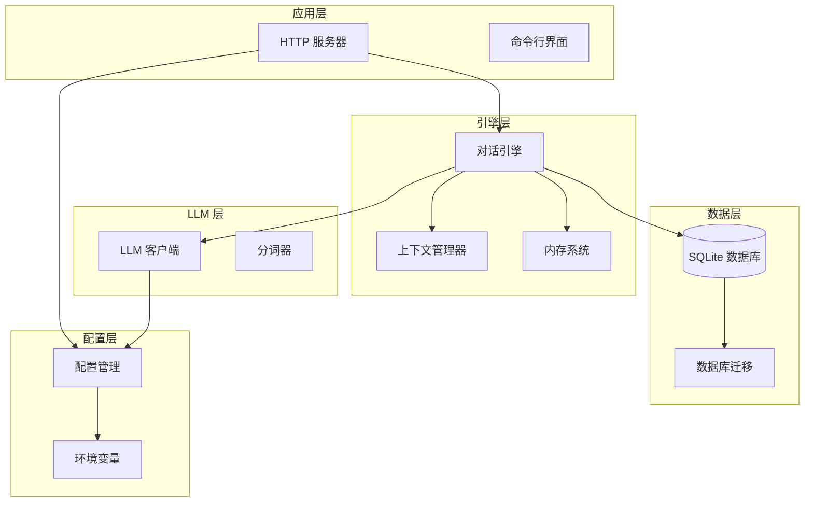
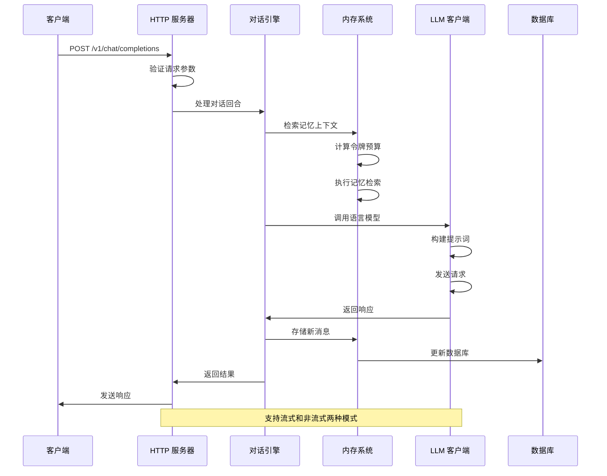
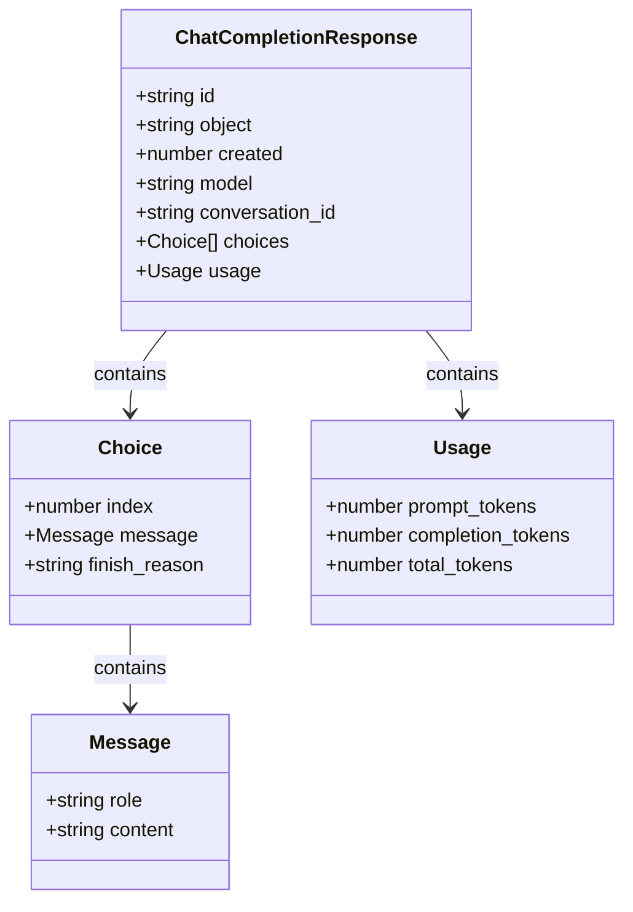
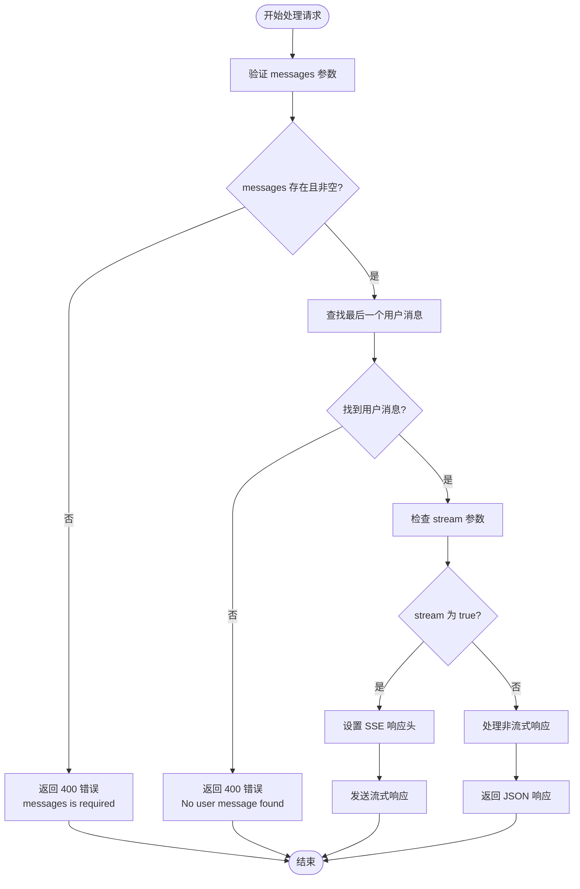
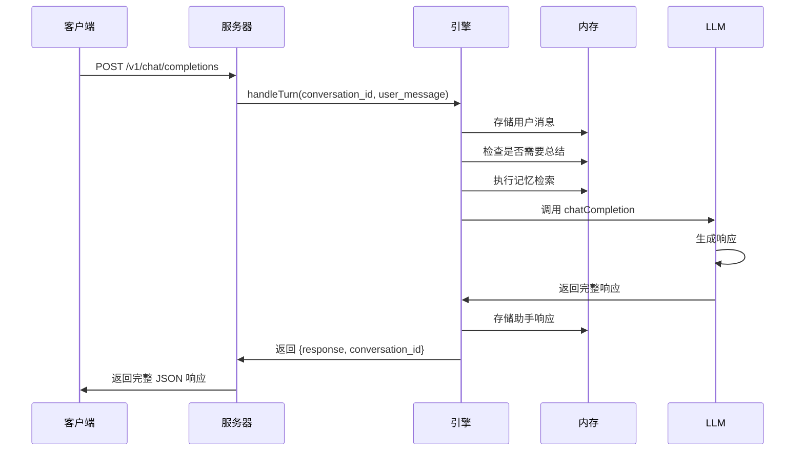
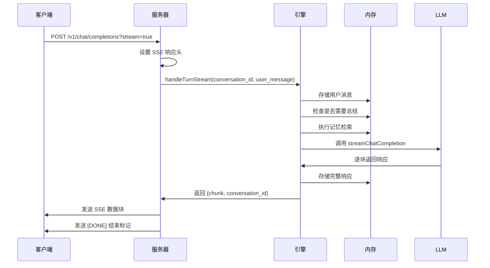
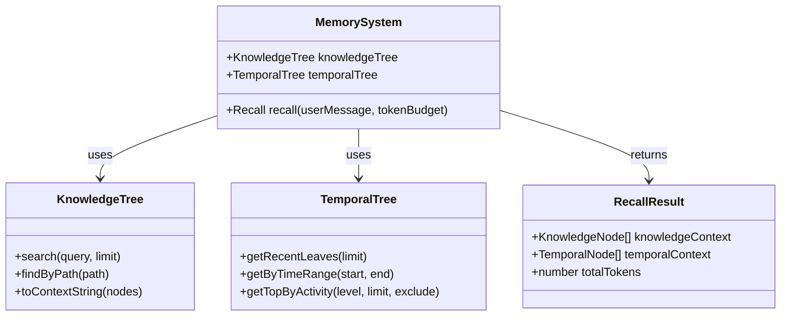
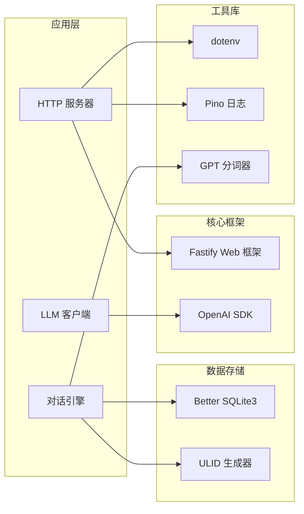
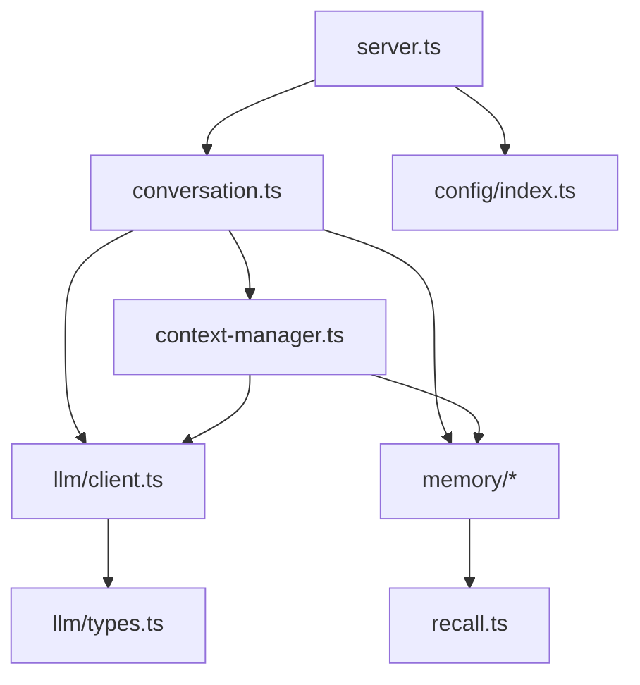

# 聊天完成接口

<cite>
**本文档引用的文件**
- [server.ts](file://src/server.ts)
- [conversation.ts](file://src/engine/conversation.ts)
- [client.ts](file://src/llm/client.ts)
- [types.ts](file://src/llm/types.ts)
- [index.ts](file://src/index.ts)
- [config/index.ts](file://src/config/index.ts)
- [context-manager.ts](file://src/engine/context-manager.ts)
- [recall.ts](file://src/memory/recall.ts)
- [migrate.ts](file://src/db/migrate.ts)
- [package.json](file://package.json)
</cite>

## 目录
1. [简介](#简介)
2. [项目结构](#项目结构)
3. [核心组件](#核心组件)
4. [架构概览](#架构概览)
5. [详细组件分析](#详细组件分析)
6. [依赖关系分析](#依赖关系分析)
7. [性能考虑](#性能考虑)
8. [故障排除指南](#故障排除指南)
9. [结论](#结论)

## 简介

聊天完成接口是 TreeMemory 项目中的核心 API 接口，提供与 OpenAI 兼容的聊天功能。该接口支持两种响应模式：非流式响应和流式 SSE（Server-Sent Events）响应，能够处理复杂的对话历史管理、记忆检索和上下文构建。

本接口实现了完整的 OpenAI 兼容聊天 API 规范，包括消息数组、模型名称、流式响应选项等标准参数，并提供了丰富的错误处理机制和性能优化特性。

## 项目结构

TreeMemory 采用模块化架构设计，主要分为以下几个核心模块：

**图表来源**
- [server.ts:15-165](file://src/server.ts#L15-L165)
- [conversation.ts:1-281](file://src/engine/conversation.ts#L1-L281)
- [client.ts:1-56](file://src/llm/client.ts#L1-L56)

**章节来源**
- [server.ts:15-165](file://src/server.ts#L15-L165)
- [index.ts:4-36](file://src/index.ts#L4-L36)

## 核心组件

### HTTP 服务器组件

HTTP 服务器基于 Fastify 框架构建，提供高性能的 HTTP 处理能力。主要负责路由管理、请求验证和响应格式化。

### 对话引擎组件

对话引擎是系统的核心处理单元，负责：
- 会话状态管理
- 消息存储和检索
- 记忆检索和上下文构建
- LLM 调用和响应处理

### LLM 客户端组件

LLM 客户端封装了与外部语言模型服务的交互，支持：
- 非流式和流式两种调用模式
- 参数配置和模型选择
- 错误处理和重试机制

**章节来源**
- [server.ts:18-109](file://src/server.ts#L18-L109)
- [conversation.ts:104-220](file://src/engine/conversation.ts#L104-L220)
- [client.ts:17-55](file://src/llm/client.ts#L17-L55)

## 架构概览

聊天完成接口的整体架构遵循分层设计原则，确保了良好的可维护性和扩展性：

**图表来源**
- [server.ts:19-109](file://src/server.ts#L19-L109)
- [conversation.ts:104-220](file://src/engine/conversation.ts#L104-L220)
- [client.ts:20-55](file://src/llm/client.ts#L20-L55)

## 详细组件分析

### API 端点定义

#### 基本信息
- **端点**: `/v1/chat/completions`
- **方法**: `POST`
- **内容类型**: `application/json`
- **认证**: 无（可选）
- **返回格式**: JSON

#### 请求参数

| 参数名 | 类型 | 必需 | 默认值 | 描述 |
|--------|------|------|--------|------|
| `messages` | 数组 | 是 | - | 消息数组，至少包含一个用户消息 |
| `model` | 字符串 | 否 | 配置文件中的模型 | LLM 模型名称 |
| `stream` | 布尔值 | 否 | `false` | 是否启用流式响应 |
| `conversation_id` | 字符串 | 否 | 自动生成 | 会话标识符 |

#### 消息对象结构

每个消息对象包含以下字段：

| 字段名 | 类型 | 必需 | 描述 |
|--------|------|------|------|
| `role` | 字符串 | 是 | 角色，可为 `system`、`user` 或 `assistant` |
| `content` | 字符串 | 是 | 消息内容 |

#### 非流式响应结构

**图表来源**
- [server.ts:88-108](file://src/server.ts#L88-L108)

#### 流式响应结构

流式响应使用 SSE 格式，每条消息包含：

| 字段名 | 类型 | 描述 |
|--------|------|------|
| `id` | 字符串 | 响应唯一标识符 |
| `object` | 字串 | 对象类型，固定为 `chat.completion.chunk` |
| `created` | 数字 | 时间戳 |
| `model` | 字符串 | 使用的模型名称 |
| `conversation_id` | 字符串 | 会话标识符 |
| `choices` | 数组 | 选择列表，包含增量内容 |

**章节来源**
- [server.ts:19-109](file://src/server.ts#L19-L109)
- [types.ts:1-12](file://src/llm/types.ts#L1-L12)

### 请求验证规则

系统实施了严格的请求验证机制：

**图表来源**
- [server.ts:27-34](file://src/server.ts#L27-L34)

**章节来源**
- [server.ts:27-34](file://src/server.ts#L27-L34)

### 处理流程

#### 非流式处理流程

**图表来源**
- [conversation.ts:104-161](file://src/engine/conversation.ts#L104-L161)
- [client.ts:20-32](file://src/llm/client.ts#L20-L32)

#### 流式处理流程

**图表来源**
- [conversation.ts:167-220](file://src/engine/conversation.ts#L167-L220)
- [client.ts:37-55](file://src/llm/client.ts#L37-L55)

**章节来源**
- [conversation.ts:104-220](file://src/engine/conversation.ts#L104-L220)

### 记忆系统集成

系统集成了多层次的记忆机制：

**图表来源**
- [recall.ts:95-167](file://src/memory/recall.ts#L95-L167)
- [context-manager.ts:51-90](file://src/engine/context-manager.ts#L51-L90)

**章节来源**
- [recall.ts:95-167](file://src/memory/recall.ts#L95-L167)
- [context-manager.ts:51-90](file://src/engine/context-manager.ts#L51-L90)

## 依赖关系分析

### 外部依赖

系统依赖于多个关键的外部库：

**图表来源**
- [package.json:17-26](file://package.json#L17-L26)
- [server.ts:1-13](file://src/server.ts#L1-L13)

### 内部依赖关系

**图表来源**
- [server.ts:4-12](file://src/server.ts#L4-L12)
- [conversation.ts:1-17](file://src/engine/conversation.ts#L1-L17)

**章节来源**
- [package.json:17-26](file://package.json#L17-L26)
- [server.ts:4-12](file://src/server.ts#L4-L12)

## 性能考虑

### 令牌管理

系统实现了智能的令牌预算管理机制：

- **最大上下文令牌**: 可通过环境变量配置，默认 8192
- **总结阈值**: 当达到最大令牌数的 75% 时触发自动总结
- **响应预留**: 为模型响应预留最多 2048 令牌
- **知识检索预算**: 为知识检索分配 25% 的令牌预算

### 内存优化

- **对话缓冲区**: 维护最近的消息缓冲区，避免重复加载历史
- **内存摘要**: 对旧对话进行摘要存储，减少令牌消耗
- **异步知识提取**: 实时知识提取不会阻塞响应

### 数据库优化

- **索引优化**: 为常用查询建立合适的索引
- **连接池**: 使用 SQLite 连接池提高并发性能
- **事务管理**: 合理使用事务确保数据一致性

## 故障排除指南

### 常见错误类型

| 错误代码 | 错误原因 | 解决方案 |
|----------|----------|----------|
| 400 | 缺少 messages 参数 | 确保请求体包含有效的 messages 数组 |
| 400 | 未找到用户消息 | 在 messages 中至少包含一条 role 为 user 的消息 |
| 500 | LLM 调用失败 | 检查 LLM API 密钥和网络连接 |
| 500 | 数据库连接失败 | 检查数据库文件权限和路径 |

### 调试建议

1. **启用详细日志**: 设置日志级别为 debug 来查看详细的处理流程
2. **检查环境变量**: 确认所有必需的环境变量已正确设置
3. **验证模型配置**: 确认 LLM 模型名称和 API 密钥有效
4. **监控资源使用**: 关注内存和 CPU 使用情况

### 性能监控

- **响应时间**: 监控从请求到响应的总时间
- **令牌使用**: 跟踪每次调用使用的令牌数量
- **数据库性能**: 监控查询执行时间和锁等待时间

**章节来源**
- [server.ts:27-34](file://src/server.ts#L27-L34)
- [config/index.ts:18-29](file://src/config/index.ts#L18-L29)

## 结论

聊天完成接口为 TreeMemory 项目提供了强大而灵活的聊天功能。通过实现 OpenAI 兼容的 API 规范，该接口不仅保持了与现有生态系统的兼容性，还集成了独特的记忆系统和上下文管理功能。

主要特点包括：
- **完全兼容**: 符合 OpenAI API 规范
- **双模式支持**: 同时支持流式和非流式响应
- **智能记忆**: 集成多层次的记忆检索系统
- **性能优化**: 智能的令牌管理和内存优化
- **错误处理**: 完善的错误处理和恢复机制

该接口为开发者提供了构建复杂 AI 应用程序的基础，无论是简单的聊天机器人还是复杂的对话式应用程序都能从中受益。