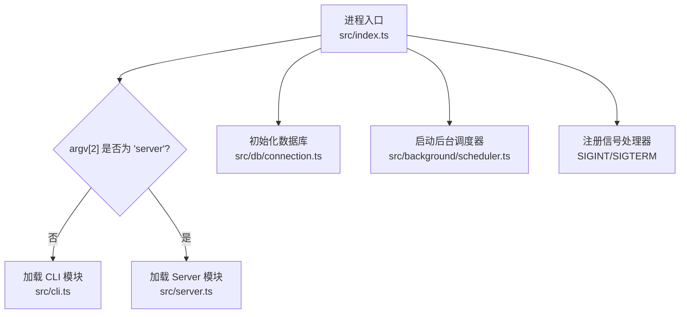
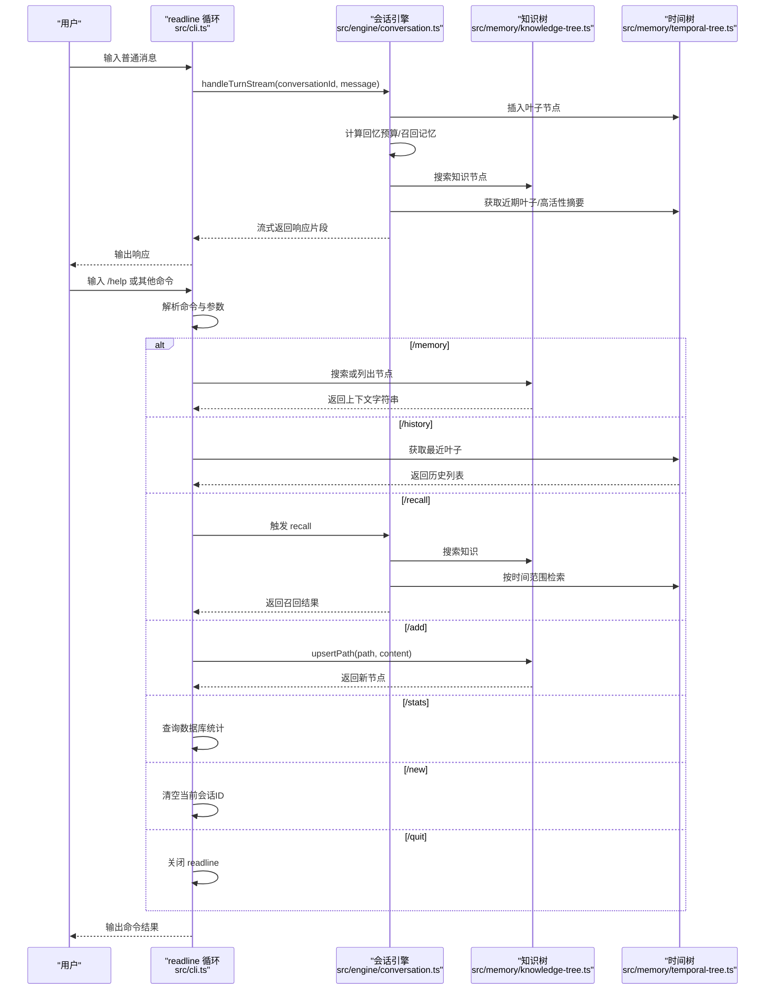
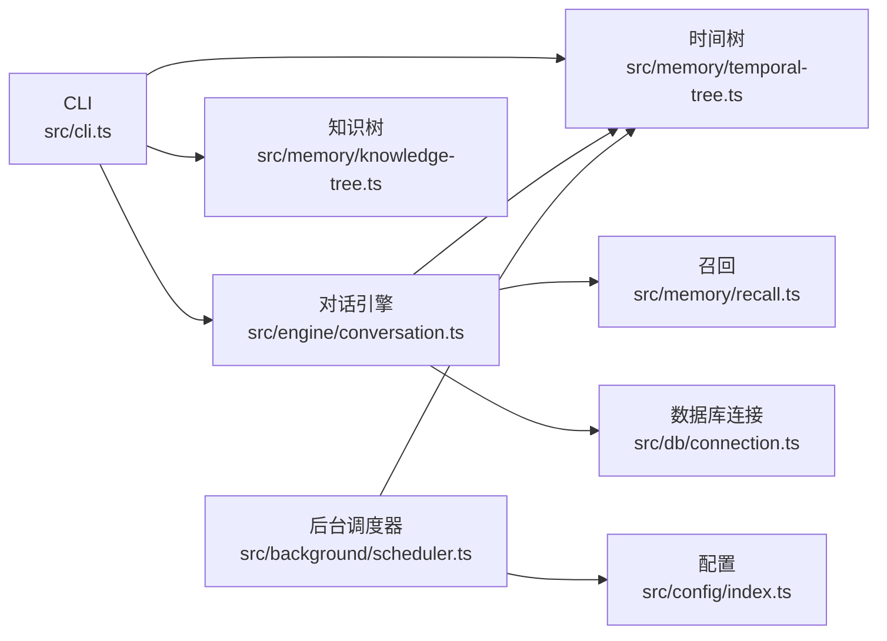

# CLI 接口

<cite>
**本文引用的文件**
- [src/cli.ts](file://src/cli.ts)
- [src/index.ts](file://src/index.ts)
- [src/config/index.ts](file://src/config/index.ts)
- [src/db/connection.ts](file://src/db/connection.ts)
- [src/memory/knowledge-tree.ts](file://src/memory/knowledge-tree.ts)
- [src/memory/temporal-tree.ts](file://src/memory/temporal-tree.ts)
- [src/memory/recall.ts](file://src/memory/recall.ts)
- [src/engine/conversation.ts](file://src/engine/conversation.ts)
- [src/background/scheduler.ts](file://src/background/scheduler.ts)
- [src/utils/logger.ts](file://src/utils/logger.ts)
- [package.json](file://package.json)
</cite>

## 目录
1. [简介](#简介)
2. [项目结构](#项目结构)
3. [核心组件](#核心组件)
4. [架构总览](#架构总览)
5. [详细组件分析](#详细组件分析)
6. [依赖关系分析](#依赖关系分析)
7. [性能考虑](#性能考虑)
8. [故障排除指南](#故障排除指南)
9. [结论](#结论)
10. [附录](#附录)

## 简介
本文件为 TreeMemory 的命令行接口（CLI）使用文档，面向希望直接通过终端进行交互或自动化使用的用户。文档覆盖：
- 交互式对话模式与批处理模式的使用方式
- 全局选项与运行模式（CLI/Server）
- 会话管理与配置命令
- 常见命令与参数解析规则
- 键盘快捷键与交互提示
- 故障排除与常见问题
- 与其他工具的集成方法与最佳实践
- 性能优化与批量处理建议

## 项目结构
TreeMemory 提供两种运行模式：
- CLI 模式：通过命令行交互进行对话与管理
- Server 模式：启动 HTTP 服务端，供外部调用

入口逻辑根据命令行参数选择模式，并初始化数据库与后台调度器。

图表来源
- [src/index.ts:4-30](file://src/index.ts#L4-L30)
- [src/db/connection.ts:8-17](file://src/db/connection.ts#L8-L17)
- [src/background/scheduler.ts:26-34](file://src/background/scheduler.ts#L26-L34)

章节来源
- [src/index.ts:4-30](file://src/index.ts#L4-L30)
- [package.json:6-12](file://package.json#L6-L12)

## 核心组件
- CLI 主循环与命令解析：负责读取用户输入、识别特殊命令、执行对话流与内部命令
- 会话引擎：负责消息存储、上下文组装、LLM 调用与流式输出
- 记忆模块：知识树与时间树的检索、统计与上下文拼接
- 配置与环境：通过环境变量控制 LLM、数据库、HTTP 端口、后台任务间隔等
- 数据库连接：初始化 SQLite 并迁移表结构
- 后台调度器：周期性触发时间树汇总与知识抽取

章节来源
- [src/cli.ts:8-195](file://src/cli.ts#L8-L195)
- [src/engine/conversation.ts:166-219](file://src/engine/conversation.ts#L166-L219)
- [src/memory/knowledge-tree.ts:138-164](file://src/memory/knowledge-tree.ts#L138-L164)
- [src/memory/temporal-tree.ts:66-75](file://src/memory/temporal-tree.ts#L66-L75)
- [src/config/index.ts:18-29](file://src/config/index.ts#L18-L29)
- [src/db/connection.ts:8-17](file://src/db/connection.ts#L8-L17)
- [src/background/scheduler.ts:26-34](file://src/background/scheduler.ts#L26-L34)

## 架构总览
CLI 的交互流程由 readline 循环驱动，支持两类输入：
- 普通消息：进入流式对话处理
- 特殊命令：以“/”开头的内部命令，用于查看知识树、历史、统计、新增知识、召回测试、新建会话、退出等

图表来源
- [src/cli.ts:19-53](file://src/cli.ts#L19-L53)
- [src/cli.ts:55-191](file://src/cli.ts#L55-L191)
- [src/engine/conversation.ts:166-219](file://src/engine/conversation.ts#L166-L219)
- [src/memory/knowledge-tree.ts:55-120](file://src/memory/knowledge-tree.ts#L55-L120)
- [src/memory/temporal-tree.ts:66-75](file://src/memory/temporal-tree.ts#L66-L75)

## 详细组件分析

### CLI 主循环与命令解析
- 交互提示：以“TreeMemory> ”作为提示符，支持空输入自动重试
- 命令识别：以“/”开头的命令会被解析并分发到对应处理函数
- 对话处理：非命令输入将进入流式对话处理，实时输出 LLM 响应片段
- 错误处理：捕获异常并输出错误信息，不影响交互循环

章节来源
- [src/cli.ts:19-53](file://src/cli.ts#L19-L53)
- [src/cli.ts:55-191](file://src/cli.ts#L55-L191)

### 会话管理与对话引擎
- 会话状态：按 ULID 标识，首次消息自动生成标题
- 缓冲区与摘要：当缓冲区达到阈值时触发摘要，减少上下文长度
- 流式输出：逐片返回 LLM 响应，同时在完成后持久化完整回复
- 背景任务：每 N 轮触发一次知识抽取任务排队

章节来源
- [src/engine/conversation.ts:23-68](file://src/engine/conversation.ts#L23-L68)
- [src/engine/conversation.ts:103-160](file://src/engine/conversation.ts#L103-L160)
- [src/engine/conversation.ts:166-219](file://src/engine/conversation.ts#L166-L219)

### 记忆与召回
- 知识树检索：基于关键词 LIKE 搜索并按有效活跃度排序
- 时间树检索：优先近期叶子，其次小时/天摘要，按有效活跃度补充
- 召回策略：结合关键词、时间范围与高活性历史，填充上下文预算

章节来源
- [src/memory/knowledge-tree.ts:138-164](file://src/memory/knowledge-tree.ts#L138-L164)
- [src/memory/temporal-tree.ts:222-283](file://src/memory/temporal-tree.ts#L222-L283)
- [src/memory/recall.ts:95-167](file://src/memory/recall.ts#L95-L167)

### 命令参考与使用示例

- /help
  - 用途：显示可用命令列表
  - 示例：直接输入 /help

- /memory
  - 用途：查看知识树或按关键词搜索
  - 无参数：列出根节点下的所有节点，显示名称、类型、活跃度
  - 有参数：按关键词搜索并以上下文字符串形式输出
  - 示例：/memory 工作

- /history
  - 用途：查看最近对话历史
  - 示例：/history

- /stats
  - 用途：查看数据库统计信息（会话数、时间树节点、知识树节点、当前会话）
  - 示例：/stats

- /new
  - 用途：开始新的对话（清空当前会话ID）
  - 示例：/new

- /recall <query>
  - 用途：测试记忆召回，输出知识上下文与时间记忆
  - 示例：/recall 会议安排

- /add <path> <content>
  - 用途：手动添加知识，路径段之间用“/”分隔
  - 示例：/add 姓名 小魏；/add 工作/公司 杭州智诺

- /quit 或 /exit
  - 用途：退出 CLI
  - 示例：/quit

章节来源
- [src/cli.ts:61-72](file://src/cli.ts#L61-L72)
- [src/cli.ts:75-99](file://src/cli.ts#L75-L99)
- [src/cli.ts:102-115](file://src/cli.ts#L102-L115)
- [src/cli.ts:118-134](file://src/cli.ts#L118-L134)
- [src/cli.ts:137-140](file://src/cli.ts#L137-L140)
- [src/cli.ts:142-164](file://src/cli.ts#L142-L164)
- [src/cli.ts:167-179](file://src/cli.ts#L167-L179)
- [src/cli.ts:181-186](file://src/cli.ts#L181-L186)

### 参数解析规则与默认行为
- 命令解析：以空白分割命令与参数，首段为命令名，其余为参数字符串
- /add 参数：要求“路径 段 内容”，使用第一个空格后的第一个子串作为路径，剩余部分作为内容
- 默认会话：首次对话后会生成会话ID；/new 可重置
- 错误处理：命令无效时提示“未知命令”，并引导使用 /help

章节来源
- [src/cli.ts:55-59](file://src/cli.ts#L55-L59)
- [src/cli.ts:167-171](file://src/cli.ts#L167-L171)
- [src/cli.ts:188-190](file://src/cli.ts#L188-L190)

### 键盘快捷键与交互提示
- 提示符：TreeMemory>
- 常用操作：输入消息进行对话；输入 /help 查看命令；输入 /quit 退出
- 流式输出：对话过程中实时显示 LLM 响应片段

章节来源
- [src/cli.ts:16-17](file://src/cli.ts#L16-L17)
- [src/cli.ts:19-53](file://src/cli.ts#L19-L53)

### 会话管理命令
- /new：开始新对话，清空当前会话ID
- /recall：触发记忆召回，输出知识与时间记忆
- /history：查看最近叶子节点
- /stats：查看数据库统计

章节来源
- [src/cli.ts:137-140](file://src/cli.ts#L137-L140)
- [src/cli.ts:142-164](file://src/cli.ts#L142-L164)
- [src/cli.ts:102-115](file://src/cli.ts#L102-L115)
- [src/cli.ts:118-134](file://src/cli.ts#L118-L134)

### 配置命令与环境变量
- 运行模式：通过命令行参数选择 CLI 或 Server
  - CLI：dev:cli
  - Server：dev:server
- 环境变量（来自配置模块）：
  - LLM_BASE_URL、LLM_API_KEY、LLM_MODEL
  - MAX_CONTEXT_TOKENS、SUMMARIZE_THRESHOLD_RATIO
  - DB_PATH、HTTP_PORT
  - BACKGROUND_INTERVAL_MS
  - ACTIVITY_DECAY_RATE、ACTIVITY_BOOST
- 日志级别：LOG_LEVEL

章节来源
- [src/index.ts:5](file://src/index.ts#L5)
- [package.json:6-12](file://package.json#L6-L12)
- [src/config/index.ts:18-29](file://src/config/index.ts#L18-L29)
- [src/utils/logger.ts:8](file://src/utils/logger.ts#L8)

## 依赖关系分析
CLI 与核心模块的依赖关系如下：

图表来源
- [src/cli.ts:2-6](file://src/cli.ts#L2-L6)
- [src/engine/conversation.ts:1-16](file://src/engine/conversation.ts#L1-L16)
- [src/memory/knowledge-tree.ts:1-6](file://src/memory/knowledge-tree.ts#L1-L6)
- [src/memory/temporal-tree.ts:1-7](file://src/memory/temporal-tree.ts#L1-L7)
- [src/memory/recall.ts:1-5](file://src/memory/recall.ts#L1-L5)
- [src/db/connection.ts:1-4](file://src/db/connection.ts#L1-L4)
- [src/background/scheduler.ts:1-4](file://src/background/scheduler.ts#L1-L4)
- [src/config/index.ts:1-3](file://src/config/index.ts#L1-L3)

## 性能考虑
- 流式输出：对话采用流式返回，降低等待时间，提升交互体验
- 上下文压缩：当缓冲区达到阈值时自动摘要，减少上下文长度
- 回忆预算：根据当前缓冲区大小动态计算回忆预算，平衡召回质量与性能
- 后台汇总：周期性对时间树进行小时/天摘要，减少检索成本
- 知识树检索：先 LIKE 搜索再按有效活跃度重排，兼顾召回率与相关性

章节来源
- [src/engine/conversation.ts:120-137](file://src/engine/conversation.ts#L120-L137)
- [src/memory/recall.ts:95-167](file://src/memory/recall.ts#L95-L167)
- [src/background/scheduler.ts:26-34](file://src/background/scheduler.ts#L26-L34)

## 故障排除指南
- 无法启动 CLI
  - 检查 Node 版本是否满足要求（>=18）
  - 确认已安装依赖并正确构建
  - 参考：[package.json:14-16](file://package.json#L14-L16)

- 无法连接数据库
  - 检查 DB_PATH 环境变量是否正确
  - 确认数据库文件可写
  - 参考：[src/db/connection.ts:8-17](file://src/db/connection.ts#L8-L17)，[src/config/index.ts:24](file://src/config/index.ts#L24)

- LLM 调用失败
  - 检查 LLM_API_KEY、LLM_BASE_URL、LLM_MODEL
  - 确认网络连通性与配额
  - 参考：[src/config/index.ts:18-22](file://src/config/index.ts#L18-L22)

- 命令无效
  - 使用 /help 查看可用命令
  - 确认命令以“/”开头且参数格式正确
  - 参考：[src/cli.ts:188-190](file://src/cli.ts#L188-L190)

- 退出后残留进程
  - 使用 SIGINT（Ctrl+C）或 SIGTERM 正常关闭
  - 参考：[src/index.ts:14-21](file://src/index.ts#L14-L21)

- 日志级别调整
  - 设置 LOG_LEVEL 环境变量
  - 参考：[src/utils/logger.ts:8](file://src/utils/logger.ts#L8)

章节来源
- [package.json:14-16](file://package.json#L14-L16)
- [src/db/connection.ts:8-17](file://src/db/connection.ts#L8-L17)
- [src/config/index.ts:18-29](file://src/config/index.ts#L18-L29)
- [src/cli.ts:188-190](file://src/cli.ts#L188-L190)
- [src/index.ts:14-21](file://src/index.ts#L14-L21)
- [src/utils/logger.ts:8](file://src/utils/logger.ts#L8)

## 结论
TreeMemory 的 CLI 提供了简洁直观的交互方式，支持知识树浏览、历史查看、统计信息、手动添加知识、记忆召回与会话管理。通过合理的参数解析与默认行为，用户可在交互式与批处理场景中高效使用。配合后台调度器与上下文压缩机制，系统在长对话与大规模记忆场景下仍能保持良好性能。

## 附录

### 常见使用示例
- 交互式对话
  - 输入任意消息开始对话
  - 使用 /help 查看命令
  - 使用 /memory 查看知识树
  - 使用 /recall 测试召回
  - 使用 /new 开始新对话
  - 使用 /quit 退出

- 批处理模式
  - 通过脚本调用 CLI 并传入命令
  - 示例：echo "/memory 工作" | npm run dev:cli
  - 注意：批处理需确保标准输入可读，避免阻塞

- 服务器模式
  - 启动 HTTP 服务：npm run dev:server
  - 通过 HTTP 接口与系统交互（需配合服务端实现）

章节来源
- [src/cli.ts:16-17](file://src/cli.ts#L16-L17)
- [src/cli.ts:61-72](file://src/cli.ts#L61-L72)
- [package.json:6-12](file://package.json#L6-L12)