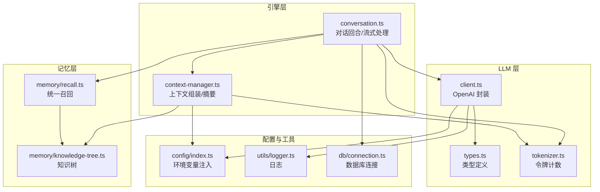
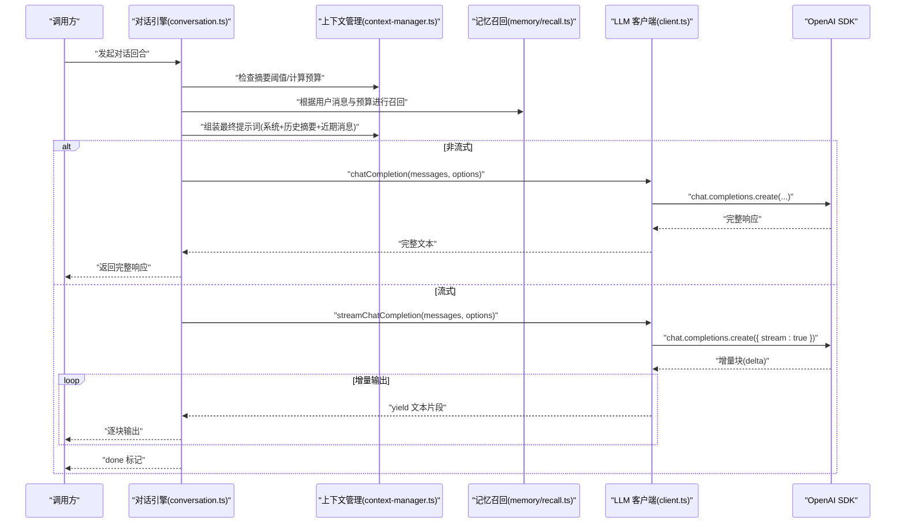
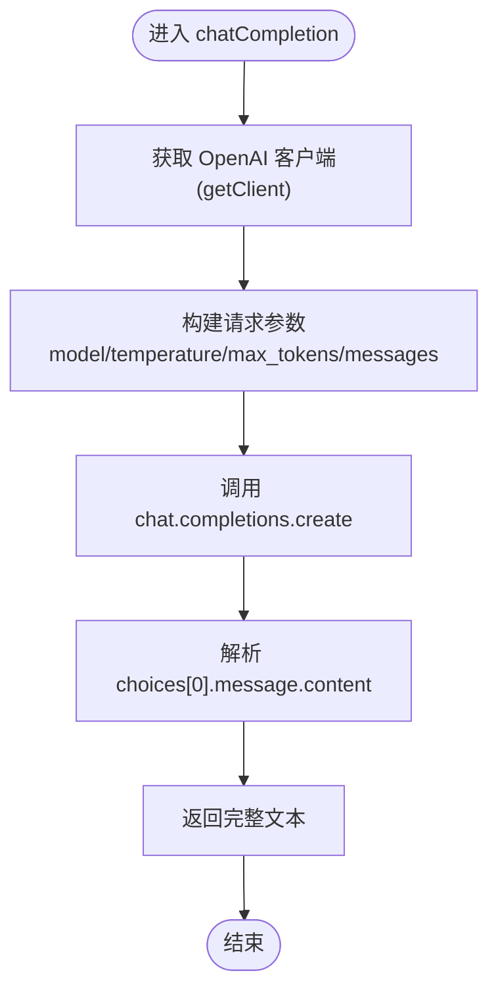
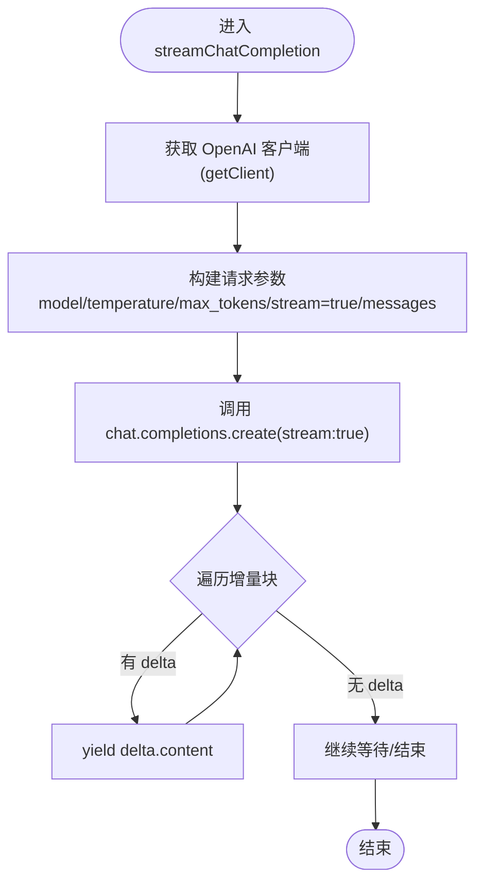
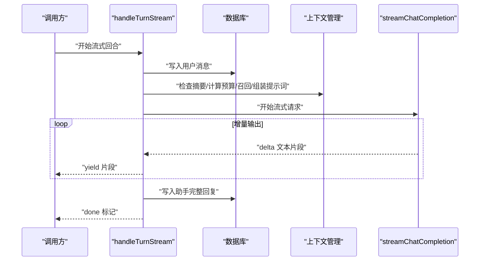
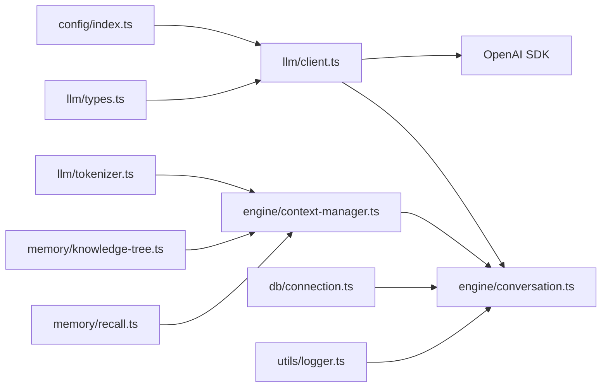

# API 客户端

<cite>
**本文引用的文件**
- [src/llm/client.ts](file://src/llm/client.ts)
- [src/llm/types.ts](file://src/llm/types.ts)
- [src/config/index.ts](file://src/config/index.ts)
- [src/engine/context-manager.ts](file://src/engine/context-manager.ts)
- [src/engine/conversation.ts](file://src/engine/conversation.ts)
- [src/llm/tokenizer.ts](file://src/llm/tokenizer.ts)
- [src/memory/recall.ts](file://src/memory/recall.ts)
- [src/memory/knowledge-tree.ts](file://src/memory/knowledge-tree.ts)
- [src/utils/logger.ts](file://src/utils/logger.ts)
- [src/db/connection.ts](file://src/db/connection.ts)
- [package.json](file://package.json)
</cite>

## 目录
1. [简介](#简介)
2. [项目结构](#项目结构)
3. [核心组件](#核心组件)
4. [架构总览](#架构总览)
5. [详细组件分析](#详细组件分析)
6. [依赖关系分析](#依赖关系分析)
7. [性能考量](#性能考量)
8. [故障排查指南](#故障排查指南)
9. [结论](#结论)
10. [附录](#附录)

## 简介
本文件面向 TreeMemory 的 LLM API 客户端模块，聚焦于 OpenAI SDK 的封装实现，系统性阐述两类调用模式：
- 非流式对话完成：一次性返回完整文本
- 流式对话完成：按块增量返回文本，支持异步迭代

文档同时覆盖客户端初始化机制（单例与延迟加载）、参数构建（消息格式化、温度、最大令牌数、模型选择）、流式响应实现（异步迭代器、SSE 风格增量输出）、错误处理策略（网络异常、速率限制、认证失败），并给出最佳实践与示例路径。

## 项目结构
LLM 客户端位于 src/llm 目录，配合配置、上下文管理、对话引擎、分词器与内存召回等模块协同工作。

图表来源
- [src/llm/client.ts:1-56](file://src/llm/client.ts#L1-L56)
- [src/llm/types.ts:1-12](file://src/llm/types.ts#L1-L12)
- [src/llm/tokenizer.ts:1-26](file://src/llm/tokenizer.ts#L1-L26)
- [src/engine/context-manager.ts:1-105](file://src/engine/context-manager.ts#L1-L105)
- [src/engine/conversation.ts:1-280](file://src/engine/conversation.ts#L1-L280)
- [src/config/index.ts:1-30](file://src/config/index.ts#L1-L30)
- [src/utils/logger.ts:1-10](file://src/utils/logger.ts#L1-L10)
- [src/db/connection.ts:1-26](file://src/db/connection.ts#L1-L26)
- [src/memory/recall.ts:1-168](file://src/memory/recall.ts#L1-L168)
- [src/memory/knowledge-tree.ts:1-239](file://src/memory/knowledge-tree.ts#L1-L239)

章节来源
- [src/llm/client.ts:1-56](file://src/llm/client.ts#L1-L56)
- [src/config/index.ts:1-30](file://src/config/index.ts#L1-L30)

## 核心组件
- OpenAI 客户端封装：提供非流式与流式两类聊天完成接口，内部通过单例与延迟加载持有 OpenAI 实例，统一读取配置中的 base URL、API Key、默认模型。
- 类型系统：定义 ChatMessage 与 CompletionOptions，确保消息角色、内容与可选参数的强类型约束。
- 上下文管理：负责是否触发摘要、计算回忆预算、拼装最终提示词（系统+历史摘要+近期消息）。
- 对话引擎：封装一次完整对话回合（非流式）与流式对话回合（增量输出），并在回合结束后持久化消息与更新缓冲区统计。
- 分词器：基于 gpt-tokenizer 计算文本与消息数组的令牌数，用于预算控制与摘要阈值判断。
- 内存召回：关键词提取、时间范围解析、知识树与时间树的多阶段检索与评分，填充上下文。

章节来源
- [src/llm/client.ts:1-56](file://src/llm/client.ts#L1-L56)
- [src/llm/types.ts:1-12](file://src/llm/types.ts#L1-L12)
- [src/engine/context-manager.ts:1-105](file://src/engine/context-manager.ts#L1-L105)
- [src/engine/conversation.ts:1-280](file://src/engine/conversation.ts#L1-L280)
- [src/llm/tokenizer.ts:1-26](file://src/llm/tokenizer.ts#L1-L26)
- [src/memory/recall.ts:1-168](file://src/memory/recall.ts#L1-L168)
- [src/memory/knowledge-tree.ts:1-239](file://src/memory/knowledge-tree.ts#L1-L239)

## 架构总览
下图展示从对话回合到 LLM 调用的关键流程，以及两种模式的差异点。

图表来源
- [src/engine/conversation.ts:103-160](file://src/engine/conversation.ts#L103-L160)
- [src/engine/conversation.ts:166-219](file://src/engine/conversation.ts#L166-L219)
- [src/engine/context-manager.ts:53-92](file://src/engine/context-manager.ts#L53-L92)
- [src/memory/recall.ts:95-167](file://src/memory/recall.ts#L95-L167)
- [src/llm/client.ts:20-55](file://src/llm/client.ts#L20-L55)

## 详细组件分析

### OpenAI 客户端封装（client.ts）
- 单例与延迟加载
  - 使用私有变量保存 OpenAI 实例，首次调用 getClient 时才创建，避免无用初始化。
  - 初始化参数来自全局配置对象，包括 base URL、API Key、默认模型。
- 非流式聊天完成
  - 接口签名：接收消息数组与可选选项，返回完整字符串。
  - 默认模型优先使用传入 options.model，否则回退到配置中的 llmModel。
  - 温度默认 0.7，最大令牌数可选传入。
- 流式聊天完成
  - 接口签名：返回异步迭代器，逐块产出文本片段。
  - 关键在于将 stream 参数设为 true，随后遍历返回的流对象，从每个增量中提取 delta.content 并 yield。
  - 适合需要实时反馈的交互场景，如打字机效果。

图表来源
- [src/llm/client.ts:20-32](file://src/llm/client.ts#L20-L32)

图表来源
- [src/llm/client.ts:37-55](file://src/llm/client.ts#L37-L55)

章节来源
- [src/llm/client.ts:1-56](file://src/llm/client.ts#L1-L56)
- [src/config/index.ts:18-29](file://src/config/index.ts#L18-L29)

### 类型系统（types.ts）
- ChatMessage：限定角色为 system、user、assistant，内容为字符串。
- CompletionOptions：包含可选的 model、temperature、maxTokens、stream。
- 作用：保证调用侧传参与 SDK 请求字段一致，减少运行期错误。

章节来源
- [src/llm/types.ts:1-12](file://src/llm/types.ts#L1-L12)

### 上下文管理（context-manager.ts）
- 摘要触发条件：当缓冲区令牌数超过阈值（maxContextTokens × summarizeThresholdRatio）时触发。
- 缓冲区摘要：对旧一半的消息进行摘要生成，作为系统消息插入，降低后续上下文成本。
- 提示词组装：
  - 系统消息：基础提示 + 知识树上下文
  - 历史摘要：来自时间树的历史摘要
  - 本次对话早期摘要：来自内存在该会话内的累积摘要
  - 近期消息：当前对话缓冲区
- 回忆预算计算：预留响应空间，结合系统提示与缓冲区估算可用令牌数，供召回使用。

章节来源
- [src/engine/context-manager.ts:15-17](file://src/engine/context-manager.ts#L15-L17)
- [src/engine/context-manager.ts:23-42](file://src/engine/context-manager.ts#L23-L42)
- [src/engine/context-manager.ts:53-92](file://src/engine/context-manager.ts#L53-L92)
- [src/engine/context-manager.ts:98-104](file://src/engine/context-manager.ts#L98-L104)

### 对话引擎（conversation.ts）
- 会话状态管理：基于内存 Map 维护每个会话的缓冲区、令牌数与轮次；必要时从数据库加载最近消息。
- 非流式回合：
  - 存储用户消息
  - 首条消息自动生成标题
  - 触发摘要（若超出阈值）
  - 召回记忆并组装提示词
  - 调用非流式 LLM 完成，存储助手回复
  - 每五轮入队知识抽取后台任务
- 流式回合：
  - 同上步骤，但调用流式 LLM 完成
  - 在增量块到达时立即 yield，累积完整响应，最后存储并标记 done

图表来源
- [src/engine/conversation.ts:166-219](file://src/engine/conversation.ts#L166-L219)
- [src/engine/conversation.ts:103-160](file://src/engine/conversation.ts#L103-L160)

章节来源
- [src/engine/conversation.ts:18-68](file://src/engine/conversation.ts#L18-L68)
- [src/engine/conversation.ts:103-160](file://src/engine/conversation.ts#L103-L160)
- [src/engine/conversation.ts:166-219](file://src/engine/conversation.ts#L166-L219)

### 分词器（tokenizer.ts）
- 文本令牌计数：基于 gpt-tokenizer 的 encode 结果长度。
- 消息数组令牌计数：考虑每条消息的固定开销与角色、内容的编码长度，模拟 OpenAI 的消息格式开销。

章节来源
- [src/llm/tokenizer.ts:9-25](file://src/llm/tokenizer.ts#L9-L25)

### 内存召回（recall.ts）
- 关键词提取：对中文与混合文本进行分词、去停用词、生成二元子词，形成关键词集合。
- 时间参考：识别“今天/昨天/前天/上周”等自然语言时间，转换为 ISO 时间范围。
- 多阶段召回：
  - 知识树：按关键词搜索，按有效活跃度排序，占用约 25% 的预算。
  - 最近叶子：始终包含，占用剩余预算。
  - 时间范围：若存在时间参考且预算充足，按有效分数排序后加入。
  - 历史摘要：填充剩余预算，优先高活跃度摘要。
- 输出：返回知识上下文与时间上下文节点列表，以及总令牌消耗。

章节来源
- [src/memory/recall.ts:12-52](file://src/memory/recall.ts#L12-L52)
- [src/memory/recall.ts:58-89](file://src/memory/recall.ts#L58-L89)
- [src/memory/recall.ts:95-167](file://src/memory/recall.ts#L95-L167)

### 知识树（knowledge-tree.ts）
- 路径维护：确保根节点存在，沿路径创建分类节点，末级为事实叶节点。
- 查询与激活：支持按路径前缀查找、全文检索（LIKE + 活跃度重排）、按活跃度获取子树。
- 上下文格式化：将知识节点序列化为可读的上下文字符串，供系统提示词使用。

章节来源
- [src/memory/knowledge-tree.ts:55-120](file://src/memory/knowledge-tree.ts#L55-L120)
- [src/memory/knowledge-tree.ts:138-164](file://src/memory/knowledge-tree.ts#L138-L164)
- [src/memory/knowledge-tree.ts:188-202](file://src/memory/knowledge-tree.ts#L188-L202)

## 依赖关系分析
- 客户端依赖配置模块提供 base URL、API Key、默认模型；依赖类型模块确保参数正确性。
- 对话引擎依赖客户端（非流式/流式）、上下文管理、分词器、记忆召回；同时依赖数据库连接进行持久化。
- 上下文管理依赖知识树与分词器；记忆召回依赖知识树与活动评分。
- 日志与数据库连接贯穿多个模块，提供可观测性与持久化保障。

图表来源
- [src/config/index.ts:1-30](file://src/config/index.ts#L1-L30)
- [src/llm/client.ts:1-56](file://src/llm/client.ts#L1-L56)
- [src/llm/types.ts:1-12](file://src/llm/types.ts#L1-L12)
- [src/llm/tokenizer.ts:1-26](file://src/llm/tokenizer.ts#L1-L26)
- [src/engine/context-manager.ts:1-105](file://src/engine/context-manager.ts#L1-L105)
- [src/memory/recall.ts:1-168](file://src/memory/recall.ts#L1-L168)
- [src/memory/knowledge-tree.ts:1-239](file://src/memory/knowledge-tree.ts#L1-L239)
- [src/engine/conversation.ts:1-280](file://src/engine/conversation.ts#L1-L280)
- [src/db/connection.ts:1-26](file://src/db/connection.ts#L1-L26)
- [src/utils/logger.ts:1-10](file://src/utils/logger.ts#L1-L10)

章节来源
- [src/engine/conversation.ts:1-280](file://src/engine/conversation.ts#L1-L280)
- [src/llm/client.ts:1-56](file://src/llm/client.ts#L1-L56)

## 性能考量
- 令牌预算控制
  - 通过分词器估算系统提示、缓冲区与响应预留，避免超出模型上下文上限。
  - 上下文管理在组装提示词前计算可用预算，确保召回阶段不会越界。
- 摘要与压缩
  - 当缓冲区接近阈值时触发摘要，显著降低后续请求的上下文成本。
  - 历史摘要合并到会话内，减少重复信息。
- 流式输出
  - 流式模式可提前感知响应，改善用户体验；但需注意网络抖动导致的断流与重连策略。
- 数据库与并发
  - 数据库连接采用延迟加载与单实例，避免频繁打开关闭；会话状态在内存中缓存，减少查询压力。

章节来源
- [src/engine/context-manager.ts:98-104](file://src/engine/context-manager.ts#L98-L104)
- [src/engine/context-manager.ts:23-42](file://src/engine/context-manager.ts#L23-L42)
- [src/llm/tokenizer.ts:17-25](file://src/llm/tokenizer.ts#L17-L25)
- [src/db/connection.ts:8-17](file://src/db/connection.ts#L8-L17)

## 故障排查指南
- 认证失败
  - 症状：401 未授权或 SDK 抛出认证异常。
  - 排查：确认环境变量 LLM_API_KEY 是否设置，且与 base URL 匹配；检查配置注入是否生效。
  - 参考路径：[src/config/index.ts:18-29](file://src/config/index.ts#L18-L29)、[src/llm/client.ts:7-15](file://src/llm/client.ts#L7-L15)
- 网络异常
  - 症状：超时、连接中断、DNS 解析失败。
  - 排查：检查 LLM_BASE_URL 是否可达；在流式模式下，建议增加重试与断线恢复逻辑。
  - 参考路径：[src/llm/client.ts:42-48](file://src/llm/client.ts#L42-L48)
- 速率限制
  - 症状：429 太多请求；SDK 可能抛出速率限制异常。
  - 排查：降低并发与请求频率；在对话引擎中增加指数退避与重试。
  - 参考路径：[src/engine/conversation.ts:166-219](file://src/engine/conversation.ts#L166-L219)
- 上下文过长
  - 症状：400 参数错误或上下文溢出。
  - 排查：检查摘要阈值与预算计算；确认知识树与时间树召回是否过度。
  - 参考路径：[src/engine/context-manager.ts:15-17](file://src/engine/context-manager.ts#L15-L17)、[src/engine/context-manager.ts:98-104](file://src/engine/context-manager.ts#L98-L104)
- 日志定位
  - 使用内置日志记录摘要触发、数据库连接状态等关键事件，便于问题追踪。
  - 参考路径：[src/utils/logger.ts:1-10](file://src/utils/logger.ts#L1-L10)、[src/db/connection.ts:13-14](file://src/db/connection.ts#L13-L14)

章节来源
- [src/config/index.ts:18-29](file://src/config/index.ts#L18-L29)
- [src/llm/client.ts:7-15](file://src/llm/client.ts#L7-L15)
- [src/engine/conversation.ts:166-219](file://src/engine/conversation.ts#L166-L219)
- [src/engine/context-manager.ts:15-17](file://src/engine/context-manager.ts#L15-L17)
- [src/engine/context-manager.ts:98-104](file://src/engine/context-manager.ts#L98-L104)
- [src/utils/logger.ts:1-10](file://src/utils/logger.ts#L1-L10)
- [src/db/connection.ts:13-14](file://src/db/connection.ts#L13-L14)

## 结论
TreeMemory 的 LLM 客户端以 OpenAI SDK 为基础，通过单例与延迟加载实现高效初始化，提供非流式与流式两类完成接口，满足不同交互需求。配合上下文管理、令牌预算、摘要与多阶段召回，系统在长上下文与复杂对话中保持稳定与高效。建议在生产环境中完善重试、限速与断线恢复策略，并持续监控日志与数据库连接状态。

## 附录
- 环境变量与默认值
  - LLM_BASE_URL：默认 https://api.openai.com/v1
  - LLM_API_KEY：必填
  - LLM_MODEL：默认 gpt-4o
  - MAX_CONTEXT_TOKENS：默认 8192
  - SUMMARIZE_THRESHOLD_RATIO：默认 0.75
  - 其他：数据库路径、HTTP 端口、后台任务间隔、活动衰减与增益等
  - 参考路径：[src/config/index.ts:18-29](file://src/config/index.ts#L18-L29)
- 依赖版本
  - openai、gpt-tokenizer、better-sqlite3、dotenv、fastify、pino、ulid 等
  - 参考路径：[package.json:17-26](file://package.json#L17-L26)