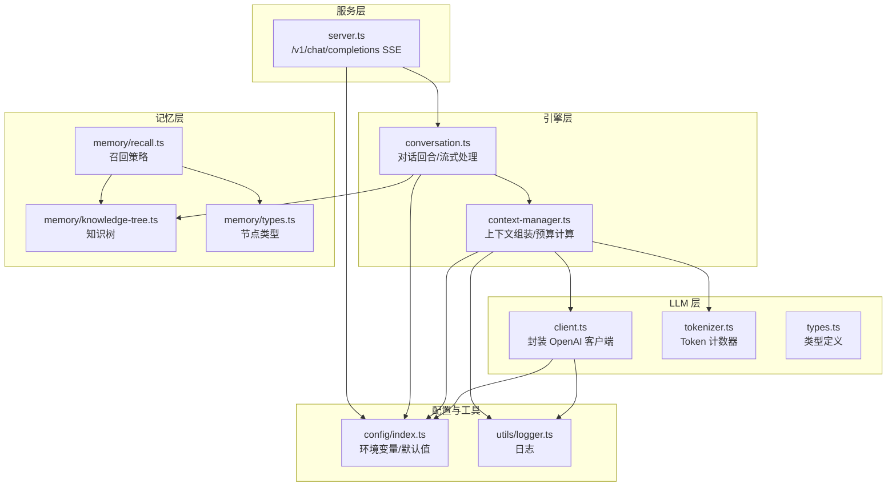
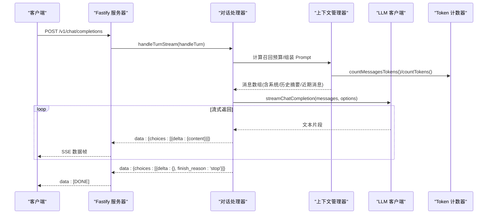
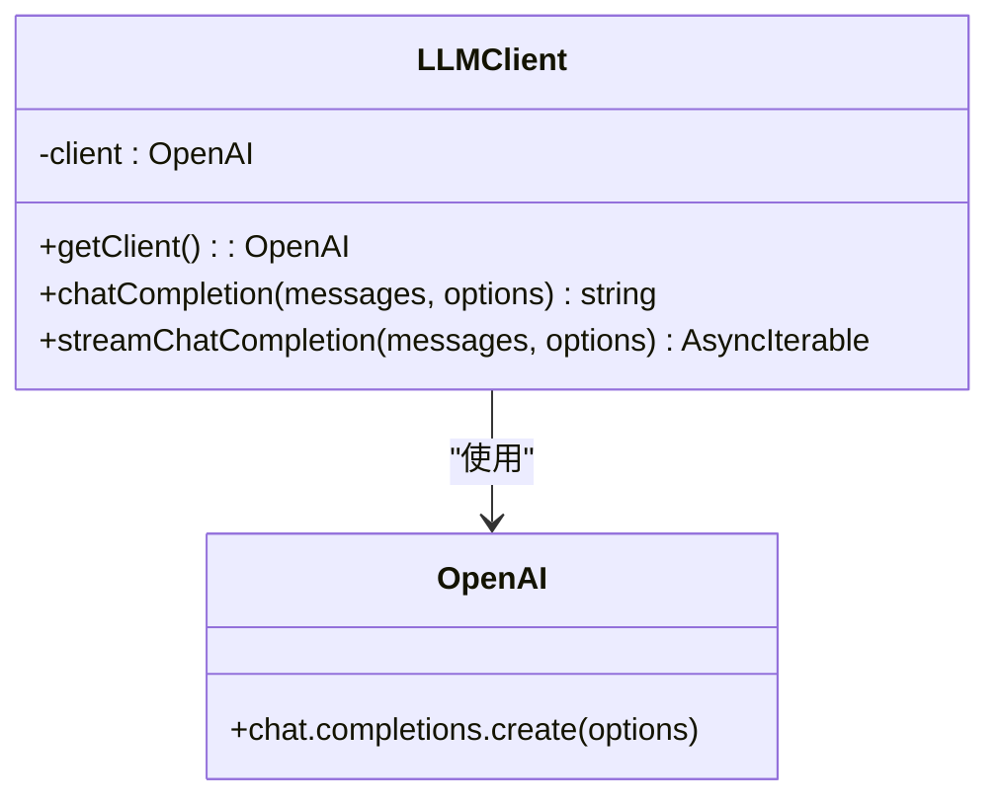
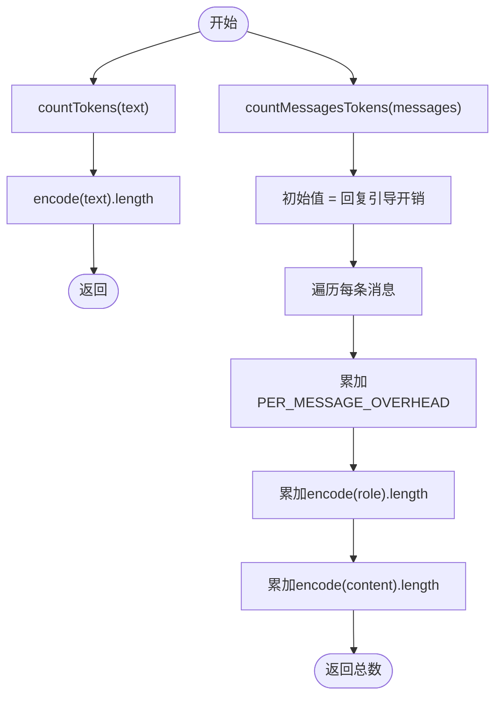
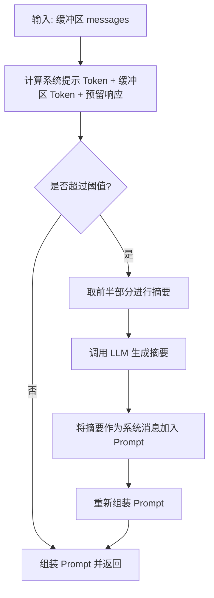
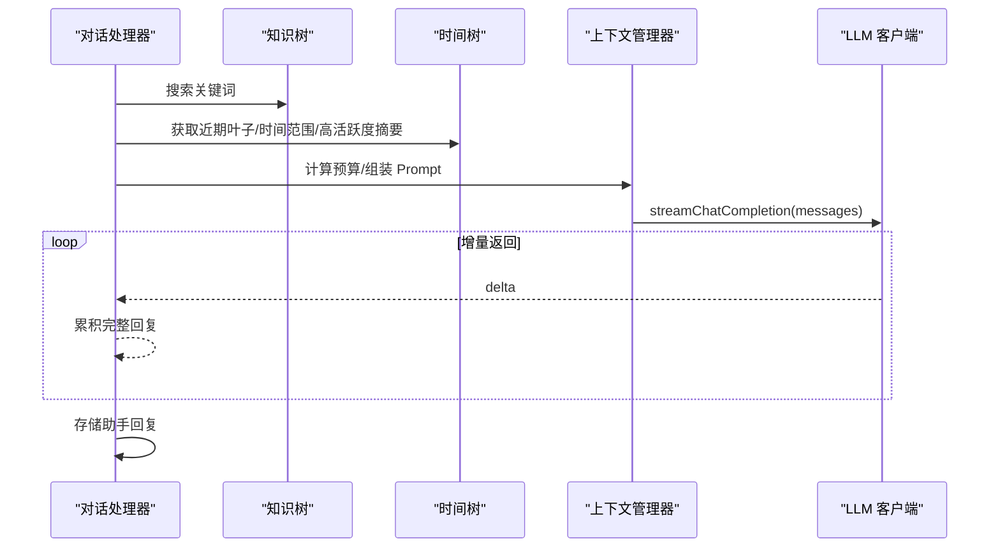
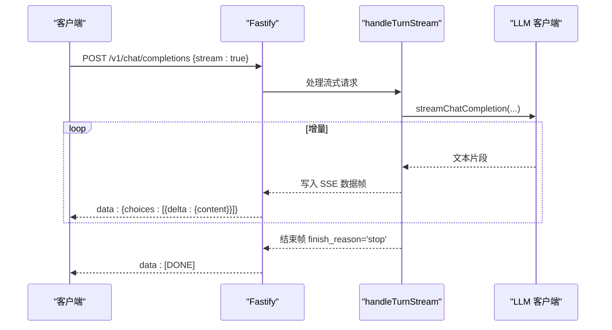
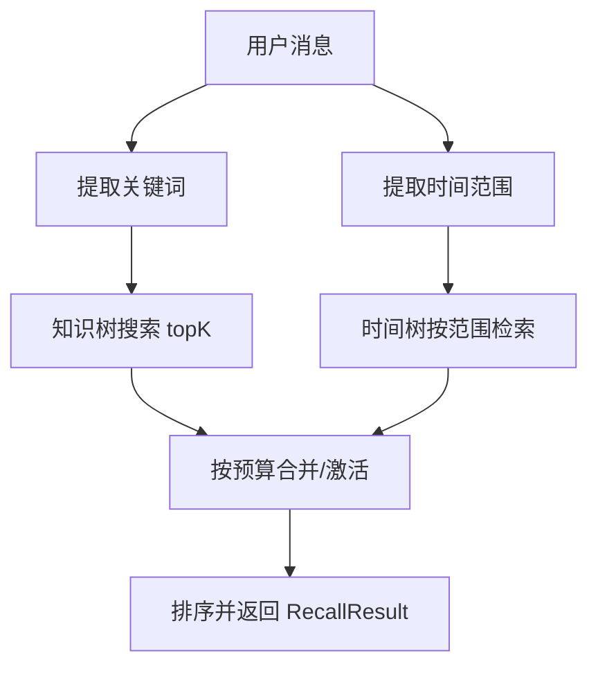
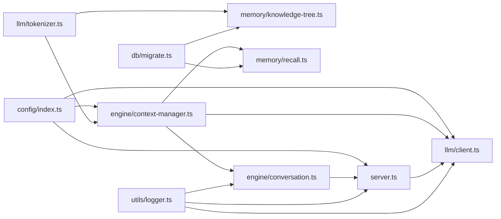

# LLM 集成

<cite>
**本文引用的文件列表**
- [src/llm/client.ts](file://src/llm/client.ts)
- [src/llm/tokenizer.ts](file://src/llm/tokenizer.ts)
- [src/llm/types.ts](file://src/llm/types.ts)
- [src/config/index.ts](file://src/config/index.ts)
- [src/engine/context-manager.ts](file://src/engine/context-manager.ts)
- [src/engine/conversation.ts](file://src/engine/conversation.ts)
- [src/server.ts](file://src/server.ts)
- [src/memory/knowledge-tree.ts](file://src/memory/knowledge-tree.ts)
- [src/memory/recall.ts](file://src/memory/recall.ts)
- [src/memory/types.ts](file://src/memory/types.ts)
- [src/utils/logger.ts](file://src/utils/logger.ts)
- [src/db/migrate.ts](file://src/db/migrate.ts)
- [package.json](file://package.json)
</cite>

## 目录
1. [简介](#简介)
2. [项目结构](#项目结构)
3. [核心组件](#核心组件)
4. [架构总览](#架构总览)
5. [组件详解](#组件详解)
6. [依赖关系分析](#依赖关系分析)
7. [性能与优化](#性能与优化)
8. [故障排除指南](#故障排除指南)
9. [结论](#结论)
10. [附录：配置与环境变量](#附录配置与环境变量)

## 简介
本文件面向 TreeMemory 的 LLM 集成模块，系统化阐述其基于 OpenAI 兼容 API 的封装实现，包括请求构建、响应解析、错误处理、Token 计数器、流式响应（SSE）、配置项、性能优化与故障排除，并给出与其他 LLM 供应商的对接建议。文档同时提供多类可视化图示，帮助读者快速把握代码结构与数据流。

## 项目结构
LLM 集成位于 src/llm 目录，配合引擎层的上下文组装、对话流程与服务器端口的 OpenAI 兼容接口，形成“消息缓冲 -> 上下文召回 -> Prompt 组装 -> LLM 调用 -> 流式/非流式返回”的完整链路。

图表来源
- [src/server.ts:18-109](file://src/server.ts#L18-L109)
- [src/engine/conversation.ts:166-219](file://src/engine/conversation.ts#L166-L219)
- [src/engine/context-manager.ts:53-104](file://src/engine/context-manager.ts#L53-L104)
- [src/llm/client.ts:1-56](file://src/llm/client.ts#L1-L56)
- [src/llm/tokenizer.ts:1-26](file://src/llm/tokenizer.ts#L1-L26)
- [src/config/index.ts:18-29](file://src/config/index.ts#L18-L29)

章节来源
- [src/llm/client.ts:1-56](file://src/llm/client.ts#L1-L56)
- [src/llm/tokenizer.ts:1-26](file://src/llm/tokenizer.ts#L1-L26)
- [src/llm/types.ts:1-12](file://src/llm/types.ts#L1-L12)
- [src/config/index.ts:18-29](file://src/config/index.ts#L18-L29)
- [src/engine/context-manager.ts:53-104](file://src/engine/context-manager.ts#L53-L104)
- [src/engine/conversation.ts:166-219](file://src/engine/conversation.ts#L166-L219)
- [src/server.ts:18-109](file://src/server.ts#L18-L109)
- [src/memory/knowledge-tree.ts:188-202](file://src/memory/knowledge-tree.ts#L188-L202)
- [src/memory/recall.ts:95-167](file://src/memory/recall.ts#L95-L167)
- [src/memory/types.ts:28-32](file://src/memory/types.ts#L28-L32)
- [src/utils/logger.ts:1-10](file://src/utils/logger.ts#L1-L10)
- [src/db/migrate.ts:4-87](file://src/db/migrate.ts#L4-L87)
- [package.json:17-26](file://package.json#L17-L26)

## 核心组件
- OpenAI 兼容客户端封装：统一初始化、非流式与流式调用、参数透传。
- Token 计数器：基于 gpt-tokenizer，支持纯文本与消息数组计数。
- 上下文管理器：阈值判断、历史摘要、Prompt 组装、召回预算计算。
- 对话处理器：回合处理、流式输出、缓冲区维护、后台知识抽取任务。
- 服务器适配：/v1/chat/completions 接口，SSE 流式响应。
- 记忆召回：关键词提取、时间范围识别、知识树与时间树的联合召回。

章节来源
- [src/llm/client.ts:7-55](file://src/llm/client.ts#L7-L55)
- [src/llm/tokenizer.ts:9-25](file://src/llm/tokenizer.ts#L9-L25)
- [src/engine/context-manager.ts:15-104](file://src/engine/context-manager.ts#L15-L104)
- [src/engine/conversation.ts:166-219](file://src/engine/conversation.ts#L166-L219)
- [src/server.ts:18-109](file://src/server.ts#L18-L109)
- [src/memory/recall.ts:12-167](file://src/memory/recall.ts#L12-L167)

## 架构总览
下图展示从客户端请求到 LLM 返回的端到端流程，以及流式响应的 SSE 数据帧序列。

图表来源
- [src/server.ts:38-85](file://src/server.ts#L38-L85)
- [src/engine/conversation.ts:166-219](file://src/engine/conversation.ts#L166-L219)
- [src/engine/context-manager.ts:53-92](file://src/engine/context-manager.ts#L53-L92)
- [src/llm/client.ts:37-55](file://src/llm/client.ts#L37-L55)
- [src/llm/tokenizer.ts:9-25](file://src/llm/tokenizer.ts#L9-L25)

## 组件详解

### OpenAI 兼容客户端封装
- 单例客户端：延迟初始化，使用配置中的 baseURL 与 api key。
- 非流式：创建 chat.completions，返回首条 choices[0].message.content。
- 流式：开启 stream: true，遍历异步迭代器，逐个产出 delta.content。

图表来源
- [src/llm/client.ts:7-55](file://src/llm/client.ts#L7-L55)

章节来源
- [src/llm/client.ts:7-55](file://src/llm/client.ts#L7-L55)

### Token 计数器
- 纯文本：基于 gpt-tokenizer.encode 计算长度。
- 消息数组：按 OpenAI 格式估算每条消息开销，累加角色与内容的 Token 数量，并加上固定消息头开销。

图表来源
- [src/llm/tokenizer.ts:9-25](file://src/llm/tokenizer.ts#L9-L25)

章节来源
- [src/llm/tokenizer.ts:9-25](file://src/llm/tokenizer.ts#L9-L25)

### 上下文管理与 Prompt 组装
- 阈值判断：当缓冲区 Token 数达到阈值比例时触发摘要。
- 历史摘要：对旧一半消息进行摘要，插入为系统消息。
- Prompt 结构：系统提示 + 历史摘要 + 当前对话缓冲 + 用户最新消息。
- 召回预算：预留响应空间，计算可用 Token 预算给知识树与时间树召回。

图表来源
- [src/engine/context-manager.ts:15-42](file://src/engine/context-manager.ts#L15-L42)
- [src/engine/context-manager.ts:53-92](file://src/engine/context-manager.ts#L53-L92)
- [src/engine/context-manager.ts:98-104](file://src/engine/context-manager.ts#L98-L104)

章节来源
- [src/engine/context-manager.ts:15-42](file://src/engine/context-manager.ts#L15-L42)
- [src/engine/context-manager.ts:53-92](file://src/engine/context-manager.ts#L53-L92)
- [src/engine/context-manager.ts:98-104](file://src/engine/context-manager.ts#L98-L104)

### 对话回合与流式处理
- 非流式回合：存储用户消息 -> 召回 -> 组装 Prompt -> 调用 LLM -> 存储助手回复 -> 返回结果。
- 流式回合：同上，但通过 streamChatCompletion 迭代返回增量片段，服务器以 SSE 写入 data 帧，最后写入 [DONE] 结束。

图表来源
- [src/engine/conversation.ts:166-219](file://src/engine/conversation.ts#L166-L219)
- [src/memory/recall.ts:95-167](file://src/memory/recall.ts#L95-L167)
- [src/llm/client.ts:37-55](file://src/llm/client.ts#L37-L55)

章节来源
- [src/engine/conversation.ts:166-219](file://src/engine/conversation.ts#L166-L219)
- [src/memory/recall.ts:95-167](file://src/memory/recall.ts#L95-L167)

### 服务器端 OpenAI 兼容接口与 SSE
- 非流式：构造标准 OpenAI 响应结构，返回完整回答。
- 流式：设置 Content-Type: text/event-stream，逐帧发送 data: {...}，结束时发送 data: [DONE]。

图表来源
- [src/server.ts:38-85](file://src/server.ts#L38-L85)

章节来源
- [src/server.ts:18-109](file://src/server.ts#L18-L109)

### 记忆召回与知识树
- 关键词提取：中英文混合分词、停用词过滤、中文长词切片。
- 时间范围提取：支持“昨天/前天/上周/今天”等自然语言时间。
- 召回策略：先知识树（关键词），再近期叶子，再时间范围，最后高活跃历史摘要，按 Token 预算填充。

图表来源
- [src/memory/recall.ts:12-167](file://src/memory/recall.ts#L12-L167)
- [src/memory/knowledge-tree.ts:138-164](file://src/memory/knowledge-tree.ts#L138-L164)

章节来源
- [src/memory/recall.ts:12-167](file://src/memory/recall.ts#L12-L167)
- [src/memory/knowledge-tree.ts:138-164](file://src/memory/knowledge-tree.ts#L138-L164)

## 依赖关系分析
- LLM 客户端依赖 OpenAI SDK 与配置模块。
- 上下文管理器依赖 Token 计数器与记忆模块。
- 对话处理器依赖上下文管理器与服务器端流式处理。
- 服务器端依赖对话处理器与配置模块。
- 记忆模块依赖数据库迁移脚本与 Token 计数器。

图表来源
- [src/config/index.ts:18-29](file://src/config/index.ts#L18-L29)
- [src/llm/client.ts:1-56](file://src/llm/client.ts#L1-L56)
- [src/llm/tokenizer.ts:1-26](file://src/llm/tokenizer.ts#L1-L26)
- [src/engine/context-manager.ts:1-105](file://src/engine/context-manager.ts#L1-L105)
- [src/engine/conversation.ts:1-233](file://src/engine/conversation.ts#L1-L233)
- [src/server.ts:1-129](file://src/server.ts#L1-L129)
- [src/memory/knowledge-tree.ts:1-239](file://src/memory/knowledge-tree.ts#L1-L239)
- [src/memory/recall.ts:1-168](file://src/memory/recall.ts#L1-L168)
- [src/utils/logger.ts:1-10](file://src/utils/logger.ts#L1-L10)
- [src/db/migrate.ts:4-87](file://src/db/migrate.ts#L4-L87)

章节来源
- [src/config/index.ts:18-29](file://src/config/index.ts#L18-L29)
- [src/llm/client.ts:1-56](file://src/llm/client.ts#L1-L56)
- [src/llm/tokenizer.ts:1-26](file://src/llm/tokenizer.ts#L1-L26)
- [src/engine/context-manager.ts:1-105](file://src/engine/context-manager.ts#L1-L105)
- [src/engine/conversation.ts:1-233](file://src/engine/conversation.ts#L1-L233)
- [src/server.ts:1-129](file://src/server.ts#L1-L129)
- [src/memory/knowledge-tree.ts:1-239](file://src/memory/knowledge-tree.ts#L1-L239)
- [src/memory/recall.ts:1-168](file://src/memory/recall.ts#L1-L168)
- [src/utils/logger.ts:1-10](file://src/utils/logger.ts#L1-L10)
- [src/db/migrate.ts:4-87](file://src/db/migrate.ts#L4-L87)

## 性能与优化
- 连接池与并发
  - 当前客户端为单例，未显式配置连接池参数。若需提升吞吐，可在 OpenAI 初始化处增加连接池与并发限制参数（参考 OpenAI SDK 文档）。
- Token 预算与批量
  - 召回阶段按预算逐步填充，优先近期叶子与高活跃摘要，减少重复检索与无效匹配。
  - Token 计数采用 gpt-tokenizer，确保与模型侧计数一致，避免越界。
- 内存管理
  - 对话缓冲区按消息追加，超过阈值时进行摘要并裁剪前半段，降低内存占用。
  - 流式输出逐帧写入，避免一次性累积大字符串。
- 缓存策略
  - 建议在应用层对频繁使用的知识树查询结果做短期缓存（LRU），结合 TTL 控制。
- 日志与可观测性
  - 使用 pino 输出，可按 LOG_LEVEL 调整级别，便于定位性能瓶颈与异常。

章节来源
- [src/engine/context-manager.ts:15-17](file://src/engine/context-manager.ts#L15-L17)
- [src/engine/context-manager.ts:23-42](file://src/engine/context-manager.ts#L23-L42)
- [src/engine/conversation.ts:182-192](file://src/engine/conversation.ts#L182-L192)
- [src/llm/tokenizer.ts:9-25](file://src/llm/tokenizer.ts#L9-L25)
- [src/utils/logger.ts:1-10](file://src/utils/logger.ts#L1-L10)

## 故障排除指南
- 网络问题
  - 症状：请求超时、连接失败。
  - 排查：检查 LLM_BASE_URL 是否可达；确认代理设置；查看日志中错误堆栈。
- API 限制
  - 症状：429/423 限流或配额耗尽。
  - 排查：核对模型限额与速率限制；在调用层增加指数退避与重试。
- 认证失败
  - 症状：401 未授权。
  - 排查：确认 LLM_API_KEY 是否正确；检查环境变量加载顺序。
- 流式响应异常
  - 症状：SSE 断流、客户端无数据。
  - 排查：确认 Content-Type 设置为 text/event-stream；检查服务器端写入是否及时；关注 [DONE] 结束帧。
- Token 超限
  - 症状：上下文过长导致截断或报错。
  - 排查：调整 MAX_CONTEXT_TOKENS 或 SUMMARIZE_THRESHOLD_RATIO；优化 Prompt 结构与召回策略。

章节来源
- [src/server.ts:38-85](file://src/server.ts#L38-L85)
- [src/config/index.ts:18-29](file://src/config/index.ts#L18-L29)
- [src/utils/logger.ts:1-10](file://src/utils/logger.ts#L1-L10)

## 结论
该 LLM 集成模块以 OpenAI 兼容 API 为核心，围绕 Token 计数、上下文组装、流式响应与记忆召回构建了完整的对话处理管线。通过合理的阈值与预算控制、流式输出与摘要机制，系统在保证响应质量的同时兼顾性能与资源占用。建议后续引入连接池、重试与缓存策略，进一步提升稳定性与吞吐。

## 附录：配置与环境变量
- LLM 基础配置
  - LLM_BASE_URL：LLM 服务地址，默认指向 OpenAI 兼容接口。
  - LLM_API_KEY：API 密钥。
  - LLM_MODEL：默认模型名。
- 上下文与记忆配置
  - MAX_CONTEXT_TOKENS：最大上下文 Token 数。
  - SUMMARIZE_THRESHOLD_RATIO：触发摘要的阈值比例。
- 运行与数据库
  - DB_PATH：SQLite 文件路径。
  - HTTP_PORT：HTTP 服务端口。
  - BACKGROUND_INTERVAL_MS：后台任务轮询间隔。
  - ACTIVITY_DECAY_RATE / ACTIVITY_BOOST：活动分数衰减与提升系数。
- 日志
  - LOG_LEVEL：日志级别。

章节来源
- [src/config/index.ts:18-29](file://src/config/index.ts#L18-L29)
- [package.json:17-26](file://package.json#L17-L26)