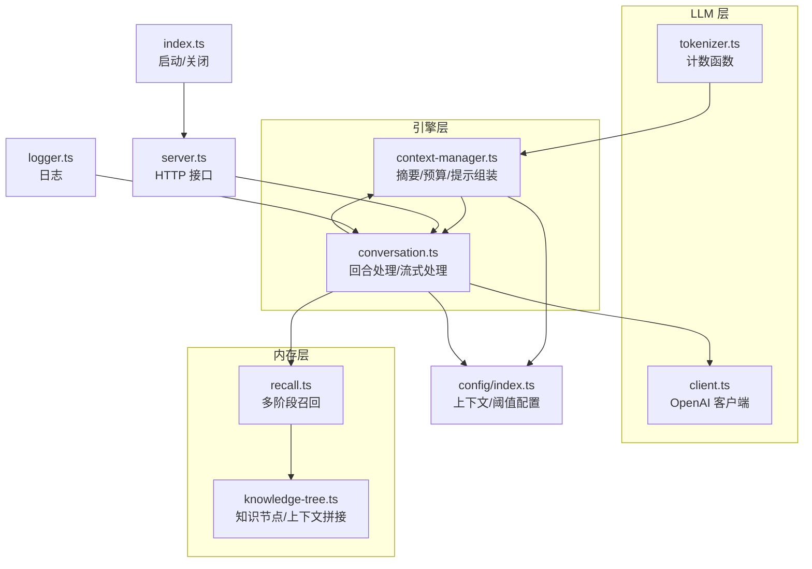
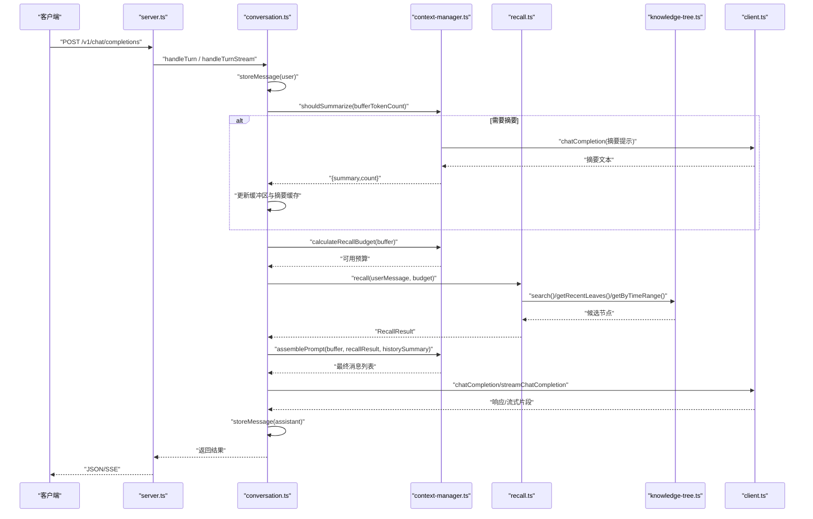
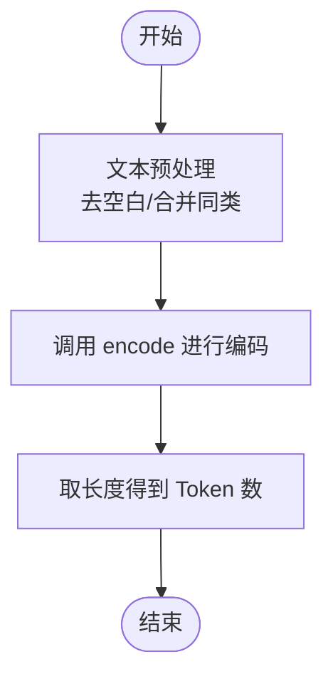
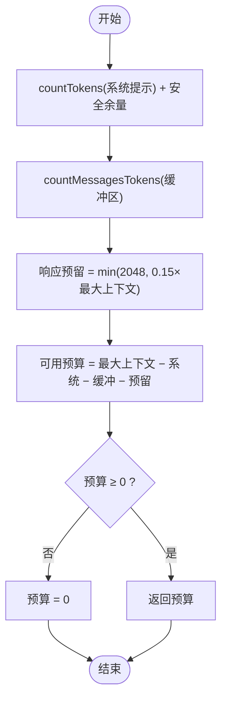
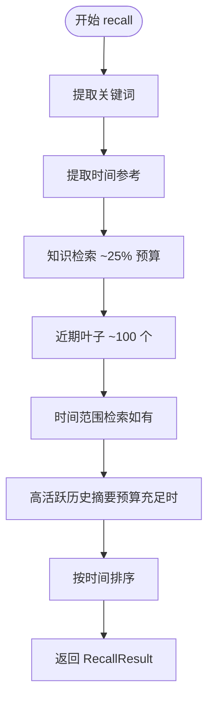
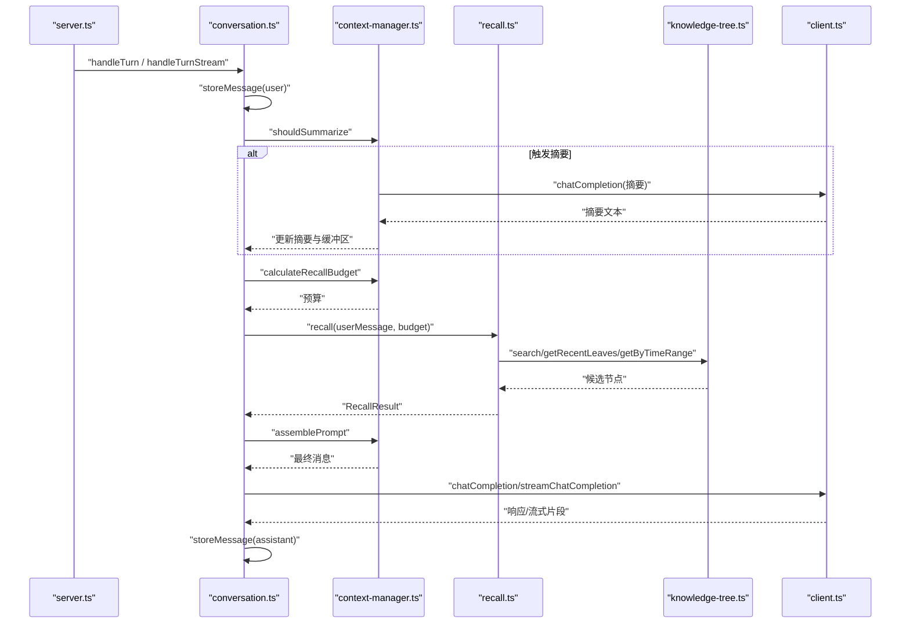
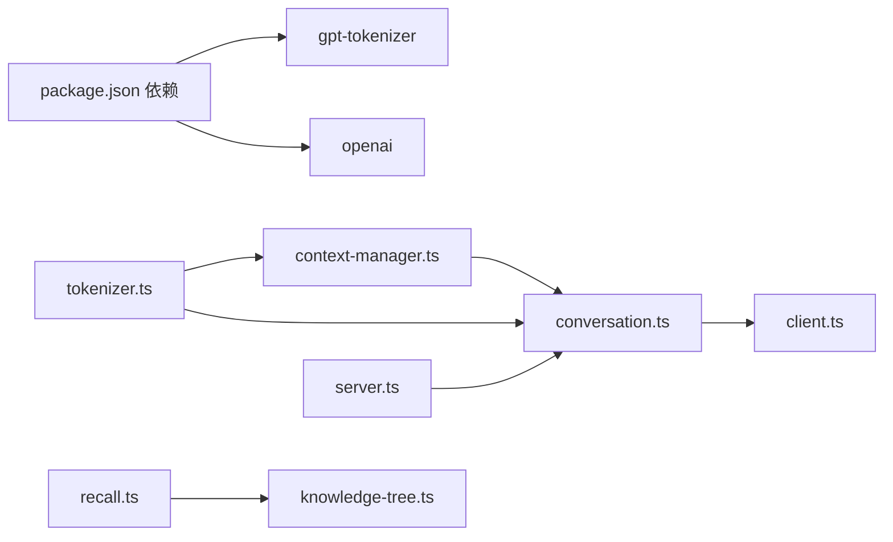

# Token 管理

<cite>
**本文引用的文件**
- [tokenizer.ts](file://src/llm/tokenizer.ts)
- [context-manager.ts](file://src/engine/context-manager.ts)
- [conversation.ts](file://src/engine/conversation.ts)
- [recall.ts](file://src/memory/recall.ts)
- [knowledge-tree.ts](file://src/memory/knowledge-tree.ts)
- [index.ts](file://src/index.ts)
- [server.ts](file://src/server.ts)
- [client.ts](file://src/llm/client.ts)
- [types.ts](file://src/llm/types.ts)
- [types.ts](file://src/engine/types.ts)
- [types.ts](file://src/memory/types.ts)
- [index.ts](file://src/config/index.ts)
- [logger.ts](file://src/utils/logger.ts)
- [package.json](file://package.json)
</cite>

## 目录
1. [简介](#简介)
2. [项目结构](#项目结构)
3. [核心组件](#核心组件)
4. [架构总览](#架构总览)
5. [详细组件分析](#详细组件分析)
6. [依赖关系分析](#依赖关系分析)
7. [性能考量](#性能考量)
8. [故障排除指南](#故障排除指南)
9. [结论](#结论)
10. [附录](#附录)

## 简介
本文件面向 TreeMemory 的 Token 管理模块，系统性说明基于 gpt-tokenizer 的集成方式、不同模型的 Token 规则差异与编码策略、批量 Token 计数的优化思路、Token 预算控制与动态调整机制、使用监控与统计能力，以及在对话引擎中的实际集成示例与常见问题排查建议。文档严格依据仓库源码进行分析与总结，避免臆测。

## 项目结构
围绕 Token 管理的关键文件分布如下：
- LLM 层：tokenizer.ts 提供纯文本与消息数组的 Token 计数；client.ts 封装 OpenAI 客户端调用。
- 引擎层：context-manager.ts 负责缓冲区摘要触发、提示组装与召回预算计算；conversation.ts 在对话回合中串联存储、摘要、召回、组装与调用 LLM。
- 内存层：recall.ts 执行多阶段召回；knowledge-tree.ts 维护知识节点的 Token 计数与上下文拼接。
- 配置与日志：config/index.ts 提供上下文长度上限与阈值等参数；logger.ts 提供统一日志输出。
- 服务入口：server.ts 对外暴露 OpenAI 兼容接口；index.ts 启动数据库与后台调度器。

图表来源
- [tokenizer.ts:1-26](file://src/llm/tokenizer.ts#L1-L26)
- [client.ts:1-56](file://src/llm/client.ts#L1-L56)
- [context-manager.ts:1-103](file://src/engine/context-manager.ts#L1-L103)
- [conversation.ts:1-281](file://src/engine/conversation.ts#L1-L281)
- [recall.ts:1-168](file://src/memory/recall.ts#L1-L168)
- [knowledge-tree.ts:1-239](file://src/memory/knowledge-tree.ts#L1-L239)
- [index.ts:1-36](file://src/index.ts#L1-L36)
- [server.ts:1-165](file://src/server.ts#L1-L165)
- [index.ts:1-30](file://src/config/index.ts#L1-L30)
- [logger.ts:1-10](file://src/utils/logger.ts#L1-L10)

章节来源
- [index.ts:1-36](file://src/index.ts#L1-L36)
- [server.ts:1-165](file://src/server.ts#L1-L165)
- [tokenizer.ts:1-26](file://src/llm/tokenizer.ts#L1-L26)
- [context-manager.ts:1-103](file://src/engine/context-manager.ts#L1-L103)
- [conversation.ts:1-281](file://src/engine/conversation.ts#L1-L281)
- [recall.ts:1-168](file://src/memory/recall.ts#L1-L168)
- [knowledge-tree.ts:1-239](file://src/memory/knowledge-tree.ts#L1-L239)
- [index.ts:1-30](file://src/config/index.ts#L1-L30)
- [logger.ts:1-10](file://src/utils/logger.ts#L1-L10)

## 核心组件
- Token 计数器
  - 纯文本计数：基于 gpt-tokenizer 的 encode，返回字节级分词数量。
  - 消息数组计数：在每条消息上累加角色与内容的 Token 数，并考虑消息格式开销常量。
- 上下文预算与阈值
  - 基于最大上下文长度与阈值比例判断是否需要摘要。
  - 计算可召回预算时，扣除系统提示、当前缓冲区、响应预留空间。
- 多阶段召回
  - 关键词检索知识树、近期叶子节点、按时间范围检索、高活跃度历史摘要，按预算填充。
- 对话回合集成
  - 存储用户/助手消息并维护缓冲区 Token 总量；必要时触发摘要；组装最终提示并调用 LLM；支持非流式与流式两种模式。

章节来源
- [tokenizer.ts:1-26](file://src/llm/tokenizer.ts#L1-L26)
- [context-manager.ts:13-15](file://src/engine/context-manager.ts#L13-L15)
- [context-manager.ts:96-102](file://src/engine/context-manager.ts#L96-L102)
- [recall.ts:95-167](file://src/memory/recall.ts#L95-L167)
- [conversation.ts:104-161](file://src/engine/conversation.ts#L104-L161)
- [conversation.ts:167-220](file://src/engine/conversation.ts#L167-L220)

## 架构总览
下图展示了从 HTTP 请求到 LLM 调用的 Token 管理关键路径：请求进入后，对话引擎先存储用户消息并检查摘要阈值；随后计算召回预算、执行多阶段召回、组装提示并调用 LLM；最后存储助手回复并可选地进行实时知识抽取。

图表来源
- [server.ts:19-109](file://src/server.ts#L19-L109)
- [conversation.ts:104-220](file://src/engine/conversation.ts#L104-L220)
- [context-manager.ts:13-15](file://src/engine/context-manager.ts#L13-L15)
- [context-manager.ts:96-102](file://src/engine/context-manager.ts#L96-L102)
- [recall.ts:95-167](file://src/memory/recall.ts#L95-L167)
- [knowledge-tree.ts:138-164](file://src/memory/knowledge-tree.ts#L138-L164)
- [client.ts:20-55](file://src/llm/client.ts#L20-L55)

## 详细组件分析

### 组件一：Token 计数器（gpt-tokenizer 集成）
- 集成方式
  - 通过导入 encode 实现纯文本与消息数组的 Token 计数。
  - 消息计数引入固定开销常量，模拟 OpenAI 格式的消息边界标记。
- 不同模型的规则差异
  - 本项目未显式区分具体模型；计数依赖 gpt-tokenizer 的默认编码策略。若需适配不同模型，请在外部统一替换编码器或在封装层做映射。
- 编码策略
  - 文本计数：直接对输入字符串进行编码并取长度。
  - 消息计数：累加角色与内容的 Token，并加上消息格式开销常量。
- 批量优化思路（概念性）
  - 预处理：合并相邻同类消息、去除空白与重复换行，减少无效 Token。
  - 缓存：对常用文本或消息序列建立 Token 计数缓存表，命中则复用。
  - 内存：避免一次性加载超大文本；采用分块计数与增量更新。

图表来源
- [tokenizer.ts:9-11](file://src/llm/tokenizer.ts#L9-L11)
- [tokenizer.ts:17-25](file://src/llm/tokenizer.ts#L17-L25)

章节来源
- [tokenizer.ts:1-26](file://src/llm/tokenizer.ts#L1-L26)

### 组件二：上下文预算与阈值控制
- 阈值触发
  - 当缓冲区 Token 数达到“最大上下文 × 阈值比例”时触发摘要。
- 召回预算计算
  - 可用预算 = 最大上下文 − 系统提示 Token − 当前缓冲区 Token − 响应预留
  - 响应预留按固定上限与最大上下文比例的较小值确定。
- 动态调整机制
  - 阈值比例与最大上下文由配置提供，可在运行时通过环境变量调整。

图表来源
- [context-manager.ts:96-102](file://src/engine/context-manager.ts#L96-L102)
- [index.ts:22-23](file://src/config/index.ts#L22-L23)

章节来源
- [context-manager.ts:13-15](file://src/engine/context-manager.ts#L13-L15)
- [context-manager.ts:96-102](file://src/engine/context-manager.ts#L96-L102)
- [index.ts:18-29](file://src/config/index.ts#L18-L29)

### 组件三：多阶段召回与 Token 填充
- 阶段划分
  - 知识检索：关键词驱动，优先选择高有效分且不超过预算的节点。
  - 近期叶子：始终包含最近的叶子节点，优先保证上下文时效性。
  - 时间范围：当用户消息包含时间参考时，按时间范围检索并按有效分排序。
  - 历史摘要：在剩余预算充足时，补充高活跃度的历史摘要。
- 填充策略
  - 逐项累加节点 Token，超过剩余预算即跳过；最终按时间排序返回。

图表来源
- [recall.ts:95-167](file://src/memory/recall.ts#L95-L167)

章节来源
- [recall.ts:12-52](file://src/memory/recall.ts#L12-L52)
- [recall.ts:58-89](file://src/memory/recall.ts#L58-L89)
- [recall.ts:95-167](file://src/memory/recall.ts#L95-L167)

### 组件四：对话引擎中的 Token 管理集成
- 非流式回合
  - 存储用户消息并更新缓冲区 Token 总量；根据阈值决定是否摘要；计算召回预算、执行召回、组装提示并调用 LLM；存储助手回复并进行实时知识抽取。
- 流式回合
  - 与非流式相同，但边接收 LLM 流式片段边产出 SSE 数据，最后再完整存储助手回复。
- 缓存与持久化
  - 会话状态在内存中维护；消息与 Token 数持久化至数据库；摘要以临时节点形式插入时间树。

图表来源
- [server.ts:19-109](file://src/server.ts#L19-L109)
- [conversation.ts:104-220](file://src/engine/conversation.ts#L104-L220)
- [context-manager.ts:13-15](file://src/engine/context-manager.ts#L13-L15)
- [context-manager.ts:96-102](file://src/engine/context-manager.ts#L96-L102)
- [recall.ts:95-167](file://src/memory/recall.ts#L95-L167)
- [knowledge-tree.ts:138-164](file://src/memory/knowledge-tree.ts#L138-L164)
- [client.ts:20-55](file://src/llm/client.ts#L20-L55)

章节来源
- [conversation.ts:104-161](file://src/engine/conversation.ts#L104-L161)
- [conversation.ts:167-220](file://src/engine/conversation.ts#L167-L220)

### 组件五：Token 使用监控与统计
- 日志记录
  - 在摘要触发、摘要完成等关键节点输出结构化日志，便于观测 Token 使用趋势。
- 统计维度（建议）
  - 会话级：单轮使用的 prompt_tokens、completion_tokens、total_tokens（可扩展）。
  - 系统级：平均每轮 Token 使用、摘要触发频率、召回命中率等。
- 报警机制（建议）
  - 当摘要触发频率过高或平均 Token 使用接近上限时发出告警；对异常低的召回命中率进行提醒。

章节来源
- [conversation.ts:121-138](file://src/engine/conversation.ts#L121-L138)
- [conversation.ts:184-193](file://src/engine/conversation.ts#L184-L193)
- [logger.ts:1-10](file://src/utils/logger.ts#L1-L10)

## 依赖关系分析
- 外部依赖
  - gpt-tokenizer：提供 Token 编码能力。
  - openai：封装 LLM 调用，支持流式与非流式。
- 内部耦合
  - tokenizer.ts 被 context-manager.ts 与 conversation.ts 广泛使用。
  - recall.ts 依赖 knowledge-tree.ts 的检索与激活能力。
  - server.ts 作为入口，协调 conversation.ts 与内存层。

图表来源
- [package.json:17-26](file://package.json#L17-L26)
- [tokenizer.ts:1-2](file://src/llm/tokenizer.ts#L1-L2)
- [client.ts:1-3](file://src/llm/client.ts#L1-L3)
- [context-manager.ts:1-8](file://src/engine/context-manager.ts#L1-L8)
- [conversation.ts:1-17](file://src/engine/conversation.ts#L1-L17)
- [recall.ts:1-5](file://src/memory/recall.ts#L1-L5)
- [knowledge-tree.ts:1-6](file://src/memory/knowledge-tree.ts#L1-L6)
- [server.ts:1-13](file://src/server.ts#L1-L13)

章节来源
- [package.json:17-26](file://package.json#L17-L26)

## 性能考量
- 计数成本
  - encode 为 O(n) 与输入长度线性相关；对长文本建议分块处理或缓存。
- 召回效率
  - 知识检索与时间范围查询可通过数据库索引优化；关键词预处理与去停用词可降低候选规模。
- 内存占用
  - 会话缓冲区与摘要缓存均驻内存，建议结合阈值与定期清理策略控制峰值内存。
- I/O 与网络
  - LLM 调用为瓶颈，建议启用流式响应与连接池复用；对失败重试与超时控制进行配置化。

## 故障排除指南
- Token 计数不准确
  - 症状：预算计算与实际调用出现偏差。
  - 排查：确认是否正确使用 countTokens 与 countMessagesTokens；检查系统提示与消息格式开销是否一致；核对最大上下文与阈值配置。
  - 参考
    - [tokenizer.ts:9-11](file://src/llm/tokenizer.ts#L9-L11)
    - [tokenizer.ts:17-25](file://src/llm/tokenizer.ts#L17-L25)
    - [context-manager.ts:96-102](file://src/engine/context-manager.ts#L96-L102)
    - [index.ts:22-23](file://src/config/index.ts#L22-L23)
- 内存泄漏
  - 症状：长时间运行后内存持续增长。
  - 排查：检查会话状态 Map 与摘要缓存 Map 是否在删除会话时清理；确认数据库连接与定时任务是否正确关闭。
  - 参考
    - [conversation.ts:274-280](file://src/engine/conversation.ts#L274-L280)
    - [index.ts:14-19](file://src/index.ts#L14-L19)
- 性能问题
  - 症状：响应延迟高、吞吐低。
  - 排查：评估 Token 计数与召回阶段耗时；开启流式响应；检查 LLM 调用超时与重试策略；优化数据库查询与索引。
  - 参考
    - [client.ts:20-55](file://src/llm/client.ts#L20-L55)
    - [recall.ts:132-161](file://src/memory/recall.ts#L132-L161)
    - [knowledge-tree.ts:125-133](file://src/memory/knowledge-tree.ts#L125-L133)

## 结论
本项目通过 gpt-tokenizer 提供的统一编码能力，结合阈值触发与预算控制，实现了可控的上下文长度与高效的多阶段召回。对话引擎将 Token 管理无缝嵌入到消息存储、摘要、召回与 LLM 调用的全流程中。为进一步提升稳定性与可观测性，建议在现有基础上增加 Token 使用统计与报警、缓存与预处理优化，以及更完善的错误恢复与资源回收机制。

## 附录
- 配置项说明（来自配置）
  - 最大上下文长度：用于限制整体上下文大小。
  - 阈值比例：用于判定何时触发摘要。
  - LLM 基础地址、API Key、模型名称：用于 LLM 客户端初始化。
  - 其他：数据库路径、HTTP 端口、活动衰减与增益等。
- 类型定义要点
  - ChatMessage：角色与内容。
  - ConversationState：会话缓冲区、Token 总量与轮次计数。
  - RecallResult：知识与时间上下文集合及总 Token 数。

章节来源
- [index.ts:5-29](file://src/config/index.ts#L5-L29)
- [types.ts:1-12](file://src/llm/types.ts#L1-L12)
- [types.ts:3-15](file://src/engine/types.ts#L3-L15)
- [types.ts:28-32](file://src/memory/types.ts#L28-L32)