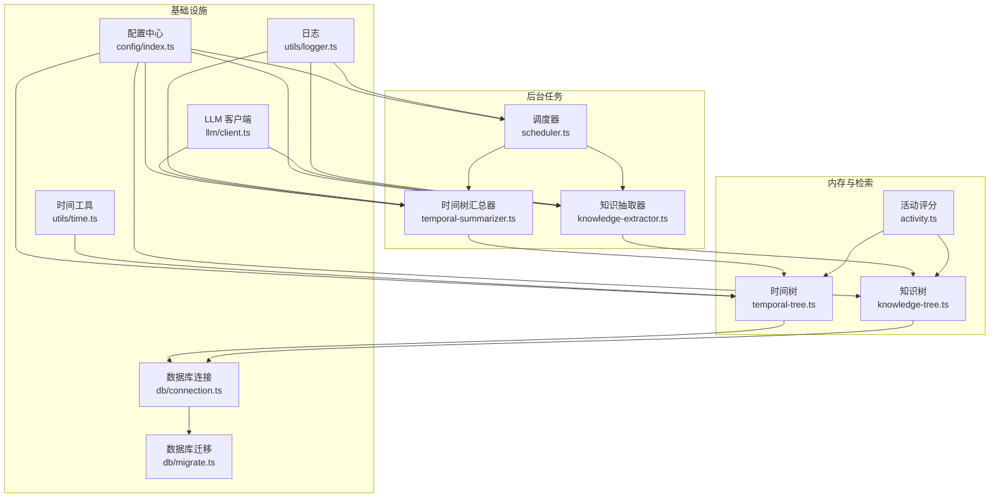
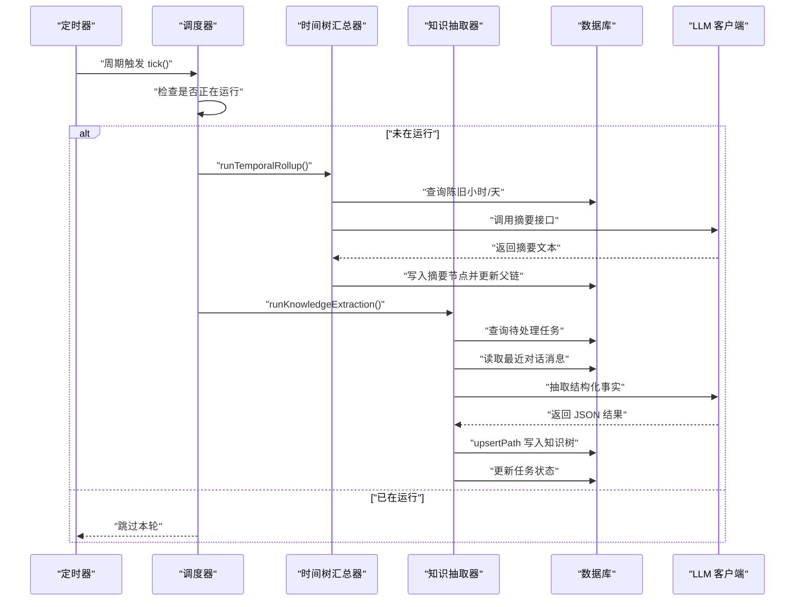
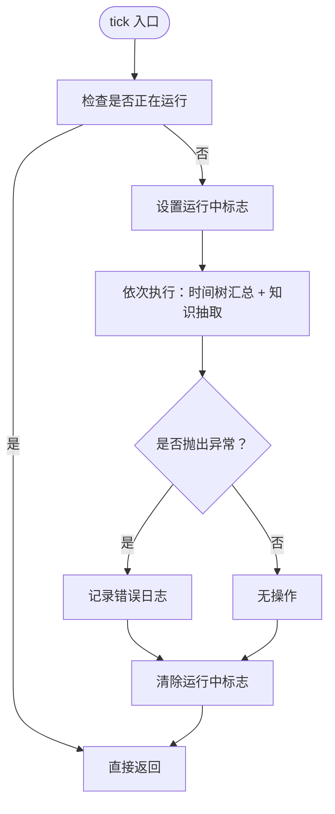
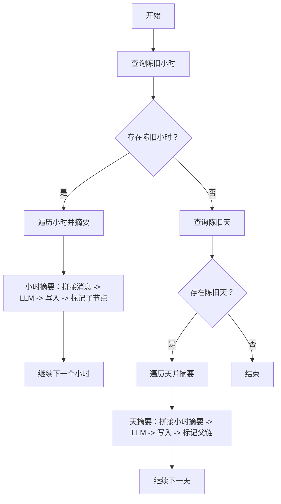
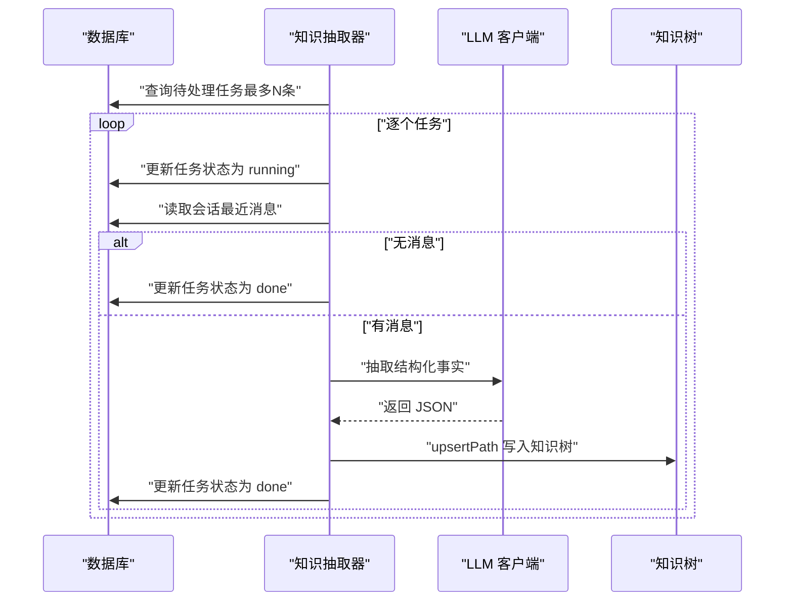
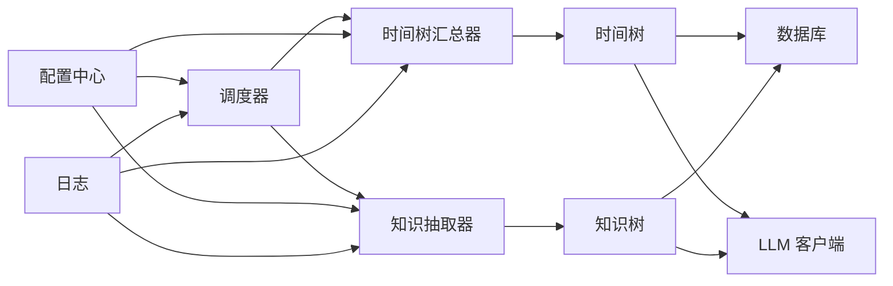

# 后台任务系统

<cite>
**本文引用的文件**
- [src/background/scheduler.ts](file://src/background/scheduler.ts)
- [src/background/temporal-summarizer.ts](file://src/background/temporal-summarizer.ts)
- [src/background/knowledge-extractor.ts](file://src/background/knowledge-extractor.ts)
- [src/config/index.ts](file://src/config/index.ts)
- [src/db/connection.ts](file://src/db/connection.ts)
- [src/db/migrate.ts](file://src/db/migrate.ts)
- [src/memory/temporal-tree.ts](file://src/memory/temporal-tree.ts)
- [src/memory/knowledge-tree.ts](file://src/memory/knowledge-tree.ts)
- [src/memory/activity.ts](file://src/memory/activity.ts)
- [src/memory/types.ts](file://src/memory/types.ts)
- [src/llm/client.ts](file://src/llm/client.ts)
- [src/utils/logger.ts](file://src/utils/logger.ts)
- [src/utils/time.ts](file://src/utils/time.ts)
- [src/engine/context-manager.ts](file://src/engine/context-manager.ts)
- [package.json](file://package.json)
</cite>

## 目录
1. [简介](#简介)
2. [项目结构](#项目结构)
3. [核心组件](#核心组件)
4. [架构总览](#架构总览)
5. [详细组件分析](#详细组件分析)
6. [依赖关系分析](#依赖关系分析)
7. [性能考量](#性能考量)
8. [故障排查指南](#故障排查指南)
9. [结论](#结论)
10. [附录](#附录)

## 简介
本文件面向 TreeMemory 的后台任务系统，系统性阐述任务调度器的实现架构与运行机制，覆盖定时任务管理、任务队列处理、错误恢复、自动摘要（时间树汇总）工作流、知识抽取策略、任务编排逻辑、任务优先级与并发控制、配置项说明、性能监控指标以及故障诊断与扩展指南。目标是帮助开发者快速理解并维护该系统。

## 项目结构
后台任务系统主要由以下模块构成：
- 调度器：周期性触发后台任务，协调时间树汇总与知识抽取。
- 时间树汇总器：按小时/天维度对对话节点进行摘要，形成层级化记忆。
- 知识抽取器：从对话消息中抽取结构化事实，写入知识树。
- 数据库与迁移：提供 SQLite 存储、索引与后台任务队列表。
- 配置中心：集中管理 LLM 接口、上下文上限、调度间隔、活动衰减等参数。
- 日志与工具：统一日志输出、时间工具与令牌计数。

图表来源
- [src/background/scheduler.ts:1-46](file://src/background/scheduler.ts#L1-L46)
- [src/background/temporal-summarizer.ts:1-34](file://src/background/temporal-summarizer.ts#L1-L34)
- [src/background/knowledge-extractor.ts:1-117](file://src/background/knowledge-extractor.ts#L1-L117)
- [src/memory/temporal-tree.ts:1-362](file://src/memory/temporal-tree.ts#L1-L362)
- [src/memory/knowledge-tree.ts:1-239](file://src/memory/knowledge-tree.ts#L1-L239)
- [src/memory/activity.ts:1-51](file://src/memory/activity.ts#L1-L51)
- [src/config/index.ts:1-30](file://src/config/index.ts#L1-L30)
- [src/db/connection.ts:1-26](file://src/db/connection.ts#L1-L26)
- [src/db/migrate.ts:1-88](file://src/db/migrate.ts#L1-L88)
- [src/llm/client.ts:1-56](file://src/llm/client.ts#L1-L56)
- [src/utils/logger.ts:1-10](file://src/utils/logger.ts#L1-L10)
- [src/utils/time.ts:1-60](file://src/utils/time.ts#L1-L60)

章节来源
- [src/background/scheduler.ts:1-46](file://src/background/scheduler.ts#L1-L46)
- [src/config/index.ts:1-30](file://src/config/index.ts#L1-L30)
- [src/db/migrate.ts:1-88](file://src/db/migrate.ts#L1-L88)

## 核心组件
- 调度器：基于定时器周期触发后台任务，避免重叠执行；启动后立即执行一次，随后按配置周期轮询。
- 时间树汇总器：识别“陈旧小时”和“陈旧天”，分别调用小时摘要与天摘要流程。
- 知识抽取器：从后台任务队列取出待处理任务，拉取最近对话消息，调用 LLM 抽取结构化事实并写入知识树。
- 数据层：SQLite 存储时间树、知识树、对话缓冲与后台任务队列；迁移脚本确保表结构与索引就绪。
- 配置中心：集中管理 LLM 接口、模型、上下文上限、摘要阈值、调度间隔、活动衰减与提升系数等。
- 日志与工具：统一日志输出、时间计算与活动评分。

章节来源
- [src/background/scheduler.ts:1-46](file://src/background/scheduler.ts#L1-L46)
- [src/background/temporal-summarizer.ts:1-34](file://src/background/temporal-summarizer.ts#L1-L34)
- [src/background/knowledge-extractor.ts:1-117](file://src/background/knowledge-extractor.ts#L1-L117)
- [src/db/migrate.ts:1-88](file://src/db/migrate.ts#L1-L88)
- [src/config/index.ts:1-30](file://src/config/index.ts#L1-L30)
- [src/utils/logger.ts:1-10](file://src/utils/logger.ts#L1-L10)

## 架构总览
后台任务系统采用“调度器驱动 + 任务队列 + 业务处理器”的分层架构：
- 调度器负责时间驱动与并发保护；
- 时间树汇总器与知识抽取器作为具体任务处理器；
- 数据库提供持久化与查询支持；
- LLM 客户端封装外部推理服务；
- 配置中心贯穿全局，影响行为与性能。

图表来源
- [src/background/scheduler.ts:9-21](file://src/background/scheduler.ts#L9-L21)
- [src/background/temporal-summarizer.ts:9-33](file://src/background/temporal-summarizer.ts#L9-L33)
- [src/background/knowledge-extractor.ts:63-116](file://src/background/knowledge-extractor.ts#L63-L116)
- [src/memory/temporal-tree.ts:96-146](file://src/memory/temporal-tree.ts#L96-L146)
- [src/memory/knowledge-tree.ts:55-120](file://src/memory/knowledge-tree.ts#L55-L120)
- [src/llm/client.ts:20-32](file://src/llm/client.ts#L20-L32)

## 详细组件分析

### 调度器（任务编排与并发控制）
- 角色：周期性触发后台任务，防止重叠执行，记录日志。
- 关键点：
  - 使用标志位控制并发，避免上一轮尚未结束时下一轮开始。
  - 启动后立即执行一次，随后按配置周期轮询。
  - 异常捕获并记录，不影响后续调度。
- 并发与资源：
  - 单实例定时器，单线程串行执行，天然避免竞争。
  - 可通过调整周期降低资源占用或提高响应速度。

图表来源
- [src/background/scheduler.ts:9-21](file://src/background/scheduler.ts#L9-L21)

章节来源
- [src/background/scheduler.ts:1-46](file://src/background/scheduler.ts#L1-L46)
- [src/config/index.ts:26-26](file://src/config/index.ts#L26-L26)

### 时间树汇总器（自动摘要工作流）
- 目标：将时间维度的记忆从“原始消息”逐步抽象为“小时摘要”和“日摘要”，降低上下文开销。
- 流程：
  - 识别“陈旧小时”：满足最小叶子数量且最晚结束时间早于阈值。
  - 对每个陈旧小时调用小时摘要：拼接消息、调用 LLM、写入小时摘要节点并标记子节点。
  - 识别“陈旧天”：当日内所有小时均已摘要，且不存在未摘要的小时。
  - 对每个陈旧天调用天摘要：拼接小时摘要、调用 LLM、写入日摘要节点并标记父链。
- 错误恢复：逐小时/天处理，单个失败不影响整体流程，日志记录失败节点。

图表来源
- [src/background/temporal-summarizer.ts:9-33](file://src/background/temporal-summarizer.ts#L9-L33)
- [src/memory/temporal-tree.ts:96-146](file://src/memory/temporal-tree.ts#L96-L146)
- [src/memory/temporal-tree.ts:166-216](file://src/memory/temporal-tree.ts#L166-L216)

章节来源
- [src/background/temporal-summarizer.ts:1-34](file://src/background/temporal-summarizer.ts#L1-L34)
- [src/memory/temporal-tree.ts:326-357](file://src/memory/temporal-tree.ts#L326-L357)
- [src/memory/temporal-tree.ts:96-146](file://src/memory/temporal-tree.ts#L96-L146)
- [src/memory/temporal-tree.ts:166-216](file://src/memory/temporal-tree.ts#L166-L216)

### 知识抽取器（知识提取与任务编排）
- 目标：从对话中抽取结构化事实，写入知识树，支撑系统“已知信息”上下文。
- 流程：
  - 从后台任务队列取出最多若干条“待处理”任务，逐一置为“运行中”。
  - 拉取对应会话最近若干条消息，按顺序拼接。
  - 调用 LLM 执行抽取，解析 JSON 结果，逐条 upsert 到知识树。
  - 成功则标记为“完成”，失败则记录错误并标记为“失败”。
- 错误恢复：任务粒度隔离，单条任务失败不影响其他任务；日志记录错误详情。

图表来源
- [src/background/knowledge-extractor.ts:63-116](file://src/background/knowledge-extractor.ts#L63-L116)
- [src/memory/knowledge-tree.ts:55-120](file://src/memory/knowledge-tree.ts#L55-L120)
- [src/llm/client.ts:20-32](file://src/llm/client.ts#L20-L32)

章节来源
- [src/background/knowledge-extractor.ts:1-117](file://src/background/knowledge-extractor.ts#L1-L117)
- [src/memory/knowledge-tree.ts:55-120](file://src/memory/knowledge-tree.ts#L55-L120)

### 数据层与任务队列
- 表结构要点：
  - 时间树表：存储原始消息与摘要节点，含层级、时间范围、活动分数、是否已摘要等字段。
  - 知识树表：存储分类与事实节点，含路径、来源时间节点、活动分数等。
  - 对话缓冲表：会话与消息的临时工作区。
  - 后台任务队列表：任务类型、状态、载荷、创建/完成时间与错误信息。
- 索引与查询：
  - 时间树与知识树均建立多维索引，优化按层级、时间、活动分数等查询。
  - 后台任务队列按状态与类型建立索引，便于高效筛选待处理任务。

章节来源
- [src/db/migrate.ts:10-82](file://src/db/migrate.ts#L10-L82)
- [src/db/connection.ts:1-26](file://src/db/connection.ts#L1-L26)

### 配置中心与参数说明
- LLM 相关：基础 URL、API Key、模型名、最大上下文令牌数、摘要阈值比例。
- 运行参数：数据库路径、HTTP 端口、后台调度间隔（毫秒）、活动衰减率、活动提升系数。
- 用途：影响任务频率、摘要触发阈值、召回预算与活动评分衰减。

章节来源
- [src/config/index.ts:5-16](file://src/config/index.ts#L5-L16)
- [src/config/index.ts:18-29](file://src/config/index.ts#L18-L29)

### 日志与监控
- 日志：统一使用结构化日志输出，记录任务状态、错误详情、摘要结果与知识抽取统计。
- 建议指标（可基于现有日志扩展）：
  - 任务执行时间：每轮 tick 的耗时。
  - 成功率：成功/失败任务数占比。
  - 资源消耗：LLM 请求次数、总 token 消耗、数据库读写次数。
  - 任务积压：后台任务队列待处理任务数。

章节来源
- [src/utils/logger.ts:1-10](file://src/utils/logger.ts#L1-L10)
- [src/background/scheduler.ts:16-18](file://src/background/scheduler.ts#L16-L18)
- [src/background/temporal-summarizer.ts:14-18](file://src/background/temporal-summarizer.ts#L14-L18)
- [src/background/knowledge-extractor.ts:94-103](file://src/background/knowledge-extractor.ts#L94-L103)

## 依赖关系分析
- 组件耦合：
  - 调度器仅依赖两个任务处理器与配置中心，低耦合高内聚。
  - 时间树与知识树分别依赖数据库与 LLM 客户端，职责清晰。
  - 活动评分与时间工具被两类树共享，复用良好。
- 外部依赖：
  - LLM SDK：OpenAI 客户端封装。
  - SQLite：better-sqlite3，配合 WAL 与外键约束。
  - 环境变量：dotenv 加载，支持运行时配置。

图表来源
- [src/background/scheduler.ts:1-4](file://src/background/scheduler.ts#L1-L4)
- [src/background/temporal-summarizer.ts:1-2](file://src/background/temporal-summarizer.ts#L1-L2)
- [src/background/knowledge-extractor.ts:1-6](file://src/background/knowledge-extractor.ts#L1-L6)
- [src/llm/client.ts:1-3](file://src/llm/client.ts#L1-L3)
- [src/config/index.ts:1-3](file://src/config/index.ts#L1-L3)

章节来源
- [package.json:17-27](file://package.json#L17-L27)

## 性能考量
- 任务频率与资源平衡：通过后台调度间隔控制 CPU/IO 占用；在高负载场景可适当增大间隔。
- 上下文预算与摘要阈值：结合最大上下文与摘要阈值，避免频繁触发摘要；引擎侧也有缓冲摘要逻辑。
- 查询与索引：时间树与知识树的索引设计有助于快速定位陈旧节点与活动节点。
- LLM 成本控制：限制每次抽取的消息条数、温度与提示词长度，减少 token 消耗。
- 并发与吞吐：当前调度器串行执行，若需提升吞吐，可在任务处理器内部引入轻量并发（需谨慎处理数据库事务与锁）。

## 故障排查指南
- 任务失败
  - 现象：某次时间树或知识抽取任务状态为失败。
  - 排查：查看日志中的错误信息与任务 ID；检查 LLM 返回内容是否符合预期；确认数据库连接与迁移是否成功。
  - 处理：修复后重新触发任务或等待下次调度覆盖。
- 资源不足
  - 现象：数据库写入缓慢、LLM 调用超时。
  - 排查：检查磁盘空间、数据库 WAL 模式与外键约束；确认网络连通性与 API Key 有效性。
  - 处理：优化摘要阈值、减少每次抽取的消息数量、增加调度间隔。
- 依赖服务异常
  - 现象：LLM 返回为空或报错。
  - 排查：核对 LLM 基础 URL、模型名与 API Key；检查服务可用性与配额。
  - 处理：切换备用服务或临时禁用相关任务。
- 数据库问题
  - 现象：查询超时或迁移失败。
  - 排查：确认数据库文件权限、WAL 与外键设置；检查索引是否存在。
  - 处理：重建索引或回滚到上一版本再重试迁移。

章节来源
- [src/utils/logger.ts:1-10](file://src/utils/logger.ts#L1-L10)
- [src/background/knowledge-extractor.ts:106-115](file://src/background/knowledge-extractor.ts#L106-L115)
- [src/db/connection.ts:8-17](file://src/db/connection.ts#L8-L17)
- [src/db/migrate.ts:4-87](file://src/db/migrate.ts#L4-L87)

## 结论
后台任务系统以调度器为核心，串联时间树汇总与知识抽取两大任务，通过数据库与 LLM 客户端实现数据持久化与智能摘要。系统具备良好的可维护性与扩展性，建议在生产环境中结合日志指标持续优化调度间隔与摘要策略，确保稳定性与成本平衡。

## 附录

### 配置项一览（环境变量）
- LLM 基础配置
  - LLM_BASE_URL：LLM 服务基础 URL
  - LLM_API_KEY：LLM 访问密钥
  - LLM_MODEL：默认模型名称
- 上下文与摘要
  - MAX_CONTEXT_TOKENS：最大上下文令牌数
  - SUMMARIZE_THRESHOLD_RATIO：摘要阈值比例
- 运行参数
  - DB_PATH：数据库文件路径
  - HTTP_PORT：HTTP 服务端口
  - BACKGROUND_INTERVAL_MS：后台调度间隔（毫秒）
  - ACTIVITY_DECAY_RATE：活动分数衰减率
  - ACTIVITY_BOOST：活动分数提升系数

章节来源
- [src/config/index.ts:18-29](file://src/config/index.ts#L18-L29)

### 任务类型与状态
- 任务类型
  - knowledge_extract：知识抽取任务
- 状态
  - pending：待处理
  - running：运行中
  - done：已完成
  - failed：失败

章节来源
- [src/background/knowledge-extractor.ts:67-71](file://src/background/knowledge-extractor.ts#L67-L71)
- [src/db/migrate.ts:71-82](file://src/db/migrate.ts#L71-L82)

### 开发新任务类型的扩展指南
- 新增任务处理器
  - 在后台目录新增处理器文件，导出异步函数用于执行任务。
  - 在调度器中调用该函数，确保异常捕获与日志记录。
- 数据库与表结构
  - 如需新增任务类型，可在后台任务队列表中扩展任务类型枚举。
  - 若需要持久化中间结果，按需新增表并编写迁移脚本。
- LLM 与外部服务
  - 将 LLM 调用封装为独立函数，便于测试与替换。
  - 控制温度、最大 token 等参数，平衡质量与成本。
- 并发与限流
  - 任务处理器内部如需并发，应考虑数据库事务与锁，避免写冲突。
  - 可引入轻量队列或信号量控制并发度。
- 监控与告警
  - 在处理器中记录关键指标（耗时、成功/失败数、token 消耗）。
  - 结合日志系统设置告警阈值。

章节来源
- [src/background/scheduler.ts:9-21](file://src/background/scheduler.ts#L9-L21)
- [src/background/knowledge-extractor.ts:63-116](file://src/background/knowledge-extractor.ts#L63-L116)
- [src/db/migrate.ts:71-82](file://src/db/migrate.ts#L71-L82)