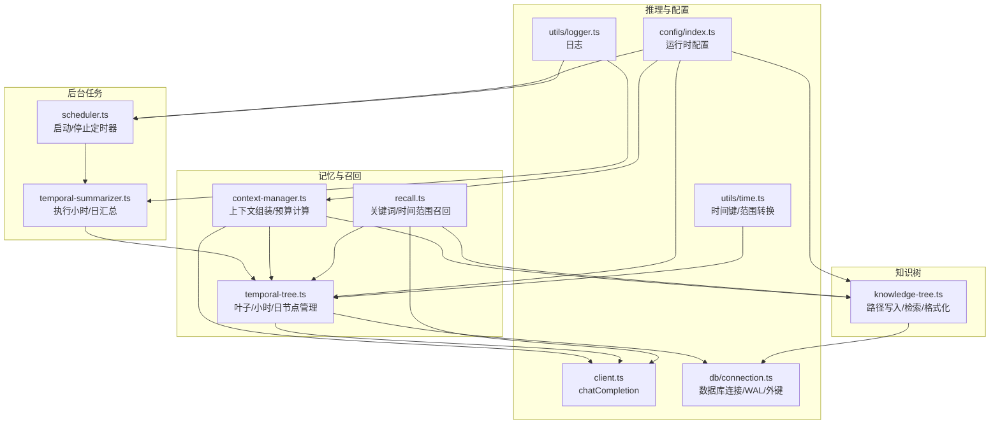
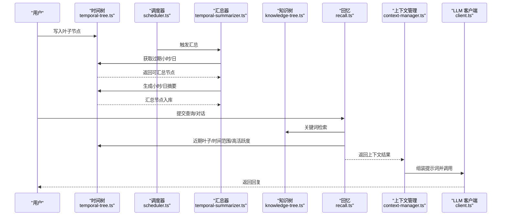
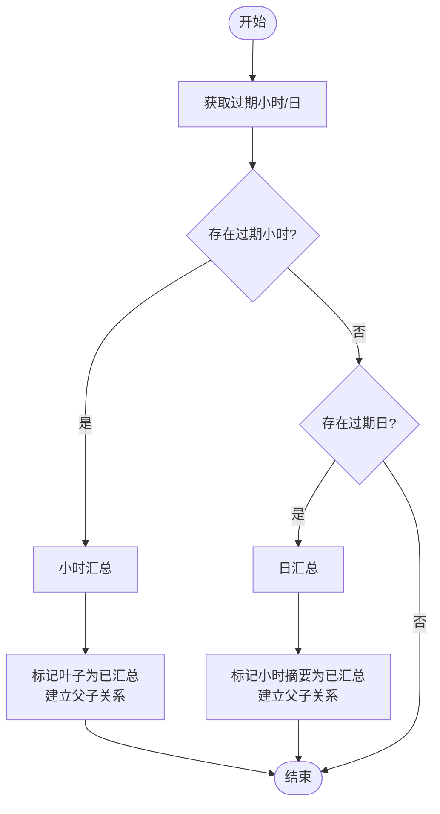
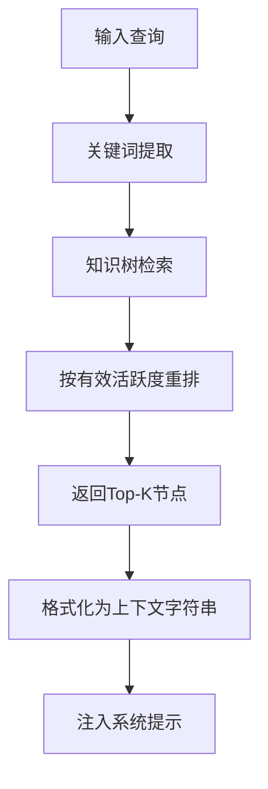
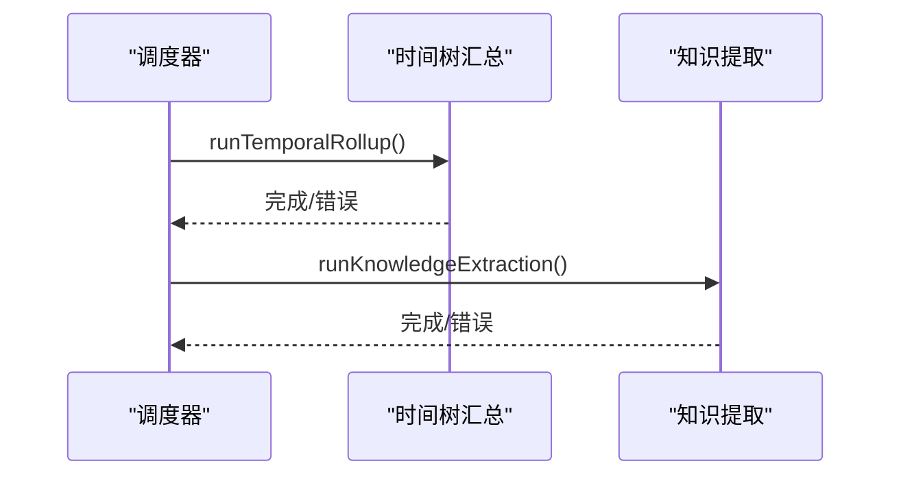
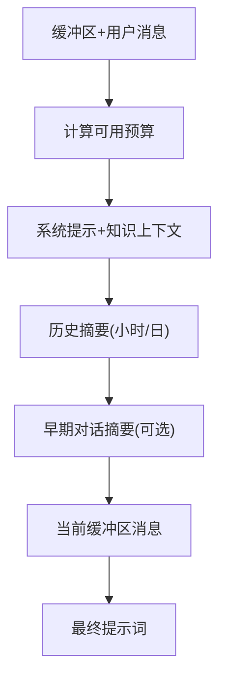
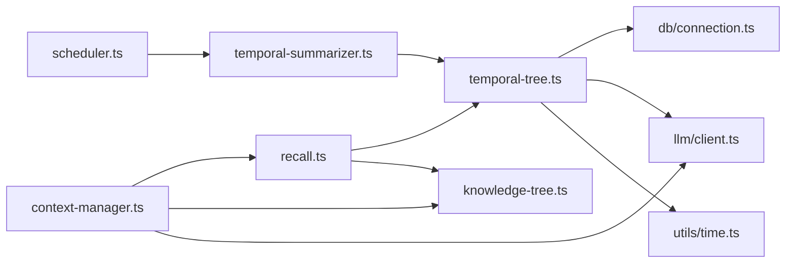

# 自动摘要

<cite>
**本文引用的文件**
- [src/background/temporal-summarizer.ts](file://src/background/temporal-summarizer.ts)
- [src/background/scheduler.ts](file://src/background/scheduler.ts)
- [src/memory/temporal-tree.ts](file://src/memory/temporal-tree.ts)
- [src/memory/recall.ts](file://src/memory/recall.ts)
- [src/memory/knowledge-tree.ts](file://src/memory/knowledge-tree.ts)
- [src/memory/activity.ts](file://src/memory/activity.ts)
- [src/memory/types.ts](file://src/memory/types.ts)
- [src/engine/context-manager.ts](file://src/engine/context-manager.ts)
- [src/llm/client.ts](file://src/llm/client.ts)
- [src/llm/types.ts](file://src/llm/types.ts)
- [src/config/index.ts](file://src/config/index.ts)
- [src/utils/time.ts](file://src/utils/time.ts)
- [src/utils/logger.ts](file://src/utils/logger.ts)
- [src/db/connection.ts](file://src/db/connection.ts)
- [tests/memory/temporal-tree.test.ts](file://tests/memory/temporal-tree.test.ts)
- [tests/memory/knowledge-tree.test.ts](file://tests/memory/knowledge-tree.test.ts)
</cite>

## 目录
1. [简介](#简介)
2. [项目结构](#项目结构)
3. [核心组件](#核心组件)
4. [架构总览](#架构总览)
5. [详细组件分析](#详细组件分析)
6. [依赖分析](#依赖分析)
7. [性能考虑](#性能考虑)
8. [故障排查指南](#故障排查指南)
9. [结论](#结论)
10. [附录](#附录)

## 简介
本文件面向 TreeMemory 的自动摘要能力，系统性阐述时间树汇总算法的实现原理与工程实践，覆盖以下主题：
- 时间树汇总算法：叶子节点聚合、时间窗口划分与摘要生成策略
- 知识提取流程：关键词识别、语义理解与结构化存储
- 任务编排逻辑：执行顺序、依赖关系与资源协调
- 配置参数说明：摘要阈值、时间窗口大小、提取精度等
- 性能优化策略：批量处理、缓存机制、并行计算
- 故障恢复机制：部分失败、数据不一致、系统重启
- 监控指标：处理速度、准确率、资源消耗
- 扩展指南：新增摘要策略的开发与集成

## 项目结构
自动摘要相关代码主要分布在以下模块：
- 后台调度与汇总：background/scheduler.ts、background/temporal-summarizer.ts
- 时间树与上下文组装：memory/temporal-tree.ts、engine/context-manager.ts、memory/recall.ts
- 知识树与结构化存储：memory/knowledge-tree.ts
- LLM 调用与分词：llm/client.ts、llm/types.ts
- 配置与工具：config/index.ts、utils/time.ts、utils/logger.ts、db/connection.ts
- 类型定义：memory/types.ts

图表来源
- [src/background/scheduler.ts:1-46](file://src/background/scheduler.ts#L1-L46)
- [src/background/temporal-summarizer.ts:1-34](file://src/background/temporal-summarizer.ts#L1-L34)
- [src/memory/temporal-tree.ts:1-363](file://src/memory/temporal-tree.ts#L1-L363)
- [src/memory/recall.ts:1-168](file://src/memory/recall.ts#L1-L168)
- [src/engine/context-manager.ts:1-103](file://src/engine/context-manager.ts#L1-L103)
- [src/memory/knowledge-tree.ts:1-239](file://src/memory/knowledge-tree.ts#L1-L239)
- [src/llm/client.ts:1-56](file://src/llm/client.ts#L1-L56)
- [src/config/index.ts:1-30](file://src/config/index.ts#L1-L30)
- [src/utils/time.ts:1-60](file://src/utils/time.ts#L1-L60)
- [src/utils/logger.ts:1-10](file://src/utils/logger.ts#L1-L10)
- [src/db/connection.ts:1-26](file://src/db/connection.ts#L1-L26)

章节来源
- [src/background/scheduler.ts:1-46](file://src/background/scheduler.ts#L1-L46)
- [src/background/temporal-summarizer.ts:1-34](file://src/background/temporal-summarizer.ts#L1-L34)
- [src/memory/temporal-tree.ts:1-363](file://src/memory/temporal-tree.ts#L1-L363)
- [src/memory/recall.ts:1-168](file://src/memory/recall.ts#L1-L168)
- [src/engine/context-manager.ts:1-103](file://src/engine/context-manager.ts#L1-L103)
- [src/memory/knowledge-tree.ts:1-239](file://src/memory/knowledge-tree.ts#L1-L239)
- [src/llm/client.ts:1-56](file://src/llm/client.ts#L1-L56)
- [src/config/index.ts:1-30](file://src/config/index.ts#L1-L30)
- [src/utils/time.ts:1-60](file://src/utils/time.ts#L1-L60)
- [src/utils/logger.ts:1-10](file://src/utils/logger.ts#L1-L10)
- [src/db/connection.ts:1-26](file://src/db/connection.ts#L1-L26)

## 核心组件
- 时间树汇总器：按小时/日维度对未汇总叶子节点进行压缩，生成层级摘要节点，并维护父子关系与标记位。
- 回忆与召回：从知识树与时间树中抽取上下文，结合关键词与时间范围，优先近期叶子，再补充高活跃度历史摘要。
- 上下文管理器：根据最大上下文令牌预算，计算可用额度，组装最终提示词，支持早期对话摘要叠加。
- 知识树：将非结构化的事实按路径结构化存储，支持路径写入、检索与格式化输出。
- LLM 客户端：封装推理调用，支持非流式与流式两种模式。
- 配置中心：集中管理 LLM 地址、模型、上下文上限、摘要阈值、数据库路径、后台调度间隔、活动衰减与提升系数等。

章节来源
- [src/memory/temporal-tree.ts:97-217](file://src/memory/temporal-tree.ts#L97-L217)
- [src/memory/recall.ts:95-167](file://src/memory/recall.ts#L95-L167)
- [src/engine/context-manager.ts:51-102](file://src/engine/context-manager.ts#L51-L102)
- [src/memory/knowledge-tree.ts:55-120](file://src/memory/knowledge-tree.ts#L55-L120)
- [src/llm/client.ts:20-32](file://src/llm/client.ts#L20-L32)
- [src/config/index.ts:18-29](file://src/config/index.ts#L18-L29)

## 架构总览
自动摘要贯穿“写入—调度—汇总—召回—组装—推理”的闭环，如下图所示：

图表来源
- [src/background/scheduler.ts:9-21](file://src/background/scheduler.ts#L9-L21)
- [src/background/temporal-summarizer.ts:9-33](file://src/background/temporal-summarizer.ts#L9-L33)
- [src/memory/temporal-tree.ts:97-217](file://src/memory/temporal-tree.ts#L97-L217)
- [src/memory/recall.ts:95-167](file://src/memory/recall.ts#L95-L167)
- [src/engine/context-manager.ts:51-90](file://src/engine/context-manager.ts#L51-L90)
- [src/llm/client.ts:20-32](file://src/llm/client.ts#L20-L32)

## 详细组件分析

### 时间树汇总算法
- 叶子节点聚合
  - 插入叶子节点时记录角色、内容、令牌数与时间边界，初始活跃度与未汇总标记。
  - 获取最近未汇总叶子用于近期上下文，保证时间顺序与令牌预算。
- 时间窗口划分
  - 小时窗口：基于 ISO 时区字符串截断到小时粒度，形成 hour_key；同理 day_key 截断到日。
  - 时间范围转换：提供 hourKey/dayKey 与起止时间互转函数，确保跨层查询一致性。
- 摘要生成策略
  - 小时摘要：收集同一小时内的所有叶子，拼接为对话文本，调用 LLM 生成摘要，插入层级为 1 的摘要节点，并将叶子标记为已汇总且建立父子关系。
  - 日摘要：收集当日所有已汇总的小时摘要，拼接标题化的时间戳与摘要内容，调用 LLM 生成日级摘要，插入层级为 2 的摘要节点，并标记小时摘要为已汇总。
- 过期判定
  - 小时过期：统计每小时未汇总叶子数量与最晚结束时间，满足数量阈值与年龄阈值则纳入汇总队列。
  - 日过期：当某日存在未汇总小时摘要且不存在未汇总叶子时，允许对该日进行日级汇总。
- 上下文窗口
  - 优先近期叶子，其次近期小时摘要，最后较旧日摘要；按有效活跃度评分排序，避免与近期叶子重叠。

图表来源
- [src/background/temporal-summarizer.ts:9-33](file://src/background/temporal-summarizer.ts#L9-L33)
- [src/memory/temporal-tree.ts:327-358](file://src/memory/temporal-tree.ts#L327-L358)
- [src/memory/temporal-tree.ts:97-217](file://src/memory/temporal-tree.ts#L97-L217)

章节来源
- [src/memory/temporal-tree.ts:31-62](file://src/memory/temporal-tree.ts#L31-L62)
- [src/memory/temporal-tree.ts:67-91](file://src/memory/temporal-tree.ts#L67-L91)
- [src/memory/temporal-tree.ts:97-147](file://src/memory/temporal-tree.ts#L97-L147)
- [src/memory/temporal-tree.ts:152-217](file://src/memory/temporal-tree.ts#L152-L217)
- [src/memory/temporal-tree.ts:223-284](file://src/memory/temporal-tree.ts#L223-L284)
- [src/memory/temporal-tree.ts:327-358](file://src/memory/temporal-tree.ts#L327-L358)
- [src/utils/time.ts:5-43](file://src/utils/time.ts#L5-L43)

### 知识提取与结构化存储
- 关键词识别
  - 支持中英文停用词过滤、空白/标点切分、中文长词二gram切分，去重后作为检索关键词。
- 语义理解与检索
  - 基于 LIKE 查询构建候选集，按有效活跃度二次重排，返回 Top-K 结果。
- 结构化存储
  - 路径写入：沿路径逐段创建分类节点，末段创建事实节点；更新时仅变更内容与计数，保持唯一性。
  - 上下文格式化：将树形结构渲染为带缩进的提示词片段，便于注入系统提示。

图表来源
- [src/memory/recall.ts:12-52](file://src/memory/recall.ts#L12-L52)
- [src/memory/recall.ts:138-164](file://src/memory/recall.ts#L138-L164)
- [src/memory/knowledge-tree.ts:55-120](file://src/memory/knowledge-tree.ts#L55-L120)
- [src/memory/knowledge-tree.ts:188-202](file://src/memory/knowledge-tree.ts#L188-L202)

章节来源
- [src/memory/recall.ts:12-52](file://src/memory/recall.ts#L12-L52)
- [src/memory/recall.ts:138-164](file://src/memory/recall.ts#L138-L164)
- [src/memory/knowledge-tree.ts:55-120](file://src/memory/knowledge-tree.ts#L55-L120)
- [src/memory/knowledge-tree.ts:188-202](file://src/memory/knowledge-tree.ts#L188-L202)

### 任务编排逻辑
- 后台调度
  - 定时触发汇总与知识提取；通过状态位防止重叠执行；异常捕获并记录。
- 执行顺序
  - 先小时汇总，再日汇总；随后进行知识提取；两者均独立、幂等。
- 依赖关系
  - 汇总依赖时间树节点状态与令牌计数；知识提取依赖关键词与检索结果；上下文组装依赖两类树的上下文与预算。
- 资源协调
  - 使用 WAL 模式与外键约束保障并发读写与引用完整性；日志统一输出，便于追踪。

图表来源
- [src/background/scheduler.ts:9-21](file://src/background/scheduler.ts#L9-L21)
- [src/background/temporal-summarizer.ts:9-33](file://src/background/temporal-summarizer.ts#L9-L33)

章节来源
- [src/background/scheduler.ts:1-46](file://src/background/scheduler.ts#L1-L46)
- [src/background/temporal-summarizer.ts:1-34](file://src/background/temporal-summarizer.ts#L1-L34)
- [src/db/connection.ts:8-17](file://src/db/connection.ts#L8-L17)

### 上下文组装与预算控制
- 预算计算
  - 系统提示预留、消息组令牌估算、响应预留空间，得到可用令牌预算。
- 上下文组装
  - 系统消息（含知识树上下文）、历史摘要（小时/日）、早期对话摘要、当前缓冲区消息。
- 缓冲区摘要
  - 当缓冲区接近阈值时，对最早一半进行摘要，减少后续 LLM 负担。

图表来源
- [src/engine/context-manager.ts:96-102](file://src/engine/context-manager.ts#L96-L102)
- [src/engine/context-manager.ts:51-90](file://src/engine/context-manager.ts#L51-L90)
- [src/engine/context-manager.ts:21-40](file://src/engine/context-manager.ts#L21-L40)

章节来源
- [src/engine/context-manager.ts:13-15](file://src/engine/context-manager.ts#L13-L15)
- [src/engine/context-manager.ts:21-40](file://src/engine/context-manager.ts#L21-L40)
- [src/engine/context-manager.ts:51-90](file://src/engine/context-manager.ts#L51-L90)
- [src/engine/context-manager.ts:96-102](file://src/engine/context-manager.ts#L96-L102)

## 依赖分析
- 组件耦合
  - 时间树与知识树分别依赖数据库连接与 LLM 客户端；回忆模块同时依赖二者；上下文管理器依赖回忆与知识树。
- 外部依赖
  - 数据库：WAL 模式、外键开启；LLM：OpenAI 客户端封装；日志：pino 输出。
- 循环依赖
  - 无直接循环；模块间通过接口与类型进行解耦。

图表来源
- [src/memory/temporal-tree.ts:1-8](file://src/memory/temporal-tree.ts#L1-L8)
- [src/memory/recall.ts:1-5](file://src/memory/recall.ts#L1-L5)
- [src/engine/context-manager.ts:1-8](file://src/engine/context-manager.ts#L1-L8)
- [src/background/scheduler.ts:1-4](file://src/background/scheduler.ts#L1-L4)
- [src/background/temporal-summarizer.ts:1-2](file://src/background/temporal-summarizer.ts#L1-L2)

章节来源
- [src/memory/temporal-tree.ts:1-8](file://src/memory/temporal-tree.ts#L1-L8)
- [src/memory/recall.ts:1-5](file://src/memory/recall.ts#L1-L5)
- [src/engine/context-manager.ts:1-8](file://src/engine/context-manager.ts#L1-L8)
- [src/background/scheduler.ts:1-4](file://src/background/scheduler.ts#L1-L4)
- [src/background/temporal-summarizer.ts:1-2](file://src/background/temporal-summarizer.ts#L1-L2)
- [src/db/connection.ts:1-26](file://src/db/connection.ts#L1-L26)
- [src/llm/client.ts:1-56](file://src/llm/client.ts#L1-L56)

## 性能考虑
- 批量处理
  - 汇总时一次性读取整小时/日的叶子或小时摘要，减少多次往返。
  - 回忆阶段先关键词检索，再按预算填充，避免无谓扫描。
- 缓存机制
  - 通过有效活跃度评分缓存候选节点，减少重复计算。
- 并行计算
  - 后台任务串行触发（由调度器控制），可在未来扩展为多线程/多进程并行汇总不同时间片。
- 数据库优化
  - WAL 模式提升并发读写性能；外键启用保障引用一致性。
- LLM 调用
  - 控制温度与最大输出，降低随机性与成本；对早期对话进行局部摘要，显著降低上下文长度。

章节来源
- [src/memory/temporal-tree.ts:97-147](file://src/memory/temporal-tree.ts#L97-L147)
- [src/memory/temporal-tree.ts:167-217](file://src/memory/temporal-tree.ts#L167-L217)
- [src/memory/recall.ts:106-161](file://src/memory/recall.ts#L106-L161)
- [src/db/connection.ts:9-14](file://src/db/connection.ts#L9-L14)
- [src/engine/context-manager.ts:21-40](file://src/engine/context-manager.ts#L21-L40)

## 故障排查指南
- 部分失败
  - 汇总过程中单小时/日失败不会阻塞其他批次；建议记录失败节点与错误信息，后续重试。
- 数据不一致
  - 若叶子与小时摘要的父子关系缺失，检查更新语句是否成功执行；WAL 与外键可帮助定位问题。
- 系统重启
  - 启动时会重新连接数据库并执行迁移；调度器在启动后短延迟触发一次 tick，随后按周期运行。
- 日志定位
  - 使用统一日志输出，关注调度器与汇总器的错误字段，快速定位失败环节。

章节来源
- [src/background/temporal-summarizer.ts:13-20](file://src/background/temporal-summarizer.ts#L13-L20)
- [src/background/temporal-summarizer.ts:25-32](file://src/background/temporal-summarizer.ts#L25-L32)
- [src/background/scheduler.ts:16-18](file://src/background/scheduler.ts#L16-L18)
- [src/db/connection.ts:13-14](file://src/db/connection.ts#L13-L14)

## 结论
该自动摘要体系以时间树与知识树为核心，结合后台调度与上下文管理，实现了从“写入—汇总—召回—组装—推理”的完整链路。通过合理的阈值与预算控制、结构化存储与评分重排，既保证了上下文质量，又兼顾了性能与可维护性。未来可在并行化、增量索引与更丰富的摘要策略上进一步演进。

## 附录

### 配置参数说明
- LLM 相关
  - llmBaseUrl：推理服务基础地址
  - llmApiKey：推理服务密钥
  - llmModel：默认模型名称
- 上下文与摘要
  - maxContextTokens：最大上下文令牌数
  - summarizeThresholdRatio：缓冲区摘要阈值比例
- 存储与调度
  - dbPath：SQLite 文件路径
  - backgroundIntervalMs：后台任务轮询间隔（毫秒）
- 活动评分
  - activityDecayRate：每日衰减率
  - activityBoost：激活增益

章节来源
- [src/config/index.ts:18-29](file://src/config/index.ts#L18-L29)

### 监控指标建议
- 处理速度
  - 汇总耗时（小时/日）、知识提取耗时、上下文组装耗时、LLM 推理耗时
- 准确率
  - 关键词命中率、召回覆盖率、摘要与原文一致性评估（可选人工评估）
- 资源消耗
  - 数据库读写次数、令牌用量、内存占用、并发请求数

[本节为通用指导，无需特定文件引用]

### 扩展新摘要策略的开发指南
- 新增策略步骤
  - 在时间树模块新增策略函数，遵循现有签名与返回结构，使用相同数据库与 LLM 客户端。
  - 在汇总器中注册新策略的触发条件（如新的过期判定或阈值）。
  - 在上下文组装中增加策略产出的上下文注入逻辑。
- 集成示例
  - 参考小时/日摘要的实现路径：[小时摘要:97-147](file://src/memory/temporal-tree.ts#L97-L147)、[日摘要:167-217](file://src/memory/temporal-tree.ts#L167-L217)，以及调度触发入口：[汇总器:9-33](file://src/background/temporal-summarizer.ts#L9-L33)、[调度器:9-21](file://src/background/scheduler.ts#L9-L21)。

章节来源
- [src/memory/temporal-tree.ts:97-217](file://src/memory/temporal-tree.ts#L97-L217)
- [src/background/temporal-summarizer.ts:9-33](file://src/background/temporal-summarizer.ts#L9-L33)
- [src/background/scheduler.ts:9-21](file://src/background/scheduler.ts#L9-L21)