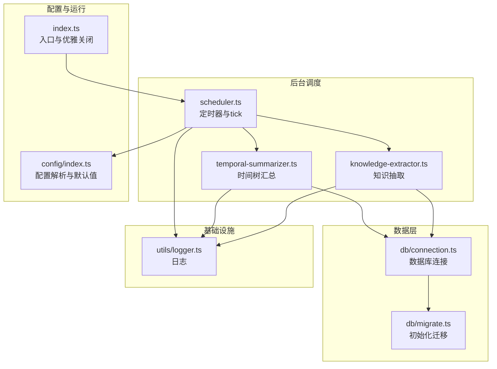
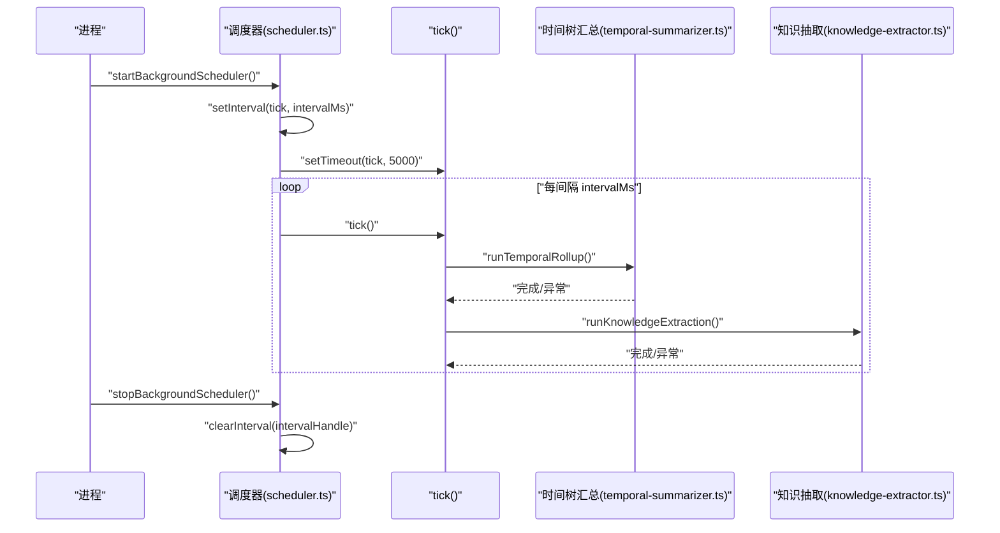
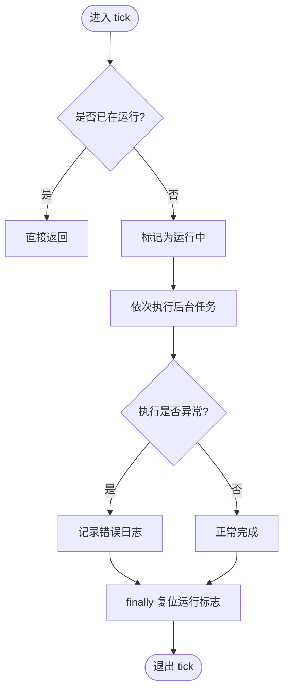
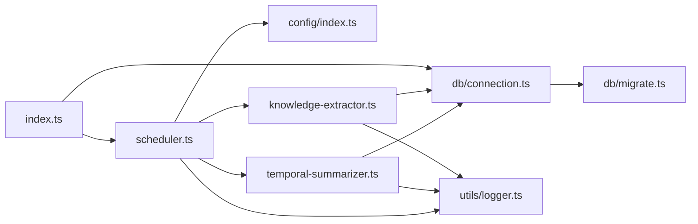

# 调度器

<cite>
**本文引用的文件**
- [src/background/scheduler.ts](file://src/background/scheduler.ts)
- [src/background/temporal-summarizer.ts](file://src/background/temporal-summarizer.ts)
- [src/background/knowledge-extractor.ts](file://src/background/knowledge-extractor.ts)
- [src/config/index.ts](file://src/config/index.ts)
- [src/index.ts](file://src/index.ts)
- [src/db/connection.ts](file://src/db/connection.ts)
- [src/db/migrate.ts](file://src/db/migrate.ts)
- [src/utils/logger.ts](file://src/utils/logger.ts)
- [package.json](file://package.json)
</cite>

## 目录
1. [简介](#简介)
2. [项目结构](#项目结构)
3. [核心组件](#核心组件)
4. [架构总览](#架构总览)
5. [详细组件分析](#详细组件分析)
6. [依赖关系分析](#依赖关系分析)
7. [性能考量](#性能考量)
8. [故障排查指南](#故障排查指南)
9. [结论](#结论)
10. [附录](#附录)

## 简介
本文件面向 TreeMemory 的后台调度器，系统性阐述其架构与实现细节，重点覆盖：
- 定时任务执行机制与并发控制策略
- tick 函数的实现逻辑（防重入、错误处理、资源清理）
- 启动与停止流程（含配置项作用与默认值）
- 配置项详解（尤其是 backgroundIntervalMs 的含义、取值范围与性能影响）
- 生命周期管理最佳实践（优雅关闭、内存泄漏防护、资源回收）
- 故障诊断指南（调度器停止、任务堆积、性能退化）
- 扩展新定时任务的开发指南与参考路径

## 项目结构
调度器位于 src/background 目录，配合配置、数据库连接与迁移、日志工具共同构成后台任务运行环境。

图表来源
- [src/background/scheduler.ts:1-46](file://src/background/scheduler.ts#L1-L46)
- [src/background/temporal-summarizer.ts:1-34](file://src/background/temporal-summarizer.ts#L1-L34)
- [src/background/knowledge-extractor.ts:1-117](file://src/background/knowledge-extractor.ts#L1-L117)
- [src/config/index.ts:1-30](file://src/config/index.ts#L1-L30)
- [src/index.ts:1-36](file://src/index.ts#L1-L36)
- [src/db/connection.ts:1-26](file://src/db/connection.ts#L1-L26)
- [src/db/migrate.ts:1-88](file://src/db/migrate.ts#L1-L88)
- [src/utils/logger.ts:1-10](file://src/utils/logger.ts#L1-L10)

章节来源
- [src/background/scheduler.ts:1-46](file://src/background/scheduler.ts#L1-L46)
- [src/config/index.ts:1-30](file://src/config/index.ts#L1-L30)
- [src/index.ts:1-36](file://src/index.ts#L1-L36)
- [src/db/connection.ts:1-26](file://src/db/connection.ts#L1-L26)
- [src/db/migrate.ts:1-88](file://src/db/migrate.ts#L1-L88)
- [src/utils/logger.ts:1-10](file://src/utils/logger.ts#L1-L10)

## 核心组件
- 调度器（scheduler.ts）
  - 维护定时器句柄与运行状态，提供启动/停止接口
  - tick 为核心执行单元，负责串行执行时间树汇总与知识抽取
- 时间树汇总（temporal-summarizer.ts）
  - 按小时/天维度对时间树进行汇总，减少叶子节点数量，提升检索效率
- 知识抽取（knowledge-extractor.ts）
  - 从对话消息批量抽取事实，写入知识树；通过 background_tasks 表驱动异步任务
- 配置（config/index.ts）
  - 定义并解析环境变量，提供 backgroundIntervalMs 默认值（毫秒）
- 入口与生命周期（index.ts）
  - 初始化数据库、启动调度器、注册 SIGINT/SIGTERM 优雅关闭
- 数据库与迁移（db/connection.ts, db/migrate.ts）
  - 确保数据库连接与 background_tasks 表存在
- 日志（utils/logger.ts）
  - 统一日志输出级别与目标

章节来源
- [src/background/scheduler.ts:1-46](file://src/background/scheduler.ts#L1-L46)
- [src/background/temporal-summarizer.ts:1-34](file://src/background/temporal-summarizer.ts#L1-L34)
- [src/background/knowledge-extractor.ts:1-117](file://src/background/knowledge-extractor.ts#L1-L117)
- [src/config/index.ts:1-30](file://src/config/index.ts#L1-L30)
- [src/index.ts:1-36](file://src/index.ts#L1-L36)
- [src/db/connection.ts:1-26](file://src/db/connection.ts#L1-L26)
- [src/db/migrate.ts:1-88](file://src/db/migrate.ts#L1-L88)
- [src/utils/logger.ts:1-10](file://src/utils/logger.ts#L1-L10)

## 架构总览
调度器采用“定时器 + 串行 tick”的简单可靠模式，tick 内部顺序执行两个后台任务，并通过布尔标志防止重入。启动后会立即延迟触发一次 tick，随后按配置周期执行。

图表来源
- [src/background/scheduler.ts:23-45](file://src/background/scheduler.ts#L23-L45)
- [src/background/temporal-summarizer.ts:1-34](file://src/background/temporal-summarizer.ts#L1-L34)
- [src/background/knowledge-extractor.ts:63-117](file://src/background/knowledge-extractor.ts#L63-L117)

## 详细组件分析

### 调度器与 tick 实现
- 并发控制
  - 使用布尔标志避免 tick 重入，确保同一时刻仅有一个 tick 在执行
- 错误处理
  - tick 内捕获异常并记录错误日志，保证调度器继续运行
- 资源清理
  - finally 中复位运行标志，确保异常退出也能恢复状态
- 启动与停止
  - 启动：若未启动则设置定时器并延迟触发一次 tick
  - 停止：清除定时器并将句柄置空

图表来源
- [src/background/scheduler.ts:9-21](file://src/background/scheduler.ts#L9-L21)

章节来源
- [src/background/scheduler.ts:1-46](file://src/background/scheduler.ts#L1-L46)

### 时间树汇总（temporal-summarizer.ts）
- 功能
  - 对满足条件的小时桶与天桶执行汇总，生成更高层级节点，降低叶子节点数量
- 异常处理
  - 对每个小时/天的汇总分别 try/catch，避免单个失败影响整体
- 性能特征
  - I/O 与 LLM 推理开销主要集中在该模块，建议合理设置调度间隔

章节来源
- [src/background/temporal-summarizer.ts:1-34](file://src/background/temporal-summarizer.ts#L1-L34)

### 知识抽取（knowledge-extractor.ts）
- 任务驱动
  - 从 background_tasks 表中取出最多若干条“待处理”任务，逐条执行
- 数据流
  - 读取最近对话消息 → LLM 抽取事实 → 写入知识树 → 更新任务状态
- 错误处理
  - 单条任务失败不影响其他任务；失败原因写回任务表
- 性能特征
  - 受限于 LLM 调用频率与对话消息规模，建议限制每轮处理的任务数

章节来源
- [src/background/knowledge-extractor.ts:63-117](file://src/background/knowledge-extractor.ts#L63-L117)

### 配置与默认值（config/index.ts）
- 关键配置项
  - backgroundIntervalMs：后台调度间隔（毫秒），默认 60000（1 分钟）
- 解析策略
  - 优先使用环境变量，否则采用硬编码默认值
- 其他相关配置
  - dbPath、httpPort、LLM 相关参数等，与调度器运行环境相关

章节来源
- [src/config/index.ts:18-29](file://src/config/index.ts#L18-L29)

### 启动与停止流程（index.ts）
- 启动
  - 初始化数据库连接
  - 启动后台调度器
  - 注册信号处理器，支持 SIGINT/SIGTERM
- 停止
  - 清理调度器定时器
  - 关闭数据库连接
  - 退出进程

章节来源
- [src/index.ts:4-30](file://src/index.ts#L4-L30)

## 依赖关系分析
- 耦合与内聚
  - 调度器与具体任务解耦，通过函数调用解耦
  - 任务内部依赖数据库连接与迁移脚本
- 外部依赖
  - better-sqlite3（数据库）、pino（日志）、dotenv（环境变量）

图表来源
- [src/background/scheduler.ts:1-46](file://src/background/scheduler.ts#L1-L46)
- [src/background/temporal-summarizer.ts:1-34](file://src/background/temporal-summarizer.ts#L1-L34)
- [src/background/knowledge-extractor.ts:1-117](file://src/background/knowledge-extractor.ts#L1-L117)
- [src/config/index.ts:1-30](file://src/config/index.ts#L1-L30)
- [src/db/connection.ts:1-26](file://src/db/connection.ts#L1-L26)
- [src/db/migrate.ts:1-88](file://src/db/migrate.ts#L1-L88)
- [src/utils/logger.ts:1-10](file://src/utils/logger.ts#L1-L10)
- [src/index.ts:1-36](file://src/index.ts#L1-L36)

章节来源
- [src/background/scheduler.ts:1-46](file://src/background/scheduler.ts#L1-L46)
- [src/background/temporal-summarizer.ts:1-34](file://src/background/temporal-summarizer.ts#L1-L34)
- [src/background/knowledge-extractor.ts:1-117](file://src/background/knowledge-extractor.ts#L1-L117)
- [src/config/index.ts:1-30](file://src/config/index.ts#L1-L30)
- [src/db/connection.ts:1-26](file://src/db/connection.ts#L1-L26)
- [src/db/migrate.ts:1-88](file://src/db/migrate.ts#L1-L88)
- [src/utils/logger.ts:1-10](file://src/utils/logger.ts#L1-L10)
- [src/index.ts:1-36](file://src/index.ts#L1-L36)

## 性能考量
- backgroundIntervalMs 的含义与影响
  - 含义：调度器 tick 的执行周期（毫秒）
  - 默认值：60000（1 分钟）
  - 性能影响：
    - 较短间隔：提高实时性但增加 CPU/IO 压力，尤其在任务执行耗时较长或 LLM 调用频繁时
    - 较长间隔：降低资源占用，但可能延后时间树汇总与知识抽取的时效性
- 任务执行特性
  - 时间树汇总与知识抽取均包含 I/O 与 LLM 推理，建议结合业务负载调整间隔
- 数据库与迁移
  - better-sqlite3 采用 WAL 模式与外键约束，有助于并发与一致性，但仍需关注查询索引与事务粒度

章节来源
- [src/config/index.ts:26-26](file://src/config/index.ts#L26-L26)
- [src/background/temporal-summarizer.ts:1-34](file://src/background/temporal-summarizer.ts#L1-L34)
- [src/background/knowledge-extractor.ts:63-117](file://src/background/knowledge-extractor.ts#L63-L117)
- [src/db/connection.ts:9-16](file://src/db/connection.ts#L9-L16)
- [src/db/migrate.ts:7-86](file://src/db/migrate.ts#L7-L86)

## 故障排查指南
- 调度器停止
  - 现象：tick 不再执行
  - 排查：确认是否调用了停止接口；检查定时器句柄是否被清空；核对日志中“调度器已停止”的记录
- 任务堆积
  - 现象：background_tasks 表中 pending 任务持续增长
  - 排查：检查知识抽取任务的异常日志；确认 LLM 接口可用性与速率限制；适当缩短调度间隔或减少每轮处理任务数
- 性能退化
  - 现象：tick 执行时间过长导致累积延迟
  - 排查：观察时间树汇总与知识抽取的耗时日志；评估数据库索引与查询复杂度；必要时延长调度间隔
- 优雅关闭无效
  - 现象：进程无法平滑退出
  - 排查：确认 SIGINT/SIGTERM 是否正确注册；检查停止流程是否在退出前执行

章节来源
- [src/background/scheduler.ts:39-45](file://src/background/scheduler.ts#L39-L45)
- [src/background/knowledge-extractor.ts:106-115](file://src/background/knowledge-extractor.ts#L106-L115)
- [src/index.ts:14-21](file://src/index.ts#L14-L21)

## 结论
该调度器以极简设计实现了稳定的后台任务执行：通过定时器与防重入机制保障可靠性，通过日志与异常处理提升可观测性。合理设置 backgroundIntervalMs 是平衡实时性与资源消耗的关键。建议在生产环境中结合监控指标与日志进行持续优化。

## 附录

### 配置选项说明
- backgroundIntervalMs
  - 类型：整数（毫秒）
  - 默认值：60000（1 分钟）
  - 作用：控制调度器 tick 的执行周期
  - 取值建议：根据任务执行耗时与业务实时性需求调整；过短可能导致资源紧张，过长可能影响时效

章节来源
- [src/config/index.ts:18-29](file://src/config/index.ts#L18-L29)

### 生命周期管理最佳实践
- 优雅关闭
  - 在收到终止信号时先停止调度器，再关闭数据库连接，最后退出进程
- 内存泄漏防护
  - 确保停止时清理定时器句柄；避免在 tick 中持有外部资源不释放
- 资源回收
  - 数据库连接按需打开并在进程退出时统一关闭

章节来源
- [src/index.ts:14-21](file://src/index.ts#L14-L21)
- [src/background/scheduler.ts:39-45](file://src/background/scheduler.ts#L39-L45)
- [src/db/connection.ts:19-25](file://src/db/connection.ts#L19-L25)

### 扩展新定时任务的开发指南
- 步骤
  - 新建任务模块，导出一个异步函数（例如 runMyTask），在其中实现具体逻辑
  - 在 tick 中顺序调用新任务函数，保持串行执行与异常隔离
  - 通过日志记录关键事件与错误，便于排障
- 参考路径
  - 新任务函数：[src/background/my-task.ts](file://src/background/my-task.ts)
  - tick 调用点：[src/background/scheduler.ts:13-15](file://src/background/scheduler.ts#L13-L15)
  - 日志工具：[src/utils/logger.ts:1-10](file://src/utils/logger.ts#L1-L10)

章节来源
- [src/background/scheduler.ts:9-21](file://src/background/scheduler.ts#L9-L21)
- [src/utils/logger.ts:1-10](file://src/utils/logger.ts#L1-L10)

### 运行环境与依赖
- Node.js 版本要求：>= 18
- 主要依赖：better-sqlite3、dotenv、fastify、pino、openai、gpt-tokenizer、ulid 等

章节来源
- [package.json:14-26](file://package.json#L14-L26)