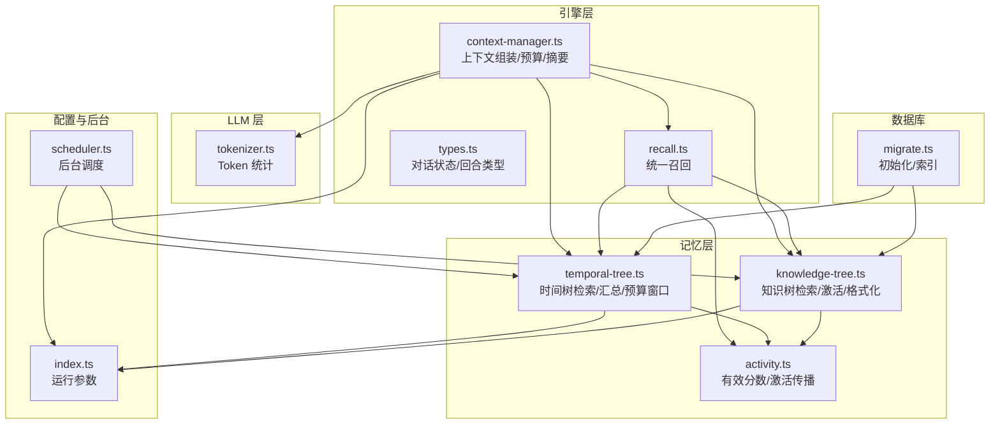
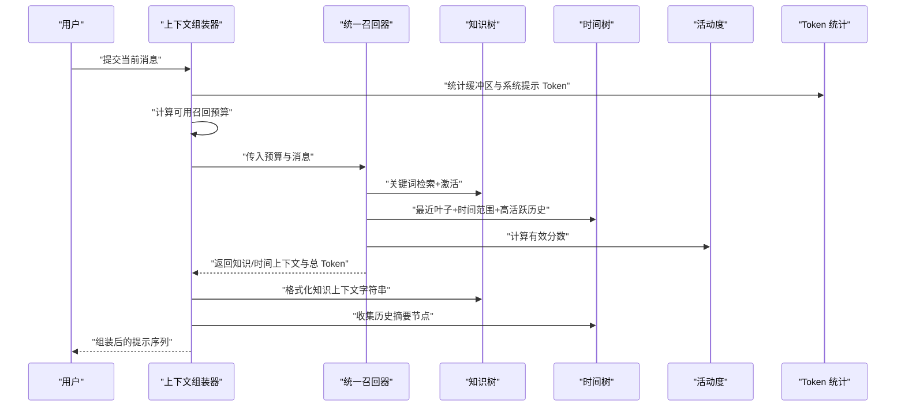
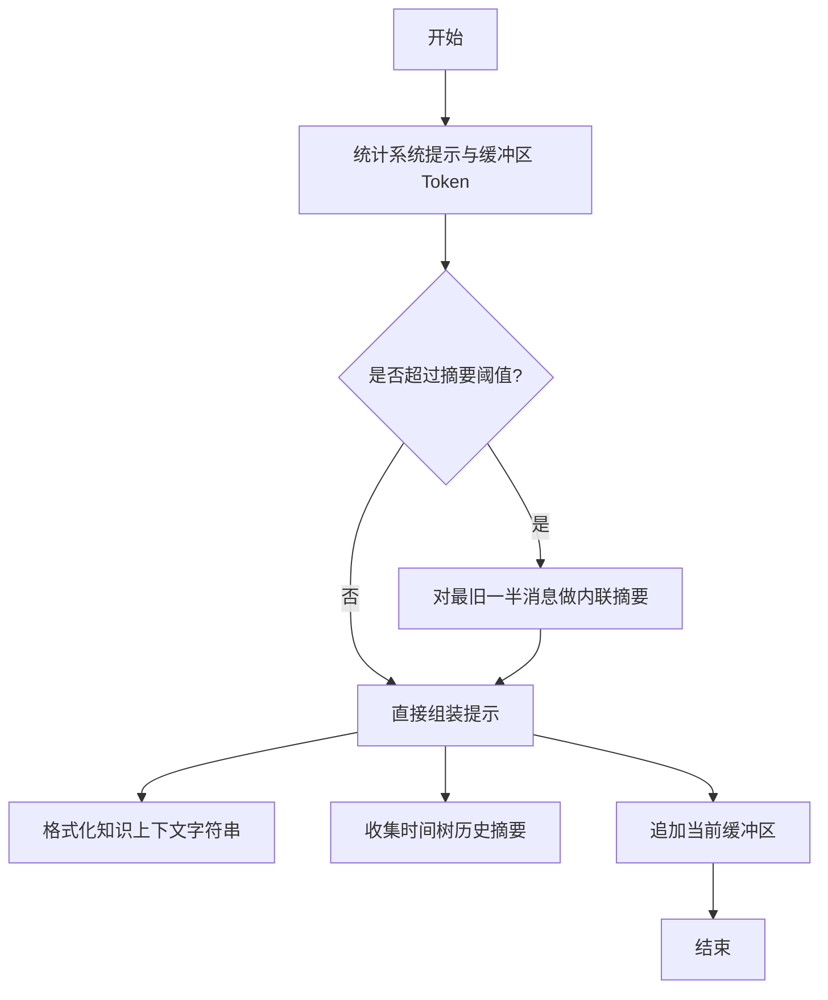
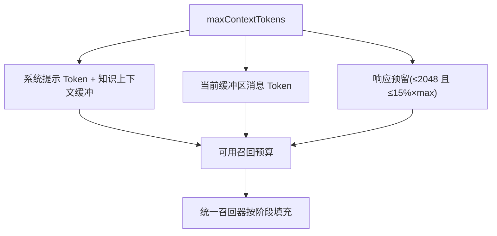
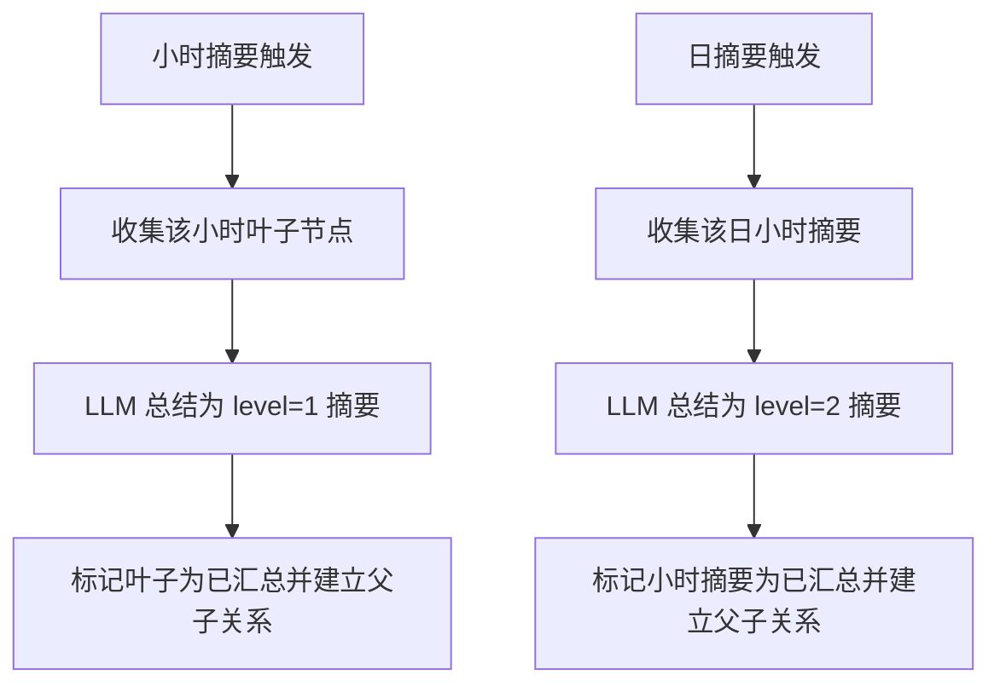
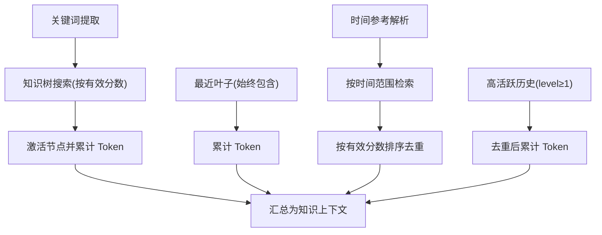
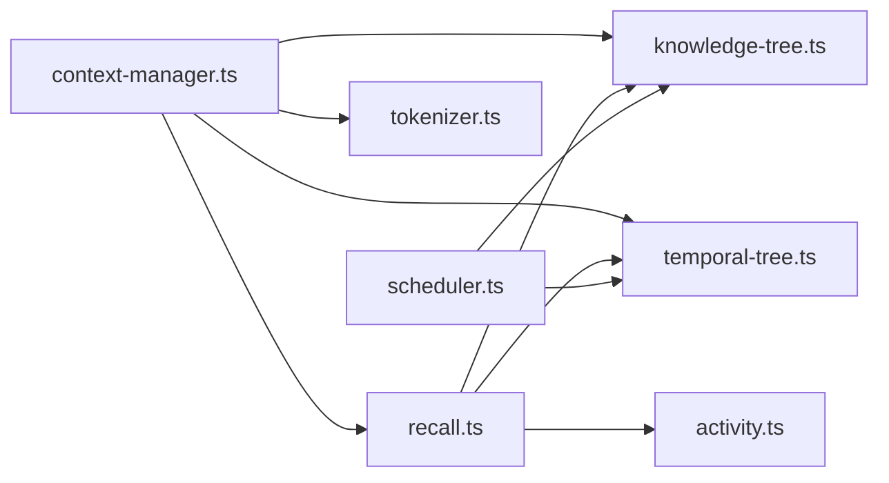

# 上下文管理

<cite>
**本文引用的文件**
- [context-manager.ts](file://src/engine/context-manager.ts)
- [recall.ts](file://src/memory/recall.ts)
- [knowledge-tree.ts](file://src/memory/knowledge-tree.ts)
- [temporal-tree.ts](file://src/memory/temporal-tree.ts)
- [activity.ts](file://src/memory/activity.ts)
- [tokenizer.ts](file://src/llm/tokenizer.ts)
- [index.ts](file://src/config/index.ts)
- [scheduler.ts](file://src/background/scheduler.ts)
- [migrate.ts](file://src/db/migrate.ts)
- [context-manager.test.ts](file://tests/engine/context-manager.test.ts)
- [package.json](file://package.json)
</cite>

## 目录
1. [简介](#简介)
2. [项目结构](#项目结构)
3. [核心组件](#核心组件)
4. [架构总览](#架构总览)
5. [详细组件分析](#详细组件分析)
6. [依赖关系分析](#依赖关系分析)
7. [性能考量](#性能考量)
8. [故障排查指南](#故障排查指南)
9. [结论](#结论)
10. [附录](#附录)

## 简介
本文件面向 TreeMemory 的上下文管理系统，围绕“上下文组装算法”“Token 预算分配机制”“摘要生成策略”“多阶段记忆召回的上下文集成”“上下文优化技术”“配置参数说明”“性能监控与内存优化”以及“代码示例路径”等方面进行系统化技术说明。目标读者既包括需要快速上手的工程师，也包括希望深入理解实现细节的高级用户。

## 项目结构
- 引擎层（engine）：负责上下文组装、对话状态与预算计算等核心逻辑
- 记忆层（memory）：知识树与时间树的检索、激活与汇总
- LLM 层（llm）：分词统计与模型调用封装
- 配置层（config）：运行时参数读取
- 背景任务（background）：周期性滚动聚合与知识抽取
- 数据库（db）：模式迁移与索引
- 测试（tests）：上下文管理器的关键行为验证

**图表来源**
- [context-manager.ts:1-103](file://src/engine/context-manager.ts#L1-L103)
- [recall.ts:1-168](file://src/memory/recall.ts#L1-L168)
- [knowledge-tree.ts:1-239](file://src/memory/knowledge-tree.ts#L1-L239)
- [temporal-tree.ts:1-363](file://src/memory/temporal-tree.ts#L1-L363)
- [activity.ts:1-51](file://src/memory/activity.ts#L1-L51)
- [tokenizer.ts:1-26](file://src/llm/tokenizer.ts#L1-L26)
- [index.ts:1-30](file://src/config/index.ts#L1-L30)
- [scheduler.ts:1-46](file://src/background/scheduler.ts#L1-L46)
- [migrate.ts:1-88](file://src/db/migrate.ts#L1-L88)

**章节来源**
- [context-manager.ts:1-103](file://src/engine/context-manager.ts#L1-L103)
- [recall.ts:1-168](file://src/memory/recall.ts#L1-L168)
- [knowledge-tree.ts:1-239](file://src/memory/knowledge-tree.ts#L1-L239)
- [temporal-tree.ts:1-363](file://src/memory/temporal-tree.ts#L1-L363)
- [activity.ts:1-51](file://src/memory/activity.ts#L1-L51)
- [tokenizer.ts:1-26](file://src/llm/tokenizer.ts#L1-L26)
- [index.ts:1-30](file://src/config/index.ts#L1-L30)
- [scheduler.ts:1-46](file://src/background/scheduler.ts#L1-L46)
- [migrate.ts:1-88](file://src/db/migrate.ts#L1-L88)

## 核心组件
- 上下文组装器：负责将系统提示、知识上下文、历史摘要、近期对话缓冲区与当前用户消息拼接为最终提示序列
- 统一召回器：按预算分阶段从知识树与时间树中提取上下文
- 时间树：按小时/天层级进行滚动摘要，形成可复用的历史摘要窗口
- 知识树：基于关键词与活动度的语义检索，支持路径式组织
- 活动度与有效分数：用于排序与去重，避免过时信息干扰
- Token 统计与预算：确保上下文不超限，并预留响应空间
- 后台调度：周期性执行时间树滚动聚合与知识抽取

**章节来源**
- [context-manager.ts:51-90](file://src/engine/context-manager.ts#L51-L90)
- [recall.ts:95-167](file://src/memory/recall.ts#L95-L167)
- [temporal-tree.ts:223-284](file://src/memory/temporal-tree.ts#L223-L284)
- [knowledge-tree.ts:188-202](file://src/memory/knowledge-tree.ts#L188-L202)
- [activity.ts:9-12](file://src/memory/activity.ts#L9-L12)
- [tokenizer.ts:9-25](file://src/llm/tokenizer.ts#L9-L25)
- [scheduler.ts:26-34](file://src/background/scheduler.ts#L26-L34)

## 架构总览
上下文管理由“预算计算—统一召回—上下文组装—摘要与滚动聚合”构成闭环。系统通过配置的最大上下文长度与摘要阈值比控制整体节奏，通过 Token 统计与响应预留保证稳定性。

**图表来源**
- [context-manager.ts:96-102](file://src/engine/context-manager.ts#L96-L102)
- [recall.ts:95-167](file://src/memory/recall.ts#L95-L167)
- [knowledge-tree.ts:188-202](file://src/memory/knowledge-tree.ts#L188-L202)
- [temporal-tree.ts:223-284](file://src/memory/temporal-tree.ts#L223-L284)
- [activity.ts:9-12](file://src/memory/activity.ts#L9-L12)
- [tokenizer.ts:17-25](file://src/llm/tokenizer.ts#L17-L25)

## 详细组件分析

### 上下文组装算法
- 触发条件：当缓冲区 Token 数超过“最大上下文 × 摘要阈值比”时触发内联摘要
- 内联摘要：对最旧的一半消息进行摘要，形成“早期摘要”
- 提示构建顺序：
  1) 系统提示（基础提示 + 知识上下文）
  2) 历史摘要（来自时间树的非根级摘要）
  3) 早期摘要（内联摘要）
  4) 当前对话缓冲区（近期消息）

**图表来源**
- [context-manager.ts:13-15](file://src/engine/context-manager.ts#L13-L15)
- [context-manager.ts:21-40](file://src/engine/context-manager.ts#L21-L40)
- [context-manager.ts:51-90](file://src/engine/context-manager.ts#L51-L90)

**章节来源**
- [context-manager.ts:13-15](file://src/engine/context-manager.ts#L13-L15)
- [context-manager.ts:21-40](file://src/engine/context-manager.ts#L21-L40)
- [context-manager.ts:51-90](file://src/engine/context-manager.ts#L51-L90)

### Token 预算分配机制
- 预算来源：maxContextTokens
- 已用项：
  - 系统提示 Token（含知识上下文缓冲）
  - 当前缓冲区消息 Token
  - 响应预留（不超过 2048，且不超过 maxContextTokens 的 15%）
- 可用预算：maxContextTokens − 系统提示 − 缓冲区 − 响应预留
- 召回预算：统一召回器接收该预算，按阶段填充

**图表来源**
- [context-manager.ts:96-102](file://src/engine/context-manager.ts#L96-L102)
- [tokenizer.ts:17-25](file://src/llm/tokenizer.ts#L17-L25)

**章节来源**
- [context-manager.ts:96-102](file://src/engine/context-manager.ts#L96-L102)
- [tokenizer.ts:9-25](file://src/llm/tokenizer.ts#L9-L25)

### 摘要生成策略
- 内联摘要（消息缓冲区）：
  - 触发条件：缓冲区 Token ≥ max × 阈值比
  - 内容：对最旧一半消息进行总结，温度较低以保持事实性
  - 存储位置：作为系统消息插入到最终提示中
- 时间树滚动摘要：
  - 小时摘要：对同一小时内的叶子节点进行摘要，生成 level=1 节点
  - 日摘要：对同一天内的小时摘要进行摘要，生成 level=2 节点
  - 触发条件：后台调度器检测“陈旧小时/天”，自动触发
- 知识树摘要：
  - 无独立摘要节点，通过“知识上下文字符串”形式注入系统提示

**图表来源**
- [context-manager.ts:21-40](file://src/engine/context-manager.ts#L21-L40)
- [temporal-tree.ts:97-147](file://src/memory/temporal-tree.ts#L97-L147)
- [temporal-tree.ts:167-217](file://src/memory/temporal-tree.ts#L167-L217)
- [scheduler.ts:26-34](file://src/background/scheduler.ts#L26-L34)

**章节来源**
- [context-manager.ts:21-40](file://src/engine/context-manager.ts#L21-L40)
- [temporal-tree.ts:97-147](file://src/memory/temporal-tree.ts#L97-L147)
- [temporal-tree.ts:167-217](file://src/memory/temporal-tree.ts#L167-L217)
- [scheduler.ts:26-34](file://src/background/scheduler.ts#L26-L34)

### 多阶段记忆召回的上下文集成
- 阶段一：知识树检索（约 25% 预算）
  - 关键词提取后搜索，按有效分数降序，逐个加入，同时激活节点
- 阶段二：最近叶子（始终包含，优先级最高）
  - 从最新到较新顺序取叶子，直到预算不足
- 阶段三：时间范围检索（若消息中包含时间参考）
  - 在指定日期范围内取节点，按有效分数排序，避免重复
- 阶段四：高活跃历史摘要（若仍有剩余预算）
  - 从 level≥1 的节点中按有效分数取若干，避免与已有节点重复

**图表来源**
- [recall.ts:12-52](file://src/memory/recall.ts#L12-L52)
- [recall.ts:95-167](file://src/memory/recall.ts#L95-L167)
- [activity.ts:9-12](file://src/memory/activity.ts#L9-L12)

**章节来源**
- [recall.ts:95-167](file://src/memory/recall.ts#L95-L167)
- [activity.ts:9-12](file://src/memory/activity.ts#L9-L12)

### 上下文优化技术
- 冗余信息过滤
  - 时间范围检索时，排除与“最近叶子”时间重叠的小时摘要，避免重复
- 重要性评分
  - 使用“有效分数”：活动度 × 时衰减因子，随时间自然衰减
- 空间压缩策略
  - 内联摘要：对最旧一半消息进行压缩
  - 时间树滚动摘要：将细粒度叶子压缩为小时/日摘要
  - Token 预留：为模型回复预留空间，避免超限

**章节来源**
- [temporal-tree.ts:257-261](file://src/memory/temporal-tree.ts#L257-L261)
- [activity.ts:9-12](file://src/memory/activity.ts#L9-L12)
- [context-manager.ts:99-101](file://src/engine/context-manager.ts#L99-L101)

### 配置参数说明与调优建议
- maxContextTokens：最大上下文长度，决定全局预算上限
- summarizeThresholdRatio：摘要阈值比，决定何时对缓冲区进行内联摘要
- responseReserve：响应预留，建议不超过 2048 或 maxContextTokens 的 15%
- activityDecayRate：活动度时衰减率，越小越快衰减
- activityBoost：激活增益，越大越容易提升召回权重
- backgroundIntervalMs：后台调度间隔，影响时间树滚动摘要的频率

调优建议：
- 若频繁触发内联摘要，适当提高 summarizeThresholdRatio 或增加 maxContextTokens
- 若历史摘要过多导致上下文拥挤，降低 backgroundIntervalMs 或减少日摘要生成
- 若响应经常受限，适当增大 maxContextTokens 或降低 responseReserve

**章节来源**
- [index.ts:18-29](file://src/config/index.ts#L18-L29)
- [context-manager.ts:96-102](file://src/engine/context-manager.ts#L96-L102)
- [temporal-tree.ts:327-358](file://src/memory/temporal-tree.ts#L327-L358)

## 依赖关系分析
- 上下文组装器依赖：
  - 统一召回器：获取知识与时间上下文
  - Token 统计：计算系统提示与缓冲区 Token
  - 知识树：格式化知识上下文字符串
  - 时间树：收集历史摘要
- 统一召回器依赖：
  - 知识树：关键词检索与激活
  - 时间树：最近叶子、时间范围与高活跃历史
  - 活动度：有效分数计算
- 后台调度器：
  - 时间树：检测陈旧小时/天并触发滚动摘要
  - 知识树：周期性抽取知识

**图表来源**
- [context-manager.ts:1-10](file://src/engine/context-manager.ts#L1-L10)
- [recall.ts:1-6](file://src/memory/recall.ts#L1-L6)
- [knowledge-tree.ts:1-6](file://src/memory/knowledge-tree.ts#L1-L6)
- [temporal-tree.ts:1-8](file://src/memory/temporal-tree.ts#L1-L8)
- [activity.ts:1-3](file://src/memory/activity.ts#L1-L3)
- [scheduler.ts:1-4](file://src/background/scheduler.ts#L1-L4)

**章节来源**
- [context-manager.ts:1-10](file://src/engine/context-manager.ts#L1-L10)
- [recall.ts:1-6](file://src/memory/recall.ts#L1-L6)
- [knowledge-tree.ts:1-6](file://src/memory/knowledge-tree.ts#L1-L6)
- [temporal-tree.ts:1-8](file://src/memory/temporal-tree.ts#L1-L8)
- [activity.ts:1-3](file://src/memory/activity.ts#L1-L3)
- [scheduler.ts:1-4](file://src/background/scheduler.ts#L1-L4)

## 性能考量
- Token 统计开销：消息数组 Token 统计为 O(n)，在大规模缓冲区时需注意
- 召回阶段剪枝：时间树按 level 与时间倒序取样，限制上限，避免全表扫描
- 有效分数缓存：在排序前计算有效分数，避免重复计算
- 后台调度节流：防止并发执行，避免数据库压力过大
- 数据库索引：按 parent_id、level+time、level+summarized、activity_score 建立索引，显著提升查询效率

**章节来源**
- [tokenizer.ts:17-25](file://src/llm/tokenizer.ts#L17-L25)
- [temporal-tree.ts:223-284](file://src/memory/temporal-tree.ts#L223-L284)
- [activity.ts:9-12](file://src/memory/activity.ts#L9-L12)
- [scheduler.ts:9-21](file://src/background/scheduler.ts#L9-L21)
- [migrate.ts:9-49](file://src/db/migrate.ts#L9-L49)

## 故障排查指南
- 摘要未触发
  - 检查 summarizeThresholdRatio 是否过高
  - 检查缓冲区 Token 统计是否异常
- 历史摘要缺失
  - 检查后台调度是否正常运行
  - 检查是否存在陈旧小时/天
- 召回内容质量差
  - 检查关键词提取是否合理
  - 调整 activityDecayRate 与 activityBoost
- 超出上下文长度
  - 检查响应预留设置
  - 适当降低 maxContextTokens 或提高阈值比

**章节来源**
- [context-manager.test.ts:20-30](file://tests/engine/context-manager.test.ts#L20-L30)
- [context-manager.ts:96-102](file://src/engine/context-manager.ts#L96-L102)
- [scheduler.ts:26-34](file://src/background/scheduler.ts#L26-L34)
- [recall.ts:12-52](file://src/memory/recall.ts#L12-L52)

## 结论
TreeMemory 的上下文管理通过“预算驱动的统一召回 + 多层级摘要 + 有效分数排序”的组合，在保证上下文质量的同时，有效控制了 Token 使用与系统负载。合理的参数调优与后台调度策略，能够进一步提升长期使用的稳定性与效果。

## 附录

### 代码示例路径（不含具体代码内容）
- 上下文组装与内联摘要
  - [shouldSummarize:13-15](file://src/engine/context-manager.ts#L13-L15)
  - [summarizeBuffer:21-40](file://src/engine/context-manager.ts#L21-L40)
  - [assemblePrompt:51-90](file://src/engine/context-manager.ts#L51-L90)
- Token 预算与统计
  - [calculateRecallBudget:96-102](file://src/engine/context-manager.ts#L96-L102)
  - [countTokens:9-11](file://src/llm/tokenizer.ts#L9-L11)
  - [countMessagesTokens:17-25](file://src/llm/tokenizer.ts#L17-L25)
- 统一召回流程
  - [recall:95-167](file://src/memory/recall.ts#L95-L167)
  - [extractKeywords:12-52](file://src/memory/recall.ts#L12-L52)
  - [extractTimeReference:58-89](file://src/memory/recall.ts#L58-L89)
- 时间树滚动摘要
  - [summarizeHour:97-147](file://src/memory/temporal-tree.ts#L97-L147)
  - [summarizeDay:167-217](file://src/memory/temporal-tree.ts#L167-L217)
  - [getContextWindow:223-284](file://src/memory/temporal-tree.ts#L223-L284)
- 知识树上下文格式化
  - [toContextString:188-202](file://src/memory/knowledge-tree.ts#L188-L202)
- 活动度与有效分数
  - [effectiveScore:9-12](file://src/memory/activity.ts#L9-L12)
  - [activateNode:18-50](file://src/memory/activity.ts#L18-L50)
- 后台调度
  - [startBackgroundScheduler:26-34](file://src/background/scheduler.ts#L26-L34)
- 数据库迁移
  - [runMigrations:4-87](file://src/db/migrate.ts#L4-L87)
- 运行参数
  - [config:18-29](file://src/config/index.ts#L18-L29)
- 依赖声明
  - [package.json:17-26](file://package.json#L17-L26)