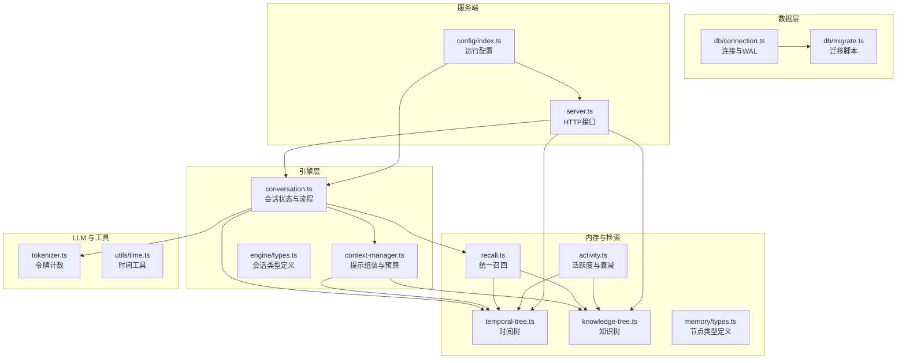
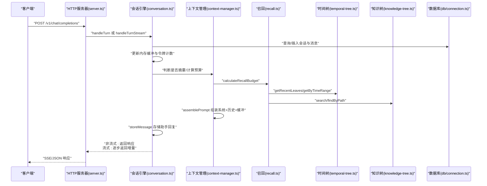
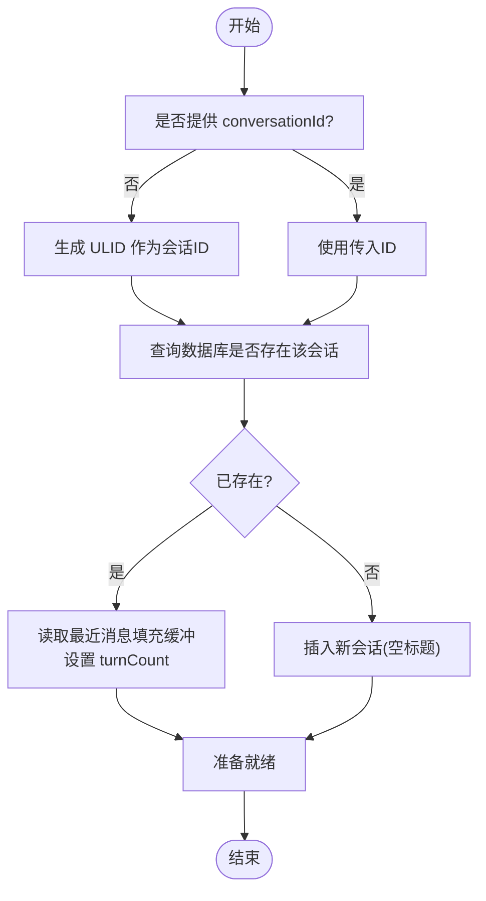
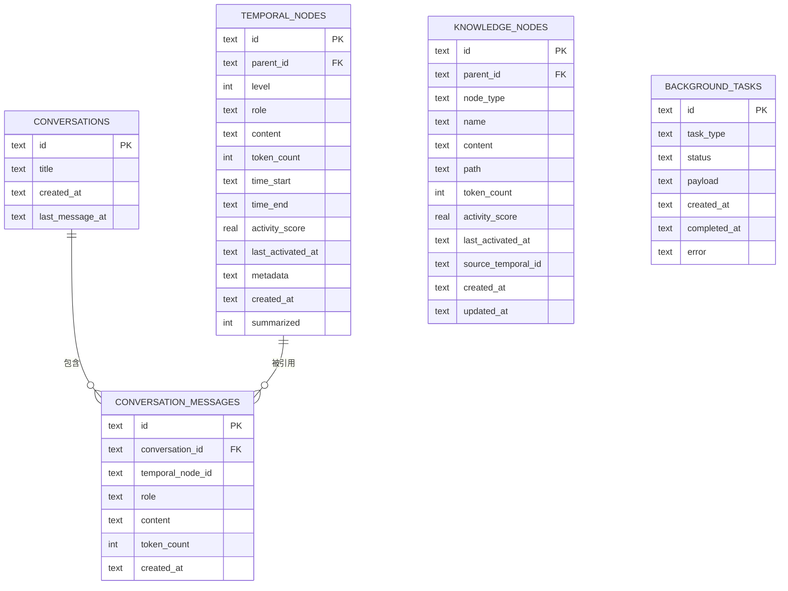
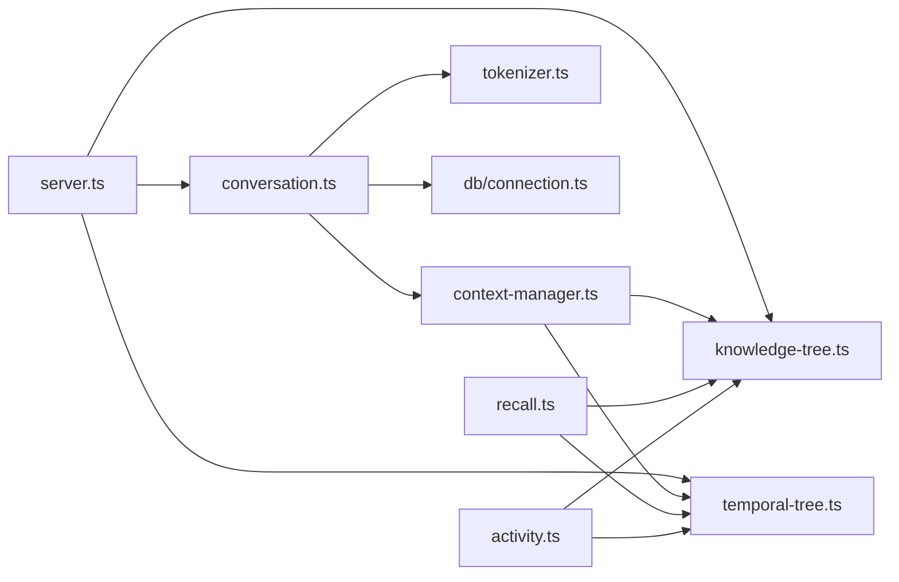

# 会话管理

<cite>
**本文引用的文件**
- [src/engine/conversation.ts](file://src/engine/conversation.ts)
- [src/engine/context-manager.ts](file://src/engine/context-manager.ts)
- [src/db/connection.ts](file://src/db/connection.ts)
- [src/db/migrate.ts](file://src/db/migrate.ts)
- [src/memory/knowledge-tree.ts](file://src/memory/knowledge-tree.ts)
- [src/memory/temporal-tree.ts](file://src/memory/temporal-tree.ts)
- [src/memory/recall.ts](file://src/memory/recall.ts)
- [src/memory/activity.ts](file://src/memory/activity.ts)
- [src/memory/types.ts](file://src/memory/types.ts)
- [src/engine/types.ts](file://src/engine/types.ts)
- [src/llm/tokenizer.ts](file://src/llm/tokenizer.ts)
- [src/utils/time.ts](file://src/utils/time.ts)
- [src/config/index.ts](file://src/config/index.ts)
- [src/server.ts](file://src/server.ts)
- [package.json](file://package.json)
</cite>

## 目录
1. [简介](#简介)
2. [项目结构](#项目结构)
3. [核心组件](#核心组件)
4. [架构总览](#架构总览)
5. [详细组件分析](#详细组件分析)
6. [依赖关系分析](#依赖关系分析)
7. [性能考量](#性能考量)
8. [故障排查指南](#故障排查指南)
9. [结论](#结论)
10. [附录](#附录)

## 简介
本文件面向 TreeMemory 的会话管理系统，提供从“会话生命周期”“内存缓存机制”“标识符生成”“持久化实现”“标题自动生成与消息缓冲区管理”“令牌计数”到“API 接口说明与错误处理”的完整技术文档。目标读者既包括需要快速上手的开发者，也包括希望深入理解实现细节的架构师。

## 项目结构
会话管理位于引擎层（engine），围绕 ConversationState 在内存中进行工作缓冲区管理，并通过数据库（SQLite）持久化会话与消息。同时，系统结合时间树（temporal memory）与知识树（semantic memory）进行检索增强与上下文组装。

图表来源
- [src/engine/conversation.ts:1-280](file://src/engine/conversation.ts#L1-L280)
- [src/engine/context-manager.ts:1-105](file://src/engine/context-manager.ts#L1-L105)
- [src/memory/temporal-tree.ts:1-362](file://src/memory/temporal-tree.ts#L1-L362)
- [src/memory/knowledge-tree.ts:1-239](file://src/memory/knowledge-tree.ts#L1-L239)
- [src/memory/recall.ts:1-168](file://src/memory/recall.ts#L1-L168)
- [src/memory/activity.ts:1-51](file://src/memory/activity.ts#L1-L51)
- [src/llm/tokenizer.ts:1-26](file://src/llm/tokenizer.ts#L1-L26)
- [src/utils/time.ts:1-60](file://src/utils/time.ts#L1-L60)
- [src/db/connection.ts:1-26](file://src/db/connection.ts#L1-L26)
- [src/db/migrate.ts:1-88](file://src/db/migrate.ts#L1-L88)
- [src/server.ts:1-165](file://src/server.ts#L1-L165)
- [src/config/index.ts:1-30](file://src/config/index.ts#L1-L30)

章节来源
- [src/engine/conversation.ts:1-280](file://src/engine/conversation.ts#L1-L280)
- [src/server.ts:1-165](file://src/server.ts#L1-L165)

## 核心组件
- 会话状态与流程：负责会话创建/加载/更新/销毁，维护内存缓冲区与令牌计数，触发摘要与后台任务。
- 上下文管理器：计算回忆预算、组装提示、判断是否需要摘要。
- 内存与检索：时间树按小时/天层级摘要；知识树按路径组织；统一召回模块整合两者。
- 数据层：Better-SQLite3 连接、WAL 模式、外键约束、迁移脚本。
- 工具链：ULID 生成、令牌计数、时间工具、配置读取。

章节来源
- [src/engine/conversation.ts:1-280](file://src/engine/conversation.ts#L1-L280)
- [src/engine/context-manager.ts:1-105](file://src/engine/context-manager.ts#L1-L105)
- [src/memory/temporal-tree.ts:1-362](file://src/memory/temporal-tree.ts#L1-L362)
- [src/memory/knowledge-tree.ts:1-239](file://src/memory/knowledge-tree.ts#L1-L239)
- [src/memory/recall.ts:1-168](file://src/memory/recall.ts#L1-L168)
- [src/db/connection.ts:1-26](file://src/db/connection.ts#L1-L26)
- [src/db/migrate.ts:1-88](file://src/db/migrate.ts#L1-L88)
- [src/llm/tokenizer.ts:1-26](file://src/llm/tokenizer.ts#L1-L26)
- [src/utils/time.ts:1-60](file://src/utils/time.ts#L1-L60)
- [src/config/index.ts:1-30](file://src/config/index.ts#L1-L30)

## 架构总览
会话管理采用“内存缓冲 + 数据库持久化 + LLM 推理 + 时间/知识树检索”的混合架构。请求进入 HTTP 层后，根据是否流式选择不同的处理分支，最终通过上下文管理器组装提示并调用 LLM。

图表来源
- [src/server.ts:19-109](file://src/server.ts#L19-L109)
- [src/engine/conversation.ts:103-219](file://src/engine/conversation.ts#L103-L219)
- [src/engine/context-manager.ts:53-104](file://src/engine/context-manager.ts#L53-L104)
- [src/memory/recall.ts:95-167](file://src/memory/recall.ts#L95-L167)
- [src/memory/temporal-tree.ts:66-283](file://src/memory/temporal-tree.ts#L66-L283)
- [src/memory/knowledge-tree.ts:138-202](file://src/memory/knowledge-tree.ts#L138-L202)
- [src/db/connection.ts:8-17](file://src/db/connection.ts#L8-L17)

## 详细组件分析

### 会话生命周期管理
- 创建：若未提供会话 ID，则生成 ULID；若数据库不存在该会话则插入空标题记录；若存在则加载最近消息到内存缓冲。
- 加载：从数据库读取 conversation_messages 并重建 buffer 与 bufferTokenCount，turnCount 基于消息对数估算。
- 更新：每次用户消息写入数据库并更新 last_message_at；必要时触发摘要，清理缓冲并更新摘要缓存；助手回复同样持久化并增加 turnCount。
- 销毁：删除会话及其消息，并清理内存中的会话与摘要缓存。

图表来源
- [src/engine/conversation.ts:23-68](file://src/engine/conversation.ts#L23-L68)

章节来源
- [src/engine/conversation.ts:23-68](file://src/engine/conversation.ts#L23-L68)
- [src/engine/conversation.ts:76-97](file://src/engine/conversation.ts#L76-L97)
- [src/engine/conversation.ts:273-279](file://src/engine/conversation.ts#L273-L279)

### 内存中的会话缓存机制
- 缓存结构：Map<string, ConversationState>，键为会话 ID，值为内存状态对象。
- 状态字段：id、title、buffer（消息数组）、bufferTokenCount（令牌总量）、turnCount（轮次计数）。
- 并发访问控制：当前实现为单进程内存 Map，无显式锁；建议在多实例部署时配合外部分布式缓存或进程内同步策略。
- 内存优化策略：
  - 定期摘要：当 bufferTokenCount 超过阈值时，对最旧的一半消息进行摘要，减少后续上下文大小。
  - 令牌预算：calculateRecallBudget 动态分配给知识树与时间树的回忆空间，避免超出最大上下文。
  - 周期性后台提取：每 N 轮入队知识抽取任务，异步提升长期记忆质量。

章节来源
- [src/engine/conversation.ts:18-18](file://src/engine/conversation.ts#L18-L18)
- [src/engine/conversation.ts:103-160](file://src/engine/conversation.ts#L103-L160)
- [src/engine/conversation.ts:166-219](file://src/engine/conversation.ts#L166-L219)
- [src/engine/context-manager.ts:15-17](file://src/engine/context-manager.ts#L15-L17)
- [src/engine/context-manager.ts:98-104](file://src/engine/context-manager.ts#L98-L104)

### 会话标识符生成机制（ULID）
- 使用 ulid 包生成全局唯一 ID，确保跨进程、跨时间的唯一性。
- 会话 ID 用于：
  - 作为 conversations 表主键
  - 作为 conversation_messages 外键
  - 作为后台任务 payload 的引用

章节来源
- [src/engine/conversation.ts:24-24](file://src/engine/conversation.ts#L24-L24)
- [src/engine/conversation.ts:80-80](file://src/engine/conversation.ts#L80-L80)
- [src/engine/conversation.ts:226-226](file://src/engine/conversation.ts#L226-L226)
- [src/memory/temporal-tree.ts:38-38](file://src/memory/temporal-tree.ts#L38-L38)
- [src/memory/knowledge-tree.ts:37-37](file://src/memory/knowledge-tree.ts#L37-L37)

### 会话持久化实现
- 数据库连接：Better-SQLite3，开启 WAL 模式与外键约束，初始化时执行迁移。
- 迁移脚本：创建四张表（temporal_nodes、knowledge_nodes、conversations、conversation_messages、background_tasks），并设置索引。
- SQL 操作：
  - 会话：插入空标题、更新标题、查询列表、按 ID 删除。
  - 消息：插入消息并关联时间树节点、更新会话最后消息时间、按会话排序读取。
  - 后台任务：插入知识抽取任务，状态 pending。
- 事务处理：当前实现为单条语句执行，未显式包裹事务；如需强一致性可在外层封装事务。

图表来源
- [src/db/migrate.ts:9-81](file://src/db/migrate.ts#L9-L81)
- [src/db/connection.ts:8-17](file://src/db/connection.ts#L8-L17)

章节来源
- [src/db/connection.ts:8-17](file://src/db/connection.ts#L8-L17)
- [src/db/migrate.ts:4-87](file://src/db/migrate.ts#L4-L87)
- [src/engine/conversation.ts:44-51](file://src/engine/conversation.ts#L44-L51)
- [src/engine/conversation.ts:54-63](file://src/engine/conversation.ts#L54-L63)
- [src/engine/conversation.ts:86-92](file://src/engine/conversation.ts#L86-L92)
- [src/engine/conversation.ts:228-231](file://src/engine/conversation.ts#L228-L231)

### 会话标题自动生成与消息缓冲区管理
- 标题生成：首次轮次且标题为空时，使用用户第一条消息的前若干字符作为标题，并持久化更新。
- 缓冲区管理：
  - storeMessage 将消息写入数据库并更新 last_message_at，同时追加到内存 buffer 并累加 token_count。
  - shouldSummarize 判断是否需要摘要，summarizeBuffer 对最旧一半消息进行摘要，合并到 per-conversation 的摘要缓存，裁剪 buffer 并重新计算令牌数。
  - assemblePrompt 将系统提示、历史摘要、近期消息拼接为最终提示。

章节来源
- [src/engine/conversation.ts:113-117](file://src/engine/conversation.ts#L113-L117)
- [src/engine/conversation.ts:120-137](file://src/engine/conversation.ts#L120-L137)
- [src/engine/conversation.ts:176-180](file://src/engine/conversation.ts#L176-L180)
- [src/engine/conversation.ts:183-192](file://src/engine/conversation.ts#L183-L192)
- [src/engine/context-manager.ts:23-42](file://src/engine/context-manager.ts#L23-L42)
- [src/engine/context-manager.ts:53-92](file://src/engine/context-manager.ts#L53-L92)

### 令牌计数机制
- 单文本计数：基于 gpt-tokenizer 的编码长度。
- 消息数组计数：考虑 OpenAI 风格的消息开销常量，逐条累加角色与内容的 token 数。
- 预留：为模型输出预留固定数量的 token，确保不会越界。

章节来源
- [src/llm/tokenizer.ts:9-25](file://src/llm/tokenizer.ts#L9-L25)
- [src/engine/context-manager.ts:98-104](file://src/engine/context-manager.ts#L98-L104)

### API 接口说明
- GET /v1/conversations
  - 功能：列出所有会话，按最后消息时间倒序。
  - 返回：数组，元素包含 id、title、createdAt、lastMessageAt。
  - 实现：调用 listConversations。
- GET /v1/conversations/:id
  - 功能：获取指定会话的所有消息，按时间升序。
  - 返回：数组，元素包含 role、content、createdAt。
  - 实现：调用 getConversationMessages。
- DELETE /v1/conversations/:id
  - 功能：删除指定会话及其消息。
  - 返回：{ success: true }。
  - 实现：调用 deleteConversation。
- POST /v1/chat/completions
  - 功能：OpenAI 兼容接口，支持流式与非流式两种模式。
  - 参数：
    - messages: 必填，数组，最后一个 role 为 user 的消息作为输入。
    - model: 可选，默认来自配置。
    - stream: 可选，布尔，true 时返回 SSE 流。
    - conversation_id: 可选，复用或新建会话。
  - 非流式返回：
    - id、object、created、model、conversation_id、choices[].message、usage。
  - 流式返回：
    - 多个 chat.completion.chunk，最后一条 [DONE] 结束。
  - 实现：路由分发至 handleTurn 或 handleTurnStream。

章节来源
- [src/server.ts:140-153](file://src/server.ts#L140-L153)
- [src/server.ts:19-109](file://src/server.ts#L19-L109)
- [src/engine/conversation.ts:103-160](file://src/engine/conversation.ts#L103-L160)
- [src/engine/conversation.ts:166-219](file://src/engine/conversation.ts#L166-L219)

### 错误处理策略
- 输入校验：messages 缺失或不含用户消息时返回 400。
- 流式处理：SSE 写入失败时需确保连接关闭与日志记录。
- 数据库异常：连接/迁移失败时记录日志并终止启动；SQL 执行异常需捕获并返回友好错误。
- 业务异常：会话删除后内存缓存同步清理，避免悬挂引用。

章节来源
- [src/server.ts:27-34](file://src/server.ts#L27-L34)
- [src/db/connection.ts:8-17](file://src/db/connection.ts#L8-L17)
- [src/engine/conversation.ts:273-279](file://src/engine/conversation.ts#L273-L279)

## 依赖关系分析
- 引擎层依赖：
  - 会话引擎依赖上下文管理器、LLM 客户端、令牌计数、时间树、召回模块。
  - 上下文管理器依赖知识树、时间树、活动度模块。
- 数据层依赖：
  - 所有内存/检索模块依赖数据库连接与迁移脚本。
- 服务层依赖：
  - HTTP 服务器依赖会话引擎与内存模块，暴露 OpenAI 兼容接口与内部内存查询接口。

图表来源
- [src/server.ts:1-165](file://src/server.ts#L1-L165)
- [src/engine/conversation.ts:1-280](file://src/engine/conversation.ts#L1-L280)
- [src/engine/context-manager.ts:1-105](file://src/engine/context-manager.ts#L1-L105)
- [src/memory/recall.ts:1-168](file://src/memory/recall.ts#L1-L168)
- [src/memory/temporal-tree.ts:1-362](file://src/memory/temporal-tree.ts#L1-L362)
- [src/memory/knowledge-tree.ts:1-239](file://src/memory/knowledge-tree.ts#L1-L239)
- [src/memory/activity.ts:1-51](file://src/memory/activity.ts#L1-L51)
- [src/db/connection.ts:1-26](file://src/db/connection.ts#L1-L26)

章节来源
- [src/server.ts:1-165](file://src/server.ts#L1-L165)
- [src/engine/conversation.ts:1-280](file://src/engine/conversation.ts#L1-L280)
- [src/engine/context-manager.ts:1-105](file://src/engine/context-manager.ts#L1-L105)
- [src/memory/recall.ts:1-168](file://src/memory/recall.ts#L1-L168)
- [src/memory/temporal-tree.ts:1-362](file://src/memory/temporal-tree.ts#L1-L362)
- [src/memory/knowledge-tree.ts:1-239](file://src/memory/knowledge-tree.ts#L1-L239)
- [src/memory/activity.ts:1-51](file://src/memory/activity.ts#L1-L51)
- [src/db/connection.ts:1-26](file://src/db/connection.ts#L1-L26)

## 性能考量
- 令牌预算与摘要：
  - 通过 calculateRecallBudget 动态分配知识树与时间树的回忆空间，避免越界。
  - shouldSummarize + summarizeBuffer 将最旧一半消息摘要，显著降低上下文规模。
- 时间树检索优先级：
  - getContextWindow 优先返回最近叶子节点，再考虑小时摘要、日摘要，满足“最近优先”的直觉。
- 索引与查询：
  - temporal_nodes/knowledge_nodes 建有复合索引，提升查询与排序效率。
- 流式响应：
  - SSE 流式返回可降低首字节延迟，改善用户体验。
- 并发与内存：
  - 当前内存 Map 无锁，建议在多实例部署时引入分布式缓存或进程间同步。

章节来源
- [src/engine/context-manager.ts:98-104](file://src/engine/context-manager.ts#L98-L104)
- [src/engine/context-manager.ts:15-17](file://src/engine/context-manager.ts#L15-L17)
- [src/engine/context-manager.ts:23-42](file://src/engine/context-manager.ts#L23-L42)
- [src/memory/temporal-tree.ts:222-283](file://src/memory/temporal-tree.ts#L222-L283)
- [src/db/migrate.ts:26-49](file://src/db/migrate.ts#L26-L49)
- [src/server.ts:38-85](file://src/server.ts#L38-L85)

## 故障排查指南
- 无法连接数据库
  - 检查 DB_PATH 是否正确，确认 WAL 与外键启用。
  - 参考：[src/db/connection.ts:8-17](file://src/db/connection.ts#L8-L17)
- 迁移失败或表缺失
  - 确认迁移版本 user_version，检查索引创建是否成功。
  - 参考：[src/db/migrate.ts:4-87](file://src/db/migrate.ts#L4-L87)
- 会话列表为空
  - 确认 conversations 表是否有数据；检查 last_message_at 排序逻辑。
  - 参考：[src/engine/conversation.ts:238-249](file://src/engine/conversation.ts#L238-L249)
- 消息未持久化
  - 检查 conversation_messages 插入与外键约束；确认 temporal_node_id 关联。
  - 参考：[src/engine/conversation.ts:86-92](file://src/engine/conversation.ts#L86-L92)
- 流式响应中断
  - 检查 SSE 写入与连接关闭；确认 handleTurnStream 的完成标记。
  - 参考：[src/engine/conversation.ts:166-219](file://src/engine/conversation.ts#L166-L219)，[src/server.ts:38-85](file://src/server.ts#L38-L85)
- 标题未生成
  - 确认首次轮次且标题为空时的赋值逻辑。
  - 参考：[src/engine/conversation.ts:113-117](file://src/engine/conversation.ts#L113-L117)，[src/engine/conversation.ts:176-180](file://src/engine/conversation.ts#L176-L180)

章节来源
- [src/db/connection.ts:8-17](file://src/db/connection.ts#L8-L17)
- [src/db/migrate.ts:4-87](file://src/db/migrate.ts#L4-L87)
- [src/engine/conversation.ts:238-249](file://src/engine/conversation.ts#L238-L249)
- [src/engine/conversation.ts:86-92](file://src/engine/conversation.ts#L86-L92)
- [src/server.ts:38-85](file://src/server.ts#L38-L85)

## 结论
TreeMemory 的会话管理以“内存缓冲 + 数据库持久化 + 时间/知识树检索”为核心，通过 ULID 保证唯一性，通过令牌预算与摘要机制控制上下文规模，通过流式接口优化交互体验。整体设计清晰、模块职责明确，具备良好的扩展性与可维护性。建议在生产环境中关注多实例部署下的缓存一致性与数据库事务封装。

## 附录
- 配置项概览（来自环境变量与默认值）
  - LLM 基础地址、API Key、模型名称
  - 最大上下文令牌数、摘要阈值比例
  - 数据库路径、HTTP 端口
  - 后台任务轮询间隔、活跃度衰减率、活跃度提升幅度

章节来源
- [src/config/index.ts:18-29](file://src/config/index.ts#L18-L29)
- [package.json:17-26](file://package.json#L17-L26)