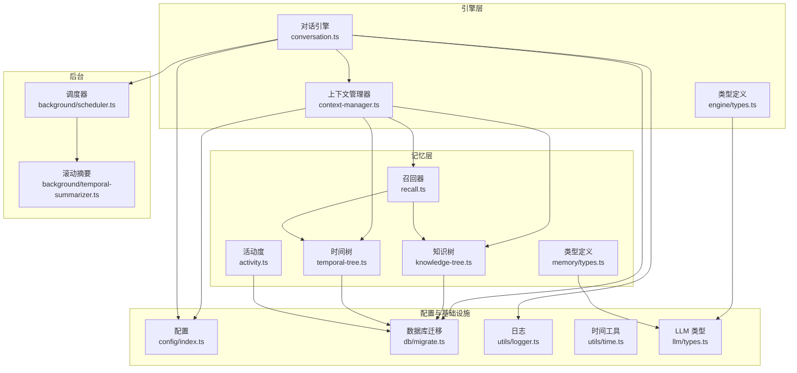
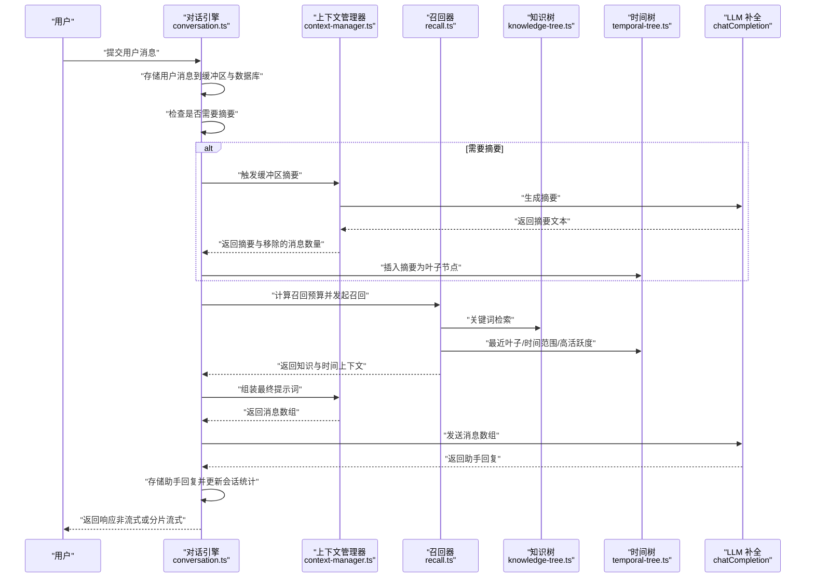
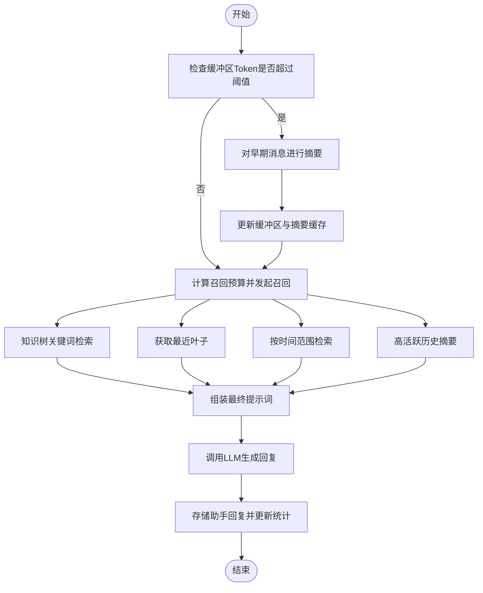
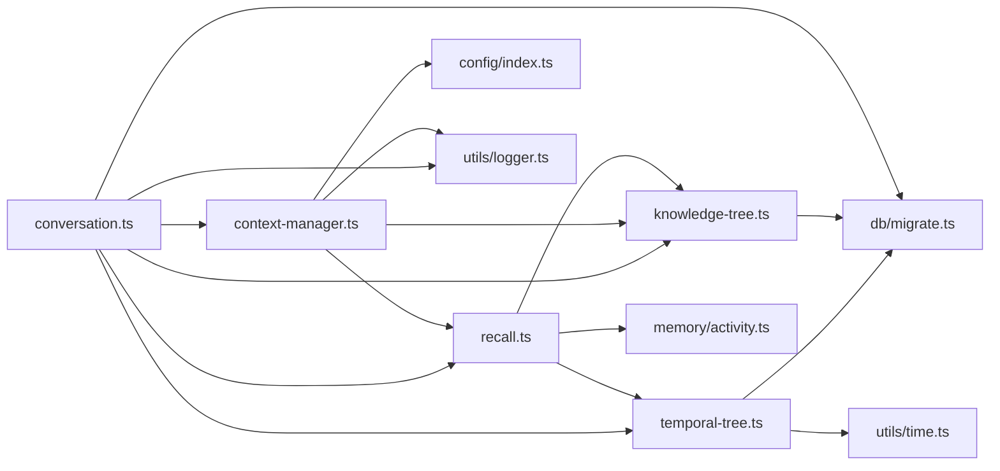
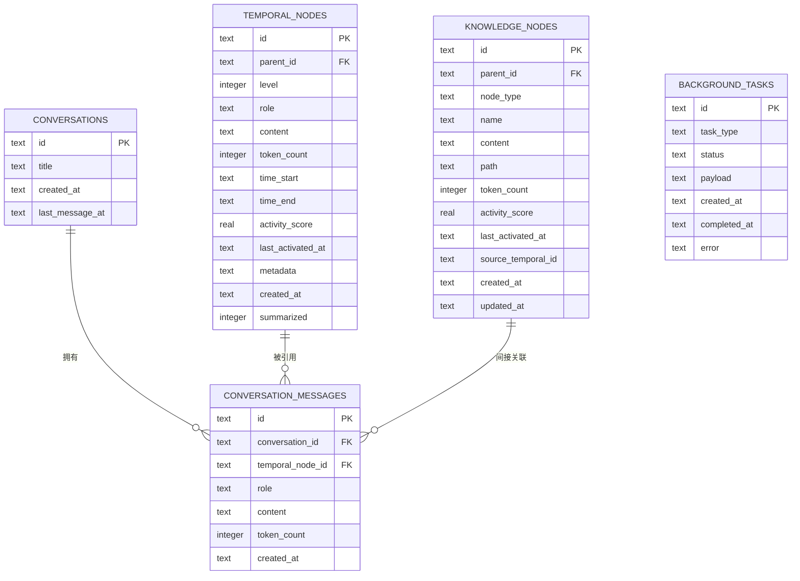

# 对话引擎

<cite>
**本文引用的文件**
- [src/engine/context-manager.ts](file://src/engine/context-manager.ts)
- [src/engine/conversation.ts](file://src/engine/conversation.ts)
- [src/engine/types.ts](file://src/engine/types.ts)
- [src/memory/knowledge-tree.ts](file://src/memory/knowledge-tree.ts)
- [src/memory/temporal-tree.ts](file://src/memory/temporal-tree.ts)
- [src/memory/recall.ts](file://src/memory/recall.ts)
- [src/memory/activity.ts](file://src/memory/activity.ts)
- [src/memory/types.ts](file://src/memory/types.ts)
- [src/config/index.ts](file://src/config/index.ts)
- [src/db/migrate.ts](file://src/db/migrate.ts)
- [src/background/scheduler.ts](file://src/background/scheduler.ts)
- [src/background/temporal-summarizer.ts](file://src/background/temporal-summarizer.ts)
- [src/utils/logger.ts](file://src/utils/logger.ts)
- [src/utils/time.ts](file://src/utils/time.ts)
- [src/llm/types.ts](file://src/llm/types.ts)
</cite>

## 目录
1. [简介](#简介)
2. [项目结构](#项目结构)
3. [核心组件](#核心组件)
4. [架构总览](#架构总览)
5. [详细组件分析](#详细组件分析)
6. [依赖关系分析](#依赖关系分析)
7. [性能考量](#性能考量)
8. [故障排查指南](#故障排查指南)
9. [结论](#结论)
10. [附录](#附录)

## 简介
本技术文档围绕 TreeMemory 的对话引擎展开，系统性阐述对话状态管理、上下文管理器、缓冲区与内存优化、背景任务调度以及完整的对话流程。重点覆盖以下方面：
- 会话生命周期与并发控制策略
- 上下文组装算法、Token 预算分配与摘要生成策略
- 缓冲区管理（消息缓存、过期与内存优化）
- 从用户输入到响应输出的完整数据流
- 配置项详解（最大上下文长度、摘要阈值、超时等）
- 性能监控指标与调优建议
- 错误处理与异常恢复机制

## 项目结构
对话引擎位于 engine 子目录，核心模块包括：
- conversation.ts：会话状态管理与对话回合处理（含非流式与流式）
- context-manager.ts：上下文组装、摘要触发与预算计算
- types.ts：会话状态与回合数据结构定义
- memory 子系统：知识树（语义记忆）、时间树（时序记忆）、召回与活动度
- config/index.ts：运行时配置
- background/*：后台调度与滚动摘要
- db/migrate.ts：数据库迁移脚本
- utils/*：日志与时间工具
- llm/types.ts：LLM 消息与补全参数类型

图表来源
- [src/engine/conversation.ts:1-280](file://src/engine/conversation.ts#L1-L280)
- [src/engine/context-manager.ts:1-105](file://src/engine/context-manager.ts#L1-L105)
- [src/memory/knowledge-tree.ts:1-239](file://src/memory/knowledge-tree.ts#L1-L239)
- [src/memory/temporal-tree.ts:1-362](file://src/memory/temporal-tree.ts#L1-L362)
- [src/memory/recall.ts:1-168](file://src/memory/recall.ts#L1-L168)
- [src/memory/activity.ts:1-51](file://src/memory/activity.ts#L1-L51)
- [src/config/index.ts:1-30](file://src/config/index.ts#L1-L30)
- [src/db/migrate.ts:1-88](file://src/db/migrate.ts#L1-L88)
- [src/background/scheduler.ts:1-46](file://src/background/scheduler.ts#L1-L46)
- [src/background/temporal-summarizer.ts:1-34](file://src/background/temporal-summarizer.ts#L1-L34)
- [src/utils/logger.ts:1-10](file://src/utils/logger.ts#L1-L10)
- [src/utils/time.ts:1-60](file://src/utils/time.ts#L1-L60)
- [src/llm/types.ts:1-12](file://src/llm/types.ts#L1-L12)

章节来源
- [src/engine/conversation.ts:1-280](file://src/engine/conversation.ts#L1-L280)
- [src/engine/context-manager.ts:1-105](file://src/engine/context-manager.ts#L1-L105)
- [src/memory/knowledge-tree.ts:1-239](file://src/memory/knowledge-tree.ts#L1-L239)
- [src/memory/temporal-tree.ts:1-362](file://src/memory/temporal-tree.ts#L1-L362)
- [src/memory/recall.ts:1-168](file://src/memory/recall.ts#L1-L168)
- [src/memory/activity.ts:1-51](file://src/memory/activity.ts#L1-L51)
- [src/config/index.ts:1-30](file://src/config/index.ts#L1-L30)
- [src/db/migrate.ts:1-88](file://src/db/migrate.ts#L1-L88)
- [src/background/scheduler.ts:1-46](file://src/background/scheduler.ts#L1-L46)
- [src/background/temporal-summarizer.ts:1-34](file://src/background/temporal-summarizer.ts#L1-L34)
- [src/utils/logger.ts:1-10](file://src/utils/logger.ts#L1-L10)
- [src/utils/time.ts:1-60](file://src/utils/time.ts#L1-L60)
- [src/llm/types.ts:1-12](file://src/llm/types.ts#L1-L12)

## 核心组件
- 会话状态管理（conversation.ts）
  - 使用内存 Map 维护会话状态，按需从数据库加载最近消息，支持创建新会话、列出会话、查询消息、删除会话
  - 提供非流式与流式对话回合处理，自动标题生成、摘要存储、知识抽取任务入队
- 上下文管理器（context-manager.ts）
  - 判断是否需要对缓冲区进行摘要（基于 Token 阈值）
  - 计算召回预算，组装最终提示词（系统提示+历史摘要+近期消息+当前用户消息）
  - 调用 LLM 完成对话与摘要生成
- 记忆与召回（knowledge-tree.ts、temporal-tree.ts、recall.ts）
  - 知识树：路径式分类与事实节点，支持 upsert、搜索、子树获取、上下文格式化
  - 时间树：按小时/天层级的滚动摘要，提供最近叶子、按时间范围检索、高活跃度节点筛选
  - 召回器：关键词提取、时间参考解析、分阶段填充 Token 预算
- 配置与基础设施（config/index.ts、db/migrate.ts、utils/logger.ts、utils/time.ts）
  - 运行时配置（模型、上下文上限、摘要阈值、数据库路径、HTTP 端口、后台间隔、活动衰减与提升）
  - 数据库迁移（表结构、索引）
  - 日志与时间工具
- 后台调度（background/scheduler.ts、background/temporal-summarizer.ts）
  - 定时执行滚动摘要与知识抽取任务，避免重叠执行

章节来源
- [src/engine/conversation.ts:1-280](file://src/engine/conversation.ts#L1-L280)
- [src/engine/context-manager.ts:1-105](file://src/engine/context-manager.ts#L1-L105)
- [src/memory/knowledge-tree.ts:1-239](file://src/memory/knowledge-tree.ts#L1-L239)
- [src/memory/temporal-tree.ts:1-362](file://src/memory/temporal-tree.ts#L1-L362)
- [src/memory/recall.ts:1-168](file://src/memory/recall.ts#L1-L168)
- [src/config/index.ts:1-30](file://src/config/index.ts#L1-L30)
- [src/db/migrate.ts:1-88](file://src/db/migrate.ts#L1-L88)
- [src/utils/logger.ts:1-10](file://src/utils/logger.ts#L1-L10)
- [src/utils/time.ts:1-60](file://src/utils/time.ts#L1-L60)
- [src/background/scheduler.ts:1-46](file://src/background/scheduler.ts#L1-L46)
- [src/background/temporal-summarizer.ts:1-34](file://src/background/temporal-summarizer.ts#L1-L34)

## 架构总览
对话引擎采用“会话状态 + 上下文组装 + 记忆召回 + LLM 推理”的分层设计。核心数据流如下：

图表来源
- [src/engine/conversation.ts:103-160](file://src/engine/conversation.ts#L103-L160)
- [src/engine/context-manager.ts:23-92](file://src/engine/context-manager.ts#L23-L92)
- [src/memory/recall.ts:95-167](file://src/memory/recall.ts#L95-L167)
- [src/memory/knowledge-tree.ts:138-164](file://src/memory/knowledge-tree.ts#L138-L164)
- [src/memory/temporal-tree.ts:222-283](file://src/memory/temporal-tree.ts#L222-L283)

## 详细组件分析

### 会话状态管理与并发控制
- 会话生命周期
  - 创建：若未提供会话 ID，则生成唯一标识；若数据库中不存在则创建记录并初始化状态
  - 加载：若存在则从 conversation_messages 中按时间顺序加载最近消息到缓冲区，并计算 Token 数
  - 更新：每次存储消息时同时写入时间树与会话消息表，并更新会话最后消息时间
  - 删除：级联删除会话消息与会话记录，并清理内存中的会话与摘要缓存
- 并发控制策略
  - 内存 Map 保存会话状态，键为会话 ID
  - 后台调度器使用标志位防止重叠执行
  - 流式响应通过异步迭代器逐块产出，避免阻塞主线程
- 关键实现位置
  - 会话获取与持久化：[src/engine/conversation.ts:23-68](file://src/engine/conversation.ts#L23-L68)
  - 消息存储与缓冲区更新：[src/engine/conversation.ts:76-97](file://src/engine/conversation.ts#L76-L97)
  - 删除会话与清理：[src/engine/conversation.ts:273-279](file://src/engine/conversation.ts#L273-L279)
  - 后台调度与互斥：[src/background/scheduler.ts:9-21](file://src/background/scheduler.ts#L9-L21)

章节来源
- [src/engine/conversation.ts:18-68](file://src/engine/conversation.ts#L18-L68)
- [src/engine/conversation.ts:76-97](file://src/engine/conversation.ts#L76-L97)
- [src/engine/conversation.ts:273-279](file://src/engine/conversation.ts#L273-L279)
- [src/background/scheduler.ts:9-21](file://src/background/scheduler.ts#L9-L21)

### 上下文管理器：组装、预算与摘要
- 摘要触发条件
  - 当缓冲区 Token 数达到 maxContextTokens × summarizeThresholdRatio 时触发
  - 触发后对最早的一半消息进行摘要，并将摘要作为系统消息注入后续提示
- 提示词组装结构
  - 系统消息（基础提示 + 知识上下文）
  - 历史时间树摘要（按层级过滤）
  - 本次对话早期摘要（来自内嵌摘要）
  - 最近对话缓冲区（当前回合前的所有消息）
- Token 预算分配
  - 系统提示预留 + 缓冲区消息 + 响应预留（不超过上下文上限的 15%）
  - 召回预算 = maxContextTokens − 系统Tokens − 缓冲区Tokens − 响应预留
- 关键实现位置
  - 摘要触发判断：[src/engine/context-manager.ts:15-17](file://src/engine/context-manager.ts#L15-L17)
  - 缓冲区摘要与插入时间树：[src/engine/context-manager.ts:23-42](file://src/engine/context-manager.ts#L23-L42)
  - 提示词组装：[src/engine/context-manager.ts:53-92](file://src/engine/context-manager.ts#L53-L92)
  - 召回预算计算：[src/engine/context-manager.ts:98-104](file://src/engine/context-manager.ts#L98-L104)

章节来源
- [src/engine/context-manager.ts:15-17](file://src/engine/context-manager.ts#L15-L17)
- [src/engine/context-manager.ts:23-42](file://src/engine/context-manager.ts#L23-L42)
- [src/engine/context-manager.ts:53-92](file://src/engine/context-manager.ts#L53-L92)
- [src/engine/context-manager.ts:98-104](file://src/engine/context-manager.ts#L98-L104)

### 缓冲区管理：消息缓存、过期与内存优化
- 消息缓存
  - 会话状态 buffer 保存最近消息，bufferTokenCount 记录累计 Token 数
  - 每条消息写入 conversation_messages 表，并与时间树叶子节点关联
- 过期策略
  - 通过时间树的滚动摘要（小时/天）降低远期消息的 Token 占用
  - 会话层面无显式 TTL，但通过摘要与预算回收实现“逻辑过期”
- 内存优化
  - 摘要触发后移除最早一半消息，减少内存占用
  - 仅保留必要的系统摘要与近期消息
- 关键实现位置
  - 缓冲区更新与摘要移除：[src/engine/conversation.ts:120-137](file://src/engine/conversation.ts#L120-L137)
  - 时间树滚动摘要（小时/天）：[src/memory/temporal-tree.ts:96-216](file://src/memory/temporal-tree.ts#L96-L216)
  - 缓冲区 Token 重新计数：[src/engine/conversation.ts:130-131](file://src/engine/conversation.ts#L130-L131)

章节来源
- [src/engine/conversation.ts:120-137](file://src/engine/conversation.ts#L120-L137)
- [src/memory/temporal-tree.ts:96-216](file://src/memory/temporal-tree.ts#L96-L216)
- [src/engine/conversation.ts:130-131](file://src/engine/conversation.ts#L130-L131)

### 记忆与召回：知识树与时间树
- 知识树（语义记忆）
  - upsertPath：沿路径创建分类节点与事实叶节点，支持更新内容与 Token 计数
  - search：关键词 LIKE 查询 + 活动度重排，返回高相关节点
  - toContextString：将节点序列格式化为系统提示的上下文字符串
- 时间树（时序记忆）
  - insertLeaf：插入单条消息为叶子节点（level=0）
  - getContextWindow：优先最近叶子，再小时摘要，最后天摘要，严格遵循 Token 预算
  - getStaleHours/getStaleDays：识别可汇总的时间桶
- 召回器
  - 分阶段填充：知识上下文（~25% 预算）→ 最近叶子（始终包含）→ 时间范围检索（可选）→ 高活跃历史摘要
  - 关键词提取与时间参考解析，提升召回质量
- 关键实现位置
  - upsertPath/search/toContextString：[src/memory/knowledge-tree.ts:55-202](file://src/memory/knowledge-tree.ts#L55-L202)
  - insertLeaf/getContextWindow/getStaleHours/getStaleDays：[src/memory/temporal-tree.ts:30-361](file://src/memory/temporal-tree.ts#L30-L361)
  - recall 主流程：[src/memory/recall.ts:95-167](file://src/memory/recall.ts#L95-L167)

章节来源
- [src/memory/knowledge-tree.ts:55-202](file://src/memory/knowledge-tree.ts#L55-L202)
- [src/memory/temporal-tree.ts:30-361](file://src/memory/temporal-tree.ts#L30-L361)
- [src/memory/recall.ts:95-167](file://src/memory/recall.ts#L95-L167)

### 后台调度与滚动摘要
- 调度器
  - 按配置周期执行，避免重叠执行；启动后延时立即执行一次
- 滚动摘要
  - 小时摘要：当某小时存在足够未汇总叶子且超过一定年龄，生成小时摘要并标记叶子
  - 天摘要：当日所有小时摘要完成后，生成天摘要
- 关键实现位置
  - 调度器启动与互斥：[src/background/scheduler.ts:26-34](file://src/background/scheduler.ts#L26-L34)
  - 滚动摘要执行：[src/background/temporal-summarizer.ts:9-33](file://src/background/temporal-summarizer.ts#L9-L33)
  - 小时/天摘要实现：[src/memory/temporal-tree.ts:96-216](file://src/memory/temporal-tree.ts#L96-L216)

章节来源
- [src/background/scheduler.ts:26-34](file://src/background/scheduler.ts#L26-L34)
- [src/background/temporal-summarizer.ts:9-33](file://src/background/temporal-summarizer.ts#L9-L33)
- [src/memory/temporal-tree.ts:96-216](file://src/memory/temporal-tree.ts#L96-L216)

### 对话流程图（端到端）

图表来源
- [src/engine/context-manager.ts:15-17](file://src/engine/context-manager.ts#L15-L17)
- [src/engine/context-manager.ts:53-92](file://src/engine/context-manager.ts#L53-L92)
- [src/memory/recall.ts:95-167](file://src/memory/recall.ts#L95-L167)
- [src/engine/conversation.ts:103-160](file://src/engine/conversation.ts#L103-L160)

## 依赖关系分析
- 组件耦合
  - conversation.ts 依赖 context-manager.ts、memory/recall.ts、memory/temporal-tree.ts、memory/knowledge-tree.ts
  - context-manager.ts 依赖 config、llm/client、tokenizer、memory/knowledge-tree、memory/recall
  - recall.ts 依赖 knowledge-tree 与 temporal-tree，并使用 activity 评分
  - temporal-tree 与 knowledge-tree 共享数据库连接与时间工具
- 外部依赖
  - better-sqlite3（数据库）
  - pino（日志）
  - dotenv（环境变量）

图表来源
- [src/engine/conversation.ts:1-20](file://src/engine/conversation.ts#L1-L20)
- [src/engine/context-manager.ts:1-10](file://src/engine/context-manager.ts#L1-L10)
- [src/memory/recall.ts:1-10](file://src/memory/recall.ts#L1-L10)
- [src/memory/knowledge-tree.ts:1-10](file://src/memory/knowledge-tree.ts#L1-L10)
- [src/memory/temporal-tree.ts:1-10](file://src/memory/temporal-tree.ts#L1-L10)
- [src/memory/activity.ts:1-10](file://src/memory/activity.ts#L1-L10)
- [src/config/index.ts:1-10](file://src/config/index.ts#L1-L10)
- [src/db/migrate.ts:1-10](file://src/db/migrate.ts#L1-L10)
- [src/utils/logger.ts:1-10](file://src/utils/logger.ts#L1-L10)
- [src/utils/time.ts:1-10](file://src/utils/time.ts#L1-L10)

章节来源
- [src/engine/conversation.ts:1-20](file://src/engine/conversation.ts#L1-L20)
- [src/engine/context-manager.ts:1-10](file://src/engine/context-manager.ts#L1-L10)
- [src/memory/recall.ts:1-10](file://src/memory/recall.ts#L1-L10)
- [src/memory/knowledge-tree.ts:1-10](file://src/memory/knowledge-tree.ts#L1-L10)
- [src/memory/temporal-tree.ts:1-10](file://src/memory/temporal-tree.ts#L1-L10)
- [src/memory/activity.ts:1-10](file://src/memory/activity.ts#L1-L10)
- [src/config/index.ts:1-10](file://src/config/index.ts#L1-L10)
- [src/db/migrate.ts:1-10](file://src/db/migrate.ts#L1-L10)
- [src/utils/logger.ts:1-10](file://src/utils/logger.ts#L1-L10)
- [src/utils/time.ts:1-10](file://src/utils/time.ts#L1-L10)

## 性能考量
- Token 预算与吞吐
  - 通过 calculateRecallBudget 动态分配召回预算，避免超出 maxContextTokens
  - 响应预留占上下文上限的约 15%，确保 LLM 输出空间
- 摘要策略
  - 缓冲区摘要按最早一半进行，平衡上下文长度与信息保留
  - 时间树小时/天摘要降低远期消息的 Token 占用，提高长对话稳定性
- 活动度与召回效率
  - effectiveScore 结合时间衰减与手动激活，提升相关上下文命中率
  - 召回阶段分优先级：最近叶子 > 时间范围 > 高活跃历史摘要
- 并发与资源
  - 后台调度器避免重叠执行，降低数据库与 LLM 调用压力
  - 流式响应减少前端等待时间，提升交互体验

[本节为通用性能讨论，无需具体文件分析]

## 故障排查指南
- 常见问题与定位
  - 上下文溢出：检查 maxContextTokens 与 summarizeThresholdRatio，确认摘要是否及时触发
  - 召回不足：确认关键词提取是否正确，时间范围解析是否命中
  - 摘要失败：查看 LLM 补全接口状态与日志
  - 后台任务堆积：检查 background_interval_ms 与数据库任务表状态
- 日志与可观测性
  - 使用 pino 输出 info/warn/error 级别日志，定位摘要、召回、调度与存储环节
  - 关键日志点：摘要触发、小时/天摘要完成、知识抽取入队、后台调度 tick
- 异常恢复
  - 后台调度 tick 包裹 try/catch，避免单次失败影响后续执行
  - 数据库事务与外键约束保证会话与消息一致性
- 关键实现位置
  - 日志配置与级别：[src/utils/logger.ts:3-9](file://src/utils/logger.ts#L3-L9)
  - 后台调度异常捕获：[src/background/scheduler.ts:16-20](file://src/background/scheduler.ts#L16-L20)
  - 会话删除与清理：[src/engine/conversation.ts:273-279](file://src/engine/conversation.ts#L273-L279)

章节来源
- [src/utils/logger.ts:3-9](file://src/utils/logger.ts#L3-L9)
- [src/background/scheduler.ts:16-20](file://src/background/scheduler.ts#L16-L20)
- [src/engine/conversation.ts:273-279](file://src/engine/conversation.ts#L273-L279)

## 结论
TreeMemory 的对话引擎通过“会话状态 + 上下文组装 + 记忆召回 + 后台滚动摘要”的协同机制，在有限上下文与高并发场景下实现了稳定、可扩展的长对话能力。其关键优势在于：
- 动态预算与摘要策略有效控制 Token 使用
- 多层次记忆（语义与时序）提升上下文相关性
- 后台任务与流式响应提升系统吞吐与用户体验

[本节为总结性内容，无需具体文件分析]

## 附录

### 配置选项详解
- LLM 相关
  - llmBaseUrl：LLM 服务地址
  - llmApiKey：访问密钥
  - llmModel：默认模型名称
- 上下文与摘要
  - maxContextTokens：最大上下文 Token 数
  - summarizeThresholdRatio：触发缓冲区摘要的阈值比例
- 数据库与网络
  - dbPath：SQLite 文件路径
  - httpPort：HTTP 服务端口
- 后台与活动度
  - backgroundIntervalMs：后台调度间隔（毫秒）
  - activityDecayRate：活动度时间衰减系数
  - activityBoost：节点激活时的分数提升量
- 环境变量来源
  - 所有配置项均来自 process.env，未提供的字段使用默认值

章节来源
- [src/config/index.ts:18-29](file://src/config/index.ts#L18-L29)

### 数据模型与关系

图表来源
- [src/db/migrate.ts:10-81](file://src/db/migrate.ts#L10-L81)