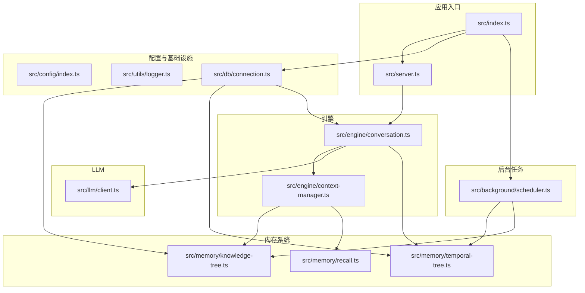
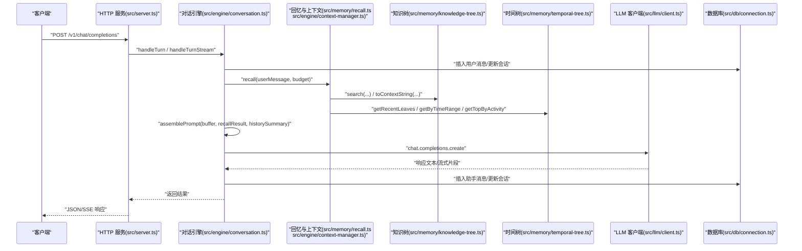
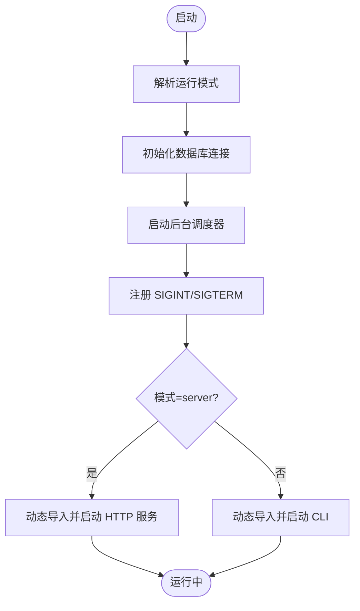
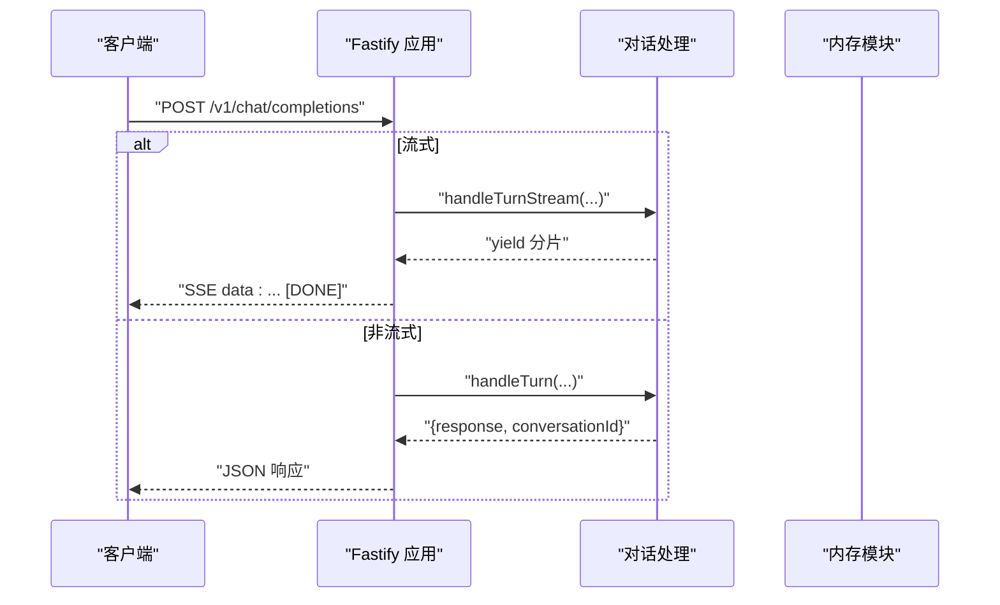
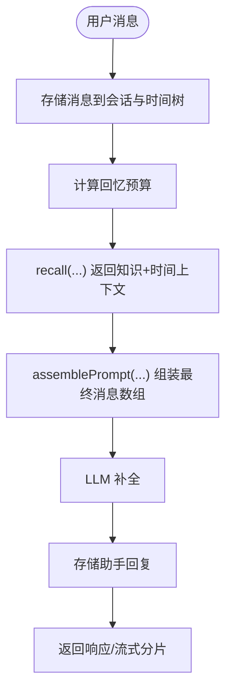
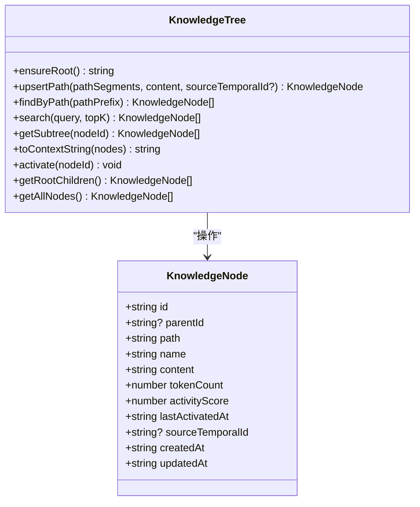
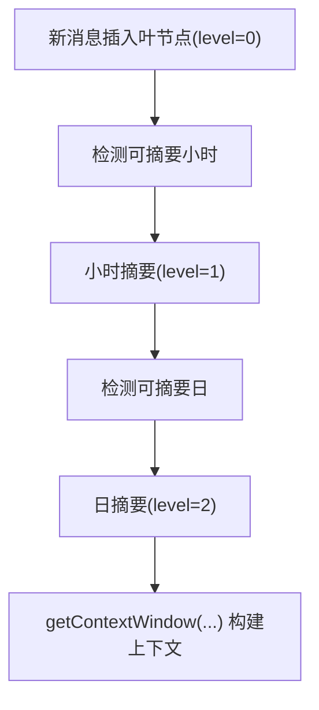
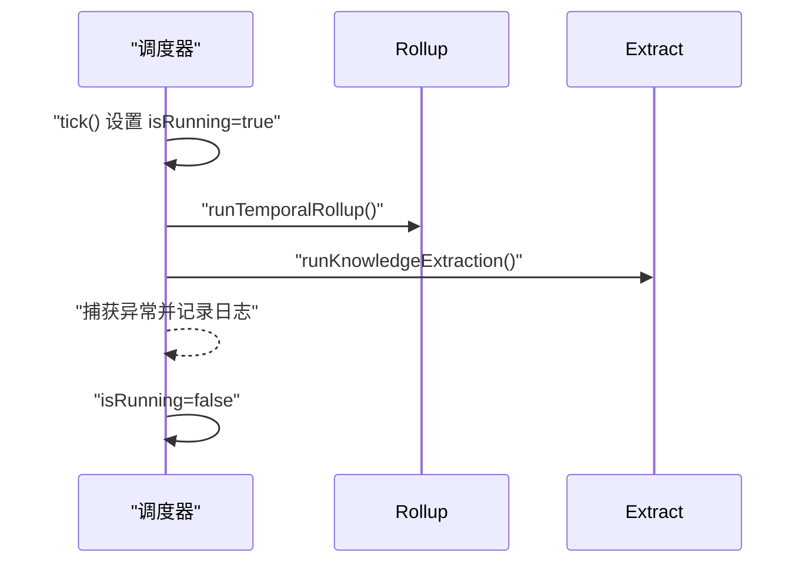
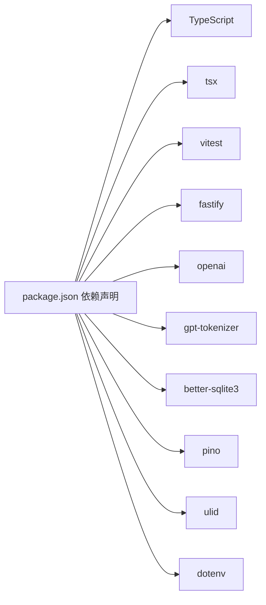

# 开发指南

<cite>
**本文引用的文件**
- [package.json](file://package.json)
- [tsconfig.json](file://tsconfig.json)
- [vitest.config.ts](file://vitest.config.ts)
- [src/index.ts](file://src/index.ts)
- [src/server.ts](file://src/server.ts)
- [src/config/index.ts](file://src/config/index.ts)
- [src/db/connection.ts](file://src/db/connection.ts)
- [src/llm/client.ts](file://src/llm/client.ts)
- [src/utils/logger.ts](file://src/utils/logger.ts)
- [src/engine/context-manager.ts](file://src/engine/context-manager.ts)
- [src/engine/conversation.ts](file://src/engine/conversation.ts)
- [src/memory/knowledge-tree.ts](file://src/memory/knowledge-tree.ts)
- [src/memory/temporal-tree.ts](file://src/memory/temporal-tree.ts)
- [src/memory/recall.ts](file://src/memory/recall.ts)
- [src/background/scheduler.ts](file://src/background/scheduler.ts)
- [tests/engine/context-manager.test.ts](file://tests/engine/context-manager.test.ts)
- [tests/memory/knowledge-tree.test.ts](file://tests/memory/knowledge-tree.test.ts)
- [tests/memory/recall.test.ts](file://tests/memory/recall.test.ts)
</cite>

## 目录
1. [简介](#简介)
2. [项目结构](#项目结构)
3. [核心组件](#核心组件)
4. [架构总览](#架构总览)
5. [详细组件分析](#详细组件分析)
6. [依赖关系分析](#依赖关系分析)
7. [性能考虑](#性能考虑)
8. [故障排查指南](#故障排查指南)
9. [结论](#结论)
10. [附录](#附录)

## 简介
本指南面向 TreeMemory 项目的开发者，提供从环境搭建、代码结构、开发流程、调试技巧、质量保障、贡献规范到性能优化与运维注意事项的完整说明。项目采用 TypeScript 编写，基于 SQLite 存储与 OpenAI 兼容的 LLM 接口，提供 CLI 与 HTTP 服务两种运行模式，并内置后台调度器进行时间树滚动聚合与知识抽取。

## 项目结构
项目采用按功能域分层的目录组织方式：
- 根目录包含构建与测试配置、包管理与脚本定义
- src 下按领域拆分：背景任务、配置、数据库连接、引擎（对话与上下文）、LLM 客户端、内存树（知识树、时间树、回忆）、工具（日志、时间）
- tests 下按功能域组织单元测试

图表来源
- [src/index.ts:1-36](file://src/index.ts#L1-L36)
- [src/server.ts:1-165](file://src/server.ts#L1-L165)
- [src/config/index.ts:1-30](file://src/config/index.ts#L1-L30)
- [src/db/connection.ts:1-26](file://src/db/connection.ts#L1-L26)
- [src/engine/conversation.ts:1-280](file://src/engine/conversation.ts#L1-L280)
- [src/engine/context-manager.ts:1-105](file://src/engine/context-manager.ts#L1-L105)
- [src/memory/knowledge-tree.ts:1-239](file://src/memory/knowledge-tree.ts#L1-L239)
- [src/memory/temporal-tree.ts:1-362](file://src/memory/temporal-tree.ts#L1-L362)
- [src/memory/recall.ts:1-168](file://src/memory/recall.ts#L1-L168)
- [src/background/scheduler.ts:1-46](file://src/background/scheduler.ts#L1-L46)

章节来源
- [package.json:1-34](file://package.json#L1-L34)
- [tsconfig.json:1-20](file://tsconfig.json#L1-L20)
- [vitest.config.ts:1-9](file://vitest.config.ts#L1-L9)

## 核心组件
- 应用入口与运行模式
  - 支持通过命令行参数选择 CLI 或 HTTP 服务器模式，统一初始化数据库与后台调度器，并处理优雅退出信号
- HTTP 服务
  - 提供 OpenAI 兼容的聊天接口、内存查询与管理接口、会话列表与删除接口、健康检查
- 引擎
  - 对话状态管理、消息缓冲与摘要、提示词组装、令牌预算计算与召回策略
- 内存系统
  - 知识树：路径式分类与事实节点、搜索与上下文拼接、激活评分
  - 时间树：按小时/天层级的滚动摘要、最近叶子节点检索、时间窗口与活动评分
  - 回忆：关键词提取、时间引用解析、跨树召回与排序
- LLM 客户端
  - 单例客户端封装、非流式与流式补全
- 数据库与迁移
  - better-sqlite3 连接、WAL 模式、外键约束、迁移执行
- 日志与配置
  - pino 日志、dotenv 加载、运行时配置读取
- 后台调度器
  - 周期性触发时间树滚动与知识抽取，避免重叠执行

章节来源
- [src/index.ts:1-36](file://src/index.ts#L1-L36)
- [src/server.ts:1-165](file://src/server.ts#L1-L165)
- [src/engine/conversation.ts:1-280](file://src/engine/conversation.ts#L1-L280)
- [src/engine/context-manager.ts:1-105](file://src/engine/context-manager.ts#L1-L105)
- [src/memory/knowledge-tree.ts:1-239](file://src/memory/knowledge-tree.ts#L1-L239)
- [src/memory/temporal-tree.ts:1-362](file://src/memory/temporal-tree.ts#L1-L362)
- [src/memory/recall.ts:1-168](file://src/memory/recall.ts#L1-L168)
- [src/llm/client.ts:1-56](file://src/llm/client.ts#L1-L56)
- [src/db/connection.ts:1-26](file://src/db/connection.ts#L1-L26)
- [src/utils/logger.ts:1-10](file://src/utils/logger.ts#L1-L10)
- [src/config/index.ts:1-30](file://src/config/index.ts#L1-L30)
- [src/background/scheduler.ts:1-46](file://src/background/scheduler.ts#L1-L46)

## 架构总览
下图展示从请求到响应的关键调用链路，涵盖 HTTP 层、对话引擎、内存召回、LLM 调用与存储层。

图表来源
- [src/server.ts:19-109](file://src/server.ts#L19-L109)
- [src/engine/conversation.ts:103-160](file://src/engine/conversation.ts#L103-L160)
- [src/engine/context-manager.ts:53-92](file://src/engine/context-manager.ts#L53-L92)
- [src/memory/recall.ts:95-167](file://src/memory/recall.ts#L95-L167)
- [src/memory/knowledge-tree.ts:138-202](file://src/memory/knowledge-tree.ts#L138-L202)
- [src/memory/temporal-tree.ts:66-283](file://src/memory/temporal-tree.ts#L66-L283)
- [src/llm/client.ts:20-55](file://src/llm/client.ts#L20-L55)
- [src/db/connection.ts:8-17](file://src/db/connection.ts#L8-L17)

## 详细组件分析

### 组件：应用入口与运行模式
- 功能要点
  - 解析运行模式（默认 CLI），初始化数据库与后台调度器
  - 注册进程信号处理，确保优雅关闭
  - 条件加载 CLI 或 HTTP 服务模块
- 关键行为
  - 数据库连接延迟初始化，首次使用时建立连接并执行迁移
  - 后台调度器周期性执行滚动聚合与知识抽取任务

图表来源
- [src/index.ts:4-30](file://src/index.ts#L4-L30)
- [src/db/connection.ts:8-17](file://src/db/connection.ts#L8-L17)
- [src/background/scheduler.ts:26-34](file://src/background/scheduler.ts#L26-L34)

章节来源
- [src/index.ts:1-36](file://src/index.ts#L1-L36)
- [src/db/connection.ts:1-26](file://src/db/connection.ts#L1-L26)
- [src/background/scheduler.ts:1-46](file://src/background/scheduler.ts#L1-L46)

### 组件：HTTP 服务与路由
- 路由概览
  - 聊天接口：OpenAI 兼容，支持流式与非流式
  - 内存接口：时间树与知识树查询、知识树写入
  - 会话接口：列出、查询、删除
  - 健康检查
- 流式响应
  - 使用 SSE 写入多个 data 行，结束时发送 [DONE]
- 错误处理
  - 缺少必要字段时返回 400

图表来源
- [src/server.ts:19-109](file://src/server.ts#L19-L109)
- [src/engine/conversation.ts:166-219](file://src/engine/conversation.ts#L166-L219)

章节来源
- [src/server.ts:1-165](file://src/server.ts#L1-L165)

### 组件：对话引擎与上下文管理
- 对话状态
  - 在内存维护会话缓冲区，持久化存储对话消息与会话元数据
- 缓冲区摘要
  - 当缓冲区达到阈值时，对旧一半消息进行摘要，减少上下文开销
- 提示词组装
  - 结合系统提示、历史摘要、时间树摘要、近期消息与知识树上下文
- 令牌预算
  - 计算可用令牌预算，平衡系统提示、缓冲区与回复预留空间
- 回忆策略
  - 先知识树，再最近叶子，再时间范围，最后高分历史摘要

图表来源
- [src/engine/conversation.ts:103-160](file://src/engine/conversation.ts#L103-L160)
- [src/engine/context-manager.ts:15-17](file://src/engine/context-manager.ts#L15-L17)
- [src/engine/context-manager.ts:23-42](file://src/engine/context-manager.ts#L23-L42)
- [src/engine/context-manager.ts:53-92](file://src/engine/context-manager.ts#L53-L92)
- [src/engine/context-manager.ts:98-104](file://src/engine/context-manager.ts#L98-L104)
- [src/memory/recall.ts:95-167](file://src/memory/recall.ts#L95-L167)

章节来源
- [src/engine/conversation.ts:1-280](file://src/engine/conversation.ts#L1-L280)
- [src/engine/context-manager.ts:1-105](file://src/engine/context-manager.ts#L1-L105)
- [src/memory/recall.ts:1-168](file://src/memory/recall.ts#L1-L168)

### 组件：知识树
- 路径式建树
  - 自动创建根节点，沿路径逐级创建分类节点，末级为事实节点
- 写入与更新
  - 叶子节点内容变更时更新 token 数与来源时间树节点
- 查询与搜索
  - 支持路径前缀查询、全文关键词搜索并按有效评分重排
- 上下文拼接
  - 将节点序列格式化为 LLM 可读的上下文字符串
- 激活评分
  - 基于时间衰减与活跃度的综合评分

图表来源
- [src/memory/knowledge-tree.ts:10-25](file://src/memory/knowledge-tree.ts#L10-L25)
- [src/memory/knowledge-tree.ts:55-120](file://src/memory/knowledge-tree.ts#L55-L120)
- [src/memory/knowledge-tree.ts:125-164](file://src/memory/knowledge-tree.ts#L125-L164)
- [src/memory/knowledge-tree.ts:188-202](file://src/memory/knowledge-tree.ts#L188-L202)
- [src/memory/knowledge-tree.ts:207-227](file://src/memory/knowledge-tree.ts#L207-L227)

章节来源
- [src/memory/knowledge-tree.ts:1-239](file://src/memory/knowledge-tree.ts#L1-L239)

### 组件：时间树与滚动摘要
- 层级结构
  - level=0：原始消息叶节点；level=1：小时摘要；level=2：日摘要
- 插入与检索
  - 插入叶节点，按小时/天聚合；支持最近叶子、小时/日摘要查询
- 滚动摘要
  - 小时摘要：将该小时内未摘要的叶子汇总为小时摘要
  - 日摘要：将当日所有小时摘要合并为日摘要
- 上下文窗口
  - 优先最近叶子，再小时摘要，最后日摘要，按令牌预算与时间顺序填充
- 活动评分
  - 基于时间衰减与活跃度的综合评分，用于历史摘要筛选

图表来源
- [src/memory/temporal-tree.ts:30-61](file://src/memory/temporal-tree.ts#L30-L61)
- [src/memory/temporal-tree.ts:96-146](file://src/memory/temporal-tree.ts#L96-L146)
- [src/memory/temporal-tree.ts:166-216](file://src/memory/temporal-tree.ts#L166-L216)
- [src/memory/temporal-tree.ts:222-283](file://src/memory/temporal-tree.ts#L222-L283)

章节来源
- [src/memory/temporal-tree.ts:1-362](file://src/memory/temporal-tree.ts#L1-L362)

### 组件：后台调度器
- 触发机制
  - 按配置间隔定时执行，首次启动后短延时立即执行一次
- 并发保护
  - 防止上一周期尚未完成时再次触发
- 错误处理
  - 捕获异常并记录日志，不影响后续周期

图表来源
- [src/background/scheduler.ts:9-21](file://src/background/scheduler.ts#L9-L21)
- [src/background/scheduler.ts:26-34](file://src/background/scheduler.ts#L26-L34)

章节来源
- [src/background/scheduler.ts:1-46](file://src/background/scheduler.ts#L1-L46)

## 依赖关系分析
- 运行时依赖
  - better-sqlite3：本地嵌入式数据库
  - fastify：高性能 HTTP 框架
  - openai：OpenAI 兼容的 LLM SDK
  - gpt-tokenizer：令牌计数
  - pino：结构化日志
  - ulid：全局唯一标识符
  - dotenv：环境变量加载
- 开发依赖
  - typescript、tsx：类型检查与开发运行
  - vitest：测试框架

图表来源
- [package.json:17-32](file://package.json#L17-L32)

章节来源
- [package.json:1-34](file://package.json#L1-L34)

## 性能考虑
- 令牌预算与摘要
  - 通过缓冲区摘要与历史摘要降低上下文长度，避免超出模型上下文限制
- 回忆策略
  - 先知识树、再最近叶子、再时间范围、最后高分历史摘要，优先重要上下文
- 时间树滚动
  - 小时/日摘要减少检索与拼接成本，提升上下文组装效率
- 数据库优化
  - WAL 模式与外键约束提升并发与一致性；合理索引与查询限制（如最近叶子数量）避免全表扫描
- LLM 调用
  - 非流式适合一次性响应，流式适合长文本与实时反馈；根据场景选择合适模式
- 日志级别
  - 生产环境建议提高日志级别，减少 IO 压力

章节来源
- [src/engine/context-manager.ts:15-17](file://src/engine/context-manager.ts#L15-L17)
- [src/engine/context-manager.ts:98-104](file://src/engine/context-manager.ts#L98-L104)
- [src/memory/recall.ts:95-167](file://src/memory/recall.ts#L95-L167)
- [src/memory/temporal-tree.ts:222-283](file://src/memory/temporal-tree.ts#L222-L283)
- [src/db/connection.ts:10-12](file://src/db/connection.ts#L10-L12)

## 故障排查指南
- 启动失败
  - 检查 Node.js 版本是否满足最低要求
  - 确认环境变量已正确加载（LLM_BASE_URL、LLM_API_KEY、DB_PATH、HTTP_PORT 等）
- 数据库问题
  - 确认数据库文件路径可写；查看迁移是否成功执行
- LLM 调用失败
  - 核对 API Key 与 Base URL；检查网络连通性
- HTTP 服务无法访问
  - 检查端口占用与防火墙；确认监听地址与端口配置
- 日志定位
  - 使用 pino 输出结构化日志，结合日志级别快速定位问题

章节来源
- [package.json:14-16](file://package.json#L14-L16)
- [src/config/index.ts:18-29](file://src/config/index.ts#L18-L29)
- [src/db/connection.ts:8-17](file://src/db/connection.ts#L8-L17)
- [src/llm/client.ts:7-15](file://src/llm/client.ts#L7-L15)
- [src/utils/logger.ts:3-9](file://src/utils/logger.ts#L3-L9)

## 结论
本指南提供了 TreeMemory 项目的开发与运维全景视图，覆盖环境搭建、代码结构、核心流程、调试与质量保障、性能优化与运维注意事项。建议在开发过程中遵循统一的配置与日志规范，利用后台调度器与滚动摘要机制维持长期记忆的有效性与性能。

## 附录

### 开发环境搭建
- Node.js 版本
  - 要求：>= 18
- 依赖安装
  - 使用包管理器安装依赖
- IDE 建议
  - VSCode + TypeScript 扩展；启用 ESLint/Prettier；推荐启用“在外部终端运行”以便使用脚本

章节来源
- [package.json:14-16](file://package.json#L14-L16)
- [package.json:6-13](file://package.json#L6-L13)

### 代码结构与模块组织
- 目录组织
  - 按功能域划分：background、config、db、engine、llm、memory、utils
- 命名约定
  - 文件名小写，模块导出函数/类首字母大写；接口名以大写字母开头
- 导入规则
  - 使用相对路径导入；避免循环依赖；尽量通过单一入口暴露 API

章节来源
- [tsconfig.json:2-16](file://tsconfig.json#L2-L16)

### 开发工作流程
- 本地开发
  - CLI：运行开发脚本启动 CLI 模式
  - 服务器：运行开发脚本启动 HTTP 服务
- 类型检查
  - 使用类型检查脚本验证类型安全
- 测试
  - 运行单元测试；watch 模式便于迭代
- 提交与分支
  - 建议采用功能分支与 PR 合并；提交信息清晰描述变更
- 发布
  - 更新版本号；生成构建产物；发布至目标环境

章节来源
- [package.json:6-13](file://package.json#L6-L13)
- [vitest.config.ts:1-9](file://vitest.config.ts#L1-L9)

### 调试技巧与开发工具
- TypeScript 配置
  - ESNext 模块、严格模式、源码映射、声明输出
- 热重载
  - 使用 tsx 实现开发时热重载
- 远程调试
  - 使用 Node.js 内置调试器附加进程；设置断点定位问题
- 日志
  - 使用 pino 输出结构化日志，便于生产环境排查

章节来源
- [tsconfig.json:2-16](file://tsconfig.json#L2-L16)
- [package.json:7-8](file://package.json#L7-L8)
- [src/utils/logger.ts:1-10](file://src/utils/logger.ts#L1-L10)

### 代码审查与质量保证
- 代码风格
  - 统一缩进与换行；注释清晰；错误处理完备
- 单元测试
  - 覆盖关键逻辑与边界条件；使用 Vitest 进行快速反馈
- 性能回归
  - 关注令牌预算与查询复杂度；避免 N+1 查询

章节来源
- [vitest.config.ts:1-9](file://vitest.config.ts#L1-L9)
- [tests/engine/context-manager.test.ts:1-105](file://tests/engine/context-manager.test.ts#L1-L105)
- [tests/memory/knowledge-tree.test.ts:1-239](file://tests/memory/knowledge-tree.test.ts#L1-L239)
- [tests/memory/recall.test.ts:1-168](file://tests/memory/recall.test.ts#L1-L168)

### 贡献指南
- 报告 Issue
  - 提供环境信息、复现步骤、期望与实际行为
- 提交 Pull Request
  - 清晰描述变更目的；附带测试；确保类型检查与测试通过
- 社区参与
  - 遵守行为准则；积极评审与讨论

### 部署与运维注意事项
- 环境变量
  - 正确配置 LLM_BASE_URL、LLM_API_KEY、DB_PATH、HTTP_PORT、MAX_CONTEXT_TOKENS 等
- 数据库
  - 备份策略；监控 WAL 文件大小；定期维护
- 服务
  - 监控健康检查端点；设置超时与重试；容器化部署时注意资源限制
- 日志
  - 生产环境调整日志级别；集中化日志收集与检索

章节来源
- [src/config/index.ts:18-29](file://src/config/index.ts#L18-L29)
- [src/server.ts:155-160](file://src/server.ts#L155-L160)
- [src/db/connection.ts:10-12](file://src/db/connection.ts#L10-L12)
- [src/utils/logger.ts:3-9](file://src/utils/logger.ts#L3-L9)