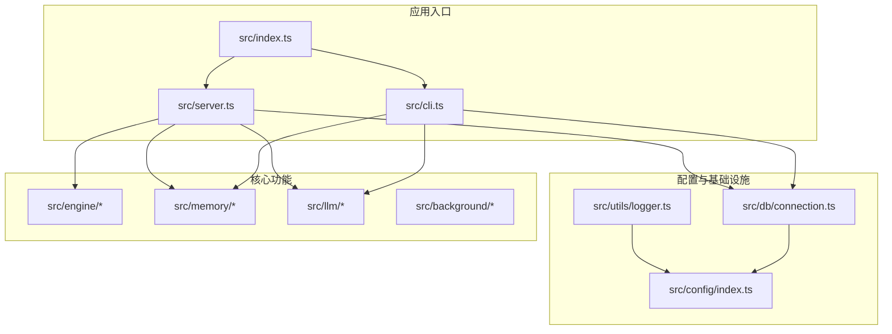
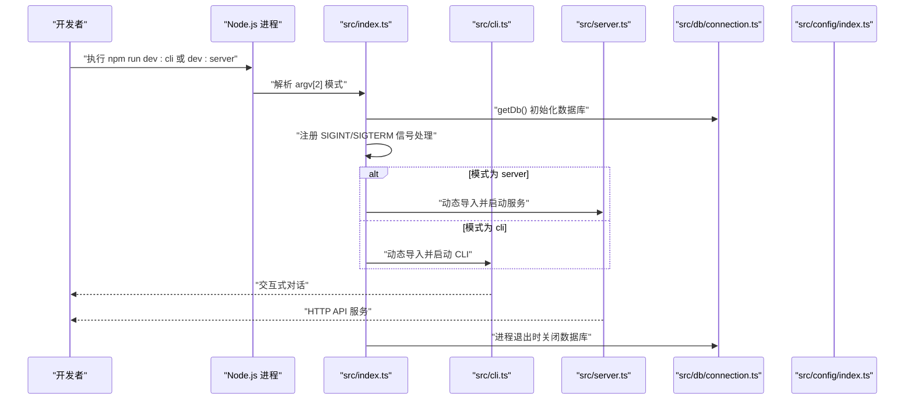
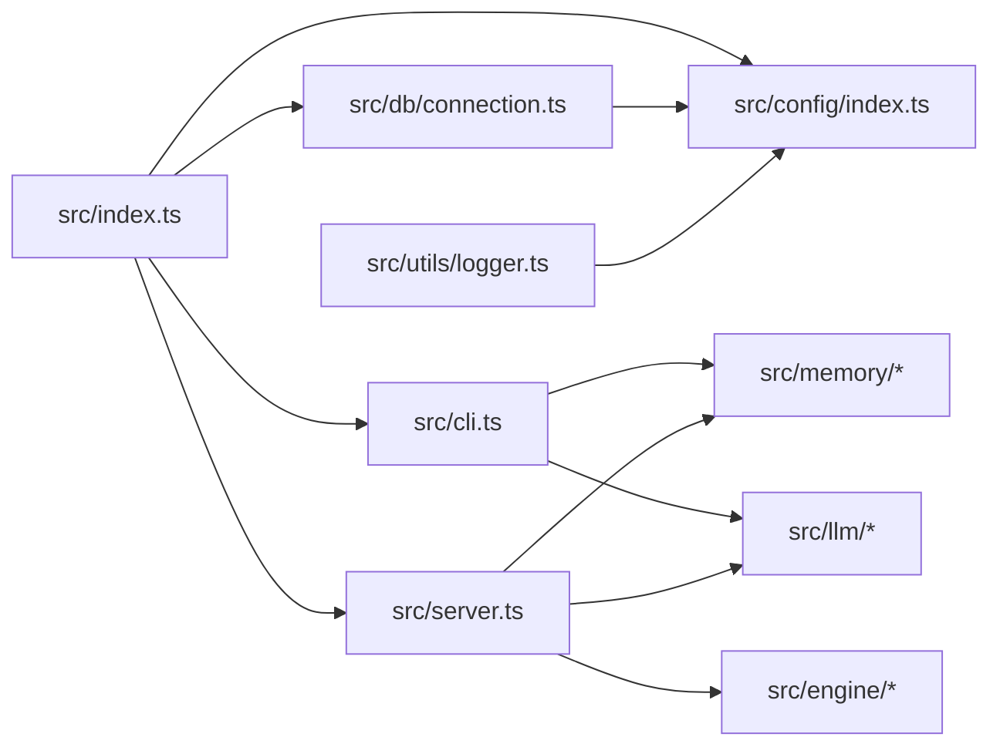

# 开发环境搭建

<cite>
**本文引用的文件**
- [package.json](file://package.json)
- [tsconfig.json](file://tsconfig.json)
- [vitest.config.ts](file://vitest.config.ts)
- [README.md](file://README.md)
- [src/index.ts](file://src/index.ts)
- [src/cli.ts](file://src/cli.ts)
- [src/config/index.ts](file://src/config/index.ts)
- [src/db/connection.ts](file://src/db/connection.ts)
- [src/utils/logger.ts](file://src/utils/logger.ts)
- [.gitignore](file://.gitignore)
</cite>

## 目录
1. [简介](#简介)
2. [项目结构](#项目结构)
3. [核心组件](#核心组件)
4. [架构总览](#架构总览)
5. [详细组件分析](#详细组件分析)
6. [依赖关系分析](#依赖关系分析)
7. [性能考虑](#性能考虑)
8. [故障排查指南](#故障排查指南)
9. [结论](#结论)
10. [附录](#附录)

## 简介
本指南面向 TreeMemory 项目的开发者，提供从零到一的开发环境搭建步骤，涵盖 Node.js 18+ 安装与配置、TypeScript 编译器安装与配置、依赖安装（生产依赖与开发依赖）、IDE 推荐配置（VS Code 插件与设置）、开发脚本详解（dev:cli、dev:server、build、typecheck 等）、环境变量配置与 .env 设置方法，以及常见问题排查与解决方案。

## 项目结构
TreeMemory 是一个基于 Node.js 与 TypeScript 的应用，采用模块化分层组织：
- src/config：集中管理环境变量与应用配置
- src/db：SQLite 数据库连接与迁移
- src/engine：对话引擎（会话管理、上下文组装、缓冲区摘要）
- src/memory：记忆系统（知识树、时间树、活跃度、召回）
- src/llm：LLM 集成（OpenAI 兼容 API、token 计数）
- src/background：后台任务（时间树汇总、知识提取）
- src/utils：工具函数（日志、时间）
- src/cli.ts 与 src/server.ts：CLI 与 HTTP 服务入口
- tests：单元测试（Vitest）

图表来源
- [src/index.ts:1-36](file://src/index.ts#L1-L36)
- [src/cli.ts:1-195](file://src/cli.ts#L1-L195)
- [src/config/index.ts:1-30](file://src/config/index.ts#L1-L30)
- [src/db/connection.ts:1-26](file://src/db/connection.ts#L1-L26)
- [src/utils/logger.ts:1-10](file://src/utils/logger.ts#L1-L10)

章节来源
- [README.md:240-257](file://README.md#L240-L257)

## 核心组件
- Node.js 与包管理器：项目要求 Node.js >= 18，并使用 npm。
- TypeScript：用于类型安全与编译输出；编译目标为 ES2022，模块系统为 ESNext，使用 bundler 解析策略。
- 开发脚本：dev:cli、dev:server、build、typecheck、test、test:watch。
- 配置加载：通过 dotenv 加载 .env 中的环境变量，统一注入到配置对象。
- 数据库：better-sqlite3，WAL 模式，自动迁移。
- 日志：pino，支持通过 LOG_LEVEL 控制日志级别。

章节来源
- [package.json:1-34](file://package.json#L1-L34)
- [tsconfig.json:1-20](file://tsconfig.json#L1-L20)
- [src/config/index.ts:1-30](file://src/config/index.ts#L1-L30)
- [src/db/connection.ts:1-26](file://src/db/connection.ts#L1-L26)
- [src/utils/logger.ts:1-10](file://src/utils/logger.ts#L1-L10)

## 架构总览
下图展示开发模式下的启动流程：index.ts 作为主入口，根据传入的模式参数选择 CLI 或 Server；CLI 模式通过 readline 与用户交互；Server 模式启动 HTTP 服务；两者均初始化数据库与后台调度器，并在进程退出时优雅关闭。

图表来源
- [src/index.ts:1-36](file://src/index.ts#L1-L36)
- [src/cli.ts:1-195](file://src/cli.ts#L1-L195)
- [src/db/connection.ts:1-26](file://src/db/connection.ts#L1-L26)

## 详细组件分析

### Node.js 与包管理器
- 版本要求：Node.js >= 18，由 engines 字段声明。
- 包管理器：npm。
- 安装步骤：确保系统已安装 Node.js 18+；在仓库根目录执行安装命令以拉取依赖。

章节来源
- [package.json:14-16](file://package.json#L14-L16)
- [README.md:55-66](file://README.md#L55-L66)

### TypeScript 编译器安装与配置
- 安装：项目依赖中包含 TypeScript，安装后即可使用 tsc。
- 配置要点：
  - 目标与模块：ES2022 + ESNext
  - 模块解析：bundler
  - 输出目录：dist
  - 输入目录：src
  - 严格模式：开启
  - 声明文件与 SourceMap：启用
  - JSON 模块解析：启用
  - 单文件隔离：启用

章节来源
- [package.json:25-25](file://package.json#L25-L25)
- [tsconfig.json:1-20](file://tsconfig.json#L1-L20)

### 依赖安装（生产依赖与开发依赖）
- 生产依赖（运行期必需）：
  - better-sqlite3：嵌入式数据库
  - dotenv：环境变量加载
  - fastify：HTTP 服务框架
  - gpt-tokenizer：token 计数
  - openai：LLM 客户端
  - pino：日志
  - tsx：开发时热重载与即时执行
  - ulid：ID 生成
- 开发依赖（构建与测试）：
  - @types/better-sqlite3、@types/node：类型定义
  - vitest：测试框架

章节来源
- [package.json:17-32](file://package.json#L17-L32)

### IDE 配置建议（VS Code）
- 推荐扩展：
  - ESLint：代码风格与错误提示
  - Prettier：代码格式化
  - TypeScript Importer：自动导入
  - DotENV：.env 文件语法高亮
  - Vitest：测试集成
- VS Code 设置建议（settings.json）：
  - editor.formatOnSave：true
  - editor.codeActionsOnSave：启用 ESLint 自动修复
  - typescript.preferences.importModuleSpecifier：relative
  - files.exclude：隐藏 node_modules、dist、*.db*、.env、*.log
  - search.exclude：同上
  - terminal.integrated.cwd：项目根目录
- 调试配置（launch.json）：
  - 启动 CLI：选择 Node 执行器，入口为 src/index.ts，参数为 cli
  - 启动 Server：入口为 src/index.ts，参数为 server
  - 断点调试：在任意 TS 源码处设置断点即可

章节来源
- [.gitignore:1-9](file://.gitignore#L1-L9)
- [README.md:260-269](file://README.md#L260-L269)

### 开发脚本详解
- dev:cli：使用 tsx 即时执行 src/index.ts 并传入 cli 参数，进入交互式 CLI 模式。
- dev:server：使用 tsx 即时执行 src/index.ts 并传入 server 参数，启动 HTTP 服务。
- build：调用 tsc 进行编译，输出至 dist。
- typecheck：tsc --noEmit 进行类型检查，不生成输出。
- test：运行 Vitest 测试。
- test:watch：监听模式运行测试。

章节来源
- [package.json:6-13](file://package.json#L6-L13)
- [src/index.ts:23-29](file://src/index.ts#L23-L29)

### 环境变量配置与 .env 设置
- 加载机制：dotenv 在应用启动时加载 .env 文件中的键值对。
- 必填项：至少需要配置 LLM_API_KEY；可选地配置 LLM_BASE_URL、LLM_MODEL。
- 全部配置项（默认值来自配置文件）：
  - LLM_BASE_URL：默认 https://api.openai.com/v1
  - LLM_API_KEY：必填
  - LLM_MODEL：默认 gpt-4o
  - MAX_CONTEXT_TOKENS：默认 8192
  - SUMMARIZE_THRESHOLD_RATIO：默认 0.75
  - DB_PATH：默认 ./treememory.db
  - HTTP_PORT：默认 3000
  - BACKGROUND_INTERVAL_MS：默认 60000
  - ACTIVITY_DECAY_RATE：默认 0.95
  - ACTIVITY_BOOST：默认 1.0
  - LOG_LEVEL：默认 info
- .env 文件位置：项目根目录；会被 .gitignore 排除，避免提交敏感信息。

章节来源
- [src/config/index.ts:1-30](file://src/config/index.ts#L1-L30)
- [src/utils/logger.ts:1-10](file://src/utils/logger.ts#L1-L10)
- [README.md:70-82](file://README.md#L70-L82)
- [.gitignore:7-7](file://.gitignore#L7-L7)

### 数据库与迁移
- 数据库：better-sqlite3，默认 WAL 模式，启用外键约束。
- 迁移：首次连接时自动执行迁移逻辑。
- 关闭：进程退出时优雅关闭数据库连接。

章节来源
- [src/db/connection.ts:1-26](file://src/db/connection.ts#L1-L26)

### 日志系统
- 日志库：pino，输出到标准输出。
- 日志级别：可通过 LOG_LEVEL 环境变量控制。

章节来源
- [src/utils/logger.ts:1-10](file://src/utils/logger.ts#L1-L10)

## 依赖关系分析
- 运行时依赖链：
  - index.ts 依赖 db/connection.ts 初始化数据库，依赖 config/index.ts 注入配置。
  - CLI 模式依赖 memory、llm、db；Server 模式依赖 engine、memory、llm。
- 开发依赖链：
  - tsconfig.json 控制编译行为；vitest.config.ts 控制测试环境。
- 外部依赖：
  - better-sqlite3：SQLite 数据库
  - fastify：HTTP 服务
  - openai：LLM 客户端
  - dotenv：环境变量
  - pino：日志
  - vitest：测试

图表来源
- [src/index.ts:1-36](file://src/index.ts#L1-L36)
- [src/cli.ts:1-195](file://src/cli.ts#L1-L195)
- [src/config/index.ts:1-30](file://src/config/index.ts#L1-L30)
- [src/db/connection.ts:1-26](file://src/db/connection.ts#L1-L26)
- [src/utils/logger.ts:1-10](file://src/utils/logger.ts#L1-L10)

## 性能考虑
- 编译优化：启用严格模式与单文件隔离，有助于早期发现潜在问题。
- 运行时：WAL 模式提升并发读写性能；合理设置 MAX_CONTEXT_TOKENS 与 SUMMARIZE_THRESHOLD_RATIO 以平衡上下文质量与性能。
- 日志：在开发阶段使用 info 级别，生产环境可根据需要调整 LOG_LEVEL。

## 故障排查指南
- Node.js 版本过低
  - 现象：安装或运行时报错，提示 Node 版本不满足 >= 18。
  - 处理：升级 Node.js 至 18+。
  - 参考：engines 字段。
- 缺少 LLM_API_KEY
  - 现象：调用 LLM 时出现鉴权错误。
  - 处理：在 .env 中设置 LLM_API_KEY；必要时设置 LLM_BASE_URL 与 LLM_MODEL。
- 数据库文件权限问题
  - 现象：无法打开数据库或迁移失败。
  - 处理：确认 DB_PATH 指向的路径存在且可写；检查 .gitignore 是否排除了该文件。
- 端口占用（Server 模式）
  - 现象：启动 HTTP 服务时报端口冲突。
  - 处理：修改 .env 中的 HTTP_PORT 或释放占用端口。
- 日志级别过高导致输出过多
  - 现象：终端输出大量日志。
  - 处理：在 .env 中设置 LOG_LEVEL（如 warn 或 error）。
- 环境变量未生效
  - 现象：配置未按预期生效。
  - 处理：确认 .env 文件存在且未被 .gitignore 排除；重启开发脚本使 dotenv 生效。

章节来源
- [package.json:14-16](file://package.json#L14-L16)
- [src/config/index.ts:18-29](file://src/config/index.ts#L18-L29)
- [src/db/connection.ts:8-17](file://src/db/connection.ts#L8-L17)
- [src/utils/logger.ts:8-8](file://src/utils/logger.ts#L8-L8)
- [.gitignore:7-7](file://.gitignore#L7-L7)

## 结论
按照本指南完成 Node.js 18+ 安装、依赖安装、TypeScript 配置与 .env 环境变量设置后，即可通过 npm run dev:cli 或 dev:server 快速启动项目。配合 VS Code 推荐插件与设置，可获得良好的开发体验。遇到问题时，可依据“故障排查指南”逐项定位与解决。

## 附录
- 快速开始
  - 安装依赖：npm install
  - 复制并编辑 .env：cp .env.example .env（若存在），否则手动创建 .env 并设置 LLM_API_KEY
  - 启动 CLI：npm run dev:cli
  - 启动 Server：npm run dev:server
  - 构建：npm run build
  - 类型检查：npm run typecheck
  - 运行测试：npm run test；监听测试：npm run test:watch

章节来源
- [README.md:60-96](file://README.md#L60-L96)
- [README.md:259-269](file://README.md#L259-L269)