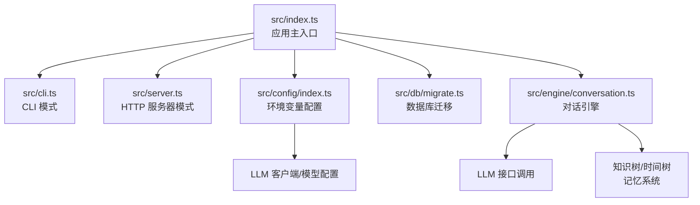
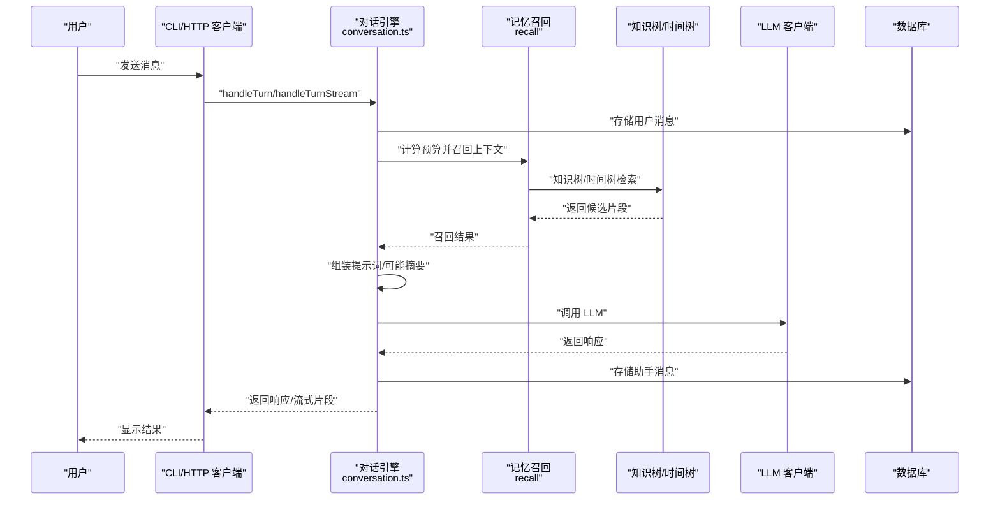
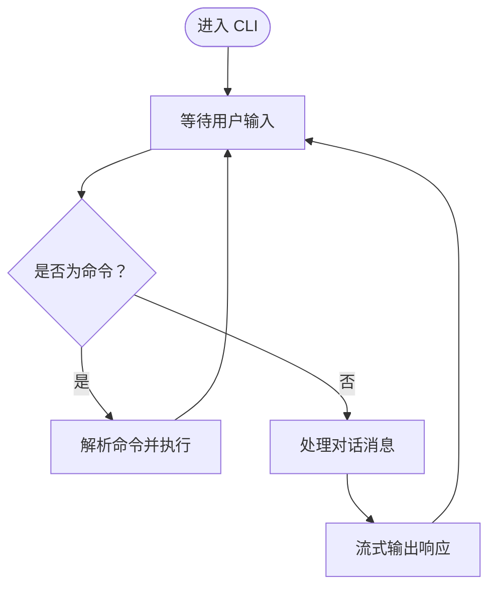
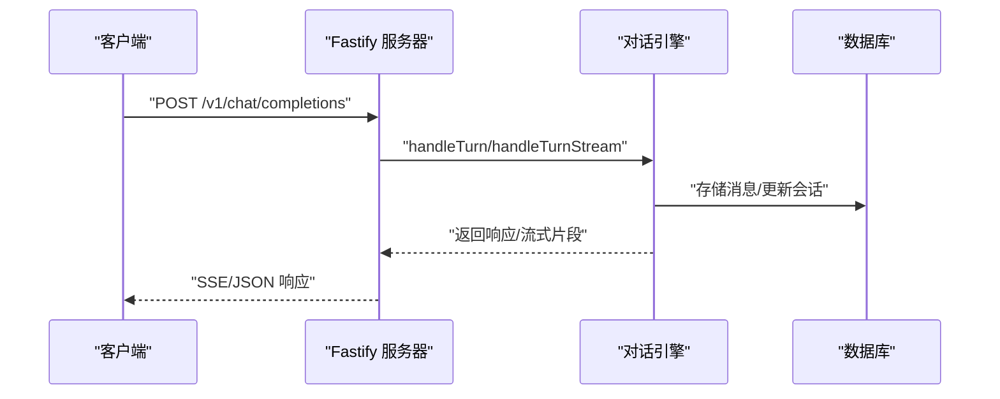
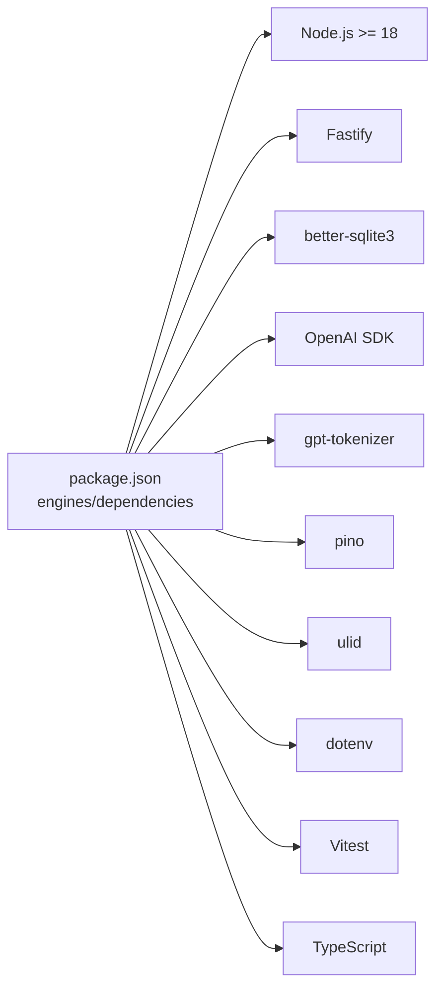

# 快速开始

<cite>
**本文引用的文件**
- [package.json](file://package.json)
- [tsconfig.json](file://tsconfig.json)
- [README.md](file://README.md)
- [src/index.ts](file://src/index.ts)
- [src/cli.ts](file://src/cli.ts)
- [src/server.ts](file://src/server.ts)
- [src/config/index.ts](file://src/config/index.ts)
- [src/engine/conversation.ts](file://src/engine/conversation.ts)
- [src/db/migrate.ts](file://src/db/migrate.ts)
</cite>

## 目录
1. [简介](#简介)
2. [项目结构](#项目结构)
3. [核心组件](#核心组件)
4. [架构总览](#架构总览)
5. [详细组件分析](#详细组件分析)
6. [依赖分析](#依赖分析)
7. [性能考虑](#性能考虑)
8. [故障排除指南](#故障排除指南)
9. [结论](#结论)
10. [附录](#附录)

## 简介
本指南面向初学者，帮助你在最短时间内完成 TreeMemory 项目的克隆、安装、配置与首次运行，并掌握 CLI 模式与 HTTP 服务器模式的基本使用方法。你将学会如何进行基础的对话交互、查看知识树与时间树、管理会话以及排查常见问题。

## 项目结构
TreeMemory 采用模块化的 TypeScript 结构，核心入口根据命令行参数选择 CLI 或 HTTP 服务器模式；配置通过环境变量驱动；数据库采用 SQLite 并内置迁移脚本；对话引擎负责会话状态、上下文组装与 LLM 调用；记忆系统包含知识树与时间树两大子系统。

图表来源
- [src/index.ts:1-36](file://src/index.ts#L1-L36)
- [src/cli.ts:1-195](file://src/cli.ts#L1-L195)
- [src/server.ts:1-165](file://src/server.ts#L1-L165)
- [src/config/index.ts:1-30](file://src/config/index.ts#L1-L30)
- [src/db/migrate.ts:1-88](file://src/db/migrate.ts#L1-L88)
- [src/engine/conversation.ts:1-280](file://src/engine/conversation.ts#L1-L280)

章节来源
- [README.md:240-257](file://README.md#L240-L257)

## 核心组件
- 应用主入口：根据传入的模式参数加载 CLI 或 HTTP 服务器，并初始化数据库与后台调度器。
- CLI 模式：提供交互式命令行界面，支持基本对话、知识树浏览、历史查看、统计信息、记忆召回与手动添加知识等命令。
- HTTP 服务器模式：提供 OpenAI 兼容的聊天补全接口、记忆查询与写入接口、会话管理接口与健康检查。
- 配置系统：通过环境变量集中管理 LLM 端点、密钥、模型、数据库路径、HTTP 端口、上下文大小、摘要阈值、活跃度衰减与增益等参数。
- 数据库与迁移：SQLite 数据库存储对话、记忆节点与后台任务队列，迁移脚本确保表结构一致。
- 对话引擎：维护会话状态、缓冲区、摘要、记忆召回、提示词组装与 LLM 调用，支持流式与非流式响应。

章节来源
- [src/index.ts:4-30](file://src/index.ts#L4-L30)
- [src/cli.ts:8-195](file://src/cli.ts#L8-L195)
- [src/server.ts:15-165](file://src/server.ts#L15-L165)
- [src/config/index.ts:5-30](file://src/config/index.ts#L5-L30)
- [src/db/migrate.ts:4-87](file://src/db/migrate.ts#L4-L87)
- [src/engine/conversation.ts:23-280](file://src/engine/conversation.ts#L23-L280)

## 架构总览
下图展示了从用户输入到 LLM 响应的完整链路，包括记忆召回、上下文组装与持久化存储。

图表来源
- [src/engine/conversation.ts:103-219](file://src/engine/conversation.ts#L103-L219)
- [src/server.ts:19-109](file://src/server.ts#L19-L109)
- [src/cli.ts:34-50](file://src/cli.ts#L34-L50)

## 详细组件分析

### CLI 模式
- 启动方式：通过脚本运行 CLI 模式。
- 交互流程：读取用户输入，区分普通消息与特殊命令；普通消息通过对话引擎处理并流式输出；特殊命令包括帮助、知识树浏览、历史查看、统计、新对话、记忆召回、手动添加知识与退出。
- 常用命令：
  - 新对话：/new
  - 查看知识树：/memory 或 /memory <关键词>
  - 查看历史：/history
  - 统计信息：/stats
  - 记忆召回测试：/recall <查询>
  - 手动添加知识：/add <路径> <内容>
  - 退出：/quit 或 /exit

图表来源
- [src/cli.ts:19-53](file://src/cli.ts#L19-L53)
- [src/cli.ts:55-191](file://src/cli.ts#L55-L191)

章节来源
- [src/cli.ts:8-195](file://src/cli.ts#L8-L195)
- [README.md:98-126](file://README.md#L98-L126)

### HTTP 服务器模式
- 启动方式：通过脚本运行 HTTP 服务器模式，默认监听配置中的端口。
- 主要接口：
  - 聊天补全：POST /v1/chat/completions（支持流式与非流式）
  - 记忆查询：GET /v1/memory/knowledge、GET /v1/memory/temporal
  - 记忆写入：POST /v1/memory/knowledge
  - 会话管理：GET /v1/conversations、GET /v1/conversations/{id}、DELETE /v1/conversations/{id}
  - 健康检查：GET /health
- 响应格式：遵循 OpenAI 兼容风格，支持 SSE 流式传输。

图表来源
- [src/server.ts:19-109](file://src/server.ts#L19-L109)
- [src/engine/conversation.ts:103-219](file://src/engine/conversation.ts#L103-L219)

章节来源
- [src/server.ts:15-165](file://src/server.ts#L15-L165)
- [README.md:127-187](file://README.md#L127-L187)

### 配置系统与环境变量
- 配置来源：通过 dotenv 加载 .env 文件，随后以环境变量覆盖默认值。
- 关键配置项（部分）：
  - LLM_BASE_URL：LLM API 端点
  - LLM_API_KEY：API 密钥（必需）
  - LLM_MODEL：使用的模型
  - MAX_CONTEXT_TOKENS：单次请求 token 限制
  - SUMMARIZE_THRESHOLD_RATIO：缓冲区摘要触发阈值
  - DB_PATH：数据库文件路径
  - HTTP_PORT：服务器端口
  - BACKGROUND_INTERVAL_MS：后台任务间隔（毫秒）
  - ACTIVITY_DECAY_RATE：活跃度衰减率
  - ACTIVITY_BOOST：访问活跃度增益
- 本地 LLM 使用：可通过设置 LLM_BASE_URL 指向本地服务（如 Ollama），LLM_API_KEY 可设为占位值。

章节来源
- [src/config/index.ts:1-30](file://src/config/index.ts#L1-L30)
- [README.md:189-215](file://README.md#L189-L215)

### 数据库与迁移
- 迁移策略：根据当前版本号执行必要的 SQL 创建与索引，确保表结构一致。
- 关键表：
  - temporal_nodes：时间树节点（含层级、时间范围、活跃度、摘要标记等）
  - knowledge_nodes：知识树节点（分类/事实节点、路径、活跃度等）
  - conversations：会话元数据
  - conversation_messages：会话消息（关联时间树节点）
  - background_tasks：后台任务队列
- 索引优化：为查询热点字段建立索引，提升检索效率。

章节来源
- [src/db/migrate.ts:4-87](file://src/db/migrate.ts#L4-L87)

### 对话引擎与记忆系统
- 会话状态：按 ULID 维护会话，加载历史消息至内存缓冲区，跟踪 token 数量与轮次。
- 上下文组装：在 token 预算内结合知识树检索、最近消息、时间范围与历史摘要生成提示词。
- 缓冲区摘要：当缓冲区达到阈值比例时，对早期消息进行摘要并清理缓冲区。
- 记忆召回：综合知识树与时间树进行多阶段检索，控制 token 使用。
- 流式响应：逐块输出 LLM 输出，同时在完成后持久化完整回复。

章节来源
- [src/engine/conversation.ts:23-280](file://src/engine/conversation.ts#L23-L280)

## 依赖分析
- 运行时要求：Node.js >= 18（由 engines 字段约束）。
- 核心依赖：Fastify（HTTP 服务器）、better-sqlite3（嵌入式数据库）、OpenAI SDK（LLM 客户端）、gpt-tokenizer（token 计数）、pino（日志）、ulid（ID 生成）、dotenv（环境变量加载）。
- 构建与开发：TypeScript 编译、Vitest 测试、tsx 开发运行。

图表来源
- [package.json:14-32](file://package.json#L14-L32)

章节来源
- [package.json:1-34](file://package.json#L1-L34)
- [tsconfig.json:1-20](file://tsconfig.json#L1-L20)

## 性能考虑
- token 预算控制：通过 MAX_CONTEXT_TOKENS 与 SUMMARIZE_THRESHOLD_RATIO 控制上下文规模，避免超出模型限制。
- 活跃度模型：利用 ACTIVITY_DECAY_RATE 与 ACTIVITY_BOOST 平衡新旧记忆的优先级，减少无效检索。
- 索引优化：数据库迁移脚本已为高频查询字段建立索引，建议在大数据量场景下监控查询计划。
- 流式响应：HTTP 模式支持 SSE 流式输出，降低首字延迟并改善用户体验。
- 后台任务：定期对旧消息进行摘要与知识提取，缓解长对话的上下文膨胀。

## 故障排除指南
- Node.js 版本过低
  - 现象：安装或运行时报错，提示 Node 版本不满足 >= 18。
  - 处理：升级 Node.js 至 18 或更高版本。
  - 参考：[package.json:14-16](file://package.json#L14-L16)
- 缺少 LLM API 密钥
  - 现象：调用 LLM 时返回鉴权错误或空响应。
  - 处理：在 .env 中设置 LLM_API_KEY；若使用本地 LLM，确保 LLM_BASE_URL 正确指向本地服务。
  - 参考：[src/config/index.ts:19-21](file://src/config/index.ts#L19-L21)、[README.md:78-82](file://README.md#L78-L82)
- 端口占用导致服务器无法启动
  - 现象：启动 HTTP 服务器报端口冲突。
  - 处理：修改 HTTP_PORT 或释放占用端口。
  - 参考：[src/config/index.ts:25](file://src/config/index.ts#L25)、[src/server.ts:158](file://src/server.ts#L158)
- 数据库连接异常
  - 现象：首次运行后出现数据库相关错误。
  - 处理：确认 DB_PATH 权限可写，或更换为相对路径；确保迁移脚本执行成功。
  - 参考：[src/config/index.ts:24](file://src/config/index.ts#L24)、[src/db/migrate.ts:4-87](file://src/db/migrate.ts#L4-L87)
- CLI 输入无响应
  - 现象：输入消息后无输出。
  - 处理：检查网络连通性与 LLM 端点；确认环境变量正确加载；尝试重启 CLI。
  - 参考：[src/cli.ts:34-50](file://src/cli.ts#L34-L50)
- 记忆查询无结果
  - 现象：/memory 或 /recall 未返回预期内容。
  - 处理：先通过 /add 添加知识，再进行检索；检查关键词是否匹配路径或内容。
  - 参考：[src/cli.ts:75-99](file://src/cli.ts#L75-L99)、[src/cli.ts:142-164](file://src/cli.ts#L142-L164)

## 结论
通过本快速开始指南，你已经完成了 TreeMemory 的环境准备、安装配置与首次运行，掌握了 CLI 与 HTTP 两种模式的基本使用方法，并具备了定位常见问题的能力。建议在实际使用中逐步探索记忆系统的高级功能，如知识树的路径组织、时间树的摘要机制与后台任务的调度策略。

## 附录

### 环境要求与安装步骤
- 环境要求
  - Node.js >= 18
  - npm
- 安装步骤
  - 克隆仓库并进入目录
  - 安装依赖
- 首次运行
  - 复制并编辑 .env 文件，至少配置 LLM API 密钥
  - 运行 CLI 模式或 HTTP 服务器模式

章节来源
- [README.md:53-96](file://README.md#L53-L96)
- [package.json:14-16](file://package.json#L14-L16)

### 基本配置说明
- LLM 相关：LLM_BASE_URL、LLM_API_KEY、LLM_MODEL
- 上下文与摘要：MAX_CONTEXT_TOKENS、SUMMARIZE_THRESHOLD_RATIO
- 存储与端口：DB_PATH、HTTP_PORT
- 后台任务：BACKGROUND_INTERVAL_MS
- 活跃度模型：ACTIVITY_DECAY_RATE、ACTIVITY_BOOST

章节来源
- [src/config/index.ts:18-29](file://src/config/index.ts#L18-L29)
- [README.md:189-205](file://README.md#L189-L205)

### 启动示例（CLI 与 HTTP）
- CLI 模式
  - 使用脚本启动交互式对话
- HTTP 服务器模式
  - 使用脚本启动服务，监听配置端口
  - 可通过 /v1/chat/completions 进行对话交互

章节来源
- [src/index.ts:23-29](file://src/index.ts#L23-L29)
- [src/server.ts:158-160](file://src/server.ts#L158-L160)
- [README.md:84-96](file://README.md#L84-L96)

### 使用示例（验证安装）
- CLI 示例
  - 输入任意消息开始对话
  - 使用 /memory 查看知识树
  - 使用 /recall 测试召回
- HTTP 示例
  - 调用 /health 确认服务健康
  - 调用 /v1/chat/completions 发送消息并接收响应

章节来源
- [src/cli.ts:16-19](file://src/cli.ts#L16-L19)
- [src/server.ts:155-160](file://src/server.ts#L155-L160)
- [README.md:183-187](file://README.md#L183-L187)