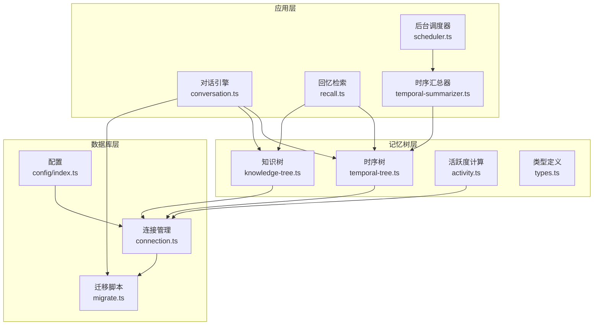
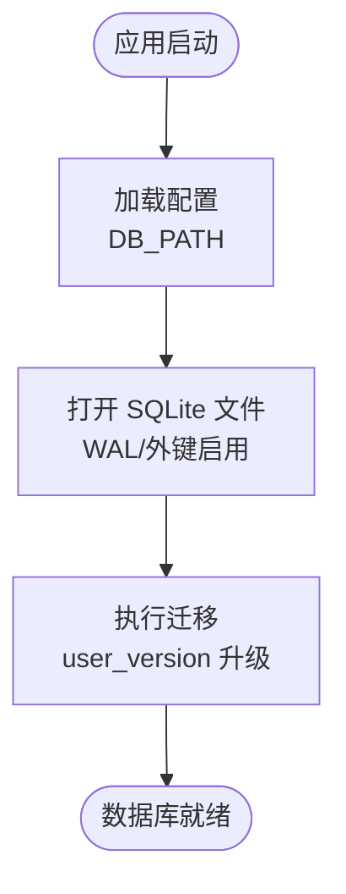
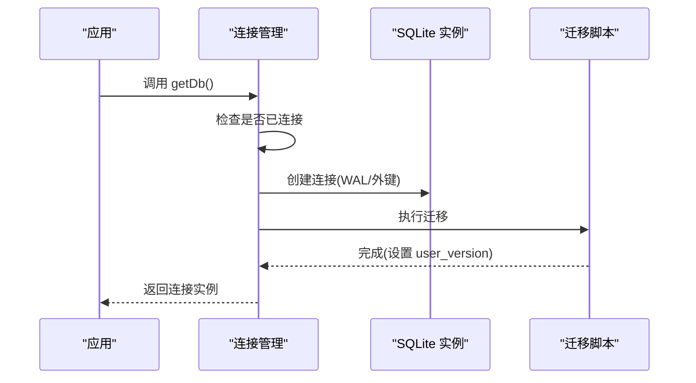
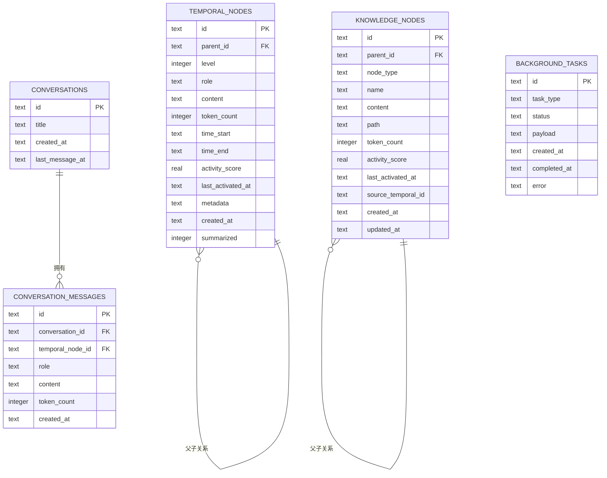
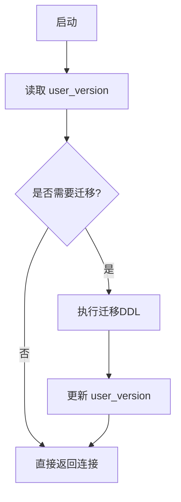
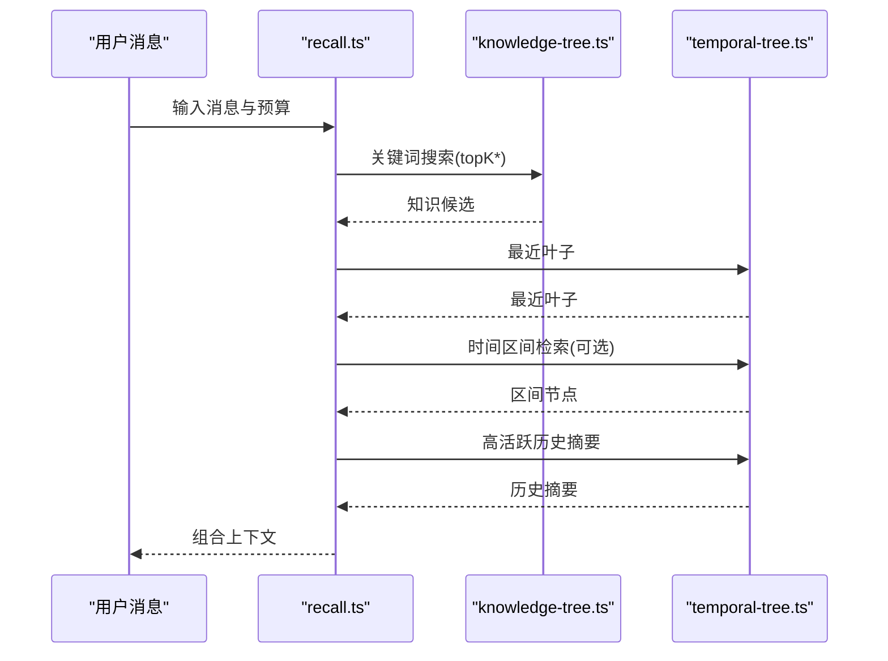
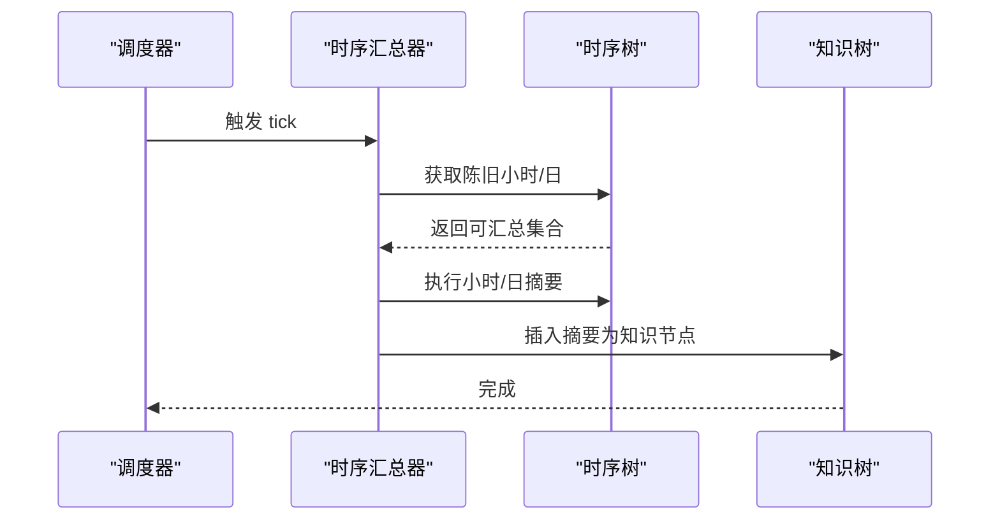
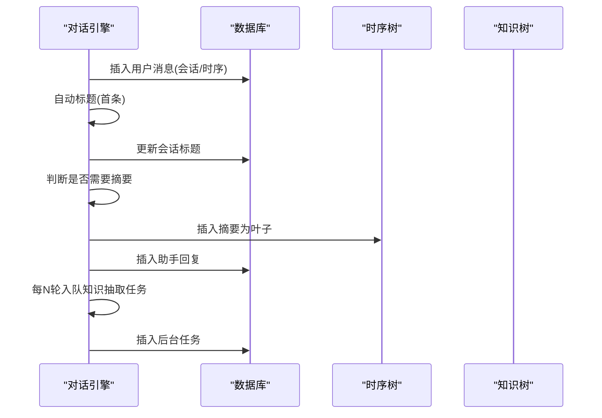
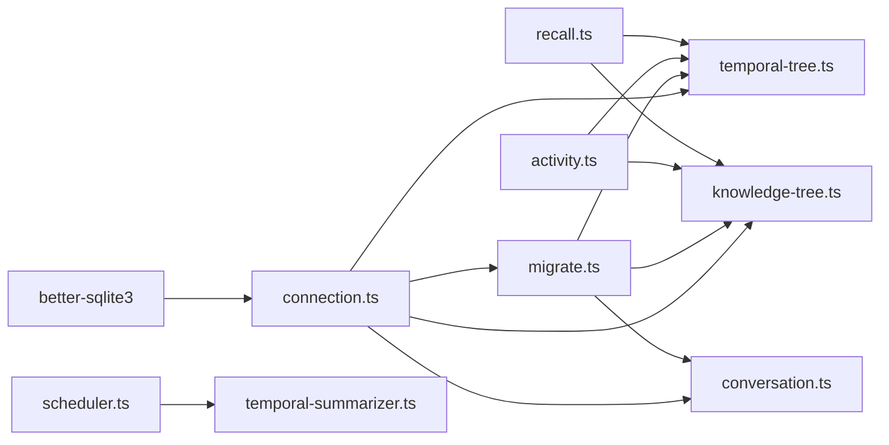

# 数据库架构

<cite>
**本文引用的文件列表**
- [src/db/connection.ts](file://src/db/connection.ts)
- [src/db/migrate.ts](file://src/db/migrate.ts)
- [src/config/index.ts](file://src/config/index.ts)
- [src/memory/knowledge-tree.ts](file://src/memory/knowledge-tree.ts)
- [src/memory/temporal-tree.ts](file://src/memory/temporal-tree.ts)
- [src/engine/conversation.ts](file://src/engine/conversation.ts)
- [src/background/scheduler.ts](file://src/background/scheduler.ts)
- [src/background/temporal-summarizer.ts](file://src/background/temporal-summarizer.ts)
- [src/memory/recall.ts](file://src/memory/recall.ts)
- [src/memory/activity.ts](file://src/memory/activity.ts)
- [src/memory/types.ts](file://src/memory/types.ts)
- [package.json](file://package.json)
</cite>

## 目录
1. [简介](#简介)
2. [项目结构](#项目结构)
3. [核心组件](#核心组件)
4. [架构总览](#架构总览)
5. [详细组件分析](#详细组件分析)
6. [依赖关系分析](#依赖关系分析)
7. [性能考量](#性能考量)
8. [故障排查指南](#故障排查指南)
9. [结论](#结论)
10. [附录](#附录)

## 简介
本文件系统性阐述 TreeMemory 的数据库架构，重点围绕 SQLite（通过 better-sqlite3 驱动）作为嵌入式数据库的选择理由与实现细节，涵盖连接管理、事务与并发控制、表结构设计、初始化与迁移机制、性能优化策略以及备份与维护最佳实践。文档同时结合代码路径进行可视化说明，帮助读者快速理解各模块职责与交互关系。

## 项目结构
数据库相关代码集中在以下模块：
- 连接与迁移：src/db/connection.ts、src/db/migrate.ts
- 配置：src/config/index.ts
- 记忆树：src/memory/temporal-tree.ts、src/memory/knowledge-tree.ts、src/memory/activity.ts、src/memory/types.ts
- 对话引擎：src/engine/conversation.ts
- 后台调度：src/background/scheduler.ts、src/background/temporal-summarizer.ts
- 回忆检索：src/memory/recall.ts

图表来源
- [src/engine/conversation.ts:1-280](file://src/engine/conversation.ts#L1-L280)
- [src/memory/temporal-tree.ts:1-363](file://src/memory/temporal-tree.ts#L1-L363)
- [src/memory/knowledge-tree.ts:1-239](file://src/memory/knowledge-tree.ts#L1-L239)
- [src/memory/recall.ts:1-168](file://src/memory/recall.ts#L1-L168)
- [src/background/scheduler.ts:1-46](file://src/background/scheduler.ts#L1-L46)
- [src/background/temporal-summarizer.ts:1-34](file://src/background/temporal-summarizer.ts#L1-L34)
- [src/db/connection.ts:1-26](file://src/db/connection.ts#L1-L26)
- [src/db/migrate.ts:1-88](file://src/db/migrate.ts#L1-L88)
- [src/config/index.ts:1-30](file://src/config/index.ts#L1-L30)

章节来源
- [src/db/connection.ts:1-26](file://src/db/connection.ts#L1-L26)
- [src/db/migrate.ts:1-88](file://src/db/migrate.ts#L1-L88)
- [src/config/index.ts:1-30](file://src/config/index.ts#L1-L30)

## 核心组件
- 数据库连接管理：单例连接、WAL 模式、外键约束启用、迁移执行。
- 表结构设计：时序树节点、知识树节点、会话与消息、后台任务队列。
- 初始化与迁移：基于 user_version 的增量迁移。
- 并发与事务：无显式事务封装，采用 WAL 模式提升并发读写能力。
- 性能优化：索引策略、查询重排、分阶段召回、令牌预算控制。
- 备份与维护：建议 WAL/快照备份、定期 VACUUM/ANALYZE。

章节来源
- [src/db/connection.ts:8-17](file://src/db/connection.ts#L8-L17)
- [src/db/migrate.ts:4-87](file://src/db/migrate.ts#L4-L87)
- [src/memory/temporal-tree.ts:223-284](file://src/memory/temporal-tree.ts#L223-L284)
- [src/memory/knowledge-tree.ts:138-164](file://src/memory/knowledge-tree.ts#L138-L164)

## 架构总览
SQLite 作为嵌入式数据库的优势：
- 轻量级：无需独立服务进程，零配置部署，适合本地与边缘场景。
- 高性能：WAL 模式显著提升并发读写吞吐；原生支持外键与索引。
- 可靠性：ACID 原语、原子提交、崩溃安全。

图表来源
- [src/db/connection.ts:8-17](file://src/db/connection.ts#L8-L17)
- [src/db/migrate.ts:4-87](file://src/db/migrate.ts#L4-L87)
- [src/config/index.ts:24](file://src/config/index.ts#L24)

## 详细组件分析

### 数据库连接与生命周期
- 单例模式：首次调用时创建连接，后续复用。
- WAL 模式：提升并发读取与写入性能。
- 外键约束：开启外键检查，确保引用完整性。
- 迁移触发：连接建立后立即执行迁移，保证 schema 最新。

图表来源
- [src/db/connection.ts:8-17](file://src/db/connection.ts#L8-L17)
- [src/db/migrate.ts:4-87](file://src/db/migrate.ts#L4-L87)

章节来源
- [src/db/connection.ts:8-25](file://src/db/connection.ts#L8-L25)

### 表结构设计与设计理念
- temporal_nodes（时序树节点）
  - 层级：0=叶子消息/命令，1=小时摘要，2=日摘要。
  - 时间范围：time_start/time_end 覆盖时间窗口。
  - 活跃度：activity_score 与 last_activated_at 支持时间衰减。
  - 标记：summarized 标识是否已被上层摘要覆盖。
  - 索引：父节点、层级+时间、层级+摘要状态、活跃度降序。
- knowledge_nodes（知识树节点）
  - 类型：category/fact，路径 path 唯一标识树形结构。
  - 内容：name/content，token_count 用于预算控制。
  - 关联：source_temporal_id 可回溯到时序节点。
  - 索引：父节点、路径、类型、活跃度降序。
- conversations（会话表）
  - 基本元信息：标题、创建时间、最后消息时间。
- conversation_messages（对话消息）
  - 与会话关联，记录角色、内容、令牌数、创建时间。
  - 外键约束：删除会话时级联删除消息。
  - 索引：会话+时间，便于按时间顺序读取。
- background_tasks（后台任务）
  - 任务类型、状态、负载、创建/完成时间、错误信息。
  - 索引：状态+类型，便于调度器筛选待处理任务。

图表来源
- [src/db/migrate.ts:10-81](file://src/db/migrate.ts#L10-L81)

章节来源
- [src/db/migrate.ts:10-81](file://src/db/migrate.ts#L10-L81)

### 初始化与迁移机制
- 版本管理：使用 SQLite PRAGMA user_version 记录当前 schema 版本。
- 增量升级：仅当 currentVersion < 目标版本时执行相应迁移块。
- 数据完整性：外键启用、索引创建、默认值与约束保证一致性。
- 执行时机：连接建立后立即运行，避免运行时 schema 不一致。

图表来源
- [src/db/migrate.ts:4-87](file://src/db/migrate.ts#L4-L87)

章节来源
- [src/db/migrate.ts:4-87](file://src/db/migrate.ts#L4-L87)

### 并发控制与事务策略
- 并发模型：采用 WAL 模式，允许多个读事务与单个写事务并发。
- 事务封装：未在应用层显式包裹事务，所有写操作以单条 SQL 执行为主，减少锁竞争。
- 锁粒度：按表/索引访问，尽量避免长事务与大范围扫描。
- 建议：对批量写入可考虑分批执行，降低锁持有时间。

章节来源
- [src/db/connection.ts:11-12](file://src/db/connection.ts#L11-L12)
- [src/memory/temporal-tree.ts:120-130](file://src/memory/temporal-tree.ts#L120-L130)
- [src/memory/knowledge-tree.ts:78-84](file://src/memory/knowledge-tree.ts#L78-L84)

### 查询与召回流程
- 回忆检索 recall
  - 分阶段召回：知识树关键词搜索（~25%预算）、最近叶子（始终包含）、时间区间检索（若命中）、高活跃历史摘要填充剩余预算。
  - 排序与去重：按有效活跃度排序，避免重复节点。
- 时序树上下文窗口
  - 优先级：最近未摘要叶子 → 小时摘要 → 日摘要，严格控制令牌预算。
- 知识树搜索
  - LIKE 条件组合，先粗筛再按有效活跃度重排，限制返回数量。

图表来源
- [src/memory/recall.ts:95-167](file://src/memory/recall.ts#L95-L167)
- [src/memory/knowledge-tree.ts:138-164](file://src/memory/knowledge-tree.ts#L138-L164)
- [src/memory/temporal-tree.ts:223-284](file://src/memory/temporal-tree.ts#L223-L284)

章节来源
- [src/memory/recall.ts:95-167](file://src/memory/recall.ts#L95-L167)

### 后台任务与调度
- 调度器：定时触发 runTemporalRollup 与 runKnowledgeExtraction。
- 时序汇总：识别“陈旧小时”与“陈旧日”，自动进行小时摘要与日摘要。
- 知识抽取：周期性将对话摘要转化为知识树节点，供检索使用。

图表来源
- [src/background/scheduler.ts:9-34](file://src/background/scheduler.ts#L9-L34)
- [src/background/temporal-summarizer.ts:9-33](file://src/background/temporal-summarizer.ts#L9-L33)
- [src/memory/temporal-tree.ts:97-217](file://src/memory/temporal-tree.ts#L97-L217)
- [src/memory/knowledge-tree.ts:55-120](file://src/memory/knowledge-tree.ts#L55-L120)

章节来源
- [src/background/scheduler.ts:26-34](file://src/background/scheduler.ts#L26-L34)
- [src/background/temporal-summarizer.ts:9-33](file://src/background/temporal-summarizer.ts#L9-L33)

### 对话与持久化
- 会话状态：内存中缓存会话元信息，数据库中持久化消息与会话。
- 消息存储：用户/助手消息分别插入 conversation_messages，并同步写入时序树生成 leaf 节点。
- 标题自动生成：首条消息截断作为标题，更新至数据库。
- 删除清理：删除会话时级联删除消息，释放内存缓存。

图表来源
- [src/engine/conversation.ts:76-160](file://src/engine/conversation.ts#L76-L160)
- [src/memory/temporal-tree.ts:31-62](file://src/memory/temporal-tree.ts#L31-L62)
- [src/memory/knowledge-tree.ts:55-120](file://src/memory/knowledge-tree.ts#L55-L120)

章节来源
- [src/engine/conversation.ts:23-68](file://src/engine/conversation.ts#L23-L68)
- [src/engine/conversation.ts:224-233](file://src/engine/conversation.ts#L224-L233)

## 依赖关系分析
- 外部依赖：better-sqlite3 提供高性能 SQLite 驱动。
- 内部耦合：记忆树与对话引擎通过连接管理模块共享数据库实例；活动度计算跨表通用。
- 循环依赖：无循环导入，模块职责清晰。

图表来源
- [package.json:17-26](file://package.json#L17-L26)
- [src/db/connection.ts:1-26](file://src/db/connection.ts#L1-L26)
- [src/db/migrate.ts:1-88](file://src/db/migrate.ts#L1-L88)
- [src/memory/temporal-tree.ts:1-363](file://src/memory/temporal-tree.ts#L1-L363)
- [src/memory/knowledge-tree.ts:1-239](file://src/memory/knowledge-tree.ts#L1-L239)
- [src/engine/conversation.ts:1-280](file://src/engine/conversation.ts#L1-L280)
- [src/memory/recall.ts:1-168](file://src/memory/recall.ts#L1-L168)
- [src/memory/activity.ts:1-51](file://src/memory/activity.ts#L1-L51)
- [src/background/scheduler.ts:1-46](file://src/background/scheduler.ts#L1-L46)
- [src/background/temporal-summarizer.ts:1-34](file://src/background/temporal-summarizer.ts#L1-L34)

章节来源
- [package.json:17-26](file://package.json#L17-L26)

## 性能考量
- 索引设计原则
  - temporal_nodes：父节点、层级+时间、层级+摘要状态、活跃度降序，支撑层级遍历与时间范围查询。
  - knowledge_nodes：父节点、路径、类型、活跃度降序，支撑路径前缀匹配与类型过滤。
  - conversation_messages：会话+时间，支撑按时间顺序读取消息。
  - background_tasks：状态+类型，支撑任务调度筛选。
- 查询优化技巧
  - LIKE + OR 组合 + LIMIT * K 先粗筛再重排，控制结果规模。
  - 使用有效活跃度排序，优先召回高质量上下文。
  - 上下文窗口严格预算控制，避免超限。
- 内存管理方案
  - 会话状态仅驻留内存，持久化于数据库，避免长期驻留大对象。
  - 后台任务队列异步处理，避免阻塞主流程。
- 建议的维护操作
  - 定期执行 VACUUM/ANALYZE（可通过外部脚本），保持统计信息与空间回收。
  - 使用 WAL 模式配合快照备份，降低停机风险。

章节来源
- [src/db/migrate.ts:26-29](file://src/db/migrate.ts#L26-L29)
- [src/db/migrate.ts:46-49](file://src/db/migrate.ts#L46-L49)
- [src/db/migrate.ts:69](file://src/db/migrate.ts#L69)
- [src/db/migrate.ts:81](file://src/db/migrate.ts#L81)
- [src/memory/recall.ts:138-164](file://src/memory/recall.ts#L138-L164)
- [src/memory/temporal-tree.ts:223-284](file://src/memory/temporal-tree.ts#L223-L284)

## 故障排查指南
- 连接问题
  - 症状：无法打开数据库或迁移失败。
  - 排查：确认 DB_PATH 是否可写；检查 user_version 是否正确更新；查看日志输出。
- 外键约束错误
  - 症状：插入/删除时报外键约束失败。
  - 排查：确认引用的父节点存在；检查 cascade 删除逻辑是否生效。
- 性能退化
  - 症状：查询变慢、内存占用上升。
  - 排查：检查是否缺少必要索引；确认是否频繁全表扫描；核对预算参数与召回策略。
- 后台任务堆积
  - 症状：background_tasks 长期处于 pending。
  - 排查：检查调度间隔与任务执行耗时；确认任务负载大小与 LLM 调用频率。

章节来源
- [src/db/connection.ts:19-25](file://src/db/connection.ts#L19-L25)
- [src/db/migrate.ts:4-87](file://src/db/migrate.ts#L4-L87)
- [src/background/scheduler.ts:9-21](file://src/background/scheduler.ts#L9-L21)

## 结论
TreeMemory 采用 SQLite 作为核心存储，借助 better-sqlite3 的高性能与 WAL 模式，在本地与边缘场景下实现了低门槛、高可靠的记忆系统。通过精心设计的表结构、索引与查询策略，结合后台调度与预算控制，系统在准确性与性能之间取得良好平衡。建议在生产环境中配合 WAL 快照与定期维护，确保长期稳定运行。

## 附录
- 配置项参考
  - DB_PATH：数据库文件路径，默认 ./treememory.db。
  - MAX_CONTEXT_TOKENS：最大上下文令牌预算。
  - SUMMARIZE_THRESHOLD_RATIO：缓冲区摘要阈值比例。
  - BACKGROUND_INTERVAL_MS：后台调度间隔（毫秒）。
  - ACTIVITY_DECAY_RATE/ACTIVITY_BOOST：活跃度衰减率与激活增益。
- 依赖声明
  - better-sqlite3：SQLite 驱动。
  - dotenv：环境变量加载。
  - fastify/gpt-tokenizer/openai/pino/ulid：周边工具与日志。

章节来源
- [src/config/index.ts:18-29](file://src/config/index.ts#L18-L29)
- [package.json:17-26](file://package.json#L17-L26)