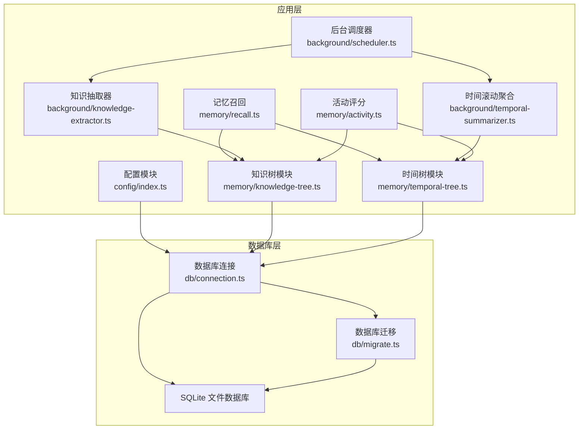
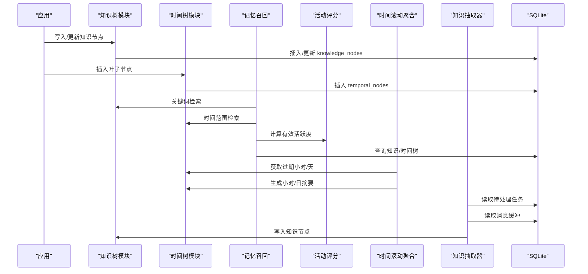
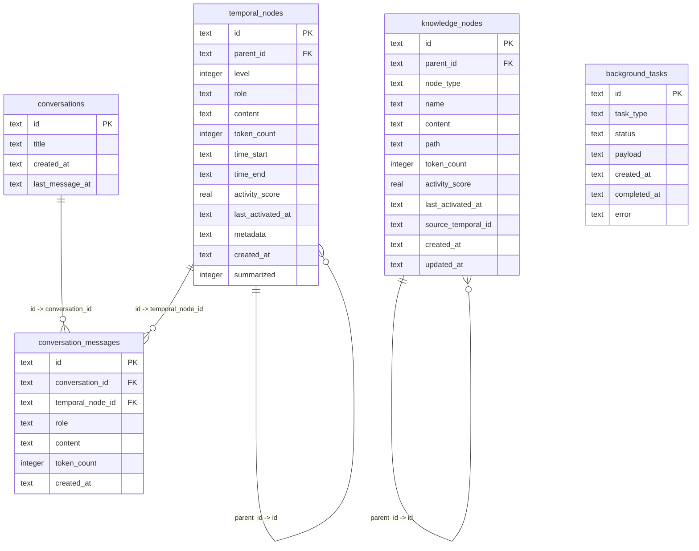
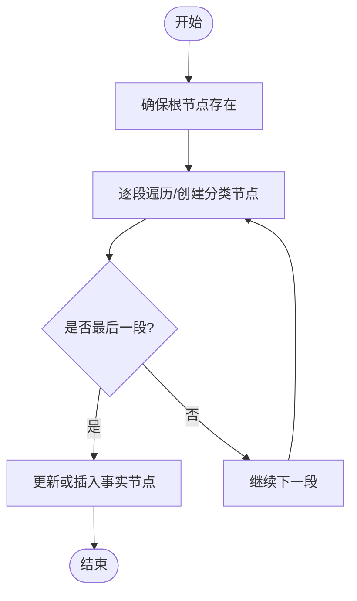
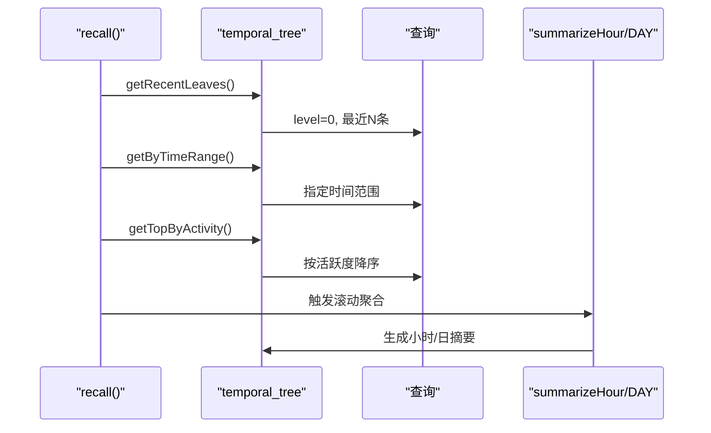
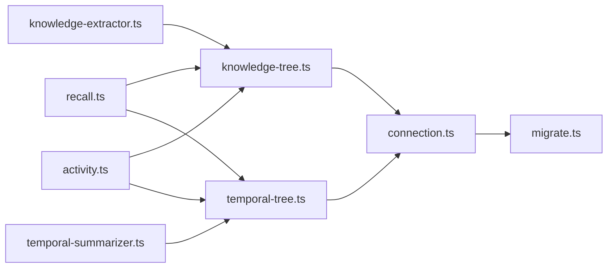

# 数据库设计

<cite>
**本文引用的文件**
- [src/db/connection.ts](file://src/db/connection.ts)
- [src/db/migrate.ts](file://src/db/migrate.ts)
- [src/config/index.ts](file://src/config/index.ts)
- [src/memory/types.ts](file://src/memory/types.ts)
- [src/memory/knowledge-tree.ts](file://src/memory/knowledge-tree.ts)
- [src/memory/temporal-tree.ts](file://src/memory/temporal-tree.ts)
- [src/memory/recall.ts](file://src/memory/recall.ts)
- [src/memory/activity.ts](file://src/memory/activity.ts)
- [src/background/scheduler.ts](file://src/background/scheduler.ts)
- [src/background/temporal-summarizer.ts](file://src/background/temporal-summarizer.ts)
- [src/background/knowledge-extractor.ts](file://src/background/knowledge-extractor.ts)
- [tests/memory/knowledge-tree.test.ts](file://tests/memory/knowledge-tree.test.ts)
- [tests/memory/temporal-tree.test.ts](file://tests/memory/temporal-tree.test.ts)
</cite>

## 目录
1. [简介](#简介)
2. [项目结构](#项目结构)
3. [核心组件](#核心组件)
4. [架构总览](#架构总览)
5. [详细组件分析](#详细组件分析)
6. [依赖分析](#依赖分析)
7. [性能考虑](#性能考虑)
8. [故障排查指南](#故障排查指南)
9. [结论](#结论)
10. [附录](#附录)

## 简介
本文件面向 TreeMemory 的数据库设计，聚焦 SQLite 在该系统中的选择理由、架构优势、表结构设计、索引策略、查询优化、实体关系图、数据迁移机制、性能分析与优化、维护与监控最佳实践，以及数据安全与隐私保护的实现细节。文档基于源码进行深入分析，并通过可视化图表帮助读者快速理解数据库层的设计与运行方式。

## 项目结构
数据库层由连接管理、迁移脚本、内存模块（时间树与知识树）、活动评分与召回逻辑、后台调度器与知识抽取器组成。整体采用“单机 SQLite + WAL 模式”的轻量级架构，配合内存型迁移脚本与按需索引，满足本地化部署与低延迟访问需求。

**图表来源**
- [src/config/index.ts:18-29](file://src/config/index.ts#L18-L29)
- [src/db/connection.ts:8-17](file://src/db/connection.ts#L8-L17)
- [src/db/migrate.ts:4-87](file://src/db/migrate.ts#L4-L87)
- [src/memory/knowledge-tree.ts:1-239](file://src/memory/knowledge-tree.ts#L1-L239)
- [src/memory/temporal-tree.ts:1-362](file://src/memory/temporal-tree.ts#L1-L362)
- [src/memory/recall.ts:95-167](file://src/memory/recall.ts#L95-L167)
- [src/background/scheduler.ts:26-34](file://src/background/scheduler.ts#L26-L34)
- [src/background/temporal-summarizer.ts:9-33](file://src/background/temporal-summarizer.ts#L9-L33)
- [src/background/knowledge-extractor.ts:63-116](file://src/background/knowledge-extractor.ts#L63-L116)

**章节来源**
- [src/db/connection.ts:1-26](file://src/db/connection.ts#L1-L26)
- [src/db/migrate.ts:1-88](file://src/db/migrate.ts#L1-L88)
- [src/config/index.ts:1-30](file://src/config/index.ts#L1-L30)

## 核心组件
- 数据库连接与初始化：建立 SQLite 连接，启用 WAL 日志模式与外键检查，执行迁移脚本。
- 迁移脚本：一次性创建初始表结构与索引，设置版本号。
- 内存模块：
  - 时间树（temporal_nodes）：按时间层级组织消息与摘要，支持小时/天两级汇总。
  - 知识树（knowledge_nodes）：按语义路径组织事实，支持路径创建、更新、检索与上下文拼装。
- 回忆与活动：根据关键词与时间范围召回上下文，结合活动评分与时间衰减进行重排。
- 后台任务：周期性滚动聚合时间树、异步抽取知识并写入知识树。

**章节来源**
- [src/db/connection.ts:8-17](file://src/db/connection.ts#L8-L17)
- [src/db/migrate.ts:4-87](file://src/db/migrate.ts#L4-L87)
- [src/memory/knowledge-tree.ts:27-120](file://src/memory/knowledge-tree.ts#L27-L120)
- [src/memory/temporal-tree.ts:27-146](file://src/memory/temporal-tree.ts#L27-L146)
- [src/memory/recall.ts:95-167](file://src/memory/recall.ts#L95-L167)
- [src/memory/activity.ts:9-50](file://src/memory/activity.ts#L9-L50)

## 架构总览
下图展示了数据库层与业务模块之间的交互关系，以及主要的数据流向与处理阶段。

**图表来源**
- [src/memory/knowledge-tree.ts:55-120](file://src/memory/knowledge-tree.ts#L55-L120)
- [src/memory/temporal-tree.ts:30-146](file://src/memory/temporal-tree.ts#L30-L146)
- [src/memory/recall.ts:95-167](file://src/memory/recall.ts#L95-L167)
- [src/memory/activity.ts:18-50](file://src/memory/activity.ts#L18-L50)
- [src/background/temporal-summarizer.ts:9-33](file://src/background/temporal-summarizer.ts#L9-L33)
- [src/background/knowledge-extractor.ts:63-116](file://src/background/knowledge-extractor.ts#L63-L116)

## 详细组件分析

### 数据库连接与初始化
- 使用 better-sqlite3 创建连接，设置 journal_mode=WAL 以提升并发读写性能；开启 foreign_keys=ON 保证引用完整性。
- 首次连接时执行迁移脚本，确保表结构与索引存在。
- 提供连接关闭接口，便于服务生命周期管理。

**章节来源**
- [src/db/connection.ts:8-17](file://src/db/connection.ts#L8-L17)
- [src/db/connection.ts:19-25](file://src/db/connection.ts#L19-L25)

### 迁移与版本管理
- 迁移脚本通过 user_version 字段判断当前版本，仅在版本小于 1 时执行初始化。
- 初始化包含以下对象：
  - temporal_nodes：时间树节点表
  - knowledge_nodes：知识树节点表
  - conversations：会话表
  - conversation_messages：会话消息缓冲表
  - background_tasks：后台任务队列表
- 设置初始版本号为 1。

**章节来源**
- [src/db/migrate.ts:4-87](file://src/db/migrate.ts#L4-L87)

### 表结构与字段定义

#### 时间树节点表 temporal_nodes
- 主键：id
- 外键：parent_id 引用自身（自引用）
- 字段要点：
  - level：层级（0=叶子消息，1=小时摘要，2=日摘要）
  - role：消息角色（如 user/assistant/system/command/summary）
  - content：消息内容
  - token_count：内容的 token 数量
  - time_start/time_end：时间窗口
  - activity_score/last_activated_at：活动评分与时点
  - metadata：JSON 元数据
  - created_at：创建时间
  - summarized：是否已被上层汇总标记
- 约束与检查：
  - level 默认 0
  - activity_score 默认 1.0
  - summarized 默认 0（整数布尔）

**章节来源**
- [src/db/migrate.ts:11-25](file://src/db/migrate.ts#L11-L25)
- [src/memory/types.ts:11-18](file://src/memory/types.ts#L11-L18)

#### 知识树节点表 knowledge_nodes
- 主键：id
- 外键：parent_id 引用自身（自引用）
- 字段要点：
  - node_type：节点类型（category/fact）
  - name：节点名称
  - content：内容（fact 节点存储事实）
  - path：完整路径字符串（用于前缀匹配）
  - token_count：token 数量
  - activity_score/last_activated_at：活动评分与时点
  - source_temporal_id：可选，指向来源时间节点
  - created_at/updated_at：创建与更新时间
- 约束与检查：
  - node_type 必须为 'category' 或 'fact'

**章节来源**
- [src/db/migrate.ts:32-45](file://src/db/migrate.ts#L32-L45)
- [src/memory/types.ts:20-26](file://src/memory/types.ts#L20-L26)

#### 会话表 conversations
- 主键：id
- 字段：title、created_at、last_message_at
- 用途：记录对话会话的基本信息

**章节来源**
- [src/db/migrate.ts:52-57](file://src/db/migrate.ts#L52-L57)

#### 会话消息缓冲表 conversation_messages
- 主键：id
- 外键：conversation_id 引用 conversations(id)，删除级联
- 可选外键：temporal_node_id 引用 temporal_nodes(id)
- 字段：role、content、token_count、created_at
- 用途：作为工作缓冲区，承载未持久化的消息，便于后续抽取与汇总

**章节来源**
- [src/db/migrate.ts:60-69](file://src/db/migrate.ts#L60-L69)

#### 后台任务队列表 background_tasks
- 主键：id
- 字段：task_type、status（默认 pending）、payload、created_at、completed_at、error
- 用途：异步任务队列，如知识抽取

**章节来源**
- [src/db/migrate.ts:72-81](file://src/db/migrate.ts#L72-L81)

### 索引策略与查询优化
- temporal_nodes：
  - idx_temporal_parent：加速父子遍历与层级查询
  - idx_temporal_level_time：按层级+时间排序查询（如最近叶子）
  - idx_temporal_level_summarized：过滤未汇总叶子
  - idx_temporal_activity：按活跃度降序查询
- knowledge_nodes：
  - idx_knowledge_parent：加速路径遍历
  - idx_knowledge_path：LIKE 前缀匹配（路径前缀查询）
  - idx_knowledge_type：按节点类型过滤
  - idx_knowledge_activity：按活跃度降序查询
- conversation_messages：
  - idx_conv_msg_conv：按会话+时间排序查询
- background_tasks：
  - idx_bg_tasks_status：按状态+类型查询待处理任务

查询优化建议：
- 使用复合索引覆盖常见过滤条件（如 level+time_start、level+summarized、node_type、path 前缀）
- LIKE 前缀匹配使用 path LIKE ? || '%'，避免 leading wildcard 导致全表扫描
- 对于全文搜索，当前实现为 LIKE 名称/内容组合，若规模扩大可考虑 FTS5 扩展（需额外迁移脚本）

**章节来源**
- [src/db/migrate.ts:26-29](file://src/db/migrate.ts#L26-L29)
- [src/db/migrate.ts:46-49](file://src/db/migrate.ts#L46-L49)
- [src/db/migrate.ts:69](file://src/db/migrate.ts#L69)
- [src/db/migrate.ts:81](file://src/db/migrate.ts#L81)
- [src/memory/knowledge-tree.ts:125-133](file://src/memory/knowledge-tree.ts#L125-L133)
- [src/memory/knowledge-tree.ts:138-164](file://src/memory/knowledge-tree.ts#L138-L164)

### 实体关系图与数据模型

**图表来源**
- [src/db/migrate.ts:11-25](file://src/db/migrate.ts#L11-L25)
- [src/db/migrate.ts:32-45](file://src/db/migrate.ts#L32-L45)
- [src/db/migrate.ts:52-57](file://src/db/migrate.ts#L52-L57)
- [src/db/migrate.ts:60-69](file://src/db/migrate.ts#L60-L69)
- [src/db/migrate.ts:72-81](file://src/db/migrate.ts#L72-L81)

### 查询流程与示例

#### 知识树路径创建与检索
- upsertPath：沿路径逐级创建 category 节点，最后创建 fact 节点；若已存在则更新内容与 token_count。
- findByPath：基于 path 前缀 LIKE 查询，返回子树。
- search：关键词分词后构建多个 LIKE 条件，先粗排再按有效活跃度重排。

**图表来源**
- [src/memory/knowledge-tree.ts:30-120](file://src/memory/knowledge-tree.ts#L30-L120)

**章节来源**
- [src/memory/knowledge-tree.ts:55-120](file://src/memory/knowledge-tree.ts#L55-L120)
- [src/memory/knowledge-tree.ts:125-164](file://src/memory/knowledge-tree.ts#L125-L164)

#### 时间树上下文窗口与滚动聚合
- getContextWindow：优先最近叶子，再小时摘要，最后日摘要，按 token 预算填充。
- getRecentLeaves/getByTimeRange/getTopByActivity：按时间与活跃度查询。
- summarizeHour/summarizeDay：调用 LLM 生成摘要，更新父指针与汇总标记。

**图表来源**
- [src/memory/recall.ts:124-161](file://src/memory/recall.ts#L124-L161)
- [src/memory/temporal-tree.ts:222-283](file://src/memory/temporal-tree.ts#L222-L283)
- [src/background/temporal-summarizer.ts:9-33](file://src/background/temporal-summarizer.ts#L9-L33)

**章节来源**
- [src/memory/temporal-tree.ts:66-146](file://src/memory/temporal-tree.ts#L66-L146)
- [src/memory/temporal-tree.ts:222-283](file://src/memory/temporal-tree.ts#L222-L283)
- [src/memory/recall.ts:124-161](file://src/memory/recall.ts#L124-L161)

### 数据迁移机制
- 版本管理：通过 PRAGMA user_version 判断当前版本，仅在小于目标版本时执行迁移。
- 迁移内容：创建表与索引，设置初始版本号。
- 回滚策略：当前版本仅支持向前迁移，未实现向后兼容或回滚逻辑。建议在升级前备份数据库文件。
- 数据备份：推荐定期复制 SQLite 文件（WAL 模式下可直接复制主库文件），并在事务间隙进行一致性备份。

**章节来源**
- [src/db/migrate.ts:4-87](file://src/db/migrate.ts#L4-L87)

### 查询性能分析与慢查询优化指南
- 热点查询：
  - 最近叶子：按 time_start DESC 排序，限制数量，避免全表扫描。
  - 路径前缀：使用 path LIKE ? || '%'，配合 idx_knowledge_path。
  - 活跃度降序：使用 idx_temporal_activity/idx_knowledge_activity。
- 慢查询识别：
  - 使用 EXPLAIN QUERY PLAN 分析 SQL 执行计划，确认索引是否被使用。
  - 对 LIKE 前缀查询避免 leading wildcard。
- 优化建议：
  - 为高频过滤字段增加复合索引（如 level+time_start、level+summarized、node_type、path）。
  - 控制单次查询返回行数，结合 LIMIT 与分页。
  - 将高成本计算（如 token_count 统计）缓存至表字段，减少运行时计算。

**章节来源**
- [src/db/migrate.ts:26-29](file://src/db/migrate.ts#L26-L29)
- [src/db/migrate.ts:46-49](file://src/db/migrate.ts#L46-L49)
- [src/db/migrate.ts:69](file://src/db/migrate.ts#L69)
- [src/db/migrate.ts:81](file://src/db/migrate.ts#L81)
- [src/memory/knowledge-tree.ts:125-164](file://src/memory/knowledge-tree.ts#L125-L164)

### 数据安全与隐私保护
- 数据库文件位置：由配置项 dbPath 指定，默认位于项目目录下，建议在生产环境设置为受控路径并限制文件权限。
- 外部依赖：通过 better-sqlite3 与 SQLite 交互，未发现明文敏感字段存储；会话消息缓冲表包含 content 字段，建议在传输与存储层面遵循最小化原则。
- 备份与恢复：建议对 SQLite 文件进行加密备份，并在恢复时验证文件完整性。
- 审计与日志：连接与迁移日志记录在应用日志中，建议在生产环境开启细粒度审计（如仅记录必要操作）。

**章节来源**
- [src/config/index.ts:24](file://src/config/index.ts#L24)
- [src/db/connection.ts:10-14](file://src/db/connection.ts#L10-L14)
- [src/db/migrate.ts:83](file://src/db/migrate.ts#L83)

## 依赖分析
- 组件耦合：
  - memory/* 模块依赖 db/connection.ts 获取连接。
  - recall 模块同时依赖知识树与时间树，形成跨模块查询。
  - 后台任务依赖 knowledge-extractor 与 temporal-summarizer，间接依赖 memory/*。
- 外部依赖：
  - better-sqlite3：SQLite 客户端
  - ulid：生成全局唯一标识符
  - dotenv：加载环境变量

**图表来源**
- [src/memory/knowledge-tree.ts:1-239](file://src/memory/knowledge-tree.ts#L1-L239)
- [src/memory/temporal-tree.ts:1-362](file://src/memory/temporal-tree.ts#L1-L362)
- [src/memory/recall.ts:1-168](file://src/memory/recall.ts#L1-L168)
- [src/memory/activity.ts:1-51](file://src/memory/activity.ts#L1-L51)
- [src/background/temporal-summarizer.ts:1-34](file://src/background/temporal-summarizer.ts#L1-L34)
- [src/background/knowledge-extractor.ts:1-117](file://src/background/knowledge-extractor.ts#L1-L117)
- [src/db/connection.ts:1-26](file://src/db/connection.ts#L1-L26)
- [src/db/migrate.ts:1-88](file://src/db/migrate.ts#L1-L88)

**章节来源**
- [src/memory/knowledge-tree.ts:1-239](file://src/memory/knowledge-tree.ts#L1-L239)
- [src/memory/temporal-tree.ts:1-362](file://src/memory/temporal-tree.ts#L1-L362)
- [src/memory/recall.ts:1-168](file://src/memory/recall.ts#L1-L168)
- [src/memory/activity.ts:1-51](file://src/memory/activity.ts#L1-L51)
- [src/background/temporal-summarizer.ts:1-34](file://src/background/temporal-summarizer.ts#L1-L34)
- [src/background/knowledge-extractor.ts:1-117](file://src/background/knowledge-extractor.ts#L1-L117)
- [src/db/connection.ts:1-26](file://src/db/connection.ts#L1-L26)
- [src/db/migrate.ts:1-88](file://src/db/migrate.ts#L1-L88)

## 性能考虑
- WAL 模式：提升并发读取与写入吞吐，降低锁竞争。
- 外键约束：保证引用完整性，但可能影响插入性能，建议在批量导入时暂时禁用（谨慎使用）。
- 索引策略：针对高频查询建立复合索引，避免全表扫描。
- 查询预算：recall 中对知识树与时间树分别设定预算比例，防止上下文溢出。
- 后台聚合：通过定时器触发滚动聚合，减少实时查询压力。

**章节来源**
- [src/db/connection.ts:11-12](file://src/db/connection.ts#L11-L12)
- [src/memory/recall.ts:107-161](file://src/memory/recall.ts#L107-L161)
- [src/background/scheduler.ts:26-34](file://src/background/scheduler.ts#L26-L34)

## 故障排查指南
- 连接问题：
  - 确认 dbPath 是否可写，WAL 文件是否存在。
  - 检查 foreign_keys 是否开启导致外键冲突。
- 迁移失败：
  - 查看迁移日志，确认 user_version 是否正确推进。
  - 若重复执行迁移，确认是否已存在表结构。
- 查询异常：
  - 使用 EXPLAIN QUERY PLAN 检查索引使用情况。
  - 对 LIKE 前缀查询检查是否遗漏通配符。
- 后台任务：
  - 检查 background_tasks 表状态与错误字段。
  - 确认知识抽取任务的 payload 结构与会话消息是否存在。

**章节来源**
- [src/db/connection.ts:10-14](file://src/db/connection.ts#L10-L14)
- [src/db/migrate.ts:4-87](file://src/db/migrate.ts#L4-L87)
- [src/background/knowledge-extractor.ts:63-116](file://src/background/knowledge-extractor.ts#L63-L116)

## 结论
TreeMemory 的数据库层以 SQLite 为核心，采用 WAL 模式与外键约束保障一致性与性能。通过合理的表结构设计与索引策略，满足时间树与知识树的高频查询需求。迁移脚本提供版本化管理，后台任务实现自动化滚动聚合与知识抽取。建议在生产环境中加强备份与监控，并持续评估全文搜索与大规模数据场景下的扩展方案。

## 附录
- 测试参考：
  - 知识树测试覆盖路径创建、更新、搜索与上下文格式化。
  - 时间树测试覆盖叶子插入、最近叶子、上下文窗口与过期小时检测。

**章节来源**
- [tests/memory/knowledge-tree.test.ts:51-134](file://tests/memory/knowledge-tree.test.ts#L51-L134)
- [tests/memory/temporal-tree.test.ts:56-118](file://tests/memory/temporal-tree.test.ts#L56-L118)