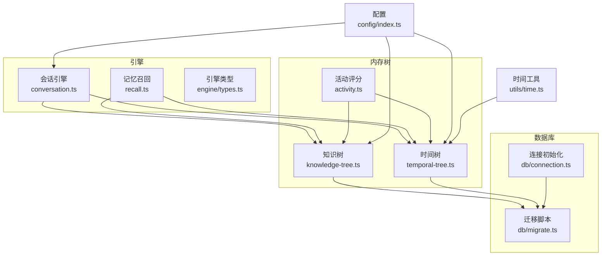
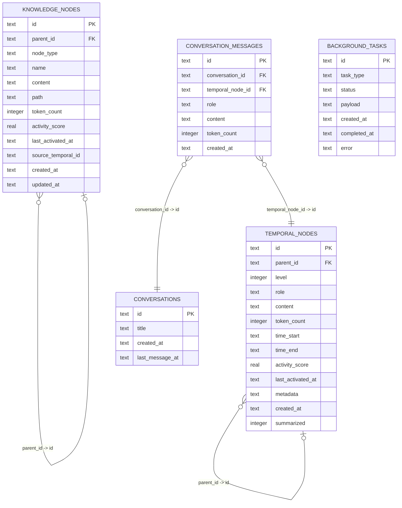
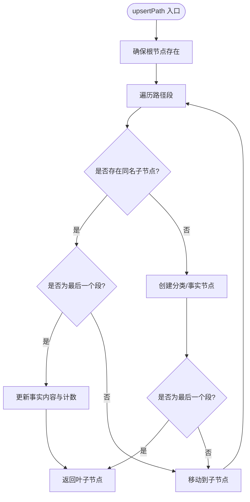
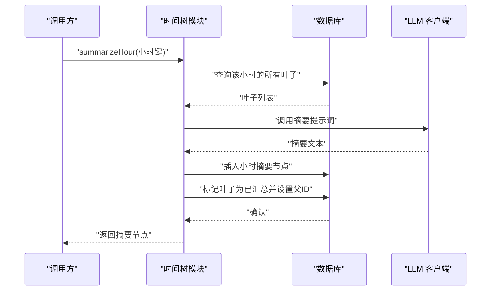
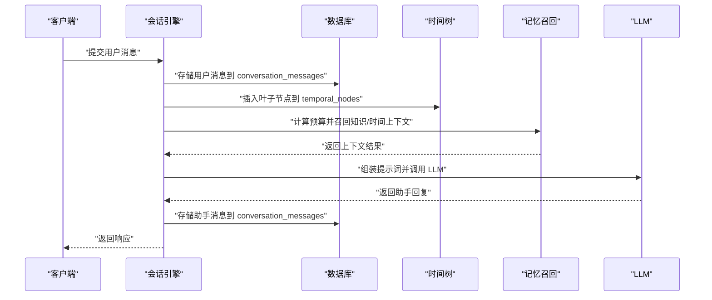
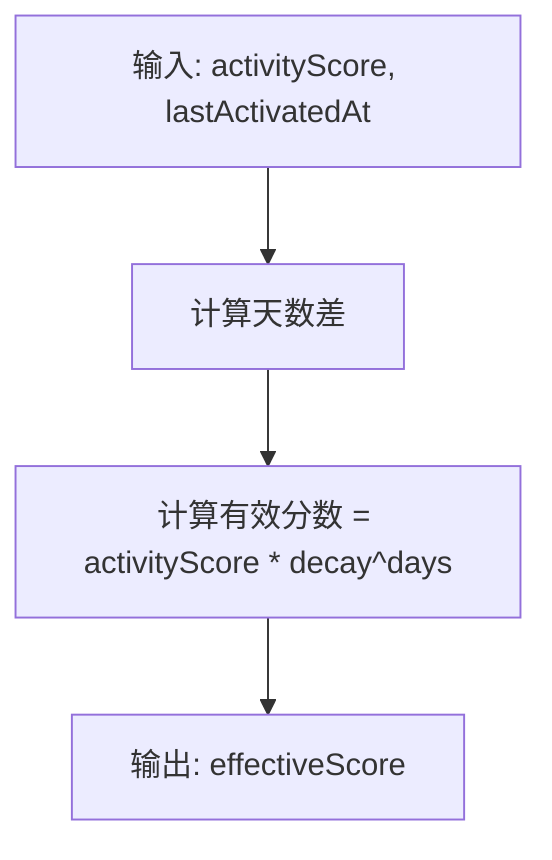
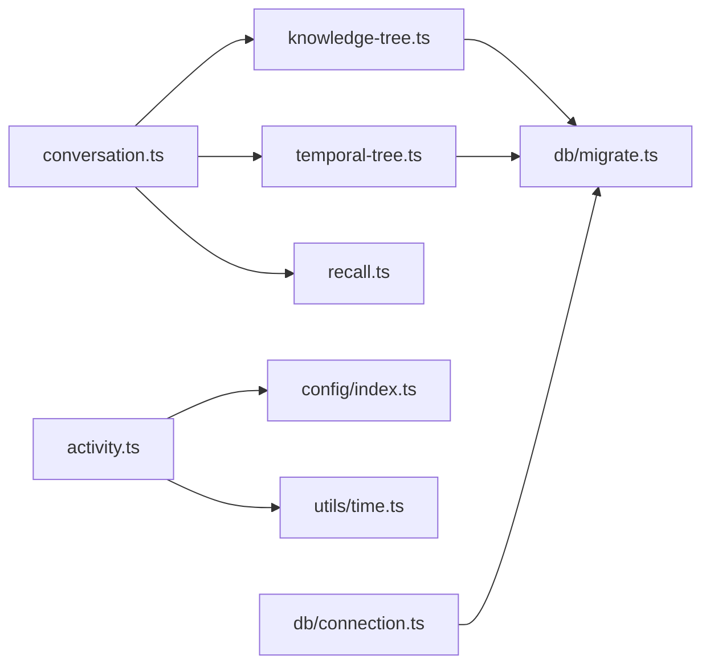

# 数据模型

<cite>
**本文引用的文件**
- [src/memory/types.ts](file://src/memory/types.ts)
- [src/db/migrate.ts](file://src/db/migrate.ts)
- [src/memory/knowledge-tree.ts](file://src/memory/knowledge-tree.ts)
- [src/memory/temporal-tree.ts](file://src/memory/temporal-tree.ts)
- [src/memory/activity.ts](file://src/memory/activity.ts)
- [src/memory/recall.ts](file://src/memory/recall.ts)
- [src/engine/conversation.ts](file://src/engine/conversation.ts)
- [src/engine/types.ts](file://src/engine/types.ts)
- [src/db/connection.ts](file://src/db/connection.ts)
- [src/config/index.ts](file://src/config/index.ts)
- [src/utils/time.ts](file://src/utils/time.ts)
- [tests/memory/knowledge-tree.test.ts](file://tests/memory/knowledge-tree.test.ts)
- [tests/memory/temporal-tree.test.ts](file://tests/memory/temporal-tree.test.ts)
</cite>

## 目录
1. [简介](#简介)
2. [项目结构](#项目结构)
3. [核心组件](#核心组件)
4. [架构总览](#架构总览)
5. [详细组件分析](#详细组件分析)
6. [依赖分析](#依赖分析)
7. [性能考虑](#性能考虑)
8. [故障排查指南](#故障排查指南)
9. [结论](#结论)
10. [附录](#附录)

## 简介
本文件系统性梳理 TreeMemory 的数据模型，聚焦以下核心实体：
- TreeNode（基础节点）
- KnowledgeNode（知识树节点）
- TemporalNode（时间树节点）
- Conversation（会话）

内容涵盖数据结构定义、字段含义、实体关系映射（父子、引用、继承）、数据类型与枚举、业务约束与验证规则、数据生命周期（创建/更新/删除/归档）、数据访问模式与查询优化、以及安全与隐私保护措施。同时提供实体关系图（ERD）与关键流程时序图，帮助读者快速理解并正确使用该数据模型。

## 项目结构
围绕数据模型的关键目录与文件如下：
- 内存树模块：知识树与时间树实现，负责节点的增删改查、检索与上下文组装
- 引擎模块：会话管理、记忆召回、提示词组装与LLM交互
- 数据库层：SQLite 迁移脚本与连接初始化
- 配置与工具：运行参数、时间工具、活动评分与衰减

图表来源
- [src/memory/knowledge-tree.ts:1-239](file://src/memory/knowledge-tree.ts#L1-L239)
- [src/memory/temporal-tree.ts:1-363](file://src/memory/temporal-tree.ts#L1-L363)
- [src/memory/activity.ts:1-51](file://src/memory/activity.ts#L1-L51)
- [src/memory/recall.ts:1-168](file://src/memory/recall.ts#L1-L168)
- [src/engine/conversation.ts:1-281](file://src/engine/conversation.ts#L1-L281)
- [src/db/migrate.ts:1-88](file://src/db/migrate.ts#L1-L88)
- [src/db/connection.ts:1-26](file://src/db/connection.ts#L1-L26)
- [src/config/index.ts:1-30](file://src/config/index.ts#L1-L30)
- [src/utils/time.ts:1-60](file://src/utils/time.ts#L1-L60)

章节来源
- [src/memory/knowledge-tree.ts:1-239](file://src/memory/knowledge-tree.ts#L1-L239)
- [src/memory/temporal-tree.ts:1-363](file://src/memory/temporal-tree.ts#L1-L363)
- [src/memory/activity.ts:1-51](file://src/memory/activity.ts#L1-L51)
- [src/memory/recall.ts:1-168](file://src/memory/recall.ts#L1-L168)
- [src/engine/conversation.ts:1-281](file://src/engine/conversation.ts#L1-L281)
- [src/db/migrate.ts:1-88](file://src/db/migrate.ts#L1-L88)
- [src/db/connection.ts:1-26](file://src/db/connection.ts#L1-L26)
- [src/config/index.ts:1-30](file://src/config/index.ts#L1-L30)
- [src/utils/time.ts:1-60](file://src/utils/time.ts#L1-L60)

## 核心组件
本节定义四大核心实体及其字段语义，并说明它们之间的关系。

- TreeNode（基础节点）
  - 字段：id、parentId、content、tokenCount、activityScore、lastActivatedAt、createdAt
  - 语义：所有树形节点的通用属性，用于统一存储与操作
  - 关系：作为父类接口，被 KnowledgeNode 和 TemporalNode 继承扩展

- KnowledgeNode（知识树节点）
  - 字段：继承自 TreeNode；新增 nodeType（category/fact）、name、path、sourceTemporalId、updatedAt
  - 语义：语义记忆节点，支持层次化路径组织，fact 叶子承载事实内容
  - 关系：通过 parent_id 与自身表形成父子树；可引用 TemporalNode 的 id 作为来源

- TemporalNode（时间树节点）
  - 字段：继承自 TreeNode；新增 level（0/1/2）、role（user/assistant/system/command/summary）、timeStart、timeEnd、summarized、metadata
  - 语义：时间记忆节点，按小时/天聚合，支持摘要生成与层级结构
  - 关系：通过 parent_id 与自身表形成父子树；叶子节点 level=0，摘要节点 level=1/2

- Conversation（会话）
  - 字段：id、title、buffer（消息数组）、bufferTokenCount、turnCount
  - 语义：会话状态对象，维护对话缓冲区与统计信息
  - 关系：持久化存储于 conversations 表；消息持久化于 conversation_messages 表，并与 temporal_nodes 建立引用

章节来源
- [src/memory/types.ts:1-33](file://src/memory/types.ts#L1-L33)
- [src/engine/types.ts:1-16](file://src/engine/types.ts#L1-L16)

## 架构总览
下图展示数据模型在数据库中的表结构、索引与外键约束，以及与业务模块的交互。

图表来源
- [src/db/migrate.ts:10-81](file://src/db/migrate.ts#L10-L81)

章节来源
- [src/db/migrate.ts:1-88](file://src/db/migrate.ts#L1-L88)

## 详细组件分析

### 知识树（KnowledgeNode）
- 数据结构
  - 继承 TreeNode，扩展 nodeType、name、path、sourceTemporalId、updatedAt
  - 路径 path 采用“Root/...”层级形式，便于范围查询与排序
- 关键操作
  - upsertPath：沿路径创建分类节点，最终创建/更新事实节点
  - findByPath：按路径前缀查询子树
  - search：关键词 LIKE 搜索，结合有效分数重排
  - getSubtree/getRootChildren/getAllNodes：树遍历与可视化
  - toContextString：格式化为 LLM 提示上下文
  - activate：提升节点与祖先节点活跃度
- 业务约束
  - node_type 仅允许 'category' 或 'fact'
  - path 唯一性由查询与插入逻辑保证（同级 name 唯一）
  - sourceTemporalId 可空，用于回溯事实来源

图表来源
- [src/memory/knowledge-tree.ts:55-120](file://src/memory/knowledge-tree.ts#L55-L120)

章节来源
- [src/memory/knowledge-tree.ts:1-239](file://src/memory/knowledge-tree.ts#L1-L239)
- [tests/memory/knowledge-tree.test.ts:51-134](file://tests/memory/knowledge-tree.test.ts#L51-L134)

### 时间树（TemporalNode）
- 数据结构
  - 继承 TreeNode，扩展 level、role、timeStart、timeEnd、summarized、metadata
  - level=0 表示叶子消息；level=1 表示小时摘要；level=2 表示日摘要
- 关键操作
  - insertLeaf：插入叶子节点
  - getRecentLeaves/getLeavesByHour：按时间窗口检索
  - summarizeHour/summarizeDay：基于 LLM 的摘要生成，建立父子关系
  - getContextWindow：按预算优先选择最近叶子、小时摘要、日摘要
  - getTopByActivity：按有效活跃度筛选历史摘要
  - getStaleHours/getStaleDays：识别可汇总的时间桶
- 业务约束
  - level 仅允许 0/1/2
  - role 限定用户/助手/系统/命令/摘要
  - timeStart ≤ timeEnd，且按时间有序
  - summarized 标记用于避免重复汇总

图表来源
- [src/memory/temporal-tree.ts:97-147](file://src/memory/temporal-tree.ts#L97-L147)

章节来源
- [src/memory/temporal-tree.ts:1-363](file://src/memory/temporal-tree.ts#L1-L363)
- [tests/memory/temporal-tree.test.ts:56-118](file://tests/memory/temporal-tree.test.ts#L56-L118)

### 会话（Conversation）
- 数据结构
  - ConversationState：内存态，包含 id、title、buffer、bufferTokenCount、turnCount
  - ConversationTurn：单轮对话结构（用户消息、助手回复、token 使用量）
- 关键流程
  - getConversation：加载或创建会话，必要时从持久化恢复
  - handleTurn/handleTurnStream：存储用户消息、触发缓冲区摘要、召回记忆、组装提示词、调用 LLM、存储助手回复
  - listConversations/getConversationMessages/deleteConversation：会话列表、消息查询、删除清理
- 外部引用
  - conversation_messages 表与 temporal_nodes 建立引用，用于溯源消息来源

图表来源
- [src/engine/conversation.ts:104-161](file://src/engine/conversation.ts#L104-L161)
- [src/memory/recall.ts:95-167](file://src/memory/recall.ts#L95-L167)

章节来源
- [src/engine/conversation.ts:1-281](file://src/engine/conversation.ts#L1-L281)
- [src/engine/types.ts:1-16](file://src/engine/types.ts#L1-L16)

### 活动评分与时间衰减
- effectiveScore：基于配置的衰减率与激活时间计算有效分数
- activateNode：提升节点自身与祖先节点的活跃度，支持跨表（知识/时间）

图表来源
- [src/memory/activity.ts:9-12](file://src/memory/activity.ts#L9-L12)

章节来源
- [src/memory/activity.ts:1-51](file://src/memory/activity.ts#L1-L51)
- [src/config/index.ts:18-29](file://src/config/index.ts#L18-L29)

## 依赖分析
- 表间依赖
  - temporal_nodes、knowledge_nodes 自引用 parent_id
  - conversation_messages 外键引用 conversations 与 temporal_nodes
- 模块依赖
  - knowledge-tree/temporal-tree 依赖 db/migrate 的表结构
  - conversation 依赖 knowledge-tree/temporal-tree/recall
  - activity 依赖 config 与 utils/time
  - db/connection 在首次访问时执行迁移

图表来源
- [src/engine/conversation.ts:1-281](file://src/engine/conversation.ts#L1-L281)
- [src/memory/knowledge-tree.ts:1-239](file://src/memory/knowledge-tree.ts#L1-L239)
- [src/memory/temporal-tree.ts:1-363](file://src/memory/temporal-tree.ts#L1-L363)
- [src/memory/recall.ts:1-168](file://src/memory/recall.ts#L1-L168)
- [src/memory/activity.ts:1-51](file://src/memory/activity.ts#L1-L51)
- [src/db/connection.ts:1-26](file://src/db/connection.ts#L1-L26)
- [src/db/migrate.ts:1-88](file://src/db/migrate.ts#L1-L88)
- [src/config/index.ts:1-30](file://src/config/index.ts#L1-L30)
- [src/utils/time.ts:1-60](file://src/utils/time.ts#L1-L60)

章节来源
- [src/engine/conversation.ts:1-281](file://src/engine/conversation.ts#L1-L281)
- [src/memory/knowledge-tree.ts:1-239](file://src/memory/knowledge-tree.ts#L1-L239)
- [src/memory/temporal-tree.ts:1-363](file://src/memory/temporal-tree.ts#L1-L363)
- [src/memory/recall.ts:1-168](file://src/memory/recall.ts#L1-L168)
- [src/memory/activity.ts:1-51](file://src/memory/activity.ts#L1-L51)
- [src/db/connection.ts:1-26](file://src/db/connection.ts#L1-L26)
- [src/db/migrate.ts:1-88](file://src/db/migrate.ts#L1-L88)
- [src/config/index.ts:1-30](file://src/config/index.ts#L1-L30)
- [src/utils/time.ts:1-60](file://src/utils/time.ts#L1-L60)

## 性能考虑
- 索引策略
  - temporal_nodes：按 parent_id、(level,time_start)、(level,summarized)、按活跃度降序索引
  - knowledge_nodes：按 parent_id、path、node_type、按活跃度降序索引
  - conversation_messages：按 (conversation_id,created_at) 排序
  - background_tasks：按 (status,task_type) 排序
- 查询优化
  - 分层检索：优先最近叶子，再小时摘要，最后日摘要，减少扫描范围
  - 有效分数重排：先粗排后细排，降低排序成本
  - 路径 LIKE 查询：配合 path 索引，限制 topK 与二次重排
- 缓冲区摘要
  - 当缓冲区 token 达到阈值时进行摘要，降低后续上下文大小
- 并发与事务
  - 使用 WAL 模式与外键开启，提升并发读写稳定性

章节来源
- [src/db/migrate.ts:26-81](file://src/db/migrate.ts#L26-L81)
- [src/memory/temporal-tree.ts:223-284](file://src/memory/temporal-tree.ts#L223-L284)
- [src/memory/knowledge-tree.ts:138-164](file://src/memory/knowledge-tree.ts#L138-L164)
- [src/db/connection.ts:10-12](file://src/db/connection.ts#L10-L12)

## 故障排查指南
- 常见问题
  - 节点路径异常：检查 upsertPath 是否正确生成 Root 与中间分类节点
  - 摘要未生效：确认 getStaleHours/getStaleDays 返回的键值，以及 summarizeHour/summarizeDay 的调用链
  - 会话消息缺失：检查 conversation_messages 是否正确关联 temporal_nodes
  - 活跃度异常：核对 activityDecayRate 与 activityBoost 配置，以及 last_activated_at 更新
- 排查步骤
  - 使用测试用例定位：参考知识树与时间树测试，验证关键行为
  - 执行迁移：确认 db/migrate.ts 是否成功执行，版本号是否为 1
  - 日志与监控：关注会话引擎与后台任务的状态变化

章节来源
- [tests/memory/knowledge-tree.test.ts:51-134](file://tests/memory/knowledge-tree.test.ts#L51-L134)
- [tests/memory/temporal-tree.test.ts:56-118](file://tests/memory/temporal-tree.test.ts#L56-L118)
- [src/db/migrate.ts:4-86](file://src/db/migrate.ts#L4-L86)
- [src/engine/conversation.ts:104-161](file://src/engine/conversation.ts#L104-L161)

## 结论
TreeMemory 的数据模型通过 TreeNode 抽象统一了知识树与时间树的基础能力，借助路径与层级结构实现了高效的检索与上下文组装。会话模块将消息持久化与记忆召回有机结合，配合摘要与活动评分机制，既满足实时交互需求，又兼顾长期记忆的可维护性。合理的索引设计与查询策略进一步保障了性能与可扩展性。

## 附录

### 数据类型与枚举
- 角色枚举
  - TemporalNode.role：user、assistant、system、command、summary
  - ChatMessage.role：system、user、assistant
- 节点类型
  - KnowledgeNode.nodeType：category、fact
- 等级枚举
  - TemporalNode.level：0（叶子）、1（小时摘要）、2（日摘要）

章节来源
- [src/memory/types.ts:11-26](file://src/memory/types.ts#L11-L26)
- [src/llm/types.ts:1-12](file://src/llm/types.ts#L1-L12)

### 数据验证规则与业务约束
- 必填字段
  - temporal_nodes：id、parent_id、level、role、content、token_count、time_start、time_end、activity_score、last_activated_at、created_at、summarized
  - knowledge_nodes：id、parent_id、node_type、name、content、path、token_count、activity_score、last_activated_at、created_at、updated_at
  - conversations：id、created_at、last_message_at
  - conversation_messages：id、conversation_id、role、content、token_count、created_at
- 取值范围与格式
  - level ∈ {0,1,2}
  - node_type ∈ {'category','fact'}
  - time_start ≤ time_end
  - token_count ≥ 0
  - activity_score ≥ 0
  - metadata 为 JSON 文本
- 引用完整性
  - knowledge_nodes.parent_id → knowledge_nodes.id
  - temporal_nodes.parent_id → temporal_nodes.id
  - conversation_messages.conversation_id → conversations.id
  - conversation_messages.temporal_node_id → temporal_nodes.id

章节来源
- [src/db/migrate.ts:10-81](file://src/db/migrate.ts#L10-L81)

### 数据生命周期管理
- 创建
  - 插入叶子节点：insertLeaf
  - upsertPath：沿路径创建分类与事实节点
  - 新建会话：getConversation（若不存在则创建）
- 更新
  - upsertPath 更新事实内容与计数
  - 激活节点：activate/activateNode 提升活跃度
  - 更新会话标题与最后消息时间
- 删除
  - 删除会话：deleteConversation（级联删除消息）
- 归档
  - 通过摘要生成与层级提升，将历史消息归档为小时/日摘要，降低检索成本

章节来源
- [src/memory/temporal-tree.ts:31-62](file://src/memory/temporal-tree.ts#L31-L62)
- [src/memory/knowledge-tree.ts:55-120](file://src/memory/knowledge-tree.ts#L55-L120)
- [src/engine/conversation.ts:24-69](file://src/engine/conversation.ts#L24-L69)
- [src/engine/conversation.ts:274-280](file://src/engine/conversation.ts#L274-L280)

### 数据访问模式与查询优化建议
- 常用查询场景
  - 获取最近 N 条未摘要叶子：按 time_start 降序限制
  - 按小时/日范围检索：利用 (level,time_start) 索引
  - 按路径前缀检索知识树：利用 path 索引
  - 按关键词搜索知识树：LIKE + 有效分数重排
- 性能调优
  - 合理设置 token 预算与 topK，避免全表扫描
  - 使用分层检索优先级，减少无效排序
  - 对高频查询建立复合索引，如 (level,summarized)、(conversation_id,created_at)

章节来源
- [src/memory/temporal-tree.ts:67-76](file://src/memory/temporal-tree.ts#L67-L76)
- [src/memory/temporal-tree.ts:81-91](file://src/memory/temporal-tree.ts#L81-L91)
- [src/memory/knowledge-tree.ts:125-133](file://src/memory/knowledge-tree.ts#L125-L133)
- [src/memory/knowledge-tree.ts:138-164](file://src/memory/knowledge-tree.ts#L138-L164)
- [src/db/migrate.ts:26-49](file://src/db/migrate.ts#L26-L49)

### 数据安全与隐私保护
- 敏感数据处理
  - 会话消息与知识事实均以明文存储，建议在部署环境启用传输加密与访问控制
- 访问控制
  - 通过应用层权限校验与会话隔离，避免跨用户数据泄露
- 日志与审计
  - 记录关键操作（摘要、删除、迁移）以便审计与回溯

章节来源
- [src/db/connection.ts:1-26](file://src/db/connection.ts#L1-L26)
- [src/engine/conversation.ts:1-281](file://src/engine/conversation.ts#L1-L281)