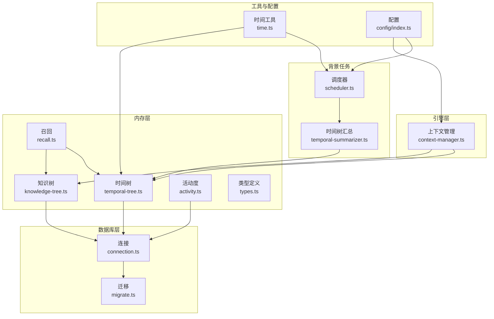
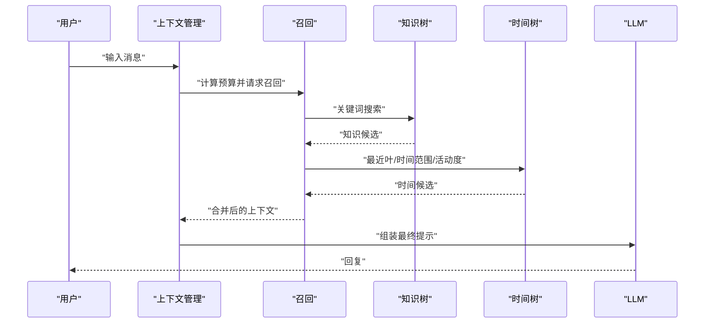
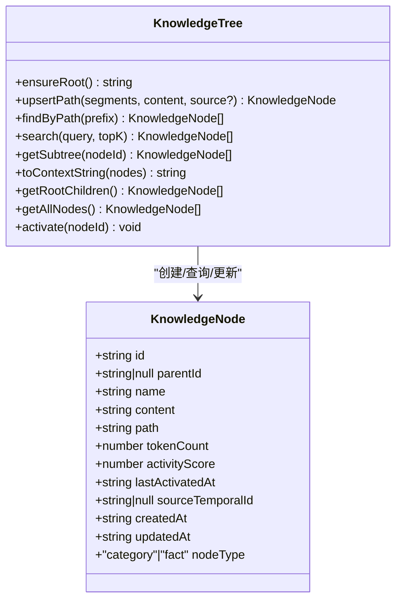
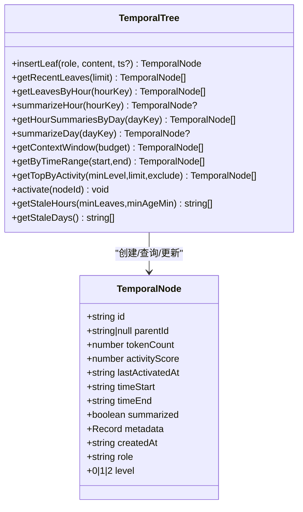
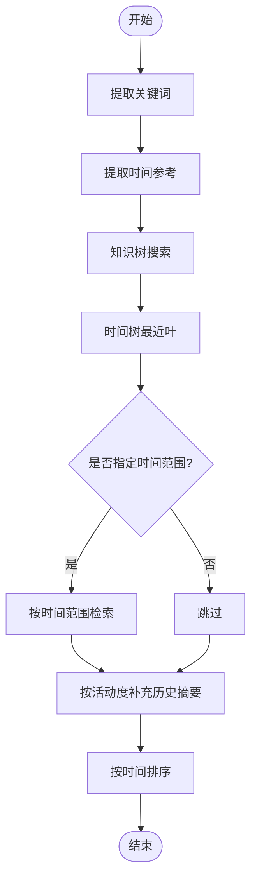
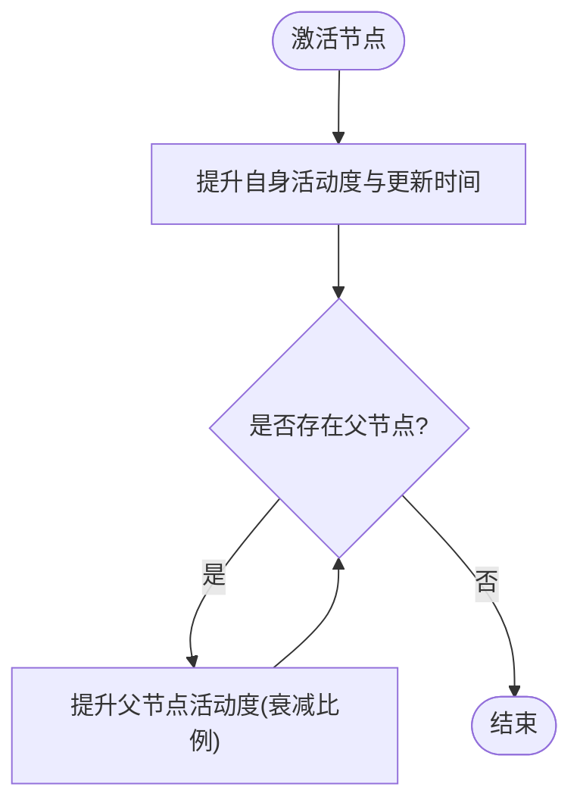
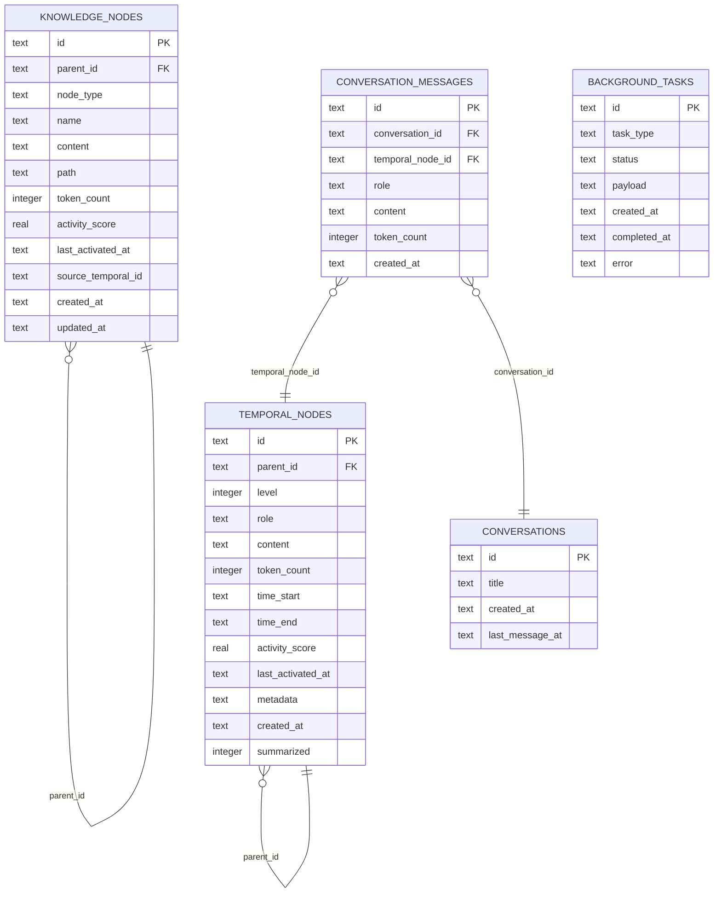
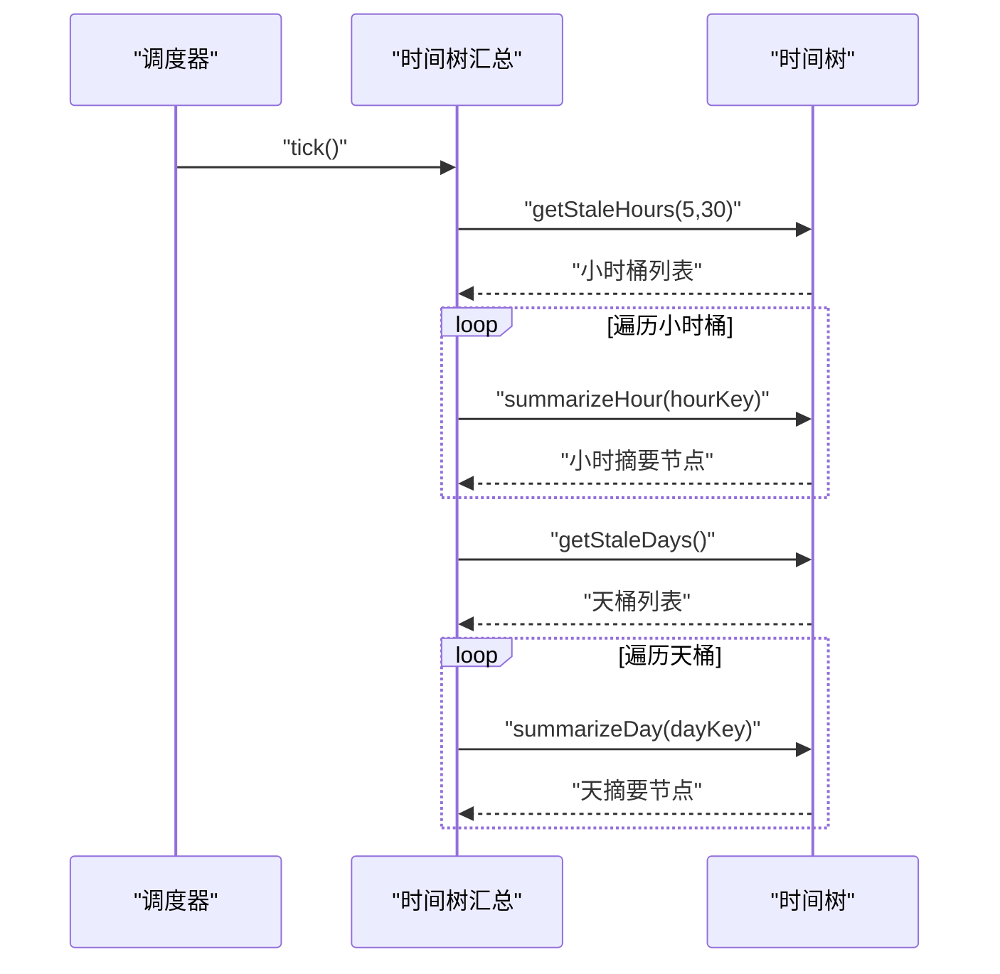
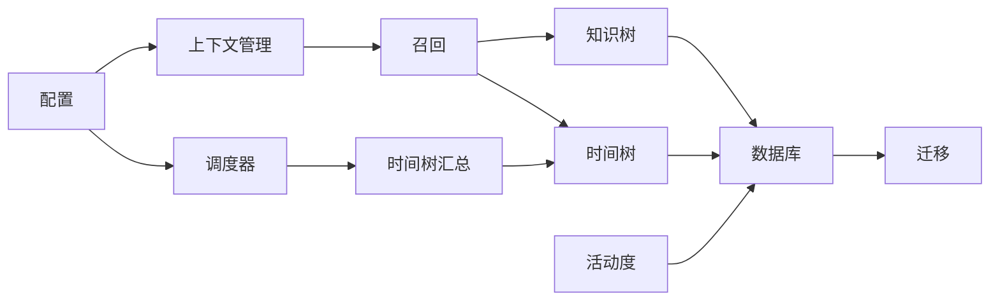

# 双树记忆架构

<cite>
**本文引用的文件**
- [src/memory/knowledge-tree.ts](file://src/memory/knowledge-tree.ts)
- [src/memory/temporal-tree.ts](file://src/memory/temporal-tree.ts)
- [src/memory/types.ts](file://src/memory/types.ts)
- [src/memory/recall.ts](file://src/memory/recall.ts)
- [src/memory/activity.ts](file://src/memory/activity.ts)
- [src/engine/context-manager.ts](file://src/engine/context-manager.ts)
- [src/db/connection.ts](file://src/db/connection.ts)
- [src/db/migrate.ts](file://src/db/migrate.ts)
- [src/utils/time.ts](file://src/utils/time.ts)
- [src/config/index.ts](file://src/config/index.ts)
- [src/background/scheduler.ts](file://src/background/scheduler.ts)
- [src/background/temporal-summarizer.ts](file://src/background/temporal-summarizer.ts)
- [tests/memory/knowledge-tree.test.ts](file://tests/memory/knowledge-tree.test.ts)
- [tests/memory/temporal-tree.test.ts](file://tests/memory/temporal-tree.test.ts)
</cite>

## 目录
1. [简介](#简介)
2. [项目结构](#项目结构)
3. [核心组件](#核心组件)
4. [架构总览](#架构总览)
5. [详细组件分析](#详细组件分析)
6. [依赖关系分析](#依赖关系分析)
7. [性能考量](#性能考量)
8. [故障排查指南](#故障排查指南)
9. [结论](#结论)
10. [附录](#附录)

## 简介
本技术文档围绕 TreeMemory 的“双树记忆架构”展开，系统通过两条独立但协同的记忆树实现长期记忆管理：
- 知识树：以层级路径组织结构化语义知识，支持分类节点与事实节点，提供路径索引与内容存储策略，便于检索与上下文拼接。
- 时间树：以时间序列管理对话历史，采用多级摘要（小时、天）压缩旧历史，提供时间窗口检索与上下文预算填充。

双树架构通过统一的召回流程整合两类记忆，结合活动度评分与时间衰减，实现高效、可扩展且具备一致性的长期记忆。

## 项目结构
- 内存层（memory）：知识树、时间树、召回与活动度模块，以及类型定义。
- 引擎层（engine）：上下文组装与提示构建。
- 数据库层（db）：连接与迁移。
- 背景任务（background）：调度器与时间树滚动汇总。
- 工具与配置（utils/config）：时间工具、配置读取。
- 测试（tests）：覆盖知识树与时间树的核心行为。

图表来源
- [src/memory/knowledge-tree.ts:1-239](file://src/memory/knowledge-tree.ts#L1-L239)
- [src/memory/temporal-tree.ts:1-362](file://src/memory/temporal-tree.ts#L1-L362)
- [src/memory/recall.ts:1-168](file://src/memory/recall.ts#L1-L168)
- [src/memory/activity.ts:1-51](file://src/memory/activity.ts#L1-L51)
- [src/engine/context-manager.ts:1-105](file://src/engine/context-manager.ts#L1-L105)
- [src/db/connection.ts:1-26](file://src/db/connection.ts#L1-L26)
- [src/db/migrate.ts:1-88](file://src/db/migrate.ts#L1-L88)
- [src/background/scheduler.ts:1-46](file://src/background/scheduler.ts#L1-L46)
- [src/background/temporal-summarizer.ts:1-34](file://src/background/temporal-summarizer.ts#L1-L34)
- [src/utils/time.ts:1-60](file://src/utils/time.ts#L1-L60)
- [src/config/index.ts:1-30](file://src/config/index.ts#L1-L30)

章节来源
- [src/memory/knowledge-tree.ts:1-239](file://src/memory/knowledge-tree.ts#L1-L239)
- [src/memory/temporal-tree.ts:1-362](file://src/memory/temporal-tree.ts#L1-L362)
- [src/memory/types.ts:1-33](file://src/memory/types.ts#L1-L33)
- [src/db/migrate.ts:1-88](file://src/db/migrate.ts#L1-L88)

## 核心组件
- 知识树（Knowledge Tree）
  - 设计理念：以“根节点 -> 分类节点 -> 事实节点”的层级路径组织结构化语义知识，路径即索引，便于按主题检索与上下文拼接。
  - 关键功能：路径写入（自动创建分类节点）、事实更新、路径查询、全文检索（基于关键词与活动度重排）、子树获取、上下文格式化、根节点子节点浏览。
- 时间树（Temporal Tree）
  - 设计理念：以时间维度分层（叶消息、小时摘要、天摘要），通过 LLM 摘要压缩旧历史，优先返回近期未摘要的高相关性片段。
  - 关键功能：插入叶节点、最近叶检索、按小时/天聚合、小时与天摘要生成、时间窗口检索、活动度优先的历史摘要填充、过期小时/天识别。
- 统一召回（Recall）
  - 将知识树与时间树的上下文按预算与优先级组合，先知识后时间，再按活动度补充历史摘要。
- 上下文管理（Context Manager）
  - 计算可用预算、组装最终提示（系统提示+知识上下文+历史摘要+缓冲区消息），并支持对早期对话进行内联摘要。
- 活动度与时间衰减（Activity）
  - 提供有效活动度计算与节点激活传播（含祖先衰减），用于排序与权重调整。
- 数据库与迁移（DB/Migrate）
  - 定义知识树与时间树表结构、索引与外键约束，确保查询性能与一致性。
- 配置与调度（Config/Scheduler）
  - 控制上下文上限、摘要阈值、数据库路径、后台轮询间隔、活动衰减率与增益等参数；后台定时触发时间树滚动汇总与知识抽取。

章节来源
- [src/memory/knowledge-tree.ts:27-239](file://src/memory/knowledge-tree.ts#L27-L239)
- [src/memory/temporal-tree.ts:27-362](file://src/memory/temporal-tree.ts#L27-L362)
- [src/memory/recall.ts:95-168](file://src/memory/recall.ts#L95-L168)
- [src/engine/context-manager.ts:53-105](file://src/engine/context-manager.ts#L53-L105)
- [src/memory/activity.ts:9-51](file://src/memory/activity.ts#L9-L51)
- [src/db/migrate.ts:4-88](file://src/db/migrate.ts#L4-L88)
- [src/config/index.ts:18-30](file://src/config/index.ts#L18-L30)
- [src/background/scheduler.ts:26-46](file://src/background/scheduler.ts#L26-L46)

## 架构总览
双树架构通过“召回-组装-执行”的闭环协作实现长期记忆：
- 召回阶段：根据用户输入提取关键词与时间参考，分别从知识树与时间树获取候选上下文。
- 组装阶段：按预算与优先级组合知识上下文与时间上下文，生成最终提示。
- 执行阶段：调用 LLM 生成回复，期间通过活动度与时间衰减维持上下文相关性。

图表来源
- [src/engine/context-manager.ts:53-105](file://src/engine/context-manager.ts#L53-L105)
- [src/memory/recall.ts:95-168](file://src/memory/recall.ts#L95-L168)
- [src/memory/knowledge-tree.ts:138-164](file://src/memory/knowledge-tree.ts#L138-L164)
- [src/memory/temporal-tree.ts:222-283](file://src/memory/temporal-tree.ts#L222-L283)

## 详细组件分析

### 知识树设计与实现
- 节点类型与路径
  - 分类节点：非叶子节点，仅作为路径容器，不承载内容。
  - 事实节点：叶子节点，承载具体语义内容。
  - 路径索引：使用“Root/{Segment1}/{Segment2}/...”的层级路径，便于 LIKE 查询与子树遍历。
- 写入与更新
  - upsertPath：沿路径逐级创建分类节点，最后创建或更新事实节点；更新时同时更新 token 数与来源时间树 ID。
- 查询与检索
  - findByPath：基于路径前缀匹配，返回有序子树。
  - search：按关键词在名称与内容中模糊匹配，先粗排再按有效活动度重排，限制输出数量。
- 上下文拼接
  - toContextString：将节点列表格式化为人类可读的上下文文本，支持缩进与标题。
- 可视化类图

图表来源
- [src/memory/knowledge-tree.ts:10-25](file://src/memory/knowledge-tree.ts#L10-L25)
- [src/memory/knowledge-tree.ts:55-120](file://src/memory/knowledge-tree.ts#L55-L120)
- [src/memory/knowledge-tree.ts:125-133](file://src/memory/knowledge-tree.ts#L125-L133)
- [src/memory/knowledge-tree.ts:138-164](file://src/memory/knowledge-tree.ts#L138-L164)
- [src/memory/knowledge-tree.ts:169-183](file://src/memory/knowledge-tree.ts#L169-L183)
- [src/memory/knowledge-tree.ts:188-202](file://src/memory/knowledge-tree.ts#L188-L202)
- [src/memory/knowledge-tree.ts:214-227](file://src/memory/knowledge-tree.ts#L214-L227)
- [src/memory/knowledge-tree.ts:232-239](file://src/memory/knowledge-tree.ts#L232-L239)

章节来源
- [src/memory/knowledge-tree.ts:27-239](file://src/memory/knowledge-tree.ts#L27-L239)
- [src/memory/types.ts:20-26](file://src/memory/types.ts#L20-L26)

### 时间树设计与实现
- 层级与摘要
  - 叶节点（level=0）：单条消息或命令，记录角色与内容。
  - 小时摘要（level=1）：对同一小时内的叶节点进行 LLM 摘要。
  - 天摘要（level=2）：对同一天内所有小时摘要进行 LLM 汇总。
- 插入与检索
  - insertLeaf：插入叶节点，设置时间边界与初始活动度。
  - getRecentLeaves：返回近期未摘要的叶节点（按时间升序）。
  - getLeavesByHour / getHourSummariesByDay：按时间桶检索。
  - summarizeHour / summarizeDay：生成摘要并标记父节点。
- 上下文窗口与时间范围
  - getContextWindow：按预算优先返回最近叶、小时摘要、天摘要，避免与最近叶重叠。
  - getByTimeRange：返回指定时间范围内的节点，按层级与时间排序。
- 过期检测
  - getStaleHours：筛选满足“足够多未摘要叶且足够老”的小时。
  - getStaleDays：筛选满足“当日所有小时摘要存在且未被天摘要”的天。
- 可视化类图

图表来源
- [src/memory/temporal-tree.ts:9-25](file://src/memory/temporal-tree.ts#L9-L25)
- [src/memory/temporal-tree.ts:30-61](file://src/memory/temporal-tree.ts#L30-L61)
- [src/memory/temporal-tree.ts:66-75](file://src/memory/temporal-tree.ts#L66-L75)
- [src/memory/temporal-tree.ts:80-90](file://src/memory/temporal-tree.ts#L80-L90)
- [src/memory/temporal-tree.ts:96-146](file://src/memory/temporal-tree.ts#L96-L146)
- [src/memory/temporal-tree.ts:151-216](file://src/memory/temporal-tree.ts#L151-L216)
- [src/memory/temporal-tree.ts:222-283](file://src/memory/temporal-tree.ts#L222-L283)
- [src/memory/temporal-tree.ts:288-296](file://src/memory/temporal-tree.ts#L288-L296)
- [src/memory/temporal-tree.ts:301-314](file://src/memory/temporal-tree.ts#L301-L314)
- [src/memory/temporal-tree.ts:326-357](file://src/memory/temporal-tree.ts#L326-L357)

章节来源
- [src/memory/temporal-tree.ts:1-362](file://src/memory/temporal-tree.ts#L1-L362)
- [src/memory/types.ts:11-18](file://src/memory/types.ts#L11-L18)

### 召回与上下文组装
- 召回流程
  - 知识树：关键词检索，按有效活动度重排，优先返回高相关知识。
  - 时间树：先返回最近叶（高相关），再按时间参考检索特定日期范围，最后按活动度补充历史摘要。
- 上下文组装
  - 计算系统提示、知识上下文、历史摘要与当前缓冲区的总 token 预算，动态裁剪以适配模型上下文长度。
- 可视化流程图

图表来源
- [src/memory/recall.ts:95-168](file://src/memory/recall.ts#L95-L168)
- [src/engine/context-manager.ts:53-105](file://src/engine/context-manager.ts#L53-L105)

章节来源
- [src/memory/recall.ts:1-168](file://src/memory/recall.ts#L1-L168)
- [src/engine/context-manager.ts:1-105](file://src/engine/context-manager.ts#L1-L105)

### 活动度与时间衰减
- 有效活动度：随天数指数衰减，保证近期节点在排序中占优。
- 节点激活：提升自身与祖先节点的活动度，并更新最近激活时间，用于后续重排与统计。

图表来源
- [src/memory/activity.ts:18-50](file://src/memory/activity.ts#L18-L50)

章节来源
- [src/memory/activity.ts:1-51](file://src/memory/activity.ts#L1-L51)

### 数据模型与SQL查询逻辑
- 表结构与索引
  - 知识树表：主键 id，父节点外键，节点类型（category/fact），路径索引，活动度与时间字段，来源时间树 ID。
  - 时间树表：主键 id，父节点外键，层级（0/1/2），角色，时间边界，摘要标记，元数据 JSON，活动度与时间字段。
  - 对应索引：父子关系、层级+时间、层级+摘要、活动度降序、路径前缀等。
- 典型查询模式
  - 知识树：路径 LIKE 前缀匹配、按活动度降序、按路径排序；upsert 时按父节点与名称查找唯一性。
  - 时间树：按层级与时间范围检索、按活动度降序、按最近叶优先、按小时/天分组统计过期桶。
- 数据库初始化与迁移

图表来源
- [src/db/migrate.ts:10-81](file://src/db/migrate.ts#L10-L81)

章节来源
- [src/db/migrate.ts:1-88](file://src/db/migrate.ts#L1-L88)
- [src/db/connection.ts:8-26](file://src/db/connection.ts#L8-L26)

### 背景调度与时间树滚动汇总
- 调度器：周期性触发，避免重入，串行执行时间树滚动与知识抽取。
- 滚动汇总：识别过期小时与过期天，自底向上生成小时摘要与天摘要，减少 LLM 调用成本与上下文负担。

图表来源
- [src/background/scheduler.ts:9-34](file://src/background/scheduler.ts#L9-L34)
- [src/background/temporal-summarizer.ts:9-34](file://src/background/temporal-summarizer.ts#L9-L34)
- [src/memory/temporal-tree.ts:326-357](file://src/memory/temporal-tree.ts#L326-L357)
- [src/memory/temporal-tree.ts:146-216](file://src/memory/temporal-tree.ts#L146-L216)

章节来源
- [src/background/scheduler.ts:1-46](file://src/background/scheduler.ts#L1-L46)
- [src/background/temporal-summarizer.ts:1-34](file://src/background/temporal-summarizer.ts#L1-L34)

## 依赖关系分析
- 组件耦合
  - 知识树与时间树均依赖数据库连接与迁移脚本，共享活动度模块。
  - 召回模块同时依赖两棵记忆树，上下文管理模块依赖召回结果与配置。
  - 背景调度器驱动时间树汇总，间接影响时间树的可检索性与质量。
- 外部依赖
  - better-sqlite3：本地嵌入式数据库，WAL 模式与外键启用。
  - OpenAI/GPT Tokenizer：LLM 接口与 token 计数。
  - ULID：全局唯一标识符生成。

图表来源
- [src/config/index.ts:18-30](file://src/config/index.ts#L18-L30)
- [src/engine/context-manager.ts:1-105](file://src/engine/context-manager.ts#L1-L105)
- [src/memory/recall.ts:1-168](file://src/memory/recall.ts#L1-L168)
- [src/memory/knowledge-tree.ts:1-239](file://src/memory/knowledge-tree.ts#L1-L239)
- [src/memory/temporal-tree.ts:1-362](file://src/memory/temporal-tree.ts#L1-L362)
- [src/memory/activity.ts:1-51](file://src/memory/activity.ts#L1-L51)
- [src/db/connection.ts:8-26](file://src/db/connection.ts#L8-L26)
- [src/db/migrate.ts:4-88](file://src/db/migrate.ts#L4-L88)
- [src/background/scheduler.ts:26-46](file://src/background/scheduler.ts#L26-L46)
- [src/background/temporal-summarizer.ts:9-34](file://src/background/temporal-summarizer.ts#L9-L34)

章节来源
- [src/config/index.ts:1-30](file://src/config/index.ts#L1-L30)
- [src/db/connection.ts:1-26](file://src/db/connection.ts#L1-L26)
- [src/db/migrate.ts:1-88](file://src/db/migrate.ts#L1-L88)

## 性能考量
- 索引与查询
  - 知识树：路径前缀 LIKE 查询配合路径索引；活动度降序索引用于快速重排。
  - 时间树：层级+时间、层级+摘要、活动度索引，支持高效的时间范围与优先级检索。
- Token 预算与裁剪
  - 上下文管理模块动态计算可用预算，避免超出模型上下文上限；时间树优先返回最近叶，其次小时摘要，最后天摘要，兼顾相关性与成本。
- 摘要策略
  - 通过小时与天摘要降低旧历史的 token 占比，显著减少 LLM 调用次数与延迟。
- 活动度衰减
  - 随时间衰减的活动度避免热点节点长期占用排序优势，提升整体检索公平性。

## 故障排查指南
- 常见问题
  - 数据库未初始化：确认迁移脚本已执行，检查表与索引是否存在。
  - 路径写入异常：检查 upsertPath 的路径段是否为空，确保根节点存在。
  - 时间树汇总失败：检查过期小时/天的判定条件与 LLM 接口可用性。
  - 回忆结果为空：检查关键词提取与时间参考解析，确认预算分配合理。
- 排查步骤
  - 启用日志，观察调度器 tick 与汇总过程中的错误信息。
  - 使用测试用例验证知识树与时间树的关键行为（如 upsert、最近叶、上下文窗口）。
  - 检查配置项（最大上下文、摘要阈值、衰减率、增益）是否符合预期。

章节来源
- [src/db/migrate.ts:4-88](file://src/db/migrate.ts#L4-L88)
- [src/background/scheduler.ts:9-21](file://src/background/scheduler.ts#L9-L21)
- [src/background/temporal-summarizer.ts:9-34](file://src/background/temporal-summarizer.ts#L9-L34)
- [tests/memory/knowledge-tree.test.ts:51-135](file://tests/memory/knowledge-tree.test.ts#L51-L135)
- [tests/memory/temporal-tree.test.ts:56-119](file://tests/memory/temporal-tree.test.ts#L56-L119)

## 结论
双树记忆架构通过“结构化知识树 + 时间序列时间树”的互补设计，在保证检索准确性的同时，实现了对长期对话历史的高效压缩与可控访问。统一的召回与上下文组装流程，结合活动度与时间衰减策略，使系统能够在有限的上下文预算内持续提供高质量的交互体验。背景调度与摘要机制进一步降低了运行成本，提升了可扩展性。

## 附录
- 代码示例路径（不含具体代码内容）
  - 创建知识树路径：[upsertPath:55-120](file://src/memory/knowledge-tree.ts#L55-L120)
  - 查询知识树路径：[findByPath:125-133](file://src/memory/knowledge-tree.ts#L125-L133)
  - 搜索知识树：[search:138-164](file://src/memory/knowledge-tree.ts#L138-L164)
  - 获取时间树最近叶：[getRecentLeaves:66-75](file://src/memory/temporal-tree.ts#L66-L75)
  - 按小时汇总：[summarizeHour:96-146](file://src/memory/temporal-tree.ts#L96-L146)
  - 按天汇总：[summarizeDay:166-216](file://src/memory/temporal-tree.ts#L166-L216)
  - 获取时间上下文窗口：[getContextWindow:222-283](file://src/memory/temporal-tree.ts#L222-L283)
  - 统一召回：[recall:95-168](file://src/memory/recall.ts#L95-L168)
  - 组装最终提示：[assemblePrompt:53-92](file://src/engine/context-manager.ts#L53-L92)
  - 激活节点（知识/时间）：[activateNode:18-50](file://src/memory/activity.ts#L18-L50)
  - 数据库连接与迁移：[getDb:8-17](file://src/db/connection.ts#L8-L17)、[runMigrations:4-88](file://src/db/migrate.ts#L4-L88)