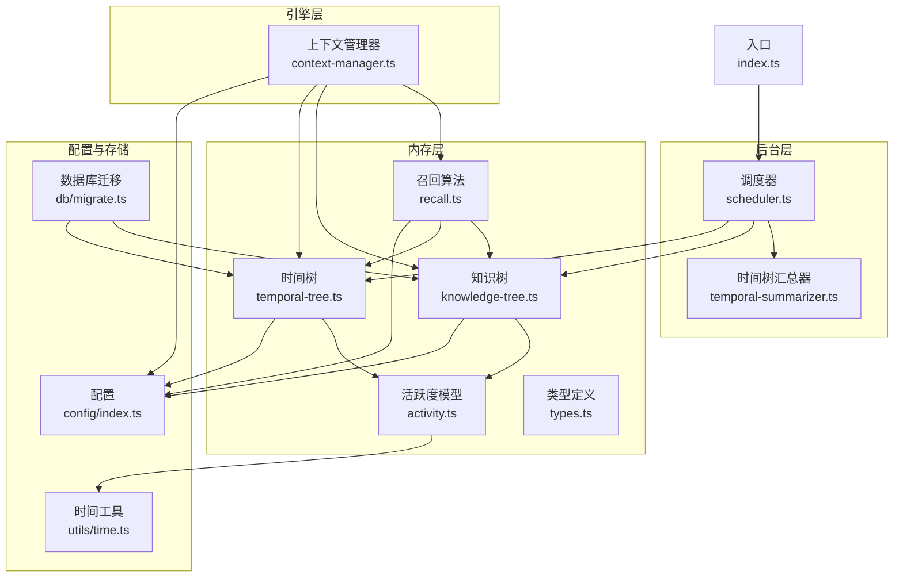
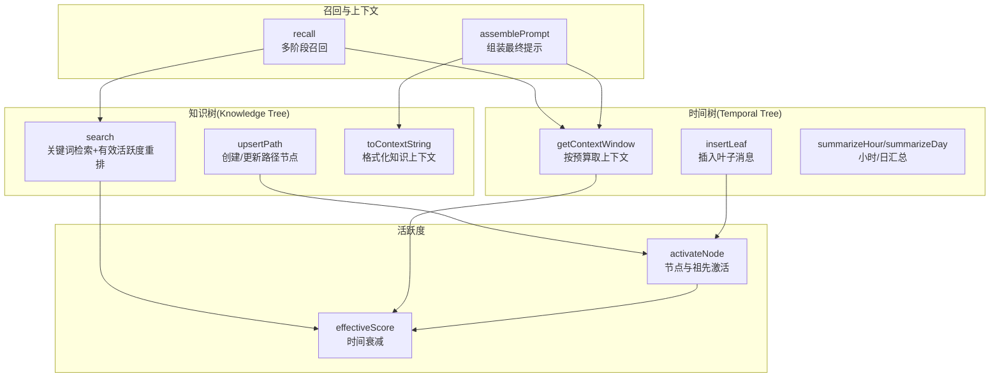
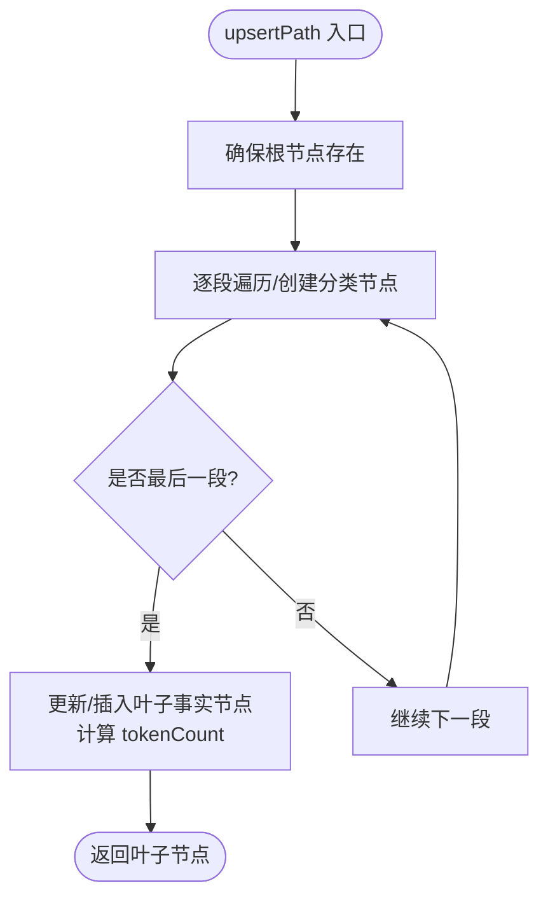
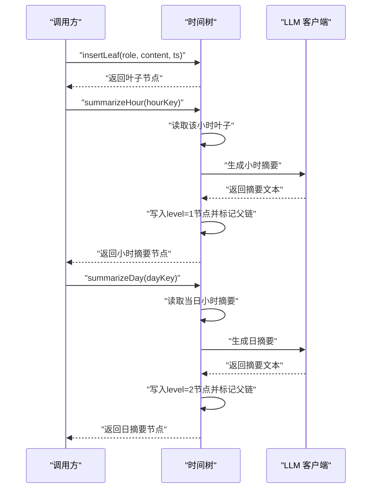
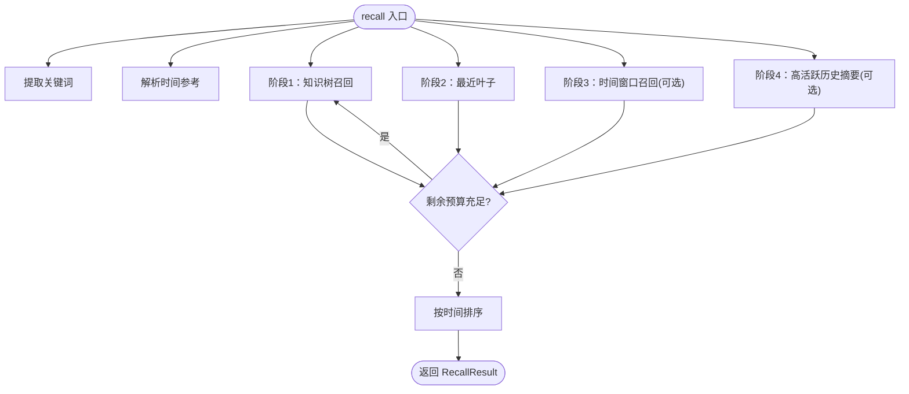
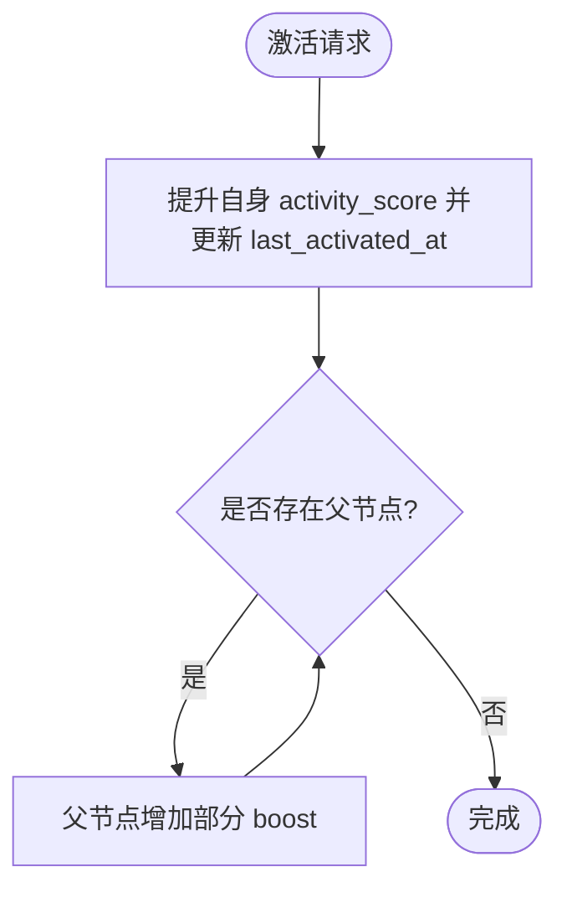
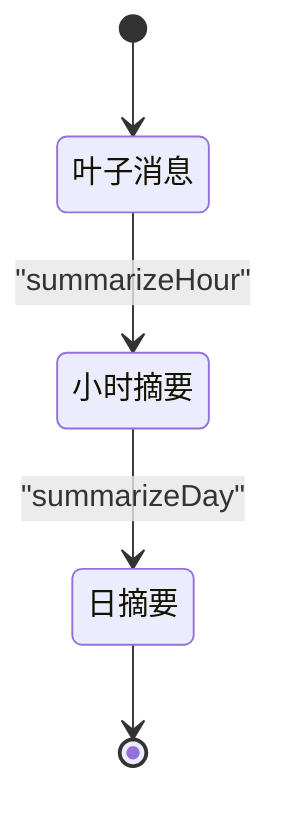
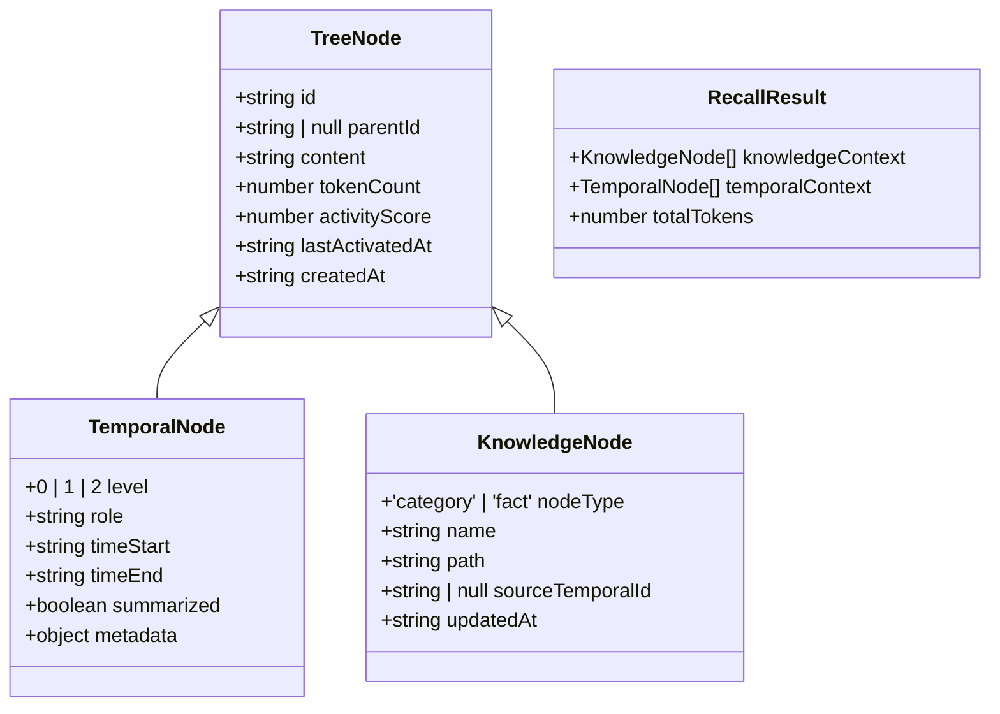
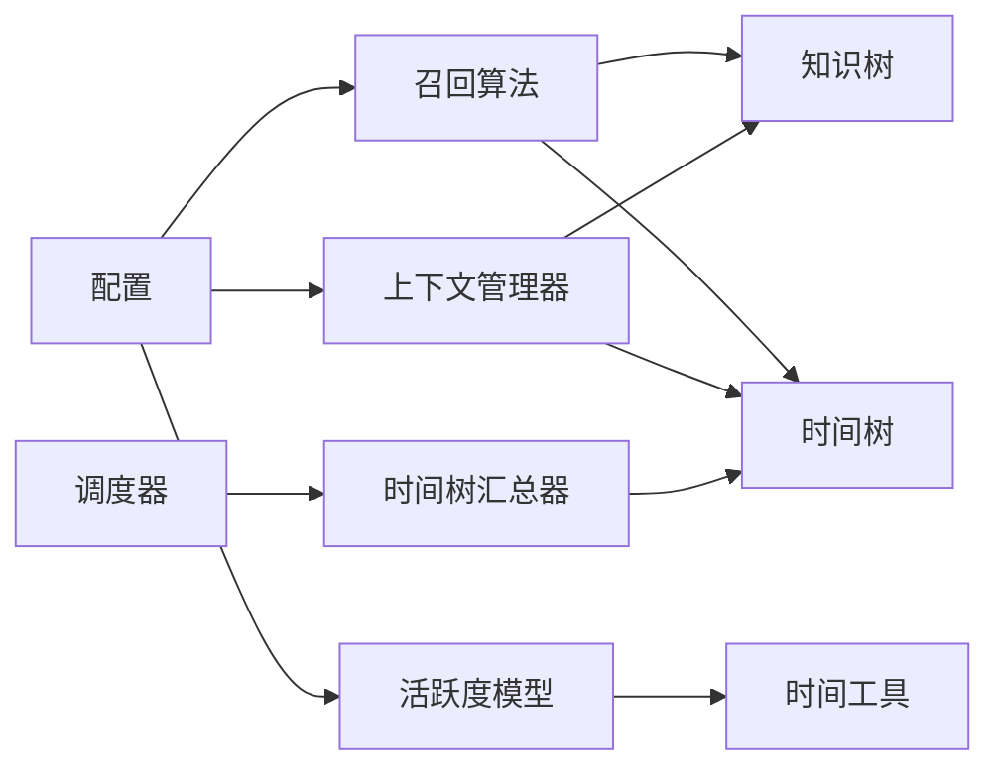

# 核心概念

<cite>
**本文引用的文件**
- [src/memory/knowledge-tree.ts](file://src/memory/knowledge-tree.ts)
- [src/memory/temporal-tree.ts](file://src/memory/temporal-tree.ts)
- [src/memory/recall.ts](file://src/memory/recall.ts)
- [src/memory/activity.ts](file://src/memory/activity.ts)
- [src/memory/types.ts](file://src/memory/types.ts)
- [src/config/index.ts](file://src/config/index.ts)
- [src/db/migrate.ts](file://src/db/migrate.ts)
- [src/utils/time.ts](file://src/utils/time.ts)
- [src/background/scheduler.ts](file://src/background/scheduler.ts)
- [src/background/temporal-summarizer.ts](file://src/background/temporal-summarizer.ts)
- [src/engine/context-manager.ts](file://src/engine/context-manager.ts)
- [src/index.ts](file://src/index.ts)
- [tests/memory/knowledge-tree.test.ts](file://tests/memory/knowledge-tree.test.ts)
- [tests/memory/recall.test.ts](file://tests/memory/recall.test.ts)
</cite>

## 目录
1. [引言](#引言)
2. [项目结构](#项目结构)
3. [核心组件](#核心组件)
4. [架构总览](#架构总览)
5. [详细组件分析](#详细组件分析)
6. [依赖分析](#依赖分析)
7. [性能考虑](#性能考虑)
8. [故障排查指南](#故障排查指南)
9. [结论](#结论)
10. [附录](#附录)

## 引言
本文件面向 TreeMemory 的核心概念，系统性阐述“双树记忆架构”的设计理念与实现原理，涵盖知识树与时间树的数据结构、活跃度衰减模型、多阶段记忆召回算法、记忆节点生命周期管理，以及性能优化与最佳实践。文档通过分层讲解与可视化图示，帮助开发者快速理解各模块间的交互关系与数据流。

## 项目结构
TreeMemory 采用按功能域分层的组织方式：内存层负责知识树与时间树、召回与活跃度；引擎层负责上下文组装与预算计算；后台层负责周期性汇总与知识抽取；配置层统一管理参数；数据库层提供持久化与迁移；工具层提供时间与日志等通用能力。

图表来源
- [src/index.ts:1-36](file://src/index.ts#L1-L36)
- [src/background/scheduler.ts:1-46](file://src/background/scheduler.ts#L1-L46)
- [src/background/temporal-summarizer.ts:1-34](file://src/background/temporal-summarizer.ts#L1-L34)
- [src/memory/knowledge-tree.ts:1-239](file://src/memory/knowledge-tree.ts#L1-L239)
- [src/memory/temporal-tree.ts:1-362](file://src/memory/temporal-tree.ts#L1-L362)
- [src/memory/recall.ts:1-168](file://src/memory/recall.ts#L1-L168)
- [src/memory/activity.ts:1-51](file://src/memory/activity.ts#L1-L51)
- [src/engine/context-manager.ts:1-105](file://src/engine/context-manager.ts#L1-L105)
- [src/config/index.ts:1-30](file://src/config/index.ts#L1-L30)
- [src/db/migrate.ts:1-88](file://src/db/migrate.ts#L1-L88)
- [src/utils/time.ts:1-60](file://src/utils/time.ts#L1-L60)

章节来源
- [src/index.ts:1-36](file://src/index.ts#L1-L36)
- [src/db/migrate.ts:1-88](file://src/db/migrate.ts#L1-L88)

## 核心组件
- 知识树：基于路径的分类与事实节点，支持路径级 upsert、子树查询、关键词检索与上下文格式化。
- 时间树：基于时间层级的叶子、小时与日摘要节点，支持最近叶子检索、按时间窗口取数、多级汇总与上下文预算填充。
- 召回算法：多阶段融合检索，结合关键词、近期上下文、时间范围与高活跃历史摘要，严格控制 Token 预算。
- 活跃度模型：时间衰减与节点激活传播，用于排序与优先级控制。
- 上下文管理器：根据预算动态组装最终提示词，含知识上下文、历史摘要与对话缓冲区。
- 后台调度：周期性触发时间树汇总与知识抽取，维持长期记忆的可维护性与容量平衡。

章节来源
- [src/memory/knowledge-tree.ts:1-239](file://src/memory/knowledge-tree.ts#L1-L239)
- [src/memory/temporal-tree.ts:1-362](file://src/memory/temporal-tree.ts#L1-L362)
- [src/memory/recall.ts:1-168](file://src/memory/recall.ts#L1-L168)
- [src/memory/activity.ts:1-51](file://src/memory/activity.ts#L1-L51)
- [src/engine/context-manager.ts:1-105](file://src/engine/context-manager.ts#L1-L105)
- [src/background/scheduler.ts:1-46](file://src/background/scheduler.ts#L1-L46)
- [src/background/temporal-summarizer.ts:1-34](file://src/background/temporal-summarizer.ts#L1-L34)

## 架构总览
双树记忆架构将“语义知识”与“时序对话”分离建模，分别由知识树与时间树承载，并通过召回与上下文管理器进行融合。活跃度模型贯穿两类树，作为统一的排序与优先级依据。后台任务负责周期性汇总，降低长期上下文的 Token 负担。

图表来源
- [src/memory/knowledge-tree.ts:55-164](file://src/memory/knowledge-tree.ts#L55-L164)
- [src/memory/temporal-tree.ts:30-283](file://src/memory/temporal-tree.ts#L30-L283)
- [src/memory/recall.ts:95-167](file://src/memory/recall.ts#L95-L167)
- [src/memory/activity.ts:9-50](file://src/memory/activity.ts#L9-L50)
- [src/engine/context-manager.ts:53-104](file://src/engine/context-manager.ts#L53-L104)

## 详细组件分析

### 知识树：路径驱动的语义记忆
- 数据结构与路径建模
  - 根节点固定存在，路径以“/”连接，叶子节点为事实，中间节点为分类。
  - upsertPath 沿路径创建分类节点并在末级创建或更新事实节点，同时记录 tokenCount 与活动分数。
- 查询与排序
  - findByPath 支持路径前缀检索；search 基于关键词 LIKE 查询并按有效活跃度二次重排。
- 上下文生成
  - toContextString 将节点序列格式化为带缩进的 Markdown 片段，便于注入系统提示。
- 生命周期与激活
  - activate 提升节点活跃度并向上游祖先传播部分增益，配合时间衰减参与排序。

图表来源
- [src/memory/knowledge-tree.ts:55-120](file://src/memory/knowledge-tree.ts#L55-L120)

章节来源
- [src/memory/knowledge-tree.ts:1-239](file://src/memory/knowledge-tree.ts#L1-L239)
- [src/db/migrate.ts:31-49](file://src/db/migrate.ts#L31-L49)

### 时间树：层级化的时序记忆
- 层级与节点
  - level=0 叶子（单条消息/命令），level=1 小时摘要，level=2 日摘要；每个节点记录 time_start/time_end 与 tokenCount。
- 最近上下文与时间窗口
  - getRecentLeaves 返回最近未汇总的叶子；getContextWindow 按预算优先取最近叶子，再取小时摘要，最后取日摘要，避免与最近叶子重叠。
- 汇总策略
  - summarizeHour 对小时桶内的叶子调用 LLM 生成摘要并标记父链；summarizeDay 对当日所有小时摘要进行日级汇总。
- 活跃度与过期
  - getStaleHours 与 getStaleDays 识别可汇总的时间段，配合后台任务自动推进。

图表来源
- [src/memory/temporal-tree.ts:30-216](file://src/memory/temporal-tree.ts#L30-L216)

章节来源
- [src/memory/temporal-tree.ts:1-362](file://src/memory/temporal-tree.ts#L1-L362)
- [src/db/migrate.ts:10-29](file://src/db/migrate.ts#L10-L29)

### 多阶段记忆召回：关键词、时间与活跃度融合
- 关键词提取
  - 支持中英文停用词过滤、标点与空白切分、中文长词二gram扩展，去重后形成关键词集合。
- 时间参考解析
  - 解析“今天/昨天/前天/上周”等自然语言时间表达，转换为 ISO 时间区间。
- 召回阶段
  - 阶段1（约25%预算）：知识树搜索匹配关键词的事实节点，按 tokenCount 与剩余预算填充。
  - 阶段2（优先包含）：最近叶子无条件纳入，直至预算不足。
  - 阶段3（可选）：若存在时间参考且预算充足，按有效活跃度对指定时间窗口节点重排后填充。
  - 阶段4（兜底）：若仍有较多预算，补充高活跃的历史摘要（小时/日）。
- 上下文组装
  - 上下文管理器将知识上下文与时间摘要拼接为系统提示，再叠加对话缓冲区，形成最终提示词数组。

图表来源
- [src/memory/recall.ts:95-167](file://src/memory/recall.ts#L95-L167)

章节来源
- [src/memory/recall.ts:1-168](file://src/memory/recall.ts#L1-L168)
- [src/engine/context-manager.ts:53-104](file://src/engine/context-manager.ts#L53-L104)

### 活跃度衰减模型：时间衰减与激活传播
- 有效活跃度
  - effectiveScore 使用指数衰减函数，以天为单位计算自上次激活以来的衰减值，使较新的节点在排序中更优。
- 节点激活
  - activateNode 对目标节点与祖先节点分别施加 boost，祖先获得较小比例的增益，形成“涟漪效应”，提升相关路径的整体权重。
- 参数来源
  - activityDecayRate 与 activityBoost 来自配置，影响衰减速度与激活强度。

图表来源
- [src/memory/activity.ts:18-50](file://src/memory/activity.ts#L18-L50)

章节来源
- [src/memory/activity.ts:1-51](file://src/memory/activity.ts#L1-L51)
- [src/config/index.ts:27-28](file://src/config/index.ts#L27-L28)

### 记忆节点生命周期管理：创建、更新、过期与清理
- 创建
  - upsertPath 在知识树中沿路径创建分类节点与叶子；insertLeaf 在时间树中插入叶子节点。
- 更新
  - 知识树叶子内容可更新，时间树叶子不可变但可通过汇总形成更高层节点。
- 过期与清理
  - 通过时间维度的汇总（小时/日）替代原始叶子，减少底层节点数量与 Token 占用。
  - 后台调度器定期扫描“陈旧小时/日期”并执行汇总，避免无限增长。
- 访问追踪
  - 每次访问（如召回）会激活节点及其祖先，结合时间衰减参与后续排序。

图表来源
- [src/memory/temporal-tree.ts:96-216](file://src/memory/temporal-tree.ts#L96-L216)
- [src/background/temporal-summarizer.ts:9-33](file://src/background/temporal-summarizer.ts#L9-L33)

章节来源
- [src/memory/temporal-tree.ts:1-362](file://src/memory/temporal-tree.ts#L1-L362)
- [src/background/scheduler.ts:1-46](file://src/background/scheduler.ts#L1-L46)
- [src/background/temporal-summarizer.ts:1-34](file://src/background/temporal-summarizer.ts#L1-L34)

### 类型与数据模型
- 统一节点接口 TreeNode 包含 id、parentId、content、tokenCount、activityScore、lastActivatedAt、createdAt。
- 时间树节点 TemporalNode 扩展 level、role、timeStart、timeEnd、summarized、metadata。
- 知识树节点 KnowledgeNode 扩展 nodeType、name、path、sourceTemporalId、updatedAt。
- 召回结果 RecallResult 包含知识上下文、时间上下文与总 Token 数。

图表来源
- [src/memory/types.ts:1-33](file://src/memory/types.ts#L1-L33)

章节来源
- [src/memory/types.ts:1-33](file://src/memory/types.ts#L1-L33)

## 依赖分析
- 内存层内部耦合
  - recall 同时依赖知识树与时间树；知识树与时间树共享活跃度模型与时间工具。
- 引擎层与内存层
  - context-manager 依赖 recall 结果与知识树上下文格式化；两者共同决定最终提示词结构。
- 后台层与内存层
  - scheduler 触发 temporal-summarizer，后者调用时间树的汇总接口，形成“汇总-激活-排序”的闭环。
- 配置与全局参数
  - config 提供 maxContextTokens、summarizeThresholdRatio、activityDecayRate、activityBoost 等关键参数，影响预算、阈值与衰减行为。

图表来源
- [src/config/index.ts:18-29](file://src/config/index.ts#L18-L29)
- [src/memory/recall.ts:95-167](file://src/memory/recall.ts#L95-L167)
- [src/engine/context-manager.ts:53-104](file://src/engine/context-manager.ts#L53-L104)
- [src/background/scheduler.ts:9-34](file://src/background/scheduler.ts#L9-L34)
- [src/background/temporal-summarizer.ts:9-33](file://src/background/temporal-summarizer.ts#L9-L33)
- [src/memory/activity.ts:9-50](file://src/memory/activity.ts#L9-L50)
- [src/utils/time.ts:48-59](file://src/utils/time.ts#L48-L59)

章节来源
- [src/config/index.ts:1-30](file://src/config/index.ts#L1-L30)
- [src/memory/recall.ts:1-168](file://src/memory/recall.ts#L1-L168)
- [src/engine/context-manager.ts:1-105](file://src/engine/context-manager.ts#L1-L105)
- [src/background/scheduler.ts:1-46](file://src/background/scheduler.ts#L1-L46)
- [src/background/temporal-summarizer.ts:1-34](file://src/background/temporal-summarizer.ts#L1-L34)
- [src/memory/activity.ts:1-51](file://src/memory/activity.ts#L1-L51)
- [src/utils/time.ts:1-60](file://src/utils/time.ts#L1-L60)

## 性能考虑
- Token 预算与分阶段填充
  - 召回阶段按优先级与预算上限填充，避免一次性加载过多上下文导致溢出。
  - 上下文管理器在组装提示时预留响应空间，确保 LLM 输出不会挤占预算。
- 索引与查询优化
  - 数据库为时间树与知识树建立复合索引，加速层级查询、时间范围检索与活跃度排序。
- 汇总降维
  - 通过小时/日摘要替代大量叶子节点，显著降低上下文长度与 Token 消耗。
- 活跃度与时间衰减
  - 有效活跃度抑制冷节点干扰，提高检索质量与排序效率。
- 后台批处理
  - 定时汇总减少实时计算压力，提升整体吞吐。

章节来源
- [src/engine/context-manager.ts:98-104](file://src/engine/context-manager.ts#L98-L104)
- [src/db/migrate.ts:26-49](file://src/db/migrate.ts#L26-L49)
- [src/background/temporal-summarizer.ts:9-33](file://src/background/temporal-summarizer.ts#L9-L33)

## 故障排查指南
- 召回结果为空
  - 检查关键词提取是否命中（中文分词与停用词设置）；确认时间参考解析是否正确；核对预算是否过低。
- 上下文超限
  - 调整 maxContextTokens 或降低 summmarizeThresholdRatio；检查是否有过多高 token 的叶子未被汇总。
- 汇总失败
  - 查看后台日志，确认 LLM 接口可用与凭据正确；检查数据库连接与迁移是否成功。
- 节点未激活
  - 确认 recall 是否调用了激活逻辑；检查配置中的 activityBoost 是否为正数。

章节来源
- [src/memory/recall.ts:95-167](file://src/memory/recall.ts#L95-L167)
- [src/engine/context-manager.ts:53-104](file://src/engine/context-manager.ts#L53-L104)
- [src/background/scheduler.ts:9-21](file://src/background/scheduler.ts#L9-L21)
- [src/config/index.ts:18-29](file://src/config/index.ts#L18-L29)

## 结论
TreeMemory 的双树架构以“语义-时序”两条主线协同构建长期记忆：知识树承载稳定事实，时间树承载动态对话；通过活跃度衰减与多阶段召回，实现高质量、可控成本的上下文组装；后台汇总进一步保障长期可用性。该体系在工程上具备清晰的模块边界、可扩展的参数化配置与稳健的性能表现。

## 附录
- 测试验证要点
  - 知识树：路径 upsert、更新、搜索、上下文格式化、根节点可见性。
  - 召回：关键词匹配、最近上下文、时间范围召回、预算约束。
- 建议的环境变量与默认值
  - LLM 基础地址、模型、API Key；最大上下文 Token、汇总阈值比例；数据库路径、HTTP 端口；后台轮询间隔；活跃度衰减率与增益。

章节来源
- [tests/memory/knowledge-tree.test.ts:51-134](file://tests/memory/knowledge-tree.test.ts#L51-L134)
- [tests/memory/recall.test.ts:51-94](file://tests/memory/recall.test.ts#L51-L94)
- [src/config/index.ts:18-29](file://src/config/index.ts#L18-L29)