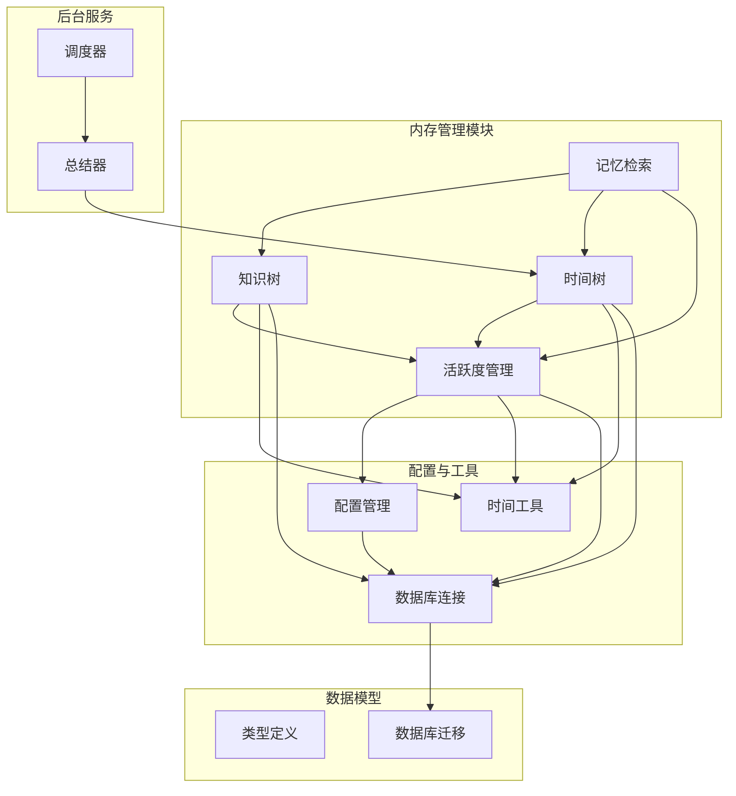
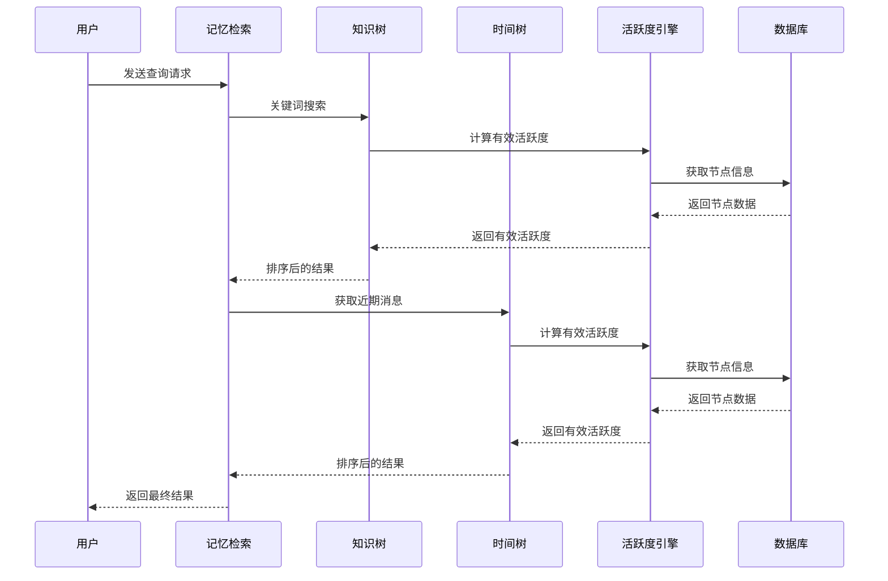
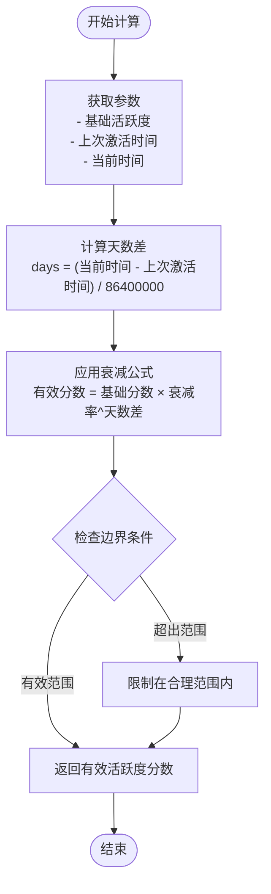
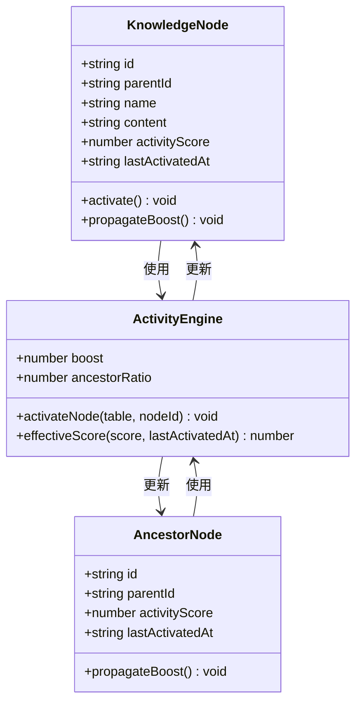
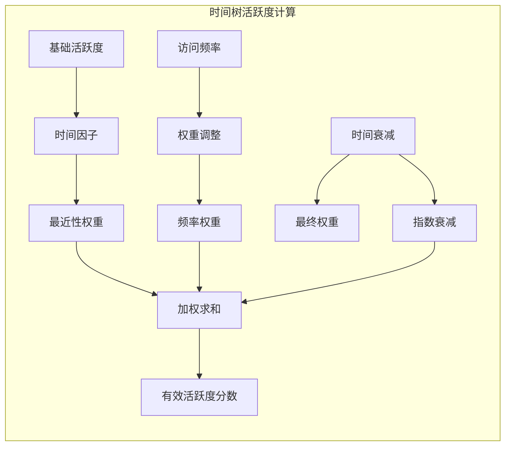
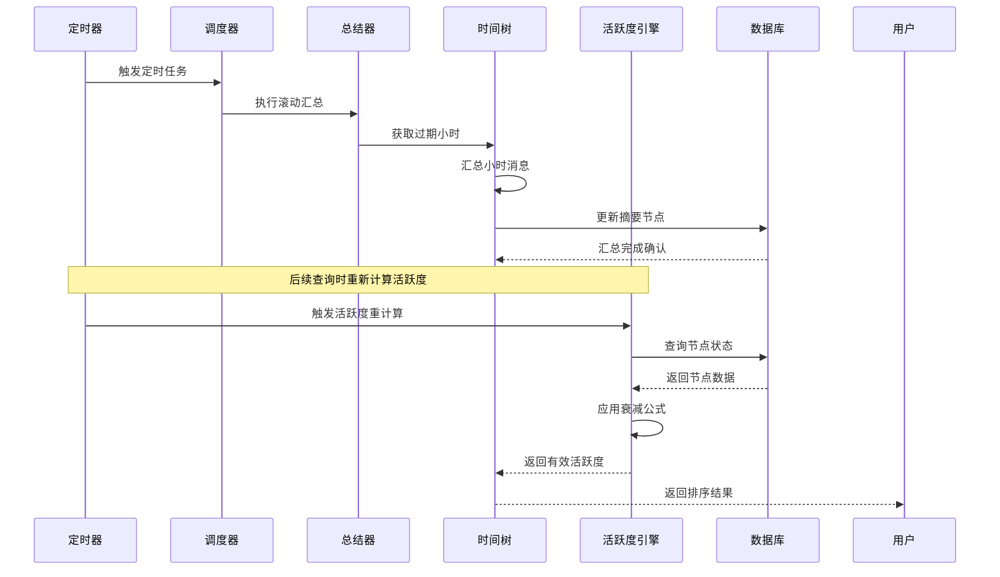
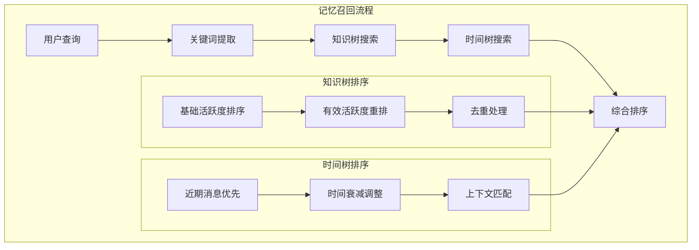
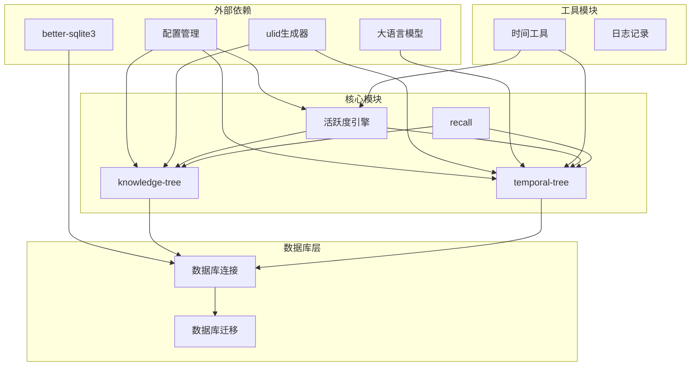

# 活跃度衰减模型

<cite>
**本文档引用的文件**
- [src/memory/activity.ts](file://src/memory/activity.ts)
- [src/memory/knowledge-tree.ts](file://src/memory/knowledge-tree.ts)
- [src/memory/temporal-tree.ts](file://src/memory/temporal-tree.ts)
- [src/memory/recall.ts](file://src/memory/recall.ts)
- [src/memory/types.ts](file://src/memory/types.ts)
- [src/config/index.ts](file://src/config/index.ts)
- [src/utils/time.ts](file://src/utils/time.ts)
- [src/db/migrate.ts](file://src/db/migrate.ts)
- [src/background/scheduler.ts](file://src/background/scheduler.ts)
- [src/background/temporal-summarizer.ts](file://src/background/temporal-summarizer.ts)
</cite>

## 目录
1. [简介](#简介)
2. [项目结构](#项目结构)
3. [核心组件](#核心组件)
4. [架构概览](#架构概览)
5. [详细组件分析](#详细组件分析)
6. [依赖关系分析](#依赖关系分析)
7. [性能考虑](#性能考虑)
8. [故障排除指南](#故障排除指南)
9. [结论](#结论)

## 简介

TreeMemory 是一个基于知识树和时间树的记忆系统，通过活跃度衰减模型实现智能的记忆检索和优先级排序。该系统的核心在于活跃度评分机制，它能够根据时间因素动态调整记忆的重要性，确保最新的、最相关的记忆在检索时具有更高的优先级。

活跃度衰减模型采用指数衰减公式，结合时间权重计算，为知识树和时间树中的节点提供动态的活跃度评分。这种设计使得系统能够：
- 自动识别和优先处理最近访问的记忆
- 渐进式地降低长期未使用的记忆重要性
- 在知识树中实现语义层次的活跃度传播
- 在时间树中实现时间维度的上下文优先级排序

## 项目结构

TreeMemory 项目采用模块化的架构设计，主要分为以下几个核心模块：

**图表来源**
- [src/memory/activity.ts:1-51](file://src/memory/activity.ts#L1-L51)
- [src/memory/knowledge-tree.ts:1-239](file://src/memory/knowledge-tree.ts#L1-L239)
- [src/memory/temporal-tree.ts:1-363](file://src/memory/temporal-tree.ts#L1-L363)
- [src/memory/recall.ts:1-168](file://src/memory/recall.ts#L1-L168)

**章节来源**
- [src/memory/activity.ts:1-51](file://src/memory/activity.ts#L1-L51)
- [src/memory/knowledge-tree.ts:1-239](file://src/memory/knowledge-tree.ts#L1-L239)
- [src/memory/temporal-tree.ts:1-363](file://src/memory/temporal-tree.ts#L1-L363)
- [src/memory/recall.ts:1-168](file://src/memory/recall.ts#L1-L168)

## 核心组件

### 活跃度计算引擎

活跃度计算引擎是整个系统的核心，负责计算和管理所有节点的活跃度评分。它提供了两个关键功能：

1. **有效活跃度分数计算**：使用指数衰减公式计算当前的有效活跃度
2. **节点激活机制**：提升节点活跃度并向上游传播

### 知识树活跃度管理

知识树中的活跃度管理具有独特的层次传播特性：
- 节点激活时，不仅提升目标节点的活跃度
- 同时向父节点传播部分活跃度（祖先比率）
- 支持语义层次的活跃度传播

### 时间树活跃度管理

时间树中的活跃度管理专注于时间维度的优先级排序：
- 最近的消息具有最高的优先级
- 小时摘要和日摘要按活跃度排序
- 支持时间范围内的精确检索

**章节来源**
- [src/memory/activity.ts:5-51](file://src/memory/activity.ts#L5-L51)
- [src/memory/knowledge-tree.ts:207-209](file://src/memory/knowledge-tree.ts#L207-L209)
- [src/memory/temporal-tree.ts:320-322](file://src/memory/temporal-tree.ts#L320-L322)

## 架构概览

TreeMemory 的活跃度衰减模型采用分层架构设计，实现了知识树和时间树的统一活跃度管理：

**图表来源**
- [src/memory/recall.ts:95-167](file://src/memory/recall.ts#L95-L167)
- [src/memory/knowledge-tree.ts:138-164](file://src/memory/knowledge-tree.ts#L138-L164)
- [src/memory/temporal-tree.ts:223-284](file://src/memory/temporal-tree.ts#L223-L284)

## 详细组件分析

### 活跃度计算核心算法

活跃度衰减模型的核心是指数衰减公式，其数学表达式为：

**有效活跃度分数 = 基础活跃度 × 衰减率^(天数差)**

其中：
- 基础活跃度：节点的原始活跃度评分
- 衰减率：由配置决定的时间衰减系数（默认0.95）
- 天数差：从上次激活到现在经过的天数

**图表来源**
- [src/memory/activity.ts:9-12](file://src/memory/activity.ts#L9-L12)
- [src/utils/time.ts:48-52](file://src/utils/time.ts#L48-L52)

#### 参数调节机制

活跃度模型的关键参数可以通过环境变量进行调节：

| 参数名 | 默认值 | 作用 | 调整建议 |
|--------|--------|------|----------|
| ACTIVITY_DECAY_RATE | 0.95 | 时间衰减率 | 0.90-0.99之间，越小衰减越慢 |
| ACTIVITY_BOOST | 1.0 | 节点激活增量 | 0.5-2.0之间，越大响应越敏感 |
| MAX_CONTEXT_TOKENS | 8192 | 上下文令牌上限 | 根据LLM能力调整 |

**章节来源**
- [src/memory/activity.ts:9-12](file://src/memory/activity.ts#L9-L12)
- [src/config/index.ts:27-28](file://src/config/index.ts#L27-L28)

### 知识树活跃度传播机制

知识树中的活跃度传播具有独特的层次特性，实现了语义层次的活跃度管理：

**图表来源**
- [src/memory/knowledge-tree.ts:207-209](file://src/memory/knowledge-tree.ts#L207-L209)
- [src/memory/activity.ts:18-50](file://src/memory/activity.ts#L18-L50)

#### 节点激活策略

知识树的节点激活策略包含以下步骤：

1. **直接激活**：提升目标节点的活跃度分数
2. **祖先传播**：向上游传播部分活跃度（默认30%）
3. **时间更新**：更新最后激活时间为当前时间
4. **层级传播**：逐级向上，直到根节点

#### 访问追踪机制

知识树通过以下方式实现访问追踪：

- 每个节点维护 `last_activated_at` 字段
- 激活操作自动更新时间戳
- 搜索时使用有效活跃度进行排序
- 支持历史访问模式分析

**章节来源**
- [src/memory/knowledge-tree.ts:207-209](file://src/memory/knowledge-tree.ts#L207-L209)
- [src/memory/activity.ts:18-50](file://src/memory/activity.ts#L18-L50)

### 时间树活跃度权重计算

时间树中的活跃度权重计算专门针对时间维度进行了优化：

**图表来源**
- [src/memory/temporal-tree.ts:223-284](file://src/memory/temporal-tree.ts#L223-L284)
- [src/memory/recall.ts:136-139](file://src/memory/recall.ts#L136-L139)

#### 时间权重计算规则

时间树的活跃度权重计算遵循以下规则：

1. **最近性优先**：最新消息具有最高权重
2. **时间衰减**：随时间推移权重逐渐降低
3. **频率调整**：频繁访问的节点权重更高
4. **上下文相关**：与查询相关的节点权重提升

#### 高活跃度节点优先级提升

系统通过以下机制提升高活跃度节点的优先级：

- **检索排序**：使用有效活跃度进行降序排序
- **预算分配**：为高活跃度节点预留更多上下文空间
- **时间窗口**：最近节点优先包含在上下文中
- **去重机制**：避免重复包含相同内容

**章节来源**
- [src/memory/temporal-tree.ts:223-284](file://src/memory/temporal-tree.ts#L223-L284)
- [src/memory/recall.ts:136-139](file://src/memory/recall.ts#L136-L139)

### 有效活跃度分数重新计算流程

有效活跃度分数的重新计算是一个动态过程，涉及多个组件的协同工作：

**图表来源**
- [src/background/scheduler.ts:9-21](file://src/background/scheduler.ts#L9-L21)
- [src/background/temporal-summarizer.ts:9-33](file://src/background/temporal-summarizer.ts#L9-L33)
- [src/memory/activity.ts:9-12](file://src/memory/activity.ts#L9-L12)

#### 时间因子影响分析

时间因子对活跃度计算的影响体现在：

1. **线性时间衰减**：活跃度随时间呈指数下降
2. **阈值效应**：超过一定时间后活跃度快速降低
3. **相对比较**：同一时间段内节点间的相对活跃度保持稳定
4. **动态平衡**：新节点能够快速获得高活跃度

#### 衰减曲线调整方法

系统提供了多种调整衰减曲线的方法：

- **参数调优**：通过调整 `ACTIVITY_DECAY_RATE` 控制衰减速度
- **自适应调整**：根据使用模式自动调整衰减参数
- **分层衰减**：不同类型的内容采用不同的衰减策略
- **上下文感知**：根据查询上下文调整衰减权重

**章节来源**
- [src/memory/activity.ts:9-12](file://src/memory/activity.ts#L9-L12)
- [src/background/temporal-summarizer.ts:9-33](file://src/background/temporal-summarizer.ts#L9-L33)

### 记忆召回优先级排序

活跃度模型直接影响记忆召回的优先级排序，系统通过多阶段的排序机制实现智能的上下文选择：

**图表来源**
- [src/memory/recall.ts:95-167](file://src/memory/recall.ts#L95-L167)
- [src/memory/knowledge-tree.ts:138-164](file://src/memory/knowledge-tree.ts#L138-L164)

#### 高活跃度节点优先级提升

系统通过以下机制提升高活跃度节点的优先级：

1. **多阶段排序**：先按基础活跃度排序，再按有效活跃度重排
2. **预算分配**：为高活跃度节点预留更多上下文空间
3. **时间窗口**：最近节点优先包含在上下文中
4. **去重机制**：避免重复包含相同内容

#### 低活跃度节点淘汰机制

系统采用渐进式淘汰机制处理低活跃度节点：

- **阈值过滤**：低于阈值的节点不参与排序
- **预算限制**：严格控制上下文大小
- **时间窗口**：只考虑最近的相关内容
- **质量优先**：优先选择高质量、高相关性的内容

**章节来源**
- [src/memory/recall.ts:95-167](file://src/memory/recall.ts#L95-L167)
- [src/memory/knowledge-tree.ts:138-164](file://src/memory/knowledge-tree.ts#L138-L164)

## 依赖关系分析

活跃度衰减模型的依赖关系体现了清晰的分层架构：

**图表来源**
- [src/memory/activity.ts:1-3](file://src/memory/activity.ts#L1-L3)
- [src/memory/knowledge-tree.ts:1-6](file://src/memory/knowledge-tree.ts#L1-L6)
- [src/memory/temporal-tree.ts:1-8](file://src/memory/temporal-tree.ts#L1-L8)
- [src/memory/recall.ts:1-5](file://src/memory/recall.ts#L1-L5)

### 组件耦合度分析

活跃度模型的组件耦合度设计体现了良好的内聚性和低耦合性：

- **活跃度引擎**：独立于具体业务逻辑，仅依赖配置和时间工具
- **知识树模块**：依赖活跃度引擎进行节点激活和排序
- **时间树模块**：依赖活跃度引擎进行时间维度的活跃度计算
- **检索模块**：协调知识树和时间树的活跃度计算

### 循环依赖检测

系统通过模块化设计避免了循环依赖：

- 活跃度引擎不依赖具体的数据结构
- 数据结构模块不依赖活跃度计算逻辑
- 检索模块通过接口抽象调用各模块功能

**章节来源**
- [src/memory/activity.ts:1-51](file://src/memory/activity.ts#L1-L51)
- [src/memory/types.ts:1-33](file://src/memory/types.ts#L1-L33)

## 性能考虑

活跃度衰减模型在设计时充分考虑了性能优化：

### 时间复杂度分析

- **活跃度计算**：O(1) - 单次计算复杂度恒定
- **知识树激活**：O(h) - h为节点层级深度
- **时间树查询**：O(log n) - 基于索引的查询
- **整体检索**：O(k log k) - k为候选节点数量

### 空间复杂度优化

- **内存使用**：仅存储必要的活跃度信息
- **数据库索引**：为活跃度字段建立索引
- **缓存策略**：热点数据的缓存管理

### 数据库性能优化

系统通过以下方式优化数据库性能：

- **索引策略**：为常用查询字段建立复合索引
- **批量操作**：减少数据库往返次数
- **事务管理**：合理使用事务提高写入性能

## 故障排除指南

### 常见问题诊断

#### 活跃度计算异常

**症状**：活跃度分数异常或计算错误
**可能原因**：
- 时间格式不正确
- 配置参数设置不当
- 数据库连接问题

**解决方法**：
1. 检查时间戳格式是否符合ISO标准
2. 验证配置参数的有效性
3. 确认数据库连接状态

#### 节点激活失败

**症状**：节点活跃度无法提升
**可能原因**：
- 数据库权限不足
- 节点ID不存在
- SQL语法错误

**解决方法**：
1. 检查数据库用户权限
2. 验证节点ID的有效性
3. 查看SQL执行日志

#### 检索性能问题

**症状**：记忆检索响应缓慢
**可能原因**：
- 缺少必要的数据库索引
- 查询条件过于复杂
- 数据量过大

**解决方法**：
1. 添加适当的数据库索引
2. 优化查询条件
3. 考虑数据分区策略

**章节来源**
- [src/memory/activity.ts:1-51](file://src/memory/activity.ts#L1-L51)
- [src/db/migrate.ts:9-87](file://src/db/migrate.ts#L9-L87)

## 结论

TreeMemory 的活跃度衰减模型通过精心设计的指数衰减算法和层次传播机制，实现了智能的记忆管理和优先级排序。该模型的主要优势包括：

1. **数学稳定性**：基于严格的数学模型，确保活跃度计算的准确性
2. **可调节性**：通过配置参数实现灵活的参数调节
3. **扩展性**：支持知识树和时间树的统一活跃度管理
4. **性能优化**：通过索引和缓存机制保证高效的查询性能

该模型为构建智能记忆系统提供了坚实的基础，能够有效支持各种应用场景下的记忆检索需求。通过合理的参数调节和持续的性能优化，系统能够在保证准确性的同时提供优秀的用户体验。