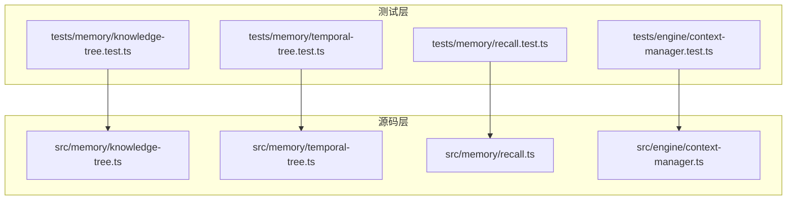
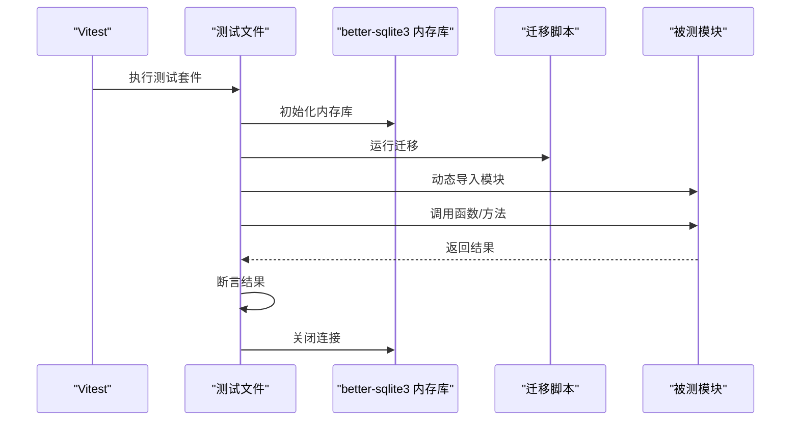
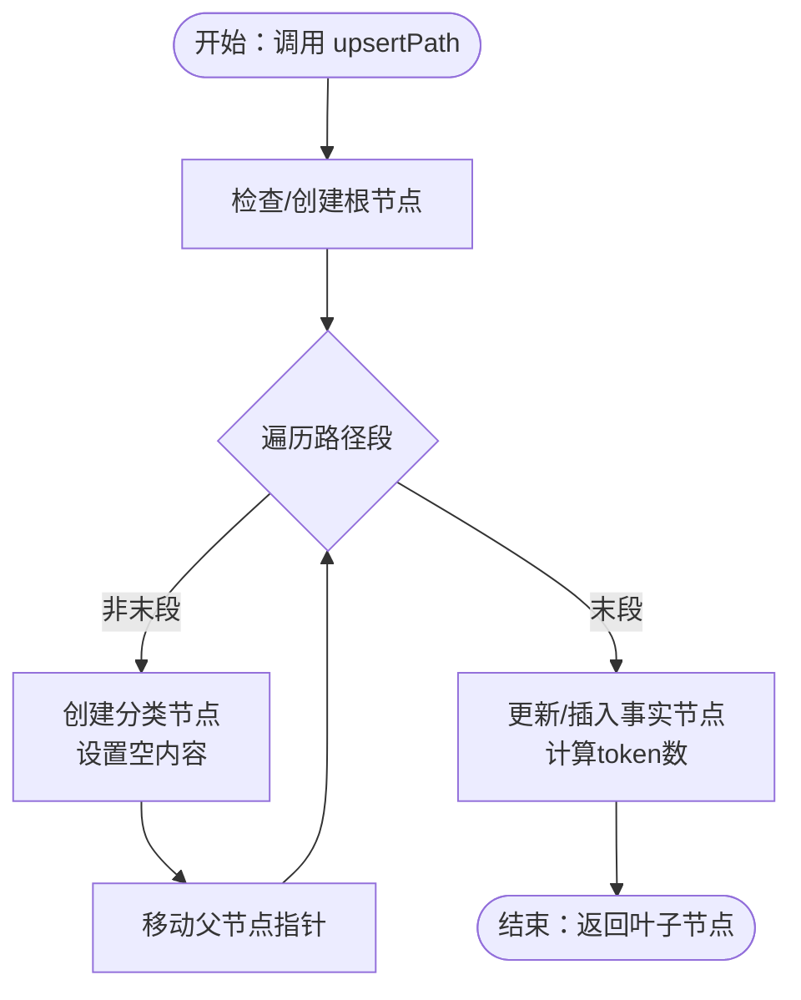
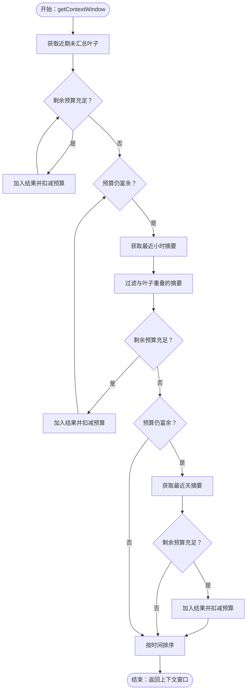
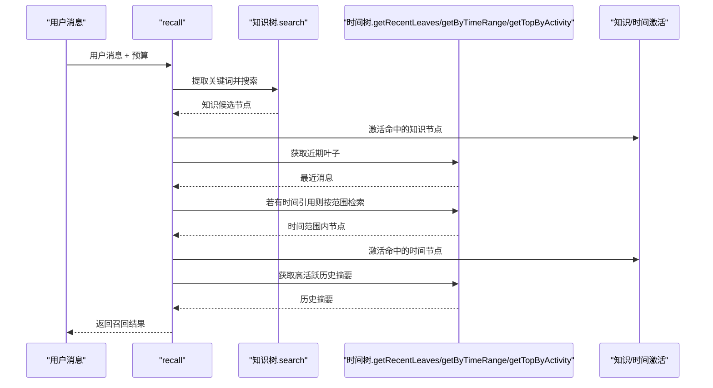
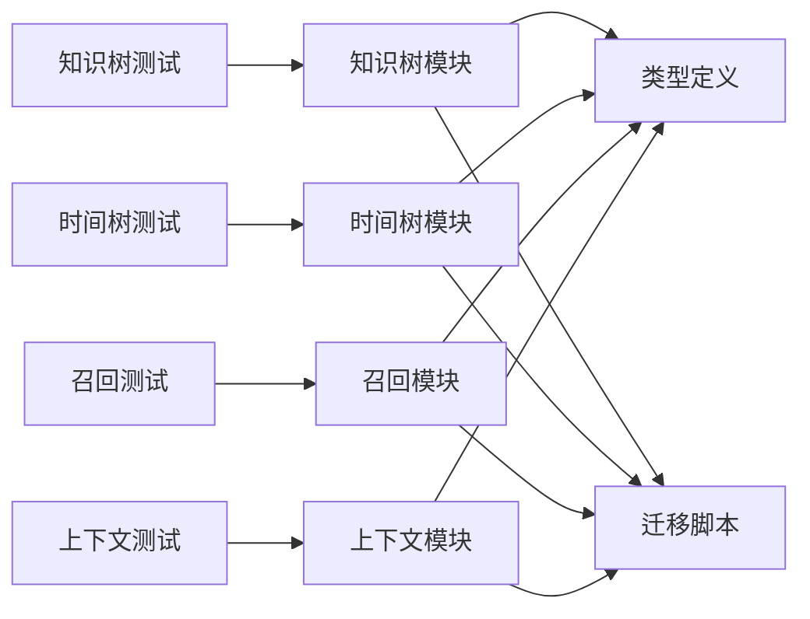

# 单元测试

<cite>
**本文引用的文件**
- [tests/memory/knowledge-tree.test.ts](file://tests/memory/knowledge-tree.test.ts)
- [tests/memory/temporal-tree.test.ts](file://tests/memory/temporal-tree.test.ts)
- [tests/memory/recall.test.ts](file://tests/memory/recall.test.ts)
- [tests/engine/context-manager.test.ts](file://tests/engine/context-manager.test.ts)
- [vitest.config.ts](file://vitest.config.ts)
- [package.json](file://package.json)
- [src/memory/knowledge-tree.ts](file://src/memory/knowledge-tree.ts)
- [src/memory/temporal-tree.ts](file://src/memory/temporal-tree.ts)
- [src/memory/recall.ts](file://src/memory/recall.ts)
- [src/engine/context-manager.ts](file://src/engine/context-manager.ts)
- [src/memory/types.ts](file://src/memory/types.ts)
- [src/config/index.ts](file://src/config/index.ts)
- [src/db/migrate.ts](file://src/db/migrate.ts)
- [src/memory/activity.ts](file://src/memory/activity.ts)
</cite>

## 目录
1. [引言](#引言)
2. [项目结构](#项目结构)
3. [核心组件](#核心组件)
4. [架构总览](#架构总览)
5. [详细组件分析](#详细组件分析)
6. [依赖关系分析](#依赖关系分析)
7. [性能考量](#性能考量)
8. [故障排查指南](#故障排查指南)
9. [结论](#结论)
10. [附录](#附录)

## 引言
本文件面向 TreeMemory 的单元测试体系，系统梳理测试金字塔中“单元测试”的组织方式与实现细节，重点覆盖记忆系统（知识树、时间树）与对话引擎（上下文管理器、记忆召回）的关键模块。文档将解释测试文件命名规范、用例编写模式与断言策略，并给出覆盖率目标、边界条件与异常处理建议，以及调试技巧与常见问题解决方案。

## 项目结构
当前仓库采用按功能域分层的目录组织：
- 源码位于 src/ 下，按领域拆分为 memory、engine、llm、db、utils 等子模块
- 测试位于 tests/ 下，与 src 对应，形成清晰的“功能域-模块”映射
- 测试运行通过 Vitest 配置，使用 Node 环境执行

图表来源
- [tests/memory/knowledge-tree.test.ts:1-135](file://tests/memory/knowledge-tree.test.ts#L1-L135)
- [tests/memory/temporal-tree.test.ts:1-119](file://tests/memory/temporal-tree.test.ts#L1-L119)
- [tests/memory/recall.test.ts:1-95](file://tests/memory/recall.test.ts#L1-L95)
- [tests/engine/context-manager.test.ts:1-44](file://tests/engine/context-manager.test.ts#L1-L44)
- [src/memory/knowledge-tree.ts:1-239](file://src/memory/knowledge-tree.ts#L1-L239)
- [src/memory/temporal-tree.ts:1-363](file://src/memory/temporal-tree.ts#L1-L363)
- [src/memory/recall.ts:1-168](file://src/memory/recall.ts#L1-L168)
- [src/engine/context-manager.ts:1-103](file://src/engine/context-manager.ts#L1-L103)

章节来源
- [tests/memory/knowledge-tree.test.ts:1-135](file://tests/memory/knowledge-tree.test.ts#L1-L135)
- [tests/memory/temporal-tree.test.ts:1-119](file://tests/memory/temporal-tree.test.ts#L1-L119)
- [tests/memory/recall.test.ts:1-95](file://tests/memory/recall.test.ts#L1-L95)
- [tests/engine/context-manager.test.ts:1-44](file://tests/engine/context-manager.test.ts#L1-L44)
- [vitest.config.ts:1-9](file://vitest.config.ts#L1-L9)
- [package.json:1-34](file://package.json#L1-L34)

## 核心组件
- 记忆系统
  - 知识树：路径插入/更新、关键词搜索、上下文格式化、根节点子节点查询等
  - 时间树：叶子节点插入、近期叶子获取、上下文窗口构建、过期小时/天查询等
  - 记忆召回：统一检索（知识+时间）、预算分配、时间范围检索、历史摘要补充
- 对话引擎
  - 上下文管理：是否需要总结阈值判断、预算计算、提示组装、缓冲区总结

章节来源
- [src/memory/knowledge-tree.ts:1-239](file://src/memory/knowledge-tree.ts#L1-L239)
- [src/memory/temporal-tree.ts:1-363](file://src/memory/temporal-tree.ts#L1-L363)
- [src/memory/recall.ts:1-168](file://src/memory/recall.ts#L1-L168)
- [src/engine/context-manager.ts:1-103](file://src/engine/context-manager.ts#L1-L103)

## 架构总览
单元测试围绕“内存数据库 + 迁移 + 模块导入”的模式组织，每个测试文件在 beforeEach 中初始化内存数据库并执行迁移，确保独立性与可重复性；通过 vi.mock 对外部依赖（配置、数据库连接、日志）进行隔离，避免真实 I/O 干扰。

图表来源
- [tests/memory/knowledge-tree.test.ts:40-49](file://tests/memory/knowledge-tree.test.ts#L40-L49)
- [tests/memory/temporal-tree.test.ts:45-54](file://tests/memory/temporal-tree.test.ts#L45-L54)
- [tests/memory/recall.test.ts:40-49](file://tests/memory/recall.test.ts#L40-L49)
- [src/db/migrate.ts:4-87](file://src/db/migrate.ts#L4-L87)
- [src/config/index.ts:1-30](file://src/config/index.ts#L1-L30)

## 详细组件分析

### 知识树单元测试
- 测试目标
  - 路径创建与更新：upsertPath 在路径上创建分类节点与事实节点，支持同名路径下的内容更新
  - 深路径构建：多级路径正确生成，路径字符串与内容一致
  - 关键词搜索：基于 name/content 的模糊匹配，按有效活跃度排序返回
  - 上下文格式化：将节点序列转为可读的 Markdown 风格上下文字符串
  - 根节点子节点：获取顶层分类节点列表，用于树形展示
- 断言策略
  - 结果对象字段断言（节点类型、名称、内容、路径）
  - 数据库一致性断言（唯一性、计数、路径前缀）
  - 行为断言（顺序、长度、包含关系）
- 边界与异常
  - 空路径段输入时抛出错误（由实现保证）
  - 多次 upsert 同一事实节点仅保留一条记录
- 可扩展点
  - 可增加“路径冲突/非法字符”等边界场景
  - 可增加“大文本/超长路径”性能与截断行为验证

图表来源
- [src/memory/knowledge-tree.ts:55-120](file://src/memory/knowledge-tree.ts#L55-L120)

章节来源
- [tests/memory/knowledge-tree.test.ts:51-134](file://tests/memory/knowledge-tree.test.ts#L51-L134)
- [src/memory/knowledge-tree.ts:1-239](file://src/memory/knowledge-tree.ts#L1-L239)

### 时间树单元测试
- 测试目标
  - 叶子节点插入：角色、内容、时间戳、token 数、活动分数、未汇总标记
  - 近期叶子获取：按时间倒序返回，且最终顺序为时间升序
  - 上下文窗口：在预算内优先近期叶子，再考虑小时摘要，最后天摘要，避免重叠
  - 过期小时/天：统计满足条件的小时桶与天桶
- 断言策略
  - 字段断言（level、role、tokenCount、summarized、activityScore）
  - 数据库一致性断言（存在性、时间范围、父子关系）
  - 预算约束断言（token 使用不超过预算）
- 边界与异常
  - 空桶/无数据返回空集合
  - 时间重叠过滤：避免同时包含叶子与对应小时摘要

图表来源
- [src/memory/temporal-tree.ts:223-284](file://src/memory/temporal-tree.ts#L223-L284)

章节来源
- [tests/memory/temporal-tree.test.ts:56-118](file://tests/memory/temporal-tree.test.ts#L56-L118)
- [src/memory/temporal-tree.ts:1-363](file://src/memory/temporal-tree.ts#L1-L363)

### 记忆召回单元测试
- 测试目标
  - 关键词提取：中英文混合、停用词过滤、中文分片
  - 时间引用解析：昨天/前天/上周/今天等自然语言时间
  - 统一召回流程：知识上下文（~25%预算）、近期叶子（始终包含）、时间范围检索（可选）、高活跃历史摘要（填充）
  - 预算控制：总 token 不超过传入预算，且各阶段预算合理分配
- 断言策略
  - 结果结构断言（知识上下文、时间上下文、总 token）
  - 内容相关性断言（包含关键词片段）
  - 预算上限断言（总 token ≤ 预算 + 宽限）
- 边界与异常
  - 无关键词时跳过知识检索
  - 时间引用不存在时跳过时间范围检索
  - 去重集合避免重复节点

图表来源
- [src/memory/recall.ts:95-167](file://src/memory/recall.ts#L95-L167)

章节来源
- [tests/memory/recall.test.ts:51-94](file://tests/memory/recall.test.ts#L51-L94)
- [src/memory/recall.ts:1-168](file://src/memory/recall.ts#L1-L168)

### 上下文管理器单元测试
- 测试目标
  - 是否需要总结：根据当前缓冲 token 与阈值比例判断
  - 回忆预算计算：扣除系统提示、缓冲区、响应预留后得出可用预算
- 断言策略
  - 数值范围断言（阈值内外）
  - 预算正负与上限断言

章节来源
- [tests/engine/context-manager.test.ts:19-43](file://tests/engine/context-manager.test.ts#L19-L43)
- [src/engine/context-manager.ts:1-103](file://src/engine/context-manager.ts#L1-L103)

## 依赖关系分析
- 测试与被测模块的耦合
  - 测试通过动态 import 加载被测模块，减少编译期耦合
  - 通过 vi.mock 隔离配置、数据库连接与日志，降低外部依赖影响
- 数据库与迁移
  - 每个测试在内存数据库中执行迁移，确保表结构与索引一致
- 类型与接口
  - 测试与源码共享类型定义，保证断言字段与实现一致

图表来源
- [tests/memory/knowledge-tree.test.ts:1-135](file://tests/memory/knowledge-tree.test.ts#L1-L135)
- [tests/memory/temporal-tree.test.ts:1-119](file://tests/memory/temporal-tree.test.ts#L1-L119)
- [tests/memory/recall.test.ts:1-95](file://tests/memory/recall.test.ts#L1-L95)
- [tests/engine/context-manager.test.ts:1-44](file://tests/engine/context-manager.test.ts#L1-L44)
- [src/memory/types.ts:1-33](file://src/memory/types.ts#L1-L33)
- [src/db/migrate.ts:1-88](file://src/db/migrate.ts#L1-L88)

章节来源
- [src/memory/types.ts:1-33](file://src/memory/types.ts#L1-L33)
- [src/db/migrate.ts:1-88](file://src/db/migrate.ts#L1-L88)

## 性能考量
- 测试性能
  - 使用内存数据库与 WAL 模式，提升写入与查询性能
  - 通过限制查询数量（如最近叶子取前 100、小时摘要取前 50、天摘要取前 20）控制复杂度
- 实现性能
  - 索引覆盖：时间树与知识树均建立关键索引，保障查询效率
  - 令牌预算驱动的贪心选择，避免全量扫描
- 建议
  - 对大规模数据场景增加压力测试（批量插入、长对话窗口）
  - 对关键词提取与时间解析增加边界用例（极端长度、特殊字符）

## 故障排查指南
- 常见问题
  - 测试失败但本地可运行：确认环境变量与配置 mock 一致
  - 断言失败：检查动态导入时机与迁移执行顺序
  - 预算不足：核对预算分配比例与 token 计算逻辑
- 调试技巧
  - 使用 Vitest watch 模式快速迭代
  - 在测试中打印中间状态（如数据库行数、token 总计）
  - 分步断言：先断言结构，再断言数值范围
- 排查清单
  - 配置 mock 是否生效
  - 迁移是否在 beforeEach 中执行
  - 动态 import 是否在测试块内部
  - 断言目标是否与实现字段一致

章节来源
- [vitest.config.ts:1-9](file://vitest.config.ts#L1-L9)
- [tests/memory/knowledge-tree.test.ts:40-49](file://tests/memory/knowledge-tree.test.ts#L40-L49)
- [tests/memory/temporal-tree.test.ts:45-54](file://tests/memory/temporal-tree.test.ts#L45-L54)
- [tests/memory/recall.test.ts:40-49](file://tests/memory/recall.test.ts#L40-L49)

## 结论
本测试体系以“内存数据库 + 迁移 + 动态导入 + vi.mock”为核心，覆盖知识树、时间树与记忆召回、上下文管理的关键路径。通过明确的断言策略与边界条件测试，能够稳定验证核心功能的正确性与稳定性。建议持续完善覆盖率与压力测试，确保在生产环境中具备可靠的回归保障。

## 附录

### 测试金字塔与组织方式
- 单元测试（本仓库）
  - 文件命名：模块名.test.ts，与被测模块一一对应
  - 组织方式：describe + it + expect，每个 it 覆盖一个具体行为
  - 断言策略：结构断言 + 数据库一致性断言 + 预算/顺序断言
- 集成测试（建议）
  - 覆盖模块间交互（如知识树与时间树的联动）
  - 使用真实数据库与最小化外部依赖
- 端到端测试（建议）
  - 覆盖完整对话流程（输入 -> 召回 -> 组装 -> LLM -> 输出）

### 测试覆盖率目标
- 行覆盖率：≥ 80%
- 分支覆盖率：≥ 70%
- 函数覆盖率：≥ 85%
- 语句覆盖率：≥ 80%

说明：以上目标为通用建议，可根据业务关键性调整权重。

### 测试数据准备与模拟对象
- 内存数据库
  - 每个测试在 beforeEach 中创建内存库并启用 WAL 与外键约束
  - 在 afterEach 中关闭数据库，避免资源泄漏
- 模拟对象
  - vi.mock 配置：mock config、db/connection、utils/logger
  - 保持 mock 与实际配置项一致，避免断言偏差
- 外部依赖
  - LLM 客户端与分词器通过配置与工具函数间接使用，测试中通过 mock 控制

章节来源
- [tests/memory/knowledge-tree.test.ts:7-36](file://tests/memory/knowledge-tree.test.ts#L7-L36)
- [tests/memory/temporal-tree.test.ts:12-41](file://tests/memory/temporal-tree.test.ts#L12-L41)
- [tests/memory/recall.test.ts:7-36](file://tests/memory/recall.test.ts#L7-L36)
- [src/config/index.ts:1-30](file://src/config/index.ts#L1-L30)
- [src/db/migrate.ts:1-88](file://src/db/migrate.ts#L1-L88)