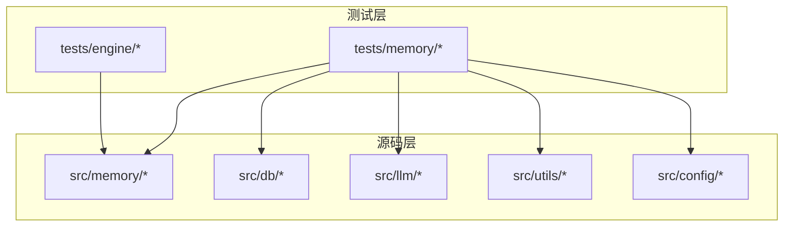
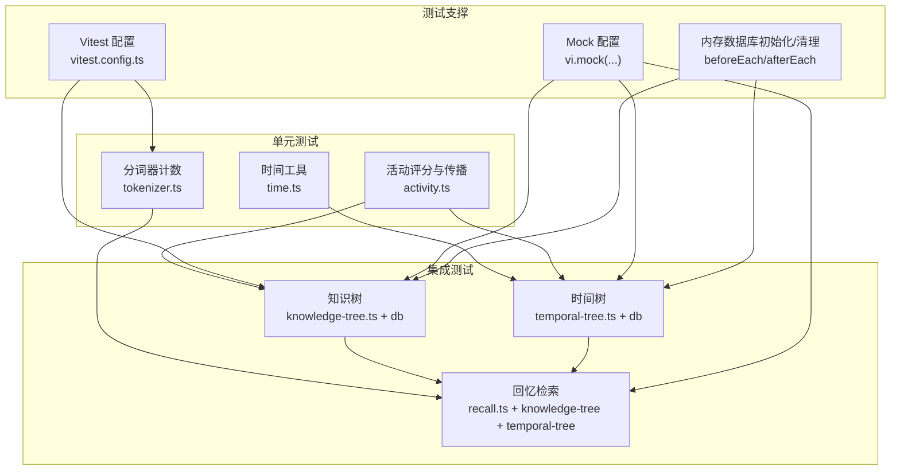
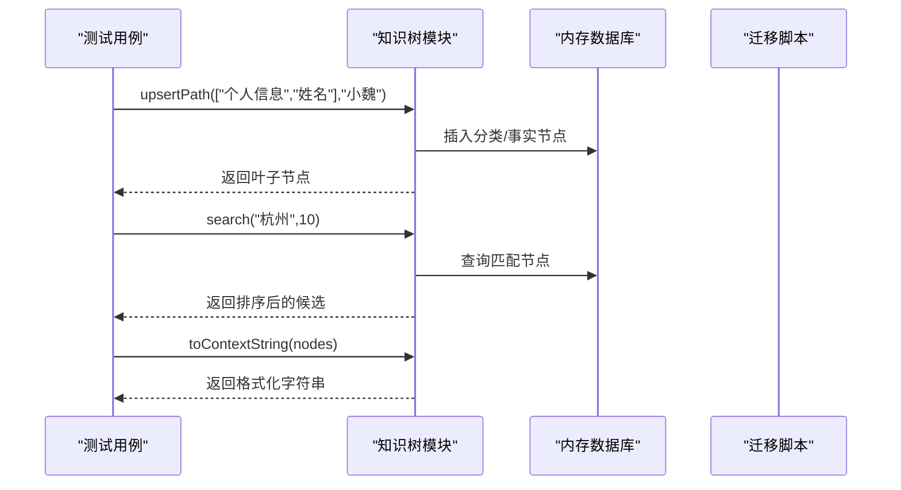
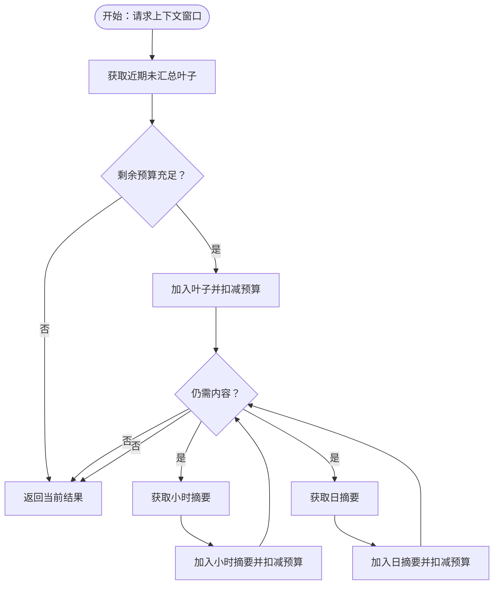
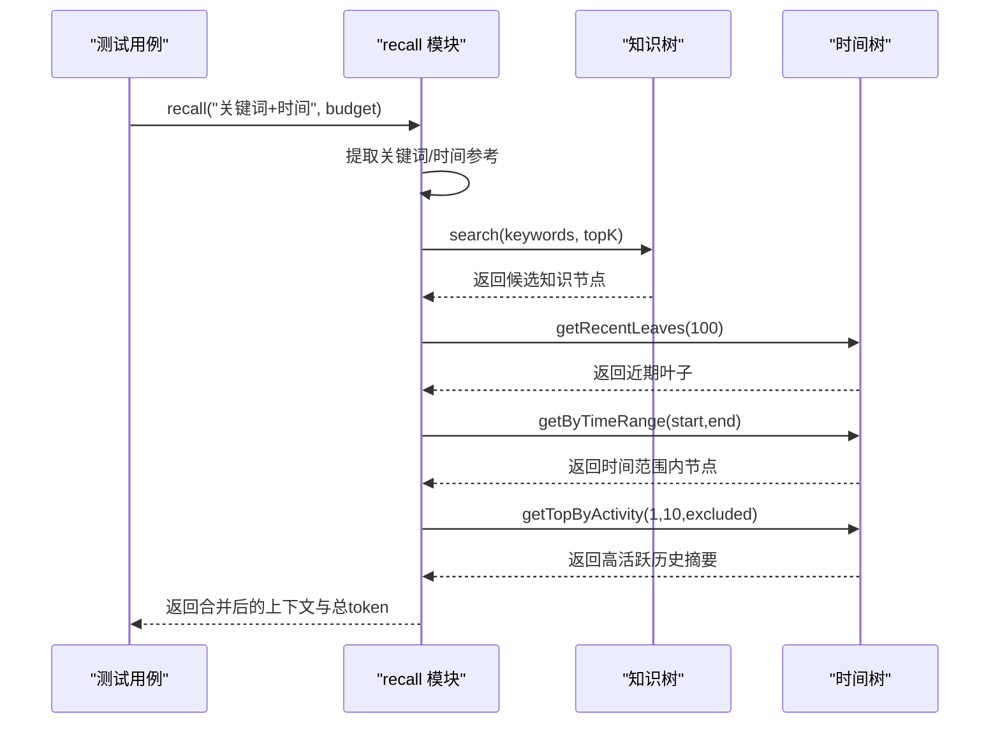
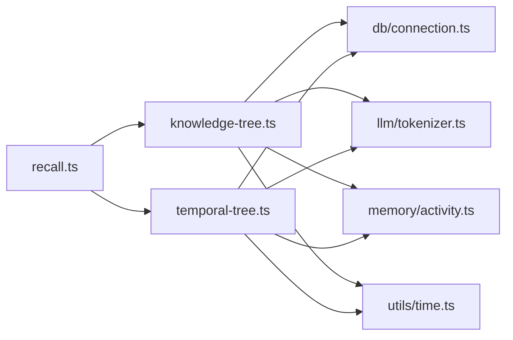

# 测试策略

<cite>
**本文引用的文件**
- [vitest.config.ts](file://vitest.config.ts)
- [package.json](file://package.json)
- [tests/engine/context-manager.test.ts](file://tests/engine/context-manager.test.ts)
- [tests/memory/knowledge-tree.test.ts](file://tests/memory/knowledge-tree.test.ts)
- [tests/memory/recall.test.ts](file://tests/memory/recall.test.ts)
- [tests/memory/temporal-tree.test.ts](file://tests/memory/temporal-tree.test.ts)
- [src/config/index.ts](file://src/config/index.ts)
- [src/db/connection.ts](file://src/db/connection.ts)
- [src/db/migrate.ts](file://src/db/migrate.ts)
- [src/memory/knowledge-tree.ts](file://src/memory/knowledge-tree.ts)
- [src/memory/temporal-tree.ts](file://src/memory/temporal-tree.ts)
- [src/memory/recall.ts](file://src/memory/recall.ts)
- [src/memory/activity.ts](file://src/memory/activity.ts)
- [src/memory/types.ts](file://src/memory/types.ts)
- [src/llm/tokenizer.ts](file://src/llm/tokenizer.ts)
- [src/utils/logger.ts](file://src/utils/logger.ts)
- [src/utils/time.ts](file://src/utils/time.ts)
</cite>

## 目录
1. [引言](#引言)
2. [项目结构](#项目结构)
3. [核心组件](#核心组件)
4. [架构总览](#架构总览)
5. [详细组件分析](#详细组件分析)
6. [依赖分析](#依赖分析)
7. [性能考虑](#性能考虑)
8. [故障排除指南](#故障排除指南)
9. [结论](#结论)
10. [附录](#附录)

## 引言
本文件系统化阐述 TreeMemory 的测试策略与测试金字塔设计，覆盖单元测试、集成测试与端到端测试的组织方式；详解 Vitest 测试框架的配置与使用、Mock 策略与覆盖率要求；明确各模块的测试重点与用例设计原则（边界条件、异常处理、性能），并提供测试数据准备与管理方案（内存数据库初始化与清理）、持续集成与自动化测试建议、调试与故障排除指南以及测试最佳实践与质量保障措施。

## 项目结构
当前仓库采用按功能域分层的组织方式：
- 源码位于 src/ 下，按领域拆分为 engine、memory、llm、db、utils 等子目录
- 测试位于 tests/ 下，与源码模块一一对应，形成清晰的“单元/集成”测试矩阵
- 根目录包含构建与测试脚本、Vitest 配置、类型定义与依赖声明

图表来源
- [tests/engine/context-manager.test.ts:1-44](file://tests/engine/context-manager.test.ts#L1-L44)
- [tests/memory/knowledge-tree.test.ts:1-135](file://tests/memory/knowledge-tree.test.ts#L1-L135)
- [tests/memory/recall.test.ts:1-95](file://tests/memory/recall.test.ts#L1-L95)
- [tests/memory/temporal-tree.test.ts:1-119](file://tests/memory/temporal-tree.test.ts#L1-L119)
- [src/memory/knowledge-tree.ts:1-239](file://src/memory/knowledge-tree.ts#L1-L239)
- [src/memory/temporal-tree.ts:1-362](file://src/memory/temporal-tree.ts#L1-L362)
- [src/memory/recall.ts:1-168](file://src/memory/recall.ts#L1-L168)
- [src/db/migrate.ts:1-88](file://src/db/migrate.ts#L1-L88)
- [src/config/index.ts:1-30](file://src/config/index.ts#L1-L30)

章节来源
- [package.json:1-34](file://package.json#L1-L34)
- [vitest.config.ts:1-9](file://vitest.config.ts#L1-L9)

## 核心组件
- 测试框架与运行环境
  - 使用 Vitest，全局启用、Node 环境，便于快速执行与断言
- 配置与数据库
  - 配置通过 dotenv 注入，生产默认值来自环境变量；测试中通过 vi.mock 固定关键参数
  - 数据库连接采用单例懒加载，测试中通过 vi.mock 将 getDb 替换为内存数据库实例
- 记忆树与检索
  - 知识树：路径插入、更新、搜索、上下文格式化、根节点查询
  - 时间树：叶子插入、近期叶子、上下文窗口、时间范围检索、活动节点激活
  - 回忆：关键词提取、时间参考解析、知识与时间上下文融合、预算分配与排序
- 工具与辅助
  - 分词器：基于 gpt-tokenizer 的 token 计数
  - 时间工具：小时/天键生成、范围转换、日期差计算
  - 日志：pino 输出到标准输出

章节来源
- [vitest.config.ts:1-9](file://vitest.config.ts#L1-L9)
- [src/config/index.ts:1-30](file://src/config/index.ts#L1-L30)
- [src/db/connection.ts:1-26](file://src/db/connection.ts#L1-L26)
- [src/db/migrate.ts:1-88](file://src/db/migrate.ts#L1-L88)
- [src/memory/knowledge-tree.ts:1-239](file://src/memory/knowledge-tree.ts#L1-L239)
- [src/memory/temporal-tree.ts:1-362](file://src/memory/temporal-tree.ts#L1-L362)
- [src/memory/recall.ts:1-168](file://src/memory/recall.ts#L1-L168)
- [src/llm/tokenizer.ts:1-26](file://src/llm/tokenizer.ts#L1-L26)
- [src/utils/time.ts:1-60](file://src/utils/time.ts#L1-L60)
- [src/utils/logger.ts:1-10](file://src/utils/logger.ts#L1-L10)

## 架构总览
测试架构遵循“单元优先、集成验证”的金字塔模式：
- 单元测试：针对纯函数与小对象（如分词器、时间工具、活动评分），确保逻辑正确性与边界行为
- 集成测试：围绕记忆树与检索模块，验证数据库交互、迁移、Mock 策略与跨模块协作
- 端到端测试：可选扩展，用于验证完整流程（如从输入到上下文拼装）

图表来源
- [vitest.config.ts:1-9](file://vitest.config.ts#L1-L9)
- [tests/memory/knowledge-tree.test.ts:1-135](file://tests/memory/knowledge-tree.test.ts#L1-L135)
- [tests/memory/temporal-tree.test.ts:1-119](file://tests/memory/temporal-tree.test.ts#L1-L119)
- [tests/memory/recall.test.ts:1-95](file://tests/memory/recall.test.ts#L1-L95)
- [src/llm/tokenizer.ts:1-26](file://src/llm/tokenizer.ts#L1-L26)
- [src/utils/time.ts:1-60](file://src/utils/time.ts#L1-L60)
- [src/memory/activity.ts:1-51](file://src/memory/activity.ts#L1-L51)

## 详细组件分析

### 单元测试：分词器与时间工具
- 测试重点
  - 文本 token 数量计算的准确性与一致性
  - 中英文混合场景下的切分与停用词过滤
  - 时间键生成、范围转换与日期差计算的边界行为
- 用例设计原则
  - 边界条件：空字符串、超长文本、纯标点、仅中文/英文
  - 异常处理：非法输入、NaN、异常时间格式（由上层调用保证）
  - 性能：大文本批量计数的线性复杂度验证
- 关键实现参考
  - 分词器计数与消息开销估算
  - 时间键与范围转换、日期差计算

章节来源
- [src/llm/tokenizer.ts:1-26](file://src/llm/tokenizer.ts#L1-L26)
- [src/utils/time.ts:1-60](file://src/utils/time.ts#L1-L60)

### 单元测试：活动评分与传播
- 测试重点
  - 有效分数随天数衰减的正确性
  - 节点激活对自身与祖先的传播比例
- 用例设计原则
  - 边界条件：极小/极大衰减率、长时间未激活
  - 异常处理：负数/非数值输入（由上层参数校验保证）
  - 性能：递归传播的深度上限与效率

章节来源
- [src/memory/activity.ts:1-51](file://src/memory/activity.ts#L1-L51)
- [src/config/index.ts:1-30](file://src/config/index.ts#L1-L30)

### 集成测试：知识树（Knowledge Tree）
- 测试重点
  - 路径插入与更新：分类节点与事实节点的创建与去重
  - 深路径构建：多级路径的正确性与唯一性
  - 搜索：关键词匹配、结果排序与去重
  - 上下文格式化：输出结构化提示词片段
  - 根节点与全量节点查询
- Mock 策略
  - vi.mock 配置固定配置参数，替换数据库连接为内存数据库实例
  - beforeEach 初始化内存数据库并执行迁移；afterEach 关闭数据库
- 关键实现参考
  - upsertPath、findByPath、search、toContextString、getRootChildren、getAllNodes

图表来源
- [tests/memory/knowledge-tree.test.ts:1-135](file://tests/memory/knowledge-tree.test.ts#L1-L135)
- [src/memory/knowledge-tree.ts:1-239](file://src/memory/knowledge-tree.ts#L1-L239)
- [src/db/migrate.ts:1-88](file://src/db/migrate.ts#L1-L88)

章节来源
- [tests/memory/knowledge-tree.test.ts:1-135](file://tests/memory/knowledge-tree.test.ts#L1-L135)
- [src/memory/knowledge-tree.ts:1-239](file://src/memory/knowledge-tree.ts#L1-L239)
- [src/db/migrate.ts:1-88](file://src/db/migrate.ts#L1-L88)

### 集成测试：时间树（Temporal Tree）
- 测试重点
  - 叶子节点插入：角色、内容、token 计数、活动分与时间范围
  - 近期叶子获取：时序正确性与数量限制
  - 上下文窗口：按预算优先级选择叶子/小时摘要/日摘要
  - 时间范围检索：指定时间段内的节点集合
  - 活动节点激活与过期小时/天识别
- Mock 策略
  - vi.mock 配置固定配置参数，替换数据库连接为内存数据库实例
  - beforeEach 初始化内存数据库并执行迁移；afterEach 关闭数据库
- 关键实现参考
  - insertLeaf、getRecentLeaves、getContextWindow、getByTimeRange、getStaleHours、getStaleDays、activate

图表来源
- [tests/memory/temporal-tree.test.ts:1-119](file://tests/memory/temporal-tree.test.ts#L1-L119)
- [src/memory/temporal-tree.ts:222-283](file://src/memory/temporal-tree.ts#L222-L283)

章节来源
- [tests/memory/temporal-tree.test.ts:1-119](file://tests/memory/temporal-tree.test.ts#L1-L119)
- [src/memory/temporal-tree.ts:1-362](file://src/memory/temporal-tree.ts#L1-L362)

### 集成测试：回忆检索（Recall）
- 测试重点
  - 关键词提取：中文分词、停用词过滤、混合文本处理
  - 时间参考解析：昨天/前天/上周/今天等自然语言映射到时间范围
  - 上下文融合：知识上下文（~25%预算）、近期叶子（始终包含）、时间范围检索、高活跃历史摘要
  - 预算控制：累计 token 不超过给定预算，且留有安全余量
- Mock 策略
  - vi.mock 配置固定配置参数，替换数据库连接为内存数据库实例
  - beforeEach 初始化内存数据库并执行迁移；afterEach 关闭数据库
- 关键实现参考
  - extractKeywords、extractTimeReference、recall、types 定义

图表来源
- [tests/memory/recall.test.ts:1-95](file://tests/memory/recall.test.ts#L1-L95)
- [src/memory/recall.ts:95-167](file://src/memory/recall.ts#L95-L167)
- [src/memory/knowledge-tree.ts:138-164](file://src/memory/knowledge-tree.ts#L138-L164)
- [src/memory/temporal-tree.ts:66-75](file://src/memory/temporal-tree.ts#L66-L75)
- [src/memory/temporal-tree.ts:288-296](file://src/memory/temporal-tree.ts#L288-L296)
- [src/memory/temporal-tree.ts:301-314](file://src/memory/temporal-tree.ts#L301-L314)

章节来源
- [tests/memory/recall.test.ts:1-95](file://tests/memory/recall.test.ts#L1-L95)
- [src/memory/recall.ts:1-168](file://src/memory/recall.ts#L1-L168)

### 单元测试：上下文管理器（Context Manager）
- 测试重点
  - 摘要触发阈值判断：基于最大上下文与阈值比例
  - 回忆预算计算：消息长度与 token 估算
- Mock 策略
  - vi.mock 固定配置参数，避免外部依赖影响
- 关键实现参考
  - shouldSummarize、calculateRecallBudget

章节来源
- [tests/engine/context-manager.test.ts:1-44](file://tests/engine/context-manager.test.ts#L1-L44)

## 依赖分析
- 组件耦合与内聚
  - 记忆树模块对数据库连接、分词器、时间工具、活动模块存在直接依赖
  - 回忆模块聚合知识树与时间树能力，形成较高内聚的上下文组装层
- 外部依赖与集成点
  - better-sqlite3 内存数据库用于测试隔离
  - gpt-tokenizer 用于 token 计数
  - pino 用于日志输出（测试中通过 vi.mock 屏蔽）
- 潜在循环依赖
  - 当前模块间无明显循环导入；通过 vi.mock 在测试中解耦

图表来源
- [src/memory/recall.ts:1-168](file://src/memory/recall.ts#L1-L168)
- [src/memory/knowledge-tree.ts:1-239](file://src/memory/knowledge-tree.ts#L1-L239)
- [src/memory/temporal-tree.ts:1-362](file://src/memory/temporal-tree.ts#L1-L362)
- [src/db/connection.ts:1-26](file://src/db/connection.ts#L1-L26)
- [src/llm/tokenizer.ts:1-26](file://src/llm/tokenizer.ts#L1-L26)
- [src/memory/activity.ts:1-51](file://src/memory/activity.ts#L1-L51)
- [src/utils/time.ts:1-60](file://src/utils/time.ts#L1-L60)

## 性能考虑
- 测试性能
  - 使用内存数据库（WAL 模式）提升写入与查询速度
  - 通过 Mock 减少外部服务调用与 IO 开销
- 实际运行性能
  - token 预算与优先级策略：近期叶子优先、再按小时/日摘要填充，避免超预算
  - 活动评分与时间衰减：减少无效扫描，提高检索效率
- 优化建议
  - 对高频查询建立索引（已有部分索引）
  - 控制每次检索 topK 与限制数量，避免 O(n) 扫描扩大
  - 合理设置阈值与预算比例，平衡召回与性能

## 故障排除指南
- 常见问题
  - 数据库连接失败：确认 dbPath 与权限；测试中使用内存数据库无需担心
  - 配置缺失导致行为异常：检查环境变量与默认值；测试中通过 vi.mock 固定配置
  - token 计数不一致：确认分词器版本与消息格式；统一使用提供的计数函数
  - Mock 未生效：确保在 import 之前进行 vi.mock，并在测试文件顶部集中配置
- 调试技巧
  - 使用 Vitest watch 模式快速迭代
  - 在测试中打印关键中间状态（如预算剩余、候选数量）
  - 逐步缩小问题范围：先单元后集成，再端到端
- 清理策略
  - 测试结束后关闭数据库连接，避免句柄泄漏

章节来源
- [tests/memory/knowledge-tree.test.ts:40-49](file://tests/memory/knowledge-tree.test.ts#L40-L49)
- [tests/memory/temporal-tree.test.ts:45-54](file://tests/memory/temporal-tree.test.ts#L45-L54)
- [tests/memory/recall.test.ts:40-49](file://tests/memory/recall.test.ts#L40-L49)

## 结论
本测试策略以 Vitest 为核心，结合严格的 Mock 策略与内存数据库，实现了对核心业务逻辑（知识树、时间树、回忆检索）的高覆盖单元与集成测试。通过明确的测试金字塔、边界条件与预算控制的测试用例设计，以及可复现的数据初始化与清理流程，保障了代码质量与可维护性。建议后续补充端到端测试与覆盖率报告，进一步完善 CI/CD 流程。

## 附录

### Vitest 配置与使用
- 全局启用与 Node 环境
- 测试命令：运行与监听模式
- Mock 策略：集中于测试文件顶部，确保 import 之前生效

章节来源
- [vitest.config.ts:1-9](file://vitest.config.ts#L1-L9)
- [package.json:6-12](file://package.json#L6-L12)

### 测试数据准备与管理
- 内存数据库初始化
  - beforeEach 创建内存数据库实例，启用 WAL 与外键约束，执行迁移
- 测试数据清理
  - afterEach 关闭数据库连接
- 关键表与索引
  - temporal_nodes、knowledge_nodes、conversations、conversation_messages、background_tasks

章节来源
- [tests/memory/knowledge-tree.test.ts:40-49](file://tests/memory/knowledge-tree.test.ts#L40-L49)
- [tests/memory/temporal-tree.test.ts:45-54](file://tests/memory/temporal-tree.test.ts#L45-L54)
- [src/db/migrate.ts:1-88](file://src/db/migrate.ts#L1-L88)

### 测试用例设计原则
- 边界条件测试：空/极值、超长、重复、非法字符
- 异常处理测试：输入校验失败、数据库异常、外部服务不可用（通过 Mock 模拟）
- 性能测试：批量数据的线性复杂度与预算控制
- 可重复性：固定随机种子（如需要）、稳定的时间戳（通过 vi.mock 或时间工具）

### 持续集成与自动化测试
- 建议在 CI 中执行：
  - 类型检查与构建
  - 单元与集成测试
  - 可选：覆盖率门槛与端到端测试
- 触发策略：推送主分支与拉取请求

章节来源
- [package.json:6-12](file://package.json#L6-L12)