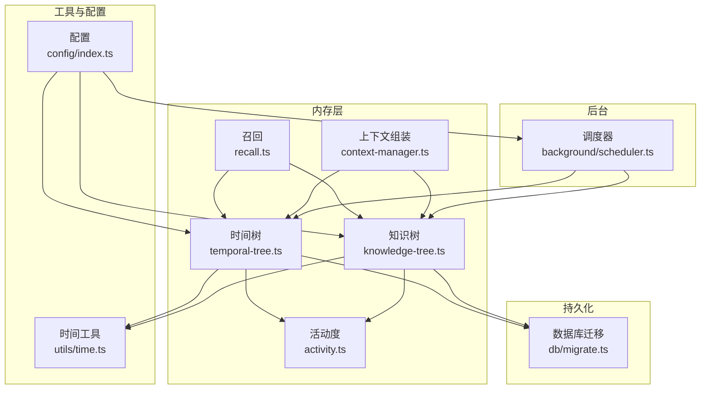
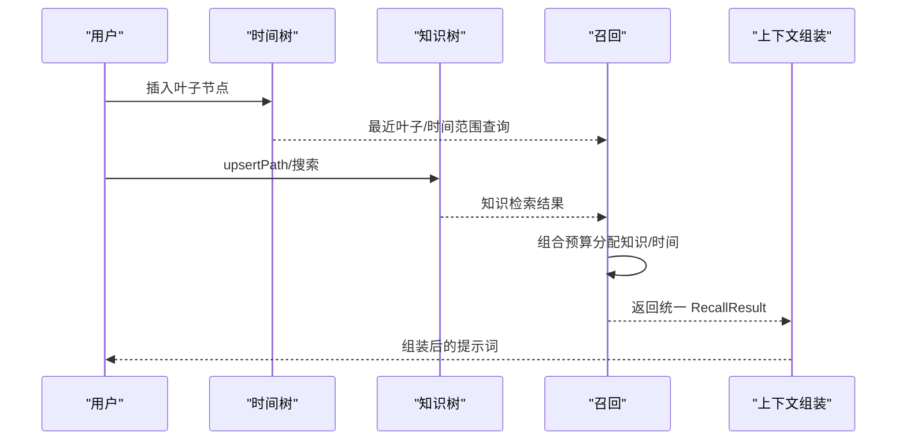
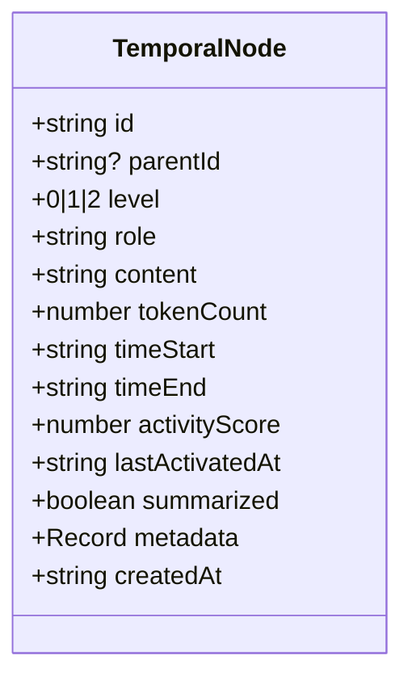
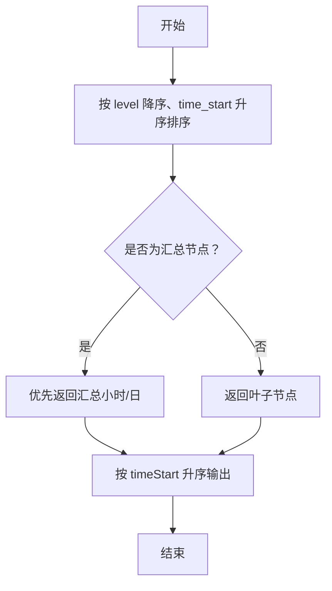
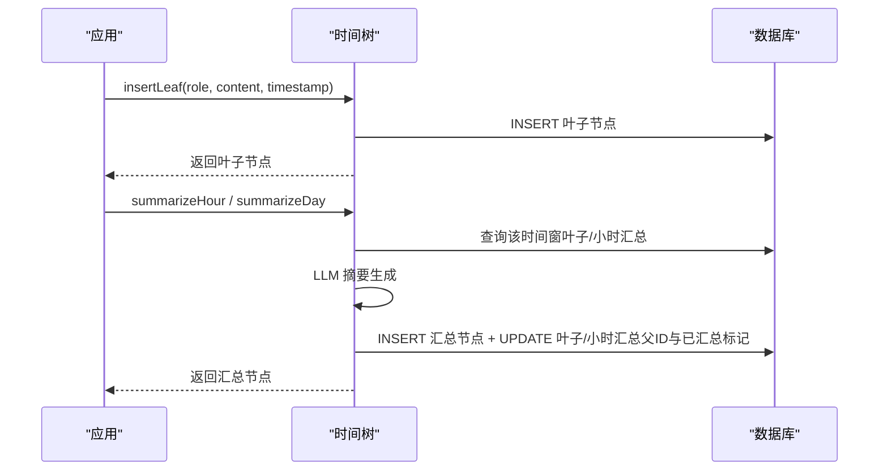
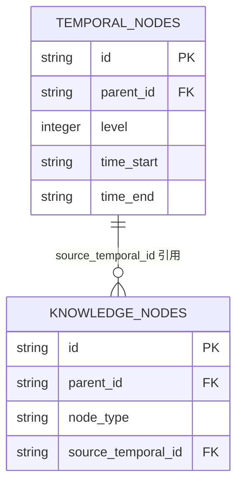
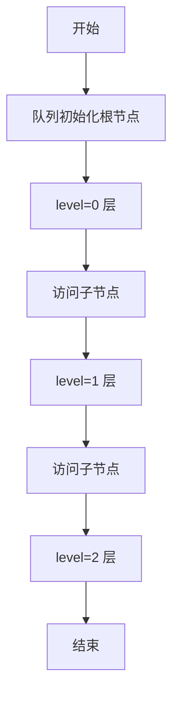
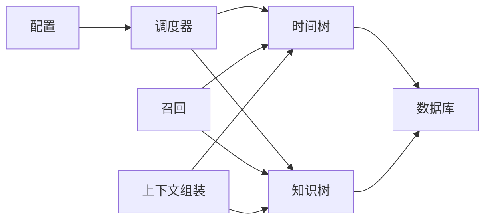

# 时间树管理

<cite>
**本文引用的文件**
- [src/memory/temporal-tree.ts](file://src/memory/temporal-tree.ts)
- [src/memory/knowledge-tree.ts](file://src/memory/knowledge-tree.ts)
- [src/memory/types.ts](file://src/memory/types.ts)
- [src/utils/time.ts](file://src/utils/time.ts)
- [src/engine/context-manager.ts](file://src/engine/context-manager.ts)
- [src/memory/recall.ts](file://src/memory/recall.ts)
- [src/memory/activity.ts](file://src/memory/activity.ts)
- [src/db/migrate.ts](file://src/db/migrate.ts)
- [src/config/index.ts](file://src/config/index.ts)
- [src/background/scheduler.ts](file://src/background/scheduler.ts)
- [src/index.ts](file://src/index.ts)
- [tests/memory/temporal-tree.test.ts](file://tests/memory/temporal-tree.test.ts)
- [tests/memory/knowledge-tree.test.ts](file://tests/memory/knowledge-tree.test.ts)
</cite>

## 目录
1. [简介](#简介)
2. [项目结构](#项目结构)
3. [核心组件](#核心组件)
4. [架构总览](#架构总览)
5. [详细组件分析](#详细组件分析)
6. [依赖关系分析](#依赖关系分析)
7. [性能考量](#性能考量)
8. [故障排查指南](#故障排查指南)
9. [结论](#结论)
10. [附录](#附录)

## 简介
本技术文档围绕“时间树管理系统”展开，系统通过时间维度构建多级记忆节点（叶子节点、小时汇总、日汇总），结合知识树进行语义检索与上下文组装，支持基于时间窗口的召回、活动度衰减评分、LLM 摘要生成与后台调度。本文重点覆盖以下主题：
- 时间树层级结构与时间戳索引机制
- 叶子节点组织与汇总流程
- 时间范围查询与排序策略
- 插入优化与时间序列维护
- 时间树与知识树的关联（源节点引用）
- 遍历算法（前序、后序、层级）
- 时间精度、时区与性能优化
- 使用示例与集成指南

## 项目结构
系统采用按功能分层的模块化组织：
- memory：时间树与知识树核心实现、召回与活动度管理
- engine：上下文组装、提示词拼装与预算计算
- utils：时间工具（时间桶、起止边界、日期差）
- db：数据库迁移与索引
- background：后台调度器，驱动时间树滚动聚合
- config：运行配置
- tests：单元测试验证关键行为

图表来源
- [src/memory/temporal-tree.ts:1-363](file://src/memory/temporal-tree.ts#L1-L363)
- [src/memory/knowledge-tree.ts:1-239](file://src/memory/knowledge-tree.ts#L1-L239)
- [src/memory/recall.ts:1-168](file://src/memory/recall.ts#L1-L168)
- [src/engine/context-manager.ts:1-103](file://src/engine/context-manager.ts#L1-L103)
- [src/utils/time.ts:1-60](file://src/utils/time.ts#L1-L60)
- [src/db/migrate.ts:1-88](file://src/db/migrate.ts#L1-L88)
- [src/background/scheduler.ts:1-46](file://src/background/scheduler.ts#L1-L46)
- [src/config/index.ts:1-30](file://src/config/index.ts#L1-L30)

章节来源
- [src/index.ts:1-36](file://src/index.ts#L1-L36)
- [src/db/migrate.ts:1-88](file://src/db/migrate.ts#L1-L88)

## 核心组件
- 时间树（Temporal Tree）
  - 叶子节点：level=0，记录原始消息或命令
  - 小时汇总：level=1，对同一小时内的叶子节点进行摘要
  - 日汇总：level=2，对同一天内小时汇总进行摘要
  - 关键能力：插入叶子、按小时/日查询、按活动度与时间窗口召回、按时间排序、激活节点提升评分
- 知识树（Knowledge Tree）
  - 分类节点（category）与事实节点（fact），路径唯一
  - 支持路径式增删改查、全文关键词搜索、上下文格式化
- 回忆与上下文（Recall & Context Manager）
  - 统一召回：先知识树，再最近叶子，再时间范围，最后高活跃历史摘要
  - 上下文组装：系统提示 + 知识上下文 + 历史摘要 + 对话缓冲
- 活动度与评分（Activity）
  - 节点激活提升分数，并向祖先传播衰减后的部分分数
  - 有效分数随时间指数衰减
- 时间工具（Time Utils）
  - 小时/日时间桶、起止边界转换、日期差计算、当前时间
- 后台调度（Scheduler）
  - 定时触发时间树滚动聚合与知识抽取任务

章节来源
- [src/memory/temporal-tree.ts:28-363](file://src/memory/temporal-tree.ts#L28-L363)
- [src/memory/knowledge-tree.ts:1-239](file://src/memory/knowledge-tree.ts#L1-L239)
- [src/memory/recall.ts:95-168](file://src/memory/recall.ts#L95-L168)
- [src/engine/context-manager.ts:51-103](file://src/engine/context-manager.ts#L51-L103)
- [src/memory/activity.ts:9-51](file://src/memory/activity.ts#L9-L51)
- [src/utils/time.ts:5-59](file://src/utils/time.ts#L5-L59)
- [src/background/scheduler.ts:9-46](file://src/background/scheduler.ts#L9-L46)

## 架构总览
时间树与知识树协同工作，形成“时间+语义”的双轴记忆体系。用户消息经插入时间树，后台定时聚合生成小时/日摘要；召回阶段根据用户输入提取关键词与时间参考，优先返回近期叶子，再补充时间范围内与高活跃历史摘要；同时结合知识树的语义检索结果，共同构成最终提示词。

图表来源
- [src/memory/recall.ts:95-168](file://src/memory/recall.ts#L95-L168)
- [src/engine/context-manager.ts:51-90](file://src/engine/context-manager.ts#L51-L90)
- [src/memory/temporal-tree.ts:67-91](file://src/memory/temporal-tree.ts#L67-L91)
- [src/memory/knowledge-tree.ts:138-164](file://src/memory/knowledge-tree.ts#L138-L164)

## 详细组件分析

### 时间树层级结构与时间戳索引
- 层级定义
  - 叶子节点：level=0，time_start=time_end，表示单条消息的时间窗
  - 小时汇总：level=1，time_start 为小时起点，time_end 为小时终点
  - 日汇总：level=2，time_start 为日起点，time_end 为日终点
- 时间戳索引机制
  - 数据库索引：level+time_start、level+summarized、activity_score DESC 等
  - 时间桶：小时/日 key 由时间工具生成，用于快速定位与范围查询
- 叶子节点组织
  - 插入时设置 token_count、activity_score、last_activated_at、metadata 等字段
  - 未汇总标记（summarized=false），便于后续聚合

图表来源
- [src/memory/types.ts:11-18](file://src/memory/types.ts#L11-L18)

章节来源
- [src/memory/temporal-tree.ts:10-62](file://src/memory/temporal-tree.ts#L10-L62)
- [src/db/migrate.ts:10-30](file://src/db/migrate.ts#L10-L30)
- [src/utils/time.ts:5-43](file://src/utils/time.ts#L5-L43)

### 时间范围查询与排序策略
- 时间范围查询
  - getByTimeRange：按 time_start >= start 且 time_end <= end 过滤，按 level 降序、time_start 升序排序，保证高层汇总在前、同层按时间顺序
- 排序策略
  - 活动度排序：getTopByActivity 按 activity_score 降序取候选，再过滤去重
  - 时间排序：sortByTime 按 timeStart 字符串比较升序
  - 上下文组装：按时间升序输出，确保历史线性可读

图表来源
- [src/memory/temporal-tree.ts:289-297](file://src/memory/temporal-tree.ts#L289-L297)
- [src/memory/temporal-tree.ts:302-315](file://src/memory/temporal-tree.ts#L302-L315)
- [src/memory/temporal-tree.ts:360-362](file://src/memory/temporal-tree.ts#L360-L362)

章节来源
- [src/memory/temporal-tree.ts:289-315](file://src/memory/temporal-tree.ts#L289-L315)

### 时间树插入优化与时间序列维护
- 插入优化
  - 叶子节点插入：一次性写入，设置 level=0、time_start=time_end、初始 activity_score=1.0
  - 批量更新父节点与汇总状态：使用占位符批量更新，减少往返
- 时间序列维护
  - 最近叶子：getRecentLeaves 按 time_start 降序取前 N 条，再反转得到时间正序
  - 汇总生成：按小时/日聚合，生成 level=1/2 的汇总节点，并标记叶子为已汇总
  - 活动度提升：activate 提升节点及其祖先分数，促进检索与召回

图表来源
- [src/memory/temporal-tree.ts:31-62](file://src/memory/temporal-tree.ts#L31-L62)
- [src/memory/temporal-tree.ts:97-147](file://src/memory/temporal-tree.ts#L97-L147)
- [src/memory/temporal-tree.ts:167-217](file://src/memory/temporal-tree.ts#L167-L217)

章节来源
- [src/memory/temporal-tree.ts:31-147](file://src/memory/temporal-tree.ts#L31-L147)
- [src/memory/temporal-tree.ts:167-217](file://src/memory/temporal-tree.ts#L167-L217)

### 时间树与知识树的关联机制
- 源节点引用
  - 知识树事实节点可绑定 source_temporal_id，建立与时间树叶子/汇总的双向线索
- 双向链接
  - 通过 source_temporal_id 在知识树中回溯到对应时间节点
  - 在时间树侧，可通过父节点关系向上回溯至更高层汇总
- 使用场景
  - 用户提问“昨天的XX”时，召回阶段提取时间参考，结合知识树路径检索，增强上下文相关性

图表来源
- [src/db/migrate.ts:11-25](file://src/db/migrate.ts#L11-L25)
- [src/db/migrate.ts:32-45](file://src/db/migrate.ts#L32-L45)
- [src/memory/types.ts:20-26](file://src/memory/types.ts#L20-L26)

章节来源
- [src/memory/knowledge-tree.ts:55-120](file://src/memory/knowledge-tree.ts#L55-L120)
- [src/memory/types.ts:20-26](file://src/memory/types.ts#L20-L26)

### 时间树遍历算法
- 前序遍历（根到叶）
  - 从父节点出发，优先访问子节点，适合打印路径或重建树结构
- 后序遍历（叶到根）
  - 先访问子节点，再访问父节点，适合统计子节点信息（如汇总）
- 层级遍历（广度优先）
  - 按 level 从低到高逐层访问，适合按时间层次展示（叶子→小时→日）

图表来源
- [src/memory/temporal-tree.ts:289-297](file://src/memory/temporal-tree.ts#L289-L297)
- [src/memory/temporal-tree.ts:360-362](file://src/memory/temporal-tree.ts#L360-L362)

章节来源
- [src/memory/temporal-tree.ts:289-315](file://src/memory/temporal-tree.ts#L289-L315)

### 时间精度、时区与性能优化
- 时间精度与索引
  - 使用 ISO-8601 字符串存储时间戳，便于字符串比较与范围查询
  - 通过索引 level+time_start、level+summarized、activity_score DESC 提升查询效率
- 时区处理
  - 时间桶与边界转换均基于 ISO 字符串，统一以 UTC 表示，避免时区偏移带来的歧义
- 性能优化
  - 召回预算控制：calculateRecallBudget 估算可用 token，避免超出模型上下文
  - 优先级策略：最近叶子优先、再叠加时间范围与高活跃历史摘要
  - 批量更新：汇总时使用占位符批量更新叶子/小时汇总的父 ID 与已汇总标记
  - 后台调度：定时聚合，降低在线写入压力

章节来源
- [src/utils/time.ts:5-59](file://src/utils/time.ts#L5-L59)
- [src/db/migrate.ts:26-29](file://src/db/migrate.ts#L26-L29)
- [src/engine/context-manager.ts:96-103](file://src/engine/context-manager.ts#L96-L103)
- [src/memory/temporal-tree.ts:125-131](file://src/memory/temporal-tree.ts#L125-L131)

### 使用示例与集成指南
- 插入与查询
  - 插入叶子：调用插入函数，传入角色与内容，自动计算 token 数
  - 获取最近叶子：按时间倒序取前若干条，再按时间正序排列
  - 按小时/日查询：传入 hourKey 或 dayKey，返回该时间窗内的叶子/汇总
- 汇总生成
  - 小时汇总：传入 hourKey，系统拉取该小时叶子，调用 LLM 生成摘要并写入 level=1 节点
  - 日汇总：传入 dayKey，系统拉取当日小时汇总，调用 LLM 生成摘要并写入 level=2 节点
- 召回与上下文
  - 召回：传入用户消息与 token 预算，系统返回知识上下文与时间上下文
  - 上下文组装：将知识上下文与历史摘要拼接到系统提示后，再追加对话缓冲
- 集成步骤
  - 初始化数据库与索引（迁移脚本）
  - 启动后台调度器，定期执行时间树滚动聚合
  - 在业务入口调用插入、召回与上下文组装接口

章节来源
- [src/memory/temporal-tree.ts:31-147](file://src/memory/temporal-tree.ts#L31-L147)
- [src/memory/recall.ts:95-168](file://src/memory/recall.ts#L95-L168)
- [src/engine/context-manager.ts:51-90](file://src/engine/context-manager.ts#L51-L90)
- [src/db/migrate.ts:4-88](file://src/db/migrate.ts#L4-L88)
- [src/background/scheduler.ts:26-34](file://src/background/scheduler.ts#L26-L34)

## 依赖关系分析
- 组件耦合
  - 时间树与知识树通过配置与数据库表结构解耦，仅在召回阶段进行数据融合
  - 回忆模块依赖时间树与知识树的查询接口，上下文组装依赖两者的结果
- 外部依赖
  - better-sqlite3：本地嵌入式数据库
  - openai/gpt-tokenizer：LLM 接口与 token 计数
  - dotenv：环境变量加载
- 潜在循环依赖
  - 当前模块间无直接循环导入，通过接口与类型约束保持清晰边界

图表来源
- [src/config/index.ts:18-30](file://src/config/index.ts#L18-L30)
- [src/background/scheduler.ts:26-34](file://src/background/scheduler.ts#L26-L34)
- [src/memory/recall.ts:1-6](file://src/memory/recall.ts#L1-L6)
- [src/engine/context-manager.ts:1-8](file://src/engine/context-manager.ts#L1-L8)
- [src/db/migrate.ts:1-88](file://src/db/migrate.ts#L1-L88)

章节来源
- [src/config/index.ts:1-30](file://src/config/index.ts#L1-L30)
- [src/background/scheduler.ts:1-46](file://src/background/scheduler.ts#L1-L46)
- [src/memory/recall.ts:1-6](file://src/memory/recall.ts#L1-L6)
- [src/engine/context-manager.ts:1-10](file://src/engine/context-manager.ts#L1-L10)

## 性能考量
- 查询性能
  - 利用索引：level+time_start、level+summarized、activity_score DESC
  - 范围查询：hourKey/dayKey 精确切片，减少全表扫描
- 写入性能
  - 批量更新：汇总时使用占位符批量更新父 ID 与已汇总标记
  - 合理批次：最近叶子与历史摘要分别限制数量，避免超大结果集
- LLM 成本控制
  - 召回预算：根据系统提示与响应预留空间动态计算可用 token
  - 渐进式召回：优先近期叶子，再叠加时间范围与高活跃摘要，平衡质量与成本

## 故障排查指南
- 常见问题
  - 汇总为空：确认是否存在未汇总的叶子或小时汇总是否齐全
  - 召回为空：检查关键词提取与时间参考是否正确，以及预算是否过小
  - 活动度不生效：确认激活接口调用与祖先传播逻辑
- 调试建议
  - 查看数据库索引是否创建成功
  - 输出中间结果：最近叶子、时间范围节点、高活跃节点
  - 校验时间桶边界转换是否符合预期

章节来源
- [src/memory/temporal-tree.ts:97-147](file://src/memory/temporal-tree.ts#L97-L147)
- [src/memory/recall.ts:123-161](file://src/memory/recall.ts#L123-L161)
- [src/memory/activity.ts:18-51](file://src/memory/activity.ts#L18-L51)
- [src/db/migrate.ts:26-29](file://src/db/migrate.ts#L26-L29)

## 结论
时间树管理系统通过“时间层次 + 语义检索”的双轴设计，实现了高效的记忆组织与召回。借助时间桶索引、活动度评分与后台聚合，系统在保证上下文质量的同时，兼顾了性能与成本控制。知识树的引入进一步增强了跨时间的语义连贯性，为复杂对话与长期记忆提供了坚实基础。

## 附录
- 测试要点
  - 时间树：叶子插入、最近叶子顺序、上下文窗口、过期小时检测
  - 知识树：路径创建与更新、深度路径、关键词搜索、上下文格式化、根节点查询
- 快速验证
  - 使用内存数据库运行迁移脚本，插入少量叶子与知识节点，调用 recall 与上下文组装接口，观察输出是否符合预期

章节来源
- [tests/memory/temporal-tree.test.ts:56-119](file://tests/memory/temporal-tree.test.ts#L56-L119)
- [tests/memory/knowledge-tree.test.ts:51-135](file://tests/memory/knowledge-tree.test.ts#L51-L135)