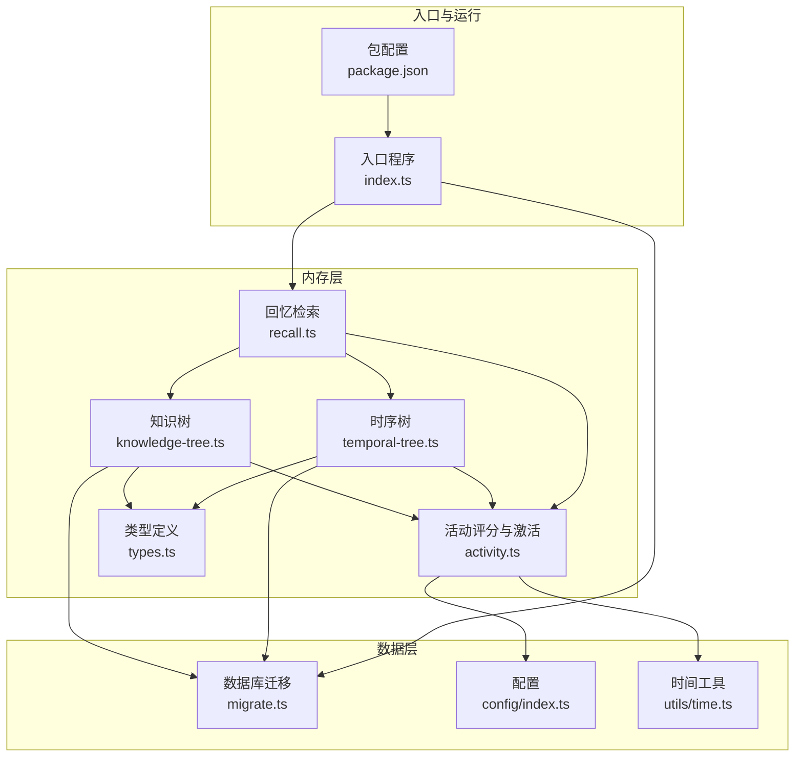
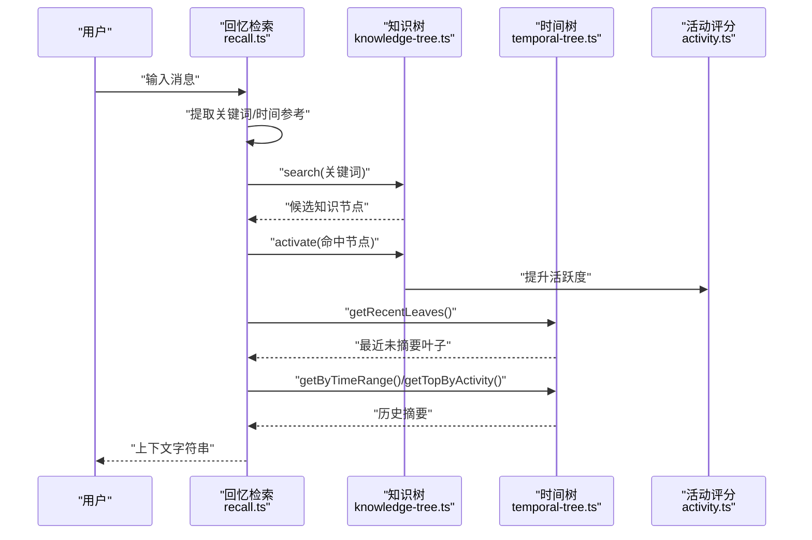
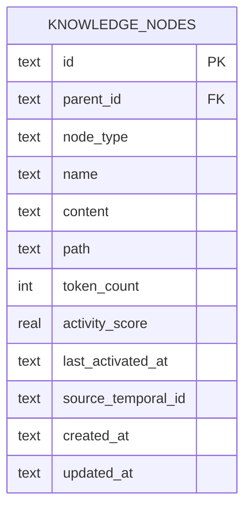
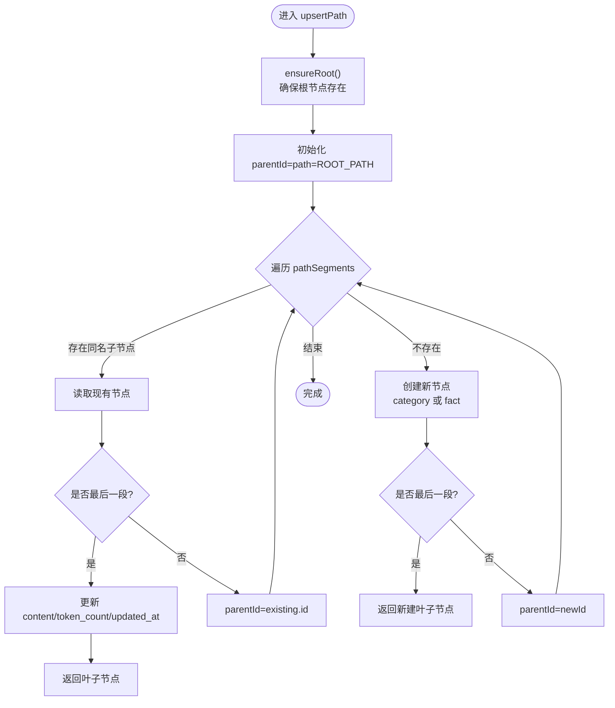
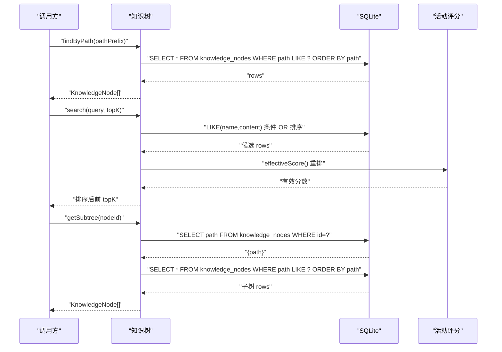
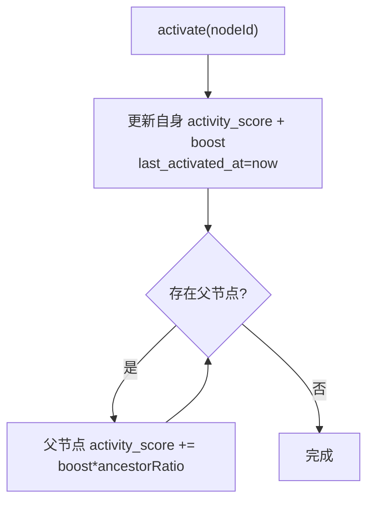
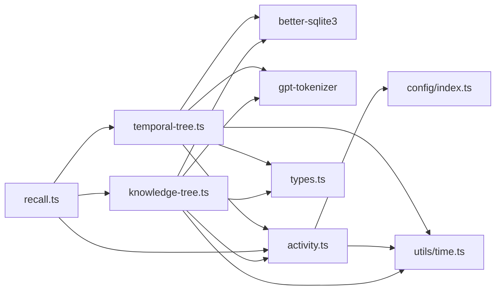

# 知识树管理

<cite>
**本文引用的文件列表**
- [知识树实现](file://src/memory/knowledge-tree.ts)
- [类型定义](file://src/memory/types.ts)
- [活动评分与激活](file://src/memory/activity.ts)
- [数据库迁移脚本](file://src/db/migrate.ts)
- [配置管理](file://src/config/index.ts)
- [时间工具](file://src/utils/time.ts)
- [测试用例](file://tests/memory/knowledge-tree.test.ts)
- [回忆检索](file://src/memory/recall.ts)
- [时序树实现](file://src/memory/temporal-tree.ts)
- [入口程序](file://src/index.ts)
- [包配置](file://package.json)
</cite>

## 目录
1. [简介](#简介)
2. [项目结构](#项目结构)
3. [核心组件](#核心组件)
4. [架构总览](#架构总览)
5. [详细组件分析](#详细组件分析)
6. [依赖关系分析](#依赖关系分析)
7. [性能考量](#性能考量)
8. [故障排查指南](#故障排查指南)
9. [结论](#结论)
10. [附录：API 参考](#附录api-参考)

## 简介
本文件面向“知识树管理系统”的技术文档，聚焦于知识树的树形结构设计、路径创建机制、节点类型管理、upsertPath 的实现原理、查询优化策略（路径前缀、文本内容、子树获取）、节点激活与活跃度评分系统，并提供完整的 API 参考与性能优化建议。该系统采用 SQLite 作为持久化存储，通过树形结构组织语义记忆（知识树）与时间记忆（时序树），并通过活动评分驱动上下文召回。

## 项目结构
- 核心模块位于 src/memory，包含知识树、时序树、活动评分、回忆检索等。
- 数据库迁移脚本负责初始化表结构与索引。
- 配置模块集中管理运行参数，如活跃度衰减率、活跃度加成等。
- 测试覆盖知识树的关键行为，验证 upsert、查询、格式化输出与根节点展示。

图表来源
- [知识树实现:1-239](file://src/memory/knowledge-tree.ts#L1-L239)
- [时序树实现:1-362](file://src/memory/temporal-tree.ts#L1-L362)
- [活动评分与激活:1-51](file://src/memory/activity.ts#L1-L51)
- [回忆检索:1-168](file://src/memory/recall.ts#L1-L168)
- [数据库迁移脚本:1-88](file://src/db/migrate.ts#L1-L88)
- [配置管理:1-30](file://src/config/index.ts#L1-L30)
- [时间工具:1-60](file://src/utils/time.ts#L1-L60)
- [入口程序:1-36](file://src/index.ts#L1-L36)
- [包配置:1-34](file://package.json#L1-L34)

章节来源
- [知识树实现:1-239](file://src/memory/knowledge-tree.ts#L1-L239)
- [数据库迁移脚本:1-88](file://src/db/migrate.ts#L1-L88)
- [配置管理:1-30](file://src/config/index.ts#L1-L30)
- [时间工具:1-60](file://src/utils/time.ts#L1-L60)
- [入口程序:1-36](file://src/index.ts#L1-L36)
- [包配置:1-34](file://package.json#L1-L34)

## 核心组件
- 知识树（semantic memory）
  - 节点类型：category（分类节点）、fact（事实节点）
  - 路径字段 path 用于树形定位与前缀匹配
  - 活跃度评分与时间衰减用于排序与召回
- 活动评分与激活
  - 自身加成与向上级祖先传播加成
  - 时间衰减计算有效分数
- 回忆检索（Recall）
  - 关键词提取与时间范围识别
  - 统一调用知识树与时间树进行上下文抽取

章节来源
- [知识树实现:1-239](file://src/memory/knowledge-tree.ts#L1-L239)
- [活动评分与激活:1-51](file://src/memory/activity.ts#L1-L51)
- [回忆检索:1-168](file://src/memory/recall.ts#L1-L168)
- [类型定义:1-33](file://src/memory/types.ts#L1-L33)

## 架构总览
知识树与时间树共同构成记忆体系：
- 知识树：语义层面的树形知识库，支持路径前缀搜索与全文关键词搜索
- 时间树：按小时/天粒度的对话记忆，支持最近叶子、小时/日摘要、时间范围检索
- 回忆检索：根据用户消息提取关键词与时间参考，结合两类记忆进行上下文拼装

图表来源
- [回忆检索:95-167](file://src/memory/recall.ts#L95-L167)
- [知识树实现:138-164](file://src/memory/knowledge-tree.ts#L138-L164)
- [时序树实现:66-90](file://src/memory/temporal-tree.ts#L66-L90)
- [活动评分与激活:18-50](file://src/memory/activity.ts#L18-L50)

## 详细组件分析

### 知识树数据模型与索引
- 表结构要点
  - 主键：id
  - 外键：parent_id 引用自身（自引用）
  - 节点类型：category/fact
  - 路径：path 用于前缀匹配
  - 活跃度：activity_score 与 last_activated_at
  - 记账：created_at/updated_at
- 索引
  - idx_knowledge_parent：加速父子查找
  - idx_knowledge_path：加速路径前缀查询
  - idx_knowledge_type：加速分类/事实筛选
  - idx_knowledge_activity：加速按活跃度排序

图表来源
- [数据库迁移脚本:32-49](file://src/db/migrate.ts#L32-L49)

章节来源
- [数据库迁移脚本:1-88](file://src/db/migrate.ts#L1-L88)
- [类型定义:20-26](file://src/memory/types.ts#L20-L26)

### 根节点初始化与路径创建机制
- 根节点保证
  - ensureRoot：若不存在则创建根节点，固定 path 为常量标识
- 路径段创建
  - upsertPath：逐段遍历 pathSegments
    - 若存在且为最后一段：更新事实节点内容与 token 数
    - 若不存在：创建分类节点（非末尾）或事实节点（末尾），并设置初始活跃度与时间戳
  - 路径拼接规则：父路径 + "/" + 当前段名

图表来源
- [知识树实现:55-120](file://src/memory/knowledge-tree.ts#L55-L120)

章节来源
- [知识树实现:27-44](file://src/memory/knowledge-tree.ts#L27-L44)
- [知识树实现:55-120](file://src/memory/knowledge-tree.ts#L55-L120)

### upsertPath 实现详解
- 参数
  - pathSegments：路径段数组，如 ["工作", "公司"]
  - content：事实内容
  - sourceTemporalId：可选的来源时间节点 ID
- 返回
  - 新建或更新后的叶子节点对象
- 关键逻辑
  - 逐段创建分类节点，末段创建事实节点
  - 更新事实节点时重计 token 数
  - 写入 created_at/updated_at 与 last_activated_at
  - 设置初始活跃度与源时间节点关联

章节来源
- [知识树实现:55-120](file://src/memory/knowledge-tree.ts#L55-L120)

### 查询优化策略
- 路径前缀搜索
  - findByPath：基于 path LIKE 前缀匹配，返回有序结果
- 文本内容搜索
  - search：按关键词拆分，构造 name/content 的多条件 OR 查询，先粗排再按有效活跃度重排
- 子树获取
  - getSubtree：先查目标节点 path，再按该 path 前缀查询整棵子树

图表来源
- [知识树实现:125-183](file://src/memory/knowledge-tree.ts#L125-L183)
- [活动评分与激活:9-12](file://src/memory/activity.ts#L9-L12)

章节来源
- [知识树实现:125-183](file://src/memory/knowledge-tree.ts#L125-L183)

### 节点激活机制与活跃度评分系统
- 激活
  - activate：对知识树节点执行激活，提升自身与祖先活跃度
- 有效分数
  - effectiveScore：基于配置的衰减率与激活时间差计算
- 配置
  - activityDecayRate：每日衰减系数
  - activityBoost：激活加成值

图表来源
- [活动评分与激活:18-50](file://src/memory/activity.ts#L18-L50)

章节来源
- [活动评分与激活:1-51](file://src/memory/activity.ts#L1-L51)
- [配置管理:18-29](file://src/config/index.ts#L18-L29)

### 回忆检索中的知识树集成
- recall
  - 先按关键词检索知识树，按 token 预算填充
  - 再取最近叶子，补充时间上下文
  - 若有时间参考，按有效活跃度排序补充历史摘要
  - 最后补充高活跃度的历史摘要

章节来源
- [回忆检索:95-167](file://src/memory/recall.ts#L95-L167)

## 依赖关系分析
- 内部依赖
  - knowledge-tree.ts 依赖：数据库连接、LLM 分词器、活动评分、时间工具、类型定义
  - activity.ts 依赖：配置、数据库连接、时间工具
  - recall.ts 依赖：知识树、时间树、活动评分
  - temporal-tree.ts 依赖：数据库连接、LLM 客户端、活动评分、时间工具
- 外部依赖
  - better-sqlite3：本地数据库
  - gpt-tokenizer：token 计数
  - openai：摘要生成
  - dotenv：环境变量
  - fastify/pino：服务端与日志（非本节重点）

图表来源
- [知识树实现:1-6](file://src/memory/knowledge-tree.ts#L1-L6)
- [活动评分与激活:1-3](file://src/memory/activity.ts#L1-L3)
- [回忆检索:1-5](file://src/memory/recall.ts#L1-L5)
- [时序树实现:1-7](file://src/memory/temporal-tree.ts#L1-L7)

章节来源
- [知识树实现:1-6](file://src/memory/knowledge-tree.ts#L1-L6)
- [活动评分与激活:1-3](file://src/memory/activity.ts#L1-L3)
- [回忆检索:1-5](file://src/memory/recall.ts#L1-L5)
- [时序树实现:1-7](file://src/memory/temporal-tree.ts#L1-L7)
- [包配置:17-26](file://package.json#L17-L26)

## 性能考量
- 索引利用
  - 使用 idx_knowledge_path 进行前缀查询，避免全表扫描
  - 使用 idx_knowledge_activity 提升排序效率
- 查询策略
  - search 先粗排（LIKE 条件 + 限制数量），再按有效活跃度重排，减少排序成本
- Token 预算
  - recall 中按 token 预算逐步填充，避免超限
- 活跃度衰减
  - 合理设置 activityDecayRate 与 activityBoost，平衡新鲜度与历史价值
- 批处理与缓存
  - 对热点路径与高频查询可考虑应用层缓存（建议在上层业务中实现）

[本节为通用性能建议，无需特定文件引用]

## 故障排查指南
- 根节点缺失
  - 现象：upsertPath 报错或查询异常
  - 排查：确认 ensureRoot 是否成功执行，检查数据库迁移是否完成
- 路径重复或冲突
  - 现象：更新事实节点失败或路径不正确
  - 排查：确认 pathSegments 正确，末段应为事实节点
- 查询无结果
  - 现象：search/find 返回空
  - 排查：关键词是否为空；索引是否存在；数据是否已写入
- 激活无效
  - 现象：节点活跃度未变化
  - 排查：检查配置 activityBoost 与 activityDecayRate；确认节点存在

章节来源
- [知识树实现:27-44](file://src/memory/knowledge-tree.ts#L27-L44)
- [数据库迁移脚本:32-49](file://src/db/migrate.ts#L32-L49)
- [配置管理:18-29](file://src/config/index.ts#L18-L29)

## 结论
知识树管理系统通过树形结构与路径前缀索引实现了高效的语义知识组织，配合活跃度评分与时间衰减机制，使检索具备时效性与相关性。upsertPath 在路径创建与叶子更新方面表现稳健，查询接口支持前缀与关键词混合策略。建议在生产环境中结合 token 预算与缓存策略进一步优化性能与稳定性。

[本节为总结性内容，无需特定文件引用]

## 附录：API 参考

### 知识树 API
- upsertPath(pathSegments, content, sourceTemporalId?)
  - 功能：创建或更新路径，末段为事实节点，中间段为分类节点
  - 参数
    - pathSegments: 字符串数组，表示路径段
    - content: 事实内容
    - sourceTemporalId: 可选，来源时间节点 ID
  - 返回：叶子节点对象
  - 示例：见测试用例中“创建路径”与“更新内容”
- findByPath(pathPrefix)
  - 功能：返回指定路径前缀下的所有节点
  - 参数：pathPrefix: 前缀字符串
  - 返回：节点数组
- search(query, topK?)
  - 功能：按关键词搜索并按有效活跃度排序
  - 参数：query: 关键词，topK: 返回数量上限
  - 返回：节点数组
- getSubtree(nodeId)
  - 功能：返回指定节点的整棵子树
  - 参数：nodeId: 节点 ID
  - 返回：节点数组
- toContextString(nodes)
  - 功能：将节点数组格式化为提示词上下文字符串
  - 参数：nodes: 节点数组
  - 返回：字符串
- activate(nodeId)
  - 功能：激活节点并向上游传播部分加成
  - 参数：nodeId: 节点 ID
- getRootChildren()
  - 功能：获取根节点的一级子节点
  - 返回：节点数组
- getAllNodes()
  - 功能：获取全部节点（按路径排序）
  - 返回：节点数组

章节来源
- [知识树实现:55-238](file://src/memory/knowledge-tree.ts#L55-L238)
- [测试用例:51-134](file://tests/memory/knowledge-tree.test.ts#L51-L134)

### 类型定义
- TreeNode
  - 字段：id、parentId、content、tokenCount、activityScore、lastActivatedAt、createdAt
- TemporalNode
  - 扩展：level、role、timeStart、timeEnd、summarized、metadata
- KnowledgeNode
  - 扩展：nodeType、name、path、sourceTemporalId、updatedAt
- RecallResult
  - 字段：knowledgeContext、temporalContext、totalTokens

章节来源
- [类型定义:1-33](file://src/memory/types.ts#L1-L33)

### 活动评分与激活
- effectiveScore(activityScore, lastActivatedAt)
  - 功能：按配置的衰减率计算有效分数
  - 返回：数值
- activateNode(table, nodeId)
  - 功能：对指定表的节点及其祖先进行加成
  - 参数：table='knowledge_nodes'|'temporal_nodes'，nodeId

章节来源
- [活动评分与激活:9-50](file://src/memory/activity.ts#L9-L50)
- [配置管理:18-29](file://src/config/index.ts#L18-L29)

### 回忆检索
- recall(userMessage, tokenBudget)
  - 功能：综合知识树与时间树生成上下文
  - 参数：userMessage、tokenBudget
  - 返回：RecallResult

章节来源
- [回忆检索:95-167](file://src/memory/recall.ts#L95-L167)

### 时序树（辅助参考）
- insertLeaf(role, content, timestamp?)
- getRecentLeaves(limit?)
- getLeavesByHour(hourKey)
- summarizeHour(hourKey)
- getHourSummariesByDay(dayKey)
- summarizeDay(dayKey)
- getContextWindow(tokenBudget)
- getByTimeRange(start, end)
- getTopByActivity(minLevel, limit, excludeIds)
- activate(nodeId)
- getStaleHours(minLeaves, minAgeMinutes)
- getStaleDays()

章节来源
- [时序树实现:27-362](file://src/memory/temporal-tree.ts#L27-L362)