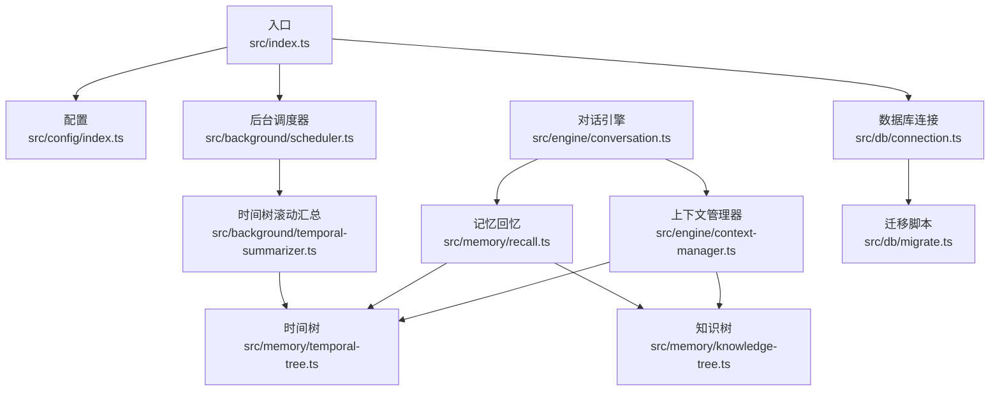
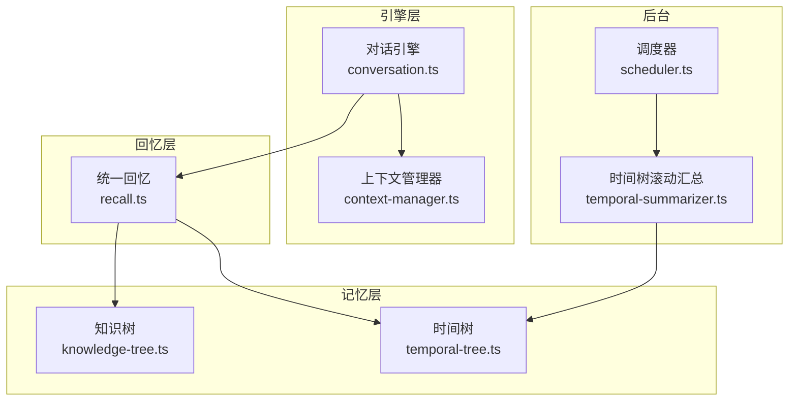
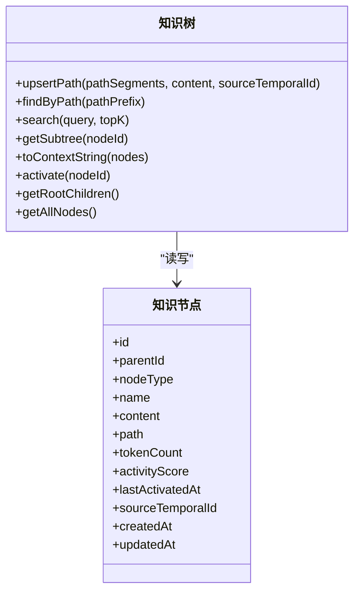
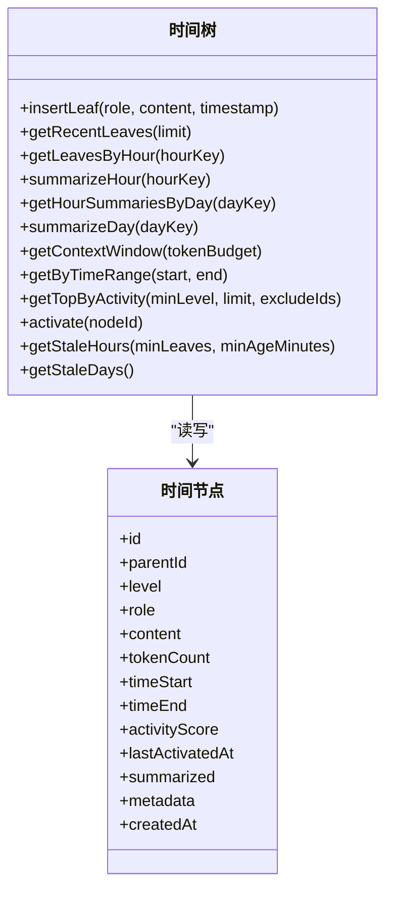
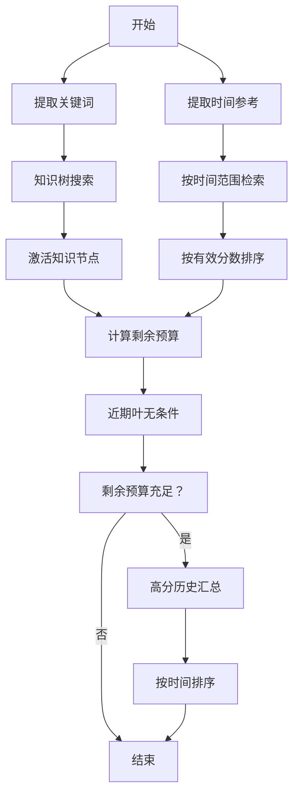
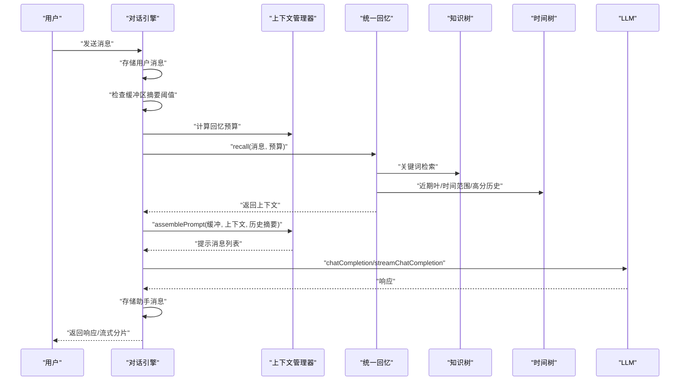
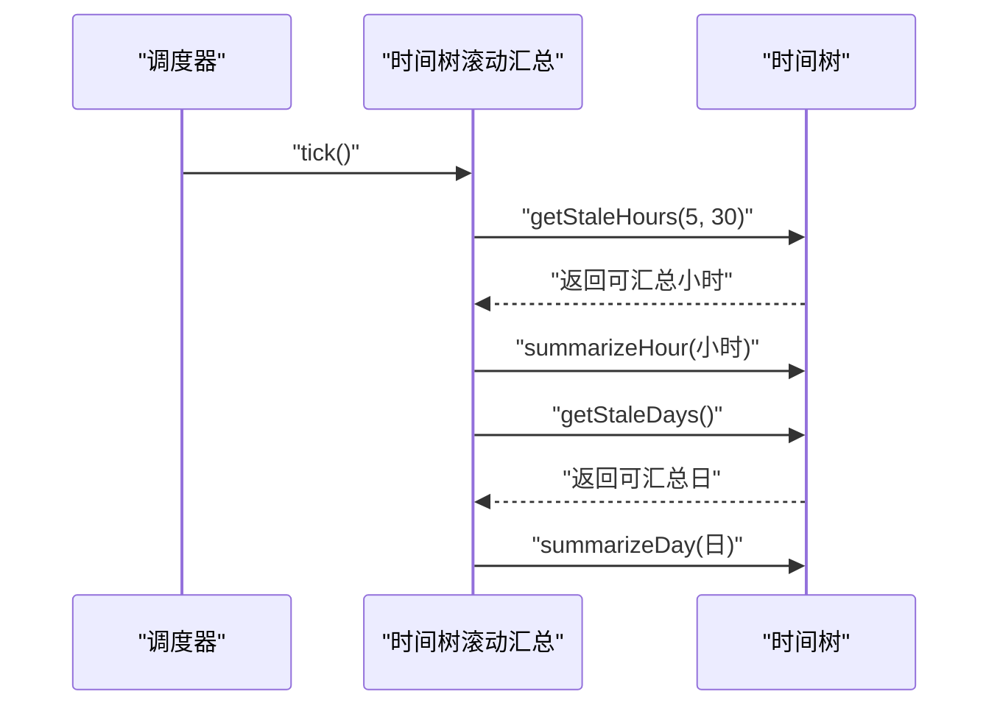
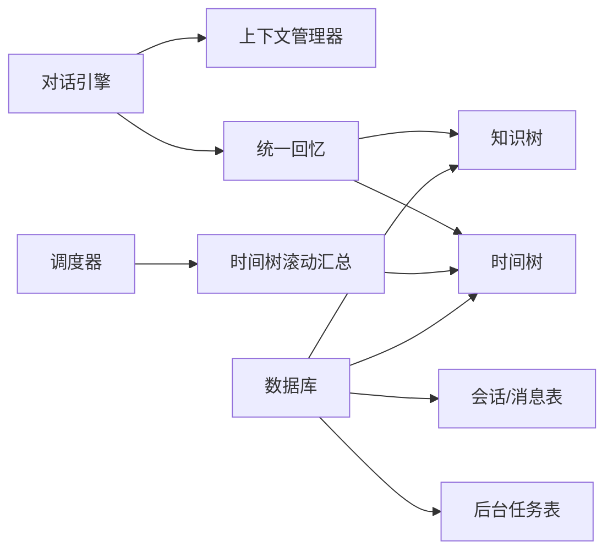

# 记忆系统

<cite>
**本文引用的文件**
- [src/index.ts](file://src/index.ts)
- [src/config/index.ts](file://src/config/index.ts)
- [src/db/connection.ts](file://src/db/connection.ts)
- [src/db/migrate.ts](file://src/db/migrate.ts)
- [src/memory/types.ts](file://src/memory/types.ts)
- [src/memory/knowledge-tree.ts](file://src/memory/knowledge-tree.ts)
- [src/memory/temporal-tree.ts](file://src/memory/temporal-tree.ts)
- [src/memory/recall.ts](file://src/memory/recall.ts)
- [src/memory/activity.ts](file://src/memory/activity.ts)
- [src/engine/context-manager.ts](file://src/engine/context-manager.ts)
- [src/engine/conversation.ts](file://src/engine/conversation.ts)
- [src/background/scheduler.ts](file://src/background/scheduler.ts)
- [src/background/temporal-summarizer.ts](file://src/background/temporal-summarizer.ts)
- [src/utils/time.ts](file://src/utils/time.ts)
- [package.json](file://package.json)
</cite>

## 目录
1. [简介](#简介)
2. [项目结构](#项目结构)
3. [核心组件](#核心组件)
4. [架构总览](#架构总览)
5. [详细组件分析](#详细组件分析)
6. [依赖关系分析](#依赖关系分析)
7. [性能考量](#性能考量)
8. [故障诊断指南](#故障诊断指南)
9. [结论](#结论)
10. [附录：API 参考](#附录api-参考)

## 简介
本项目实现了一个基于“知识树 + 时间树”的双树记忆系统，支持：
- 知识树：语义化知识组织，按路径层级存储分类与事实节点，支持关键词检索与上下文格式化。
- 时间树：按时间层次（叶节点消息、小时汇总、日汇总）组织对话历史，支持滚动摘要与优先级召回窗口。
- 统一回忆：结合知识与时间上下文，按预算动态拼装提示词，驱动 LLM 对话。
- 背景调度：周期性执行时间树滚动汇总与知识抽取任务，维持长期记忆的可维护性与可检索性。

## 项目结构
- 核心模块
  - memory：知识树、时间树、回忆与活动评分
  - engine：对话引擎、上下文管理器
  - background：后台调度器与时间树滚动汇总
  - db：数据库连接与迁移
  - config：运行时配置
  - utils：时间工具
- 启动入口：根据命令行参数选择 CLI 或 HTTP 服务模式，初始化数据库与后台调度器

图表来源
- [src/index.ts:1-36](file://src/index.ts#L1-L36)
- [src/background/scheduler.ts:1-46](file://src/background/scheduler.ts#L1-L46)
- [src/background/temporal-summarizer.ts:1-34](file://src/background/temporal-summarizer.ts#L1-L34)
- [src/engine/conversation.ts:1-280](file://src/engine/conversation.ts#L1-L280)
- [src/engine/context-manager.ts:1-105](file://src/engine/context-manager.ts#L1-L105)
- [src/memory/recall.ts:1-168](file://src/memory/recall.ts#L1-L168)
- [src/memory/knowledge-tree.ts:1-239](file://src/memory/knowledge-tree.ts#L1-L239)
- [src/memory/temporal-tree.ts:1-362](file://src/memory/temporal-tree.ts#L1-L362)
- [src/db/migrate.ts:1-88](file://src/db/migrate.ts#L1-L88)

章节来源
- [src/index.ts:1-36](file://src/index.ts#L1-L36)
- [package.json:1-34](file://package.json#L1-L34)

## 核心组件
- 记忆节点数据模型
  - 通用节点：id、父节点、内容、tokenCount、activityScore、lastActivatedAt、createdAt
  - 时间节点：level（0/1/2）、role、timeStart/timeEnd、summarized、metadata
  - 知识节点：nodeType（category/fact）、name、path、sourceTemporalId、updatedAt
  - 回忆结果：knowledgeContext、temporalContext、totalTokens
- 活动评分与激活
  - 有效分数：随天数衰减，用于排序与召回
  - 激活：提升节点及其祖先的 activityScore，并更新 lastActivatedAt
- 知识树
  - upsertPath：按路径段创建/更新分类与事实节点
  - findByPath/search/getSubtree：路径检索、关键词搜索、子树获取
  - toContextString：格式化为 LLM 提示词片段
  - getRootChildren/getAllNodes：树展示辅助
- 时间树
  - insertLeaf：插入叶节点（消息/命令）
  - getRecentLeaves/getLeavesByHour：近期未汇总叶节点
  - summarizeHour/summarizeDay：按小时/日滚动摘要
  - getContextWindow：按预算优先取近期叶、小时汇总、日汇总
  - getByTimeRange/getTopByActivity：范围检索与高分检索
  - getStaleHours/getStaleDays：识别可汇总的时间桶
- 统一回忆
  - recall：关键词知识 + 近期叶 + 时间范围 + 高分历史，按预算填充
- 上下文管理器
  - shouldSummarize/summarizeBuffer：缓冲区阈值判断与摘要
  - assemblePrompt：拼装系统提示、历史摘要、早期摘要、当前缓冲
  - calculateRecallBudget：计算回忆预算
- 对话引擎
  - handleTurn/handleTurnStream：单轮/流式对话，自动标题、缓冲摘要、存储消息、触发背景知识抽取
  - listConversations/getConversationMessages/deleteConversation：会话管理
- 背景调度
  - startBackgroundScheduler/stopBackgroundScheduler：定时执行滚动汇总与知识抽取
  - runTemporalRollup：小时/日汇总
- 数据库与迁移
  - getDb/closeDb：WAL 模式、外键开启、迁移执行
  - runMigrations：创建表与索引，版本号管理

章节来源
- [src/memory/types.ts:1-33](file://src/memory/types.ts#L1-L33)
- [src/memory/activity.ts:1-51](file://src/memory/activity.ts#L1-L51)
- [src/memory/knowledge-tree.ts:1-239](file://src/memory/knowledge-tree.ts#L1-L239)
- [src/memory/temporal-tree.ts:1-362](file://src/memory/temporal-tree.ts#L1-L362)
- [src/memory/recall.ts:1-168](file://src/memory/recall.ts#L1-L168)
- [src/engine/context-manager.ts:1-105](file://src/engine/context-manager.ts#L1-L105)
- [src/engine/conversation.ts:1-280](file://src/engine/conversation.ts#L1-L280)
- [src/background/scheduler.ts:1-46](file://src/background/scheduler.ts#L1-L46)
- [src/background/temporal-summarizer.ts:1-34](file://src/background/temporal-summarizer.ts#L1-L34)
- [src/db/connection.ts:1-26](file://src/db/connection.ts#L1-L26)
- [src/db/migrate.ts:1-88](file://src/db/migrate.ts#L1-L88)

## 架构总览
双树协同机制：
- 知识树负责语义知识的分类与检索，适合回答“是什么/关于什么”的问题。
- 时间树负责对话历史的时间层次化组织，适合回答“何时/发生了什么”的问题。
- 统一回忆在每次对话中综合两类上下文，按预算优先级选择最近的事实与历史摘要，确保 LLM 得到最相关的上下文。

图表来源
- [src/memory/knowledge-tree.ts:1-239](file://src/memory/knowledge-tree.ts#L1-L239)
- [src/memory/temporal-tree.ts:1-362](file://src/memory/temporal-tree.ts#L1-L362)
- [src/memory/recall.ts:1-168](file://src/memory/recall.ts#L1-L168)
- [src/engine/conversation.ts:1-280](file://src/engine/conversation.ts#L1-L280)
- [src/engine/context-manager.ts:1-105](file://src/engine/context-manager.ts#L1-L105)
- [src/background/scheduler.ts:1-46](file://src/background/scheduler.ts#L1-L46)
- [src/background/temporal-summarizer.ts:1-34](file://src/background/temporal-summarizer.ts#L1-L34)

## 详细组件分析

### 知识树（语义记忆）
- 数据结构
  - 知识节点包含路径 path、类型（分类/事实）、内容、tokenCount、活动分数等
  - 通过路径前缀实现层级组织与快速检索
- 关键操作
  - upsertPath：沿路径创建分类节点，最后一个是事实节点；更新时同步 tokenCount 与 sourceTemporalId
  - findByPath：前缀匹配返回子树
  - search：关键词 LIKE 检索 + 活动分数排序 + 有效分数重排
  - getSubtree：基于节点路径的子树提取
  - toContextString：将节点序列格式化为提示词片段
  - activate：提升节点及其祖先分数
- 查询优化
  - 索引：父节点索引、路径索引、类型索引、活动分数降序索引
  - 排序：先按活动分数降序，再按有效分数重排，限制 topK
- 复杂度
  - upsertPath：O(L) 路径遍历（L 为路径长度），插入/更新为 O(1)
  - search：LIKE 查询 + 限界 topK*3，排序 O(k log k)，k 为候选数
  - findByPath：前缀 LIKE，返回子树 O(m) 遍历

图表来源
- [src/memory/types.ts:20-26](file://src/memory/types.ts#L20-L26)
- [src/memory/knowledge-tree.ts:55-120](file://src/memory/knowledge-tree.ts#L55-L120)
- [src/memory/knowledge-tree.ts:125-164](file://src/memory/knowledge-tree.ts#L125-L164)
- [src/memory/knowledge-tree.ts:169-183](file://src/memory/knowledge-tree.ts#L169-L183)
- [src/memory/knowledge-tree.ts:188-202](file://src/memory/knowledge-tree.ts#L188-L202)
- [src/memory/knowledge-tree.ts:207-227](file://src/memory/knowledge-tree.ts#L207-L227)

章节来源
- [src/memory/types.ts:1-33](file://src/memory/types.ts#L1-L33)
- [src/memory/knowledge-tree.ts:1-239](file://src/memory/knowledge-tree.ts#L1-L239)
- [src/db/migrate.ts:31-49](file://src/db/migrate.ts#L31-L49)

### 时间树（时序记忆）
- 数据结构
  - 叶节点 level=0，记录角色、内容、时间区间、是否已汇总
  - 小时汇总 level=1，日汇总 level=2
  - 支持元数据 JSON 存储
- 关键操作
  - insertLeaf：插入叶节点，计算 tokenCount
  - getRecentLeaves/getLeavesByHour：按时间窗口检索叶节点
  - summarizeHour/summarizeDay：调用 LLM 生成摘要，建立父子关系并标记已汇总
  - getContextWindow：按预算优先取近期叶、小时汇总、日汇总，避免重叠
  - getByTimeRange/getTopByActivity：范围与高分检索
  - getStaleHours/getStaleDays：识别可汇总的时间桶
- 查询优化
  - 索引：父节点、(level,time_start)、(level,summarized)、活动分数降序
  - 优先级：近期叶 > 小时汇总 > 日汇总，且避免与近期叶重叠
- 复杂度
  - summarizeHour/summarizeDay：O(n) 叶节点扫描 + LLM 调用
  - getContextWindow：线性扫描三类节点，O(n+m+k)

图表来源
- [src/memory/types.ts:11-18](file://src/memory/types.ts#L11-L18)
- [src/memory/temporal-tree.ts:30-61](file://src/memory/temporal-tree.ts#L30-L61)
- [src/memory/temporal-tree.ts:96-146](file://src/memory/temporal-tree.ts#L96-L146)
- [src/memory/temporal-tree.ts:166-216](file://src/memory/temporal-tree.ts#L166-L216)
- [src/memory/temporal-tree.ts:222-283](file://src/memory/temporal-tree.ts#L222-L283)
- [src/memory/temporal-tree.ts:301-337](file://src/memory/temporal-tree.ts#L301-L337)

章节来源
- [src/memory/types.ts:1-33](file://src/memory/types.ts#L1-L33)
- [src/memory/temporal-tree.ts:1-362](file://src/memory/temporal-tree.ts#L1-L362)
- [src/db/migrate.ts:10-29](file://src/db/migrate.ts#L10-L29)

### 统一回忆（知识 + 时间）
- 流程
  - 知识阶段：关键词提取 + 知识树搜索 + 激活
  - 近期叶：无条件纳入，优先级最高
  - 时间范围：若消息包含“昨天/上周/今天”等，按时间范围检索并按有效分数排序
  - 高分历史：补充剩余预算，优先历史汇总
  - 最终按时间排序输出
- 关键函数
  - extractKeywords：中英混合分词、停用词过滤、中文二gram扩展、去重
  - extractTimeReference：解析相对时间表达为 ISO 范围
  - recall：组装上下文与预算分配

图表来源
- [src/memory/recall.ts:95-167](file://src/memory/recall.ts#L95-L167)
- [src/memory/recall.ts:12-52](file://src/memory/recall.ts#L12-L52)
- [src/memory/recall.ts:58-89](file://src/memory/recall.ts#L58-L89)

章节来源
- [src/memory/recall.ts:1-168](file://src/memory/recall.ts#L1-L168)

### 对话引擎与上下文管理器
- 对话流程
  - handleTurn/handleTurnStream：存储用户消息 -> 判断缓冲区是否需要摘要 -> 回忆记忆 -> 组装提示 -> 调用 LLM -> 存储助手回复 -> 定期入队知识抽取任务
  - assemblePrompt：系统提示 + 知识上下文 + 历史摘要 + 早期摘要 + 当前缓冲
  - calculateRecallBudget：扣除系统提示、缓冲、响应预留后得到回忆预算
- 会话持久化
  - conversations 表保存会话元信息
  - conversation_messages 表保存消息明细与 token 计数
  - 会话加载时将最近消息回填到内存缓冲

图表来源
- [src/engine/conversation.ts:103-160](file://src/engine/conversation.ts#L103-L160)
- [src/engine/conversation.ts:166-219](file://src/engine/conversation.ts#L166-L219)
- [src/engine/context-manager.ts:53-104](file://src/engine/context-manager.ts#L53-L104)
- [src/memory/recall.ts:95-167](file://src/memory/recall.ts#L95-L167)
- [src/memory/knowledge-tree.ts:138-164](file://src/memory/knowledge-tree.ts#L138-L164)
- [src/memory/temporal-tree.ts:222-283](file://src/memory/temporal-tree.ts#L222-L283)

章节来源
- [src/engine/conversation.ts:1-280](file://src/engine/conversation.ts#L1-L280)
- [src/engine/context-manager.ts:1-105](file://src/engine/context-manager.ts#L1-L105)

### 背景调度与时间树滚动汇总
- 调度器
  - 每隔固定间隔执行一次 tick，串行防止重入
  - 启动后立即延迟执行一次
- 滚动汇总
  - 小时汇总：当某小时内未汇总的叶节点数量达到阈值且足够老，进行小时摘要
  - 日汇总：当某日所有小时均已汇总且未被日汇总覆盖，进行日摘要

图表来源
- [src/background/scheduler.ts:9-34](file://src/background/scheduler.ts#L9-L34)
- [src/background/temporal-summarizer.ts:9-33](file://src/background/temporal-summarizer.ts#L9-L33)
- [src/memory/temporal-tree.ts:326-357](file://src/memory/temporal-tree.ts#L326-L357)
- [src/memory/temporal-tree.ts:96-146](file://src/memory/temporal-tree.ts#L96-L146)
- [src/memory/temporal-tree.ts:166-216](file://src/memory/temporal-tree.ts#L166-L216)

章节来源
- [src/background/scheduler.ts:1-46](file://src/background/scheduler.ts#L1-L46)
- [src/background/temporal-summarizer.ts:1-34](file://src/background/temporal-summarizer.ts#L1-L34)

## 依赖关系分析
- 组件耦合
  - recall 同时依赖知识树与时间树，耦合度适中，职责清晰
  - 对话引擎通过上下文管理器与回忆模块解耦
  - 背景调度器仅依赖时间树的“可汇总识别”接口，低耦合
- 外部依赖
  - better-sqlite3：本地嵌入式数据库
  - openai/gpt-tokenizer：LLM 接口与分词计数
  - pino：日志
- 数据库索引
  - temporal_nodes：父节点、(level,time_start)、(level,summarized)、活动分数降序
  - knowledge_nodes：父节点、path、node_type、活动分数降序
  - background_tasks：状态+类型组合索引

图表来源
- [src/engine/conversation.ts:1-280](file://src/engine/conversation.ts#L1-L280)
- [src/engine/context-manager.ts:1-105](file://src/engine/context-manager.ts#L1-L105)
- [src/memory/recall.ts:1-168](file://src/memory/recall.ts#L1-L168)
- [src/memory/knowledge-tree.ts:1-239](file://src/memory/knowledge-tree.ts#L1-L239)
- [src/memory/temporal-tree.ts:1-362](file://src/memory/temporal-tree.ts#L1-L362)
- [src/background/scheduler.ts:1-46](file://src/background/scheduler.ts#L1-L46)
- [src/background/temporal-summarizer.ts:1-34](file://src/background/temporal-summarizer.ts#L1-L34)
- [src/db/migrate.ts:10-81](file://src/db/migrate.ts#L10-L81)

章节来源
- [src/db/migrate.ts:1-88](file://src/db/migrate.ts#L1-L88)

## 性能考量
- 查询与索引
  - 时间树：(level,time_start)、(level,summarized)、活动分数索引，支持高效滚动汇总与预算填充
  - 知识树：path 前缀 LIKE + 活动分数降序，topK 限界 + 有效分数重排
- 活动评分与衰减
  - 有效分数按天数指数衰减，避免陈旧节点污染上下文
- 缓冲区摘要
  - 当缓冲区 token 达到阈值比例时，对最早一半进行摘要，降低后续 LLM 调用成本
- 内存与持久化
  - 会话缓冲驻留内存，减少频繁 IO；消息持久化到数据库，保证重启可恢复
  - 背景任务队列异步处理知识抽取，避免阻塞主线对话
- 建议
  - 根据业务规模调整 summarizeThresholdRatio 与 maxContextTokens
  - 适当提高 backgroundIntervalMs 以平衡资源占用与新鲜度

## 故障诊断指南
- 数据库连接失败
  - 现象：启动时报数据库错误
  - 排查：确认 DB_PATH 环境变量、文件权限、WAL/外键设置
  - 参考
    - [src/db/connection.ts:8-17](file://src/db/connection.ts#L8-L17)
    - [src/db/migrate.ts:4-88](file://src/db/migrate.ts#L4-L88)
- LLM 调用异常
  - 现象：聊天接口报错或超时
  - 排查：检查 LLM_BASE_URL、LLM_API_KEY、模型名、网络连通性
  - 参考
    - [src/config/index.ts:18-30](file://src/config/index.ts#L18-L30)
- 时间树滚动汇总失败
  - 现象：小时/日汇总任务报错但不影响主流程
  - 排查：查看日志中的 hourKey/dayKey，确认 LLM 账户配额与可用性
  - 参考
    - [src/background/temporal-summarizer.ts:9-33](file://src/background/temporal-summarizer.ts#L9-L33)
- 回忆结果为空
  - 现象：上下文不足导致 LLM 回答质量下降
  - 排查：检查关键词提取逻辑、时间范围解析、预算分配
  - 参考
    - [src/memory/recall.ts:95-167](file://src/memory/recall.ts#L95-L167)
- 会话消息丢失
  - 现象：重启后会话消息不完整
  - 排查：确认 conversation_messages 表存在、索引正常、事务提交
  - 参考
    - [src/db/migrate.ts:51-69](file://src/db/migrate.ts#L51-L69)
    - [src/engine/conversation.ts:30-68](file://src/engine/conversation.ts#L30-L68)

## 结论
该记忆系统通过“知识树 + 时间树”的双轨设计，实现了语义与时间维度的互补记忆。统一回忆在预算约束下优先选择最新、最相关的历史，配合后台滚动汇总与缓冲区摘要，兼顾了实时性与可维护性。数据库索引与活动评分机制进一步保障了查询效率与上下文质量。

## 附录：API 参考

- 知识树
  - upsertPath(pathSegments: string[], content: string, sourceTemporalId?: string): 知识节点
    - 功能：按路径创建/更新分类与事实节点
    - 参数：路径段数组、内容、可选来源时间节点 ID
    - 返回：创建/更新后的叶子节点
    - 参考
      - [src/memory/knowledge-tree.ts:55-120](file://src/memory/knowledge-tree.ts#L55-L120)
  - findByPath(pathPrefix: string): 知识节点[]
    - 功能：返回指定路径前缀下的所有节点
    - 返回：节点数组
    - 参考
      - [src/memory/knowledge-tree.ts:125-133](file://src/memory/knowledge-tree.ts#L125-L133)
  - search(query: string, topK?: number): 知识节点[]
    - 功能：关键词检索并按有效分数重排
    - 返回：节点数组
    - 参考
      - [src/memory/knowledge-tree.ts:138-164](file://src/memory/knowledge-tree.ts#L138-L164)
  - getSubtree(nodeId: string): 知识节点[]
    - 功能：返回指定节点的整棵子树
    - 返回：节点数组
    - 参考
      - [src/memory/knowledge-tree.ts:169-183](file://src/memory/knowledge-tree.ts#L169-L183)
  - toContextString(nodes: 知识节点[]): string
    - 功能：格式化为提示词片段
    - 返回：字符串
    - 参考
      - [src/memory/knowledge-tree.ts:188-202](file://src/memory/knowledge-tree.ts#L188-L202)
  - activate(nodeId: string): void
    - 功能：激活节点并向上传播部分分数
    - 参考
      - [src/memory/knowledge-tree.ts:207-209](file://src/memory/knowledge-tree.ts#L207-L209)
  - getRootChildren(): 知识节点[]
  - getAllNodes(): 知识节点[]
    - 参考
      - [src/memory/knowledge-tree.ts:214-238](file://src/memory/knowledge-tree.ts#L214-L238)

- 时间树
  - insertLeaf(role: string, content: string, timestamp?: Date): 时间节点
    - 功能：插入一条叶节点（消息/命令）
    - 返回：节点对象
    - 参考
      - [src/memory/temporal-tree.ts:30-61](file://src/memory/temporal-tree.ts#L30-L61)
  - getRecentLeaves(limit?: number): 时间节点[]
    - 功能：返回近期未汇总的叶节点（按时间升序）
    - 返回：节点数组
    - 参考
      - [src/memory/temporal-tree.ts:66-75](file://src/memory/temporal-tree.ts#L66-L75)
  - getLeavesByHour(hourKey: string): 时间节点[]
    - 功能：返回指定小时内的叶节点
    - 返回：节点数组
    - 参考
      - [src/memory/temporal-tree.ts:80-90](file://src/memory/temporal-tree.ts#L80-L90)
  - summarizeHour(hourKey: string): 时间节点 | null
    - 功能：对小时内的叶节点进行摘要，生成小时汇总节点
    - 返回：汇总节点或空
    - 参考
      - [src/memory/temporal-tree.ts:96-146](file://src/memory/temporal-tree.ts#L96-L146)
  - getHourSummariesByDay(dayKey: string): 时间节点[]
    - 功能：返回指定日内的小时汇总
    - 返回：节点数组
    - 参考
      - [src/memory/temporal-tree.ts:151-161](file://src/memory/temporal-tree.ts#L151-L161)
  - summarizeDay(dayKey: string): 时间节点 | null
    - 功能：对当日小时汇总进行摘要，生成日汇总节点
    - 返回：汇总节点或空
    - 参考
      - [src/memory/temporal-tree.ts:166-216](file://src/memory/temporal-tree.ts#L166-L216)
  - getContextWindow(tokenBudget: number): 时间节点[]
    - 功能：按预算优先取近期叶、小时汇总、日汇总
    - 返回：节点数组
    - 参考
      - [src/memory/temporal-tree.ts:222-283](file://src/memory/temporal-tree.ts#L222-L283)
  - getByTimeRange(start: string, end: string): 时间节点[]
    - 功能：返回指定时间范围内的节点
    - 返回：节点数组
    - 参考
      - [src/memory/temporal-tree.ts:288-296](file://src/memory/temporal-tree.ts#L288-L296)
  - getTopByActivity(minLevel: number, limit: number, excludeIds: Set<string>): 时间节点[]
    - 功能：按活动分数取高分节点（排除指定 ID）
    - 返回：节点数组
    - 参考
      - [src/memory/temporal-tree.ts:301-314](file://src/memory/temporal-tree.ts#L301-L314)
  - activate(nodeId: string): void
    - 功能：激活节点并向上传播部分分数
    - 参考
      - [src/memory/temporal-tree.ts:319-321](file://src/memory/temporal-tree.ts#L319-L321)
  - getStaleHours(minLeaves: number, minAgeMinutes: number): string[]
    - 功能：返回可汇总的小时键集合
    - 返回：小时键数组
    - 参考
      - [src/memory/temporal-tree.ts:326-337](file://src/memory/temporal-tree.ts#L326-L337)
  - getStaleDays(): string[]
    - 功能：返回可汇总的日期键集合
    - 返回：日期键数组
    - 参考
      - [src/memory/temporal-tree.ts:342-357](file://src/memory/temporal-tree.ts#L342-L357)

- 统一回忆
  - recall(userMessage: string, tokenBudget: number): 回忆结果
    - 功能：综合知识与时间上下文，按预算填充
    - 返回：包含知识上下文、时间上下文与总 token 数的结果对象
    - 参考
      - [src/memory/recall.ts:95-167](file://src/memory/recall.ts#L95-L167)

- 上下文管理器
  - shouldSummarize(bufferTokenCount: number): boolean
    - 功能：判断是否需要对缓冲区进行摘要
    - 参考
      - [src/engine/context-manager.ts:15-17](file://src/engine/context-manager.ts#L15-L17)
  - summarizeBuffer(buffer: 消息[]): { summary: string; count: number }
    - 功能：对缓冲区前半部分进行摘要
    - 返回：摘要文本与摘要条数
    - 参考
      - [src/engine/context-manager.ts:23-42](file://src/engine/context-manager.ts#L23-L42)
  - assemblePrompt(buffer: 消息[], recallResult: 回忆结果, historySummary?: string): 消息[]
    - 功能：组装最终提示消息列表
    - 返回：消息数组
    - 参考
      - [src/engine/context-manager.ts:53-92](file://src/engine/context-manager.ts#L53-L92)
  - calculateRecallBudget(buffer: 消息[]): number
    - 功能：计算回忆预算
    - 返回：预算值
    - 参考
      - [src/engine/context-manager.ts:98-104](file://src/engine/context-manager.ts#L98-L104)

- 对话引擎
  - handleTurn(conversationId: string | undefined, userMessage: string): { response: string; conversationId: string }
    - 功能：非流式单轮对话
    - 返回：响应文本与会话 ID
    - 参考
      - [src/engine/conversation.ts:103-160](file://src/engine/conversation.ts#L103-L160)
  - handleTurnStream(conversationId: string | undefined, userMessage: string): AsyncIterable<{ chunk?: string; conversationId: string; done?: boolean }>
    - 功能：流式对话，逐块返回
    - 返回：迭代器
    - 参考
      - [src/engine/conversation.ts:166-219](file://src/engine/conversation.ts#L166-L219)
  - listConversations(): 会话简要列表
    - 功能：列出所有会话
    - 返回：会话数组
    - 参考
      - [src/engine/conversation.ts:238-249](file://src/engine/conversation.ts#L238-L249)
  - getConversationMessages(conversationId: string): 消息详情
    - 功能：获取指定会话的消息
    - 返回：消息数组
    - 参考
      - [src/engine/conversation.ts:254-268](file://src/engine/conversation.ts#L254-L268)
  - deleteConversation(conversationId: string): void
    - 功能：删除会话及其消息
    - 参考
      - [src/engine/conversation.ts:273-279](file://src/engine/conversation.ts#L273-L279)

- 背景调度
  - startBackgroundScheduler(): void
    - 功能：启动调度器
    - 参考
      - [src/background/scheduler.ts:26-34](file://src/background/scheduler.ts#L26-L34)
  - stopBackgroundScheduler(): void
    - 功能：停止调度器
    - 参考
      - [src/background/scheduler.ts:39-45](file://src/background/scheduler.ts#L39-L45)

- 数据库与迁移
  - getDb(): 数据库实例
  - closeDb(): void
    - 参考
      - [src/db/connection.ts:8-25](file://src/db/connection.ts#L8-L25)
  - runMigrations(db: 数据库实例): void
    - 参考
      - [src/db/migrate.ts:4-88](file://src/db/migrate.ts#L4-L88)

- 配置
  - llmBaseUrl、llmApiKey、llmModel、maxContextTokens、summarizeThresholdRatio、dbPath、httpPort、backgroundIntervalMs、activityDecayRate、activityBoost
    - 参考
      - [src/config/index.ts:18-30](file://src/config/index.ts#L18-L30)