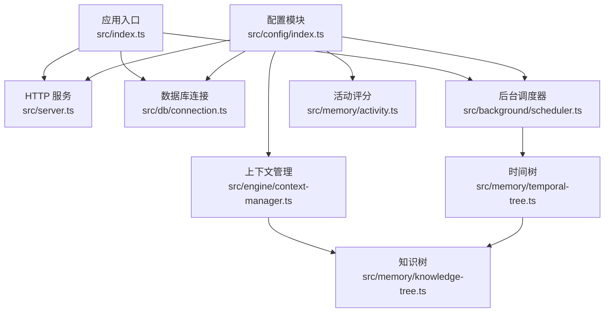
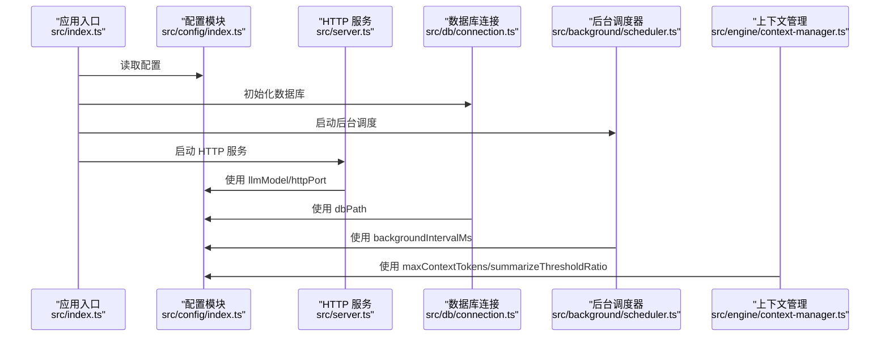
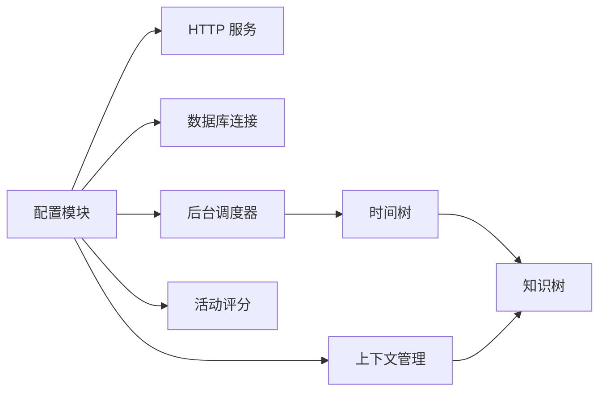

# 环境配置

<cite>
**本文引用的文件**
- [src/config/index.ts](file://src/config/index.ts)
- [src/server.ts](file://src/server.ts)
- [src/db/connection.ts](file://src/db/connection.ts)
- [src/background/scheduler.ts](file://src/background/scheduler.ts)
- [src/background/temporal-summarizer.ts](file://src/background/temporal-summarizer.ts)
- [src/engine/context-manager.ts](file://src/engine/context-manager.ts)
- [src/memory/temporal-tree.ts](file://src/memory/temporal-tree.ts)
- [src/memory/knowledge-tree.ts](file://src/memory/knowledge-tree.ts)
- [src/memory/activity.ts](file://src/memory/activity.ts)
- [src/index.ts](file://src/index.ts)
- [package.json](file://package.json)
- [tests/engine/context-manager.test.ts](file://tests/engine/context-manager.test.ts)
- [src/utils/logger.ts](file://src/utils/logger.ts)
</cite>

## 目录
1. [简介](#简介)
2. [项目结构](#项目结构)
3. [核心组件](#核心组件)
4. [架构总览](#架构总览)
5. [详细组件分析](#详细组件分析)
6. [依赖分析](#依赖分析)
7. [性能考虑](#性能考虑)
8. [故障排查指南](#故障排查指南)
9. [结论](#结论)
10. [附录](#附录)

## 简介
本文件系统性梳理 TreeMemory 的环境配置，覆盖 LLM 供应商配置、上下文与记忆参数、数据库设置、服务器端口、后台任务间隔以及活动衰减与提升等参数。文档逐项说明每个配置项的作用、默认值、取值范围与推荐设置，并给出本地开发、容器化与生产环境的配置示例，最后提供配置验证规则、错误处理机制与最佳实践。

## 项目结构
与环境配置直接相关的模块分布如下：
- 配置入口：读取 .env 并导出全局配置对象
- 服务启动：基于配置启动 HTTP 服务
- 数据库连接：根据配置打开 SQLite 数据库
- 后台调度：按配置周期执行时间树汇总与知识抽取
- 上下文管理：依据配置计算阈值与预算
- 记忆模块：时间树与知识树在运行时读取配置参与活动评分与检索
- 日志：日志级别可由环境变量控制

图表来源
- [src/config/index.ts:1-30](file://src/config/index.ts#L1-L30)
- [src/server.ts:15-165](file://src/server.ts#L15-L165)
- [src/db/connection.ts:8-26](file://src/db/connection.ts#L8-L26)
- [src/background/scheduler.ts:26-46](file://src/background/scheduler.ts#L26-L46)
- [src/engine/context-manager.ts:13-102](file://src/engine/context-manager.ts#L13-L102)
- [src/memory/temporal-tree.ts:28-363](file://src/memory/temporal-tree.ts#L28-L363)
- [src/memory/knowledge-tree.ts:27-239](file://src/memory/knowledge-tree.ts#L27-L239)
- [src/memory/activity.ts:9-51](file://src/memory/activity.ts#L9-L51)
- [src/index.ts:4-36](file://src/index.ts#L4-L36)

章节来源
- [src/config/index.ts:1-30](file://src/config/index.ts#L1-L30)
- [src/server.ts:15-165](file://src/server.ts#L15-L165)
- [src/db/connection.ts:8-26](file://src/db/connection.ts#L8-L26)
- [src/background/scheduler.ts:26-46](file://src/background/scheduler.ts#L26-L46)
- [src/engine/context-manager.ts:13-102](file://src/engine/context-manager.ts#L13-L102)
- [src/memory/temporal-tree.ts:28-363](file://src/memory/temporal-tree.ts#L28-L363)
- [src/memory/knowledge-tree.ts:27-239](file://src/memory/knowledge-tree.ts#L27-L239)
- [src/memory/activity.ts:9-51](file://src/memory/activity.ts#L9-L51)
- [src/index.ts:4-36](file://src/index.ts#L4-L36)

## 核心组件
- 配置接口与默认值：集中于配置模块，统一读取环境变量并提供默认值
- 服务器端口：HTTP 服务监听端口由配置决定
- 数据库路径：SQLite 文件路径由配置决定
- 后台任务间隔：定时执行时间树汇总与知识抽取
- 上下文与阈值：最大上下文令牌数与摘要阈值比例共同决定何时进行历史摘要
- 活动评分：时间衰减率与活动提升幅度影响检索与展示权重

章节来源
- [src/config/index.ts:5-29](file://src/config/index.ts#L5-L29)
- [src/server.ts:158-160](file://src/server.ts#L158-L160)
- [src/db/connection.ts:9-17](file://src/db/connection.ts#L9-L17)
- [src/background/scheduler.ts:26-34](file://src/background/scheduler.ts#L26-L34)
- [src/engine/context-manager.ts:13-15](file://src/engine/context-manager.ts#L13-L15)
- [src/memory/activity.ts:9-12](file://src/memory/activity.ts#L9-L12)

## 架构总览
下图展示了配置在系统中的关键作用点：从应用入口加载配置，到服务、数据库、后台调度、上下文管理与记忆模块的使用。

图表来源
- [src/index.ts:4-36](file://src/index.ts#L4-L36)
- [src/config/index.ts:18-29](file://src/config/index.ts#L18-L29)
- [src/server.ts:158-160](file://src/server.ts#L158-L160)
- [src/db/connection.ts:9-17](file://src/db/connection.ts#L9-L17)
- [src/background/scheduler.ts:26-34](file://src/background/scheduler.ts#L26-L34)
- [src/engine/context-manager.ts:13-15](file://src/engine/context-manager.ts#L13-L15)

## 详细组件分析

### 配置接口与默认值
- 配置接口定义了全部可配置项，包括 LLM 供应商、上下文与记忆、数据库、服务器端口、后台任务间隔以及活动评分相关参数
- 默认值来源于环境变量或硬编码默认值，未提供的环境变量将采用默认值
- 配置在应用启动时一次性读取并冻结，后续模块通过导入配置对象使用

章节来源
- [src/config/index.ts:5-29](file://src/config/index.ts#L5-L29)

### LLM 供应商配置
- LLM_BASE_URL：LLM 服务基础地址，默认指向 OpenAI 兼容接口
- LLM_API_KEY：访问密钥，用于鉴权
- LLM_MODEL：模型名称，默认为常用模型标识
- 使用位置：HTTP 服务在非流式与流式响应中均会使用该模型名作为返回字段；实际推理调用由 LLM 客户端封装

章节来源
- [src/config/index.ts:18-21](file://src/config/index.ts#L18-L21)
- [src/server.ts:89-108](file://src/server.ts#L89-L108)
- [src/server.ts:49-82](file://src/server.ts#L49-L82)

### 上下文管理参数
- MAX_CONTEXT_TOKENS：最大上下文令牌数，决定一次对话可承载的历史量级
- SUMMARIZE_THRESHOLD_RATIO：摘要阈值比例，当缓冲区占用超过该比例时触发历史摘要
- 使用位置：阈值判断与预算计算均依赖这两个参数
- 关键公式：是否需要摘要取决于缓冲区令牌数与阈值的比较；预算计算预留系统提示与回复空间

章节来源
- [src/config/index.ts:22-23](file://src/config/index.ts#L22-L23)
- [src/engine/context-manager.ts:13-15](file://src/engine/context-manager.ts#L13-L15)
- [src/engine/context-manager.ts:96-102](file://src/engine/context-manager.ts#L96-L102)

### 数据库设置
- DB_PATH：SQLite 数据库文件路径，默认位于项目根目录
- 使用位置：数据库连接模块在首次访问时创建连接并启用 WAL 模式与外键约束
- 影响：数据库文件位置与权限直接影响服务可用性

章节来源
- [src/config/index.ts:24](file://src/config/index.ts#L24)
- [src/db/connection.ts:9-17](file://src/db/connection.ts#L9-L17)

### 服务器配置
- HTTP_PORT：HTTP 服务监听端口，默认 3000
- 使用位置：服务启动时绑定端口并输出启动日志

章节来源
- [src/config/index.ts:25](file://src/config/index.ts#L25)
- [src/server.ts:158-160](file://src/server.ts#L158-L160)

### 后台任务参数
- BACKGROUND_INTERVAL_MS：后台调度间隔毫秒数，默认 60000（1 分钟）
- 使用位置：调度器以该间隔循环执行时间树汇总与知识抽取；启动后立即执行一次
- 影响：过短可能增加 LLM 调用成本与负载，过长可能导致历史节点未及时压缩

章节来源
- [src/config/index.ts:26](file://src/config/index.ts#L26)
- [src/background/scheduler.ts:26-34](file://src/background/scheduler.ts#L26-L34)

### 活动评分相关参数
- ACTIVITY_DECAY_RATE：活动分数的时间衰减率，用于计算有效分数
- ACTIVITY_BOOST：激活节点时的分数提升幅度，同时对祖先节点按比例提升
- 使用位置：活动评分计算与节点激活传播

章节来源
- [src/config/index.ts:27-28](file://src/config/index.ts#L27-L28)
- [src/memory/activity.ts:9-12](file://src/memory/activity.ts#L9-L12)
- [src/memory/activity.ts:18-50](file://src/memory/activity.ts#L18-L50)

### 配置项之间的依赖关系与约束
- 上下文阈值与预算：MAX_CONTEXT_TOKENS 与 SUMMARIZE_THRESHOLD_RATIO 共同决定何时进行摘要；预算计算预留固定比例的回复空间
- 后台任务与 LLM 成本：BACKGROUND_INTERVAL_MS 过小会频繁触发时间树汇总，增加 LLM 调用频率与费用
- 活动评分与检索：ACTIVITY_DECAY_RATE 决定长期记忆权重衰减速度，ACTIVITY_BOOST 决定短期活跃度提升幅度
- 数据库与端口：DB_PATH 必须可写，HTTP_PORT 必须未被占用且防火墙放行

章节来源
- [src/engine/context-manager.ts:13-15](file://src/engine/context-manager.ts#L13-L15)
- [src/engine/context-manager.ts:96-102](file://src/engine/context-manager.ts#L96-L102)
- [src/background/scheduler.ts:26-34](file://src/background/scheduler.ts#L26-L34)
- [src/memory/activity.ts:9-12](file://src/memory/activity.ts#L9-L12)
- [src/memory/activity.ts:18-50](file://src/memory/activity.ts#L18-L50)

### 配置验证规则与错误处理
- 类型转换：数值类配置通过解析函数进行转换，失败时采用默认值
- 端口与路径：端口需为整数，路径需可写；异常会在启动阶段暴露
- 日志级别：可通过环境变量设置日志级别，便于定位配置问题
- 测试校验：单元测试通过模拟配置验证阈值判断与预算计算逻辑

章节来源
- [src/config/index.ts:18-29](file://src/config/index.ts#L18-L29)
- [src/utils/logger.ts:8](file://src/utils/logger.ts#L8)
- [tests/engine/context-manager.test.ts:4-17](file://tests/engine/context-manager.test.ts#L4-L17)

### 配置文件模板与最佳实践
- .env 模板（示意）
  - LLM_BASE_URL=https://api.openai.com/v1
  - LLM_API_KEY=your_api_key
  - LLM_MODEL=gpt-4o
  - MAX_CONTEXT_TOKENS=8192
  - SUMMARIZE_THRESHOLD_RATIO=0.75
  - DB_PATH=./treememory.db
  - HTTP_PORT=3000
  - BACKGROUND_INTERVAL_MS=60000
  - ACTIVITY_DECAY_RATE=0.95
  - ACTIVITY_BOOST=1.0
  - LOG_LEVEL=info
- 最佳实践
  - 开发环境：保持默认端口与较小上下文，便于快速迭代
  - 容器环境：通过环境变量注入，避免硬编码；持久化 DB_PATH 到挂载卷
  - 生产环境：合理设置 BACKGROUND_INTERVAL_MS 控制 LLM 成本；监控日志级别与数据库磁盘空间

章节来源
- [src/config/index.ts:18-29](file://src/config/index.ts#L18-L29)
- [src/utils/logger.ts:8](file://src/utils/logger.ts#L8)

## 依赖分析
- 配置模块是全局单例，被服务、数据库、调度器、上下文管理与记忆模块广泛依赖
- 调度器依赖时间树模块执行汇总；时间树与知识树依赖数据库连接
- 上下文管理依赖 LLM 客户端与分词器，最终受配置中的模型与上下文参数影响

图表来源
- [src/config/index.ts:18-29](file://src/config/index.ts#L18-L29)
- [src/server.ts:15-165](file://src/server.ts#L15-L165)
- [src/db/connection.ts:8-26](file://src/db/connection.ts#L8-L26)
- [src/background/scheduler.ts:1-46](file://src/background/scheduler.ts#L1-L46)
- [src/engine/context-manager.ts:1-103](file://src/engine/context-manager.ts#L1-L103)
- [src/memory/temporal-tree.ts:1-363](file://src/memory/temporal-tree.ts#L1-L363)
- [src/memory/knowledge-tree.ts:1-239](file://src/memory/knowledge-tree.ts#L1-L239)
- [src/memory/activity.ts:1-51](file://src/memory/activity.ts#L1-L51)

## 性能考虑
- 后台任务间隔：缩短间隔可更快压缩历史，但会增加 LLM 调用频次与成本；建议结合业务负载调整
- 上下文预算：适当提高 MAX_CONTEXT_TOKENS 可减少摘要频率，但会增加单次推理成本；需平衡吞吐与质量
- 活动评分：降低衰减率可保留更久的记忆权重，但可能影响检索效率；提升幅度过大可能造成热点节点过度膨胀

## 故障排查指南
- 无法启动 HTTP 服务：检查端口占用与权限；确认配置端口有效
- 数据库无法打开：检查 DB_PATH 是否存在且可写；确认 SQLite 文件权限
- 后台任务不执行：检查 BACKGROUND_INTERVAL_MS 是否为正整数；确认调度器已启动
- LLM 接口异常：核对 LLM_BASE_URL 与 LLM_API_KEY；确认网络可达与配额充足
- 日志级别：通过 LOG_LEVEL 调整日志详细程度，便于定位问题

章节来源
- [src/server.ts:158-160](file://src/server.ts#L158-L160)
- [src/db/connection.ts:9-17](file://src/db/connection.ts#L9-L17)
- [src/background/scheduler.ts:26-34](file://src/background/scheduler.ts#L26-L34)
- [src/utils/logger.ts:8](file://src/utils/logger.ts#L8)

## 结论
本文档系统化梳理了 TreeMemory 的环境配置，明确了各参数的作用、默认值与推荐设置，并给出了多场景配置示例与最佳实践。通过理解配置间的依赖关系与约束，可在不同部署环境中实现稳定、高效与低成本的运行。

## 附录
- 支持的运行时版本：Node.js >= 18
- 依赖工具：dotenv、better-sqlite3、fastify、pino、ulid 等

章节来源
- [package.json:14-27](file://package.json#L14-L27)