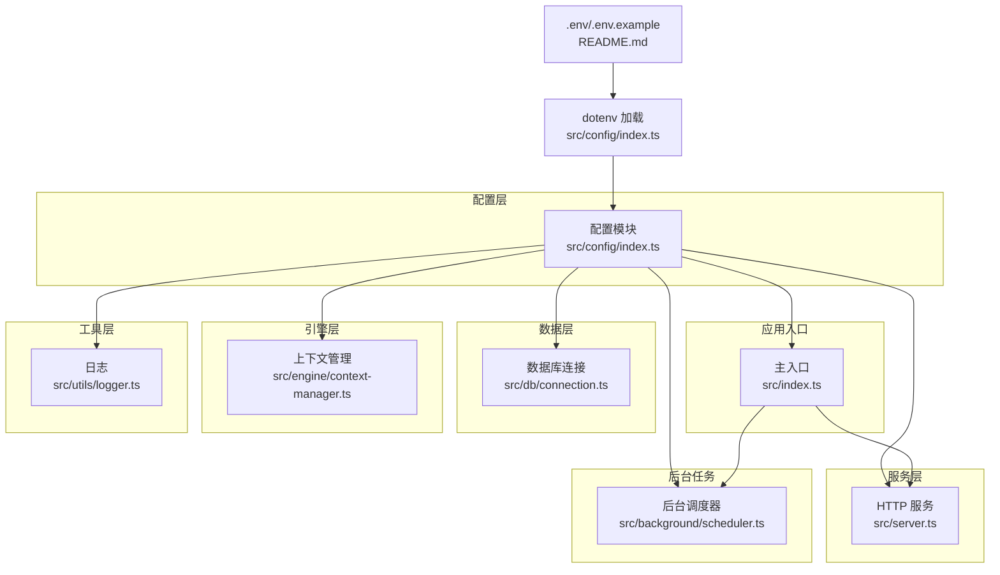
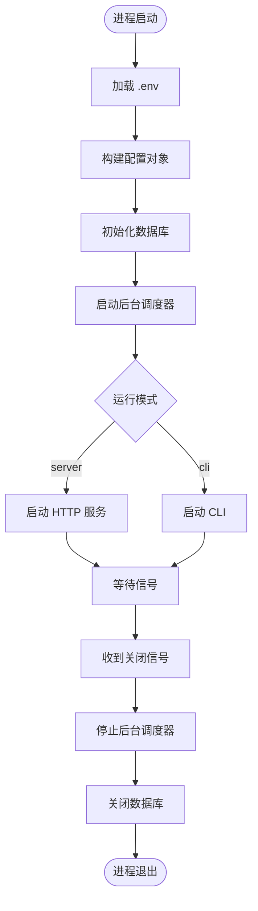
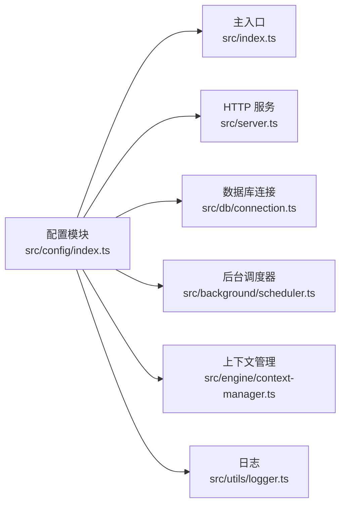

# 运行时配置

<cite>
**本文引用的文件**
- [src/config/index.ts](file://src/config/index.ts)
- [src/index.ts](file://src/index.ts)
- [src/server.ts](file://src/server.ts)
- [src/db/connection.ts](file://src/db/connection.ts)
- [src/background/scheduler.ts](file://src/background/scheduler.ts)
- [src/engine/context-manager.ts](file://src/engine/context-manager.ts)
- [src/utils/logger.ts](file://src/utils/logger.ts)
- [package.json](file://package.json)
- [README.md](file://README.md)
</cite>

## 目录
1. [简介](#简介)
2. [项目结构](#项目结构)
3. [核心组件](#核心组件)
4. [架构总览](#架构总览)
5. [详细组件分析](#详细组件分析)
6. [依赖关系分析](#依赖关系分析)
7. [性能考量](#性能考量)
8. [故障排查指南](#故障排查指南)
9. [结论](#结论)
10. [附录](#附录)

## 简介
本文件系统性阐述 TreeMemory 的运行时配置体系，重点说明以下方面：
- 配置加载顺序与优先级规则（含环境变量覆盖机制与默认值策略）
- AppConfig 接口结构与字段类型转换逻辑
- 配置验证与类型安全实现细节
- 应用启动过程中的初始化时机与生命周期管理
- 配置热更新与动态调整的支持现状与建议
- 配置变更的监控与审计机制
- 配置备份与恢复最佳实践
- 常见配置问题的诊断与解决方法

## 项目结构
TreeMemory 的配置由单一入口模块集中管理，采用“环境变量驱动 + 默认值”的方式加载，随后在整个应用生命周期内被多个子系统共享使用。

**图示来源**
- [src/config/index.ts:1-30](file://src/config/index.ts#L1-L30)
- [src/index.ts:1-36](file://src/index.ts#L1-L36)
- [src/server.ts:1-165](file://src/server.ts#L1-L165)
- [src/db/connection.ts:1-26](file://src/db/connection.ts#L1-L26)
- [src/background/scheduler.ts:1-46](file://src/background/scheduler.ts#L1-L46)
- [src/engine/context-manager.ts:1-103](file://src/engine/context-manager.ts#L1-L103)
- [src/utils/logger.ts:1-10](file://src/utils/logger.ts#L1-L10)
- [README.md:68-82](file://README.md#L68-L82)

**章节来源**
- [src/config/index.ts:1-30](file://src/config/index.ts#L1-L30)
- [README.md:68-82](file://README.md#L68-L82)

## 核心组件
- 配置模块：负责加载 .env 并导出全局只读配置对象；所有其他模块通过导入该对象使用配置。
- 主入口：在应用启动时初始化数据库与后台调度器，并根据参数选择 CLI 或 Server 模式。
- 服务层：HTTP 服务器监听配置端口，调用对话引擎与记忆模块。
- 数据层：数据库连接使用配置的路径与 WAL/外键设置。
- 后台任务：按配置的时间间隔执行时间树汇总与知识抽取。
- 引擎层：对话上下文组装与摘要阈值计算使用配置的令牌预算与阈值。
- 工具层：日志级别受环境变量控制。

**章节来源**
- [src/config/index.ts:1-30](file://src/config/index.ts#L1-L30)
- [src/index.ts:1-36](file://src/index.ts#L1-L36)
- [src/server.ts:1-165](file://src/server.ts#L1-L165)
- [src/db/connection.ts:1-26](file://src/db/connection.ts#L1-L26)
- [src/background/scheduler.ts:1-46](file://src/background/scheduler.ts#L1-L46)
- [src/engine/context-manager.ts:1-103](file://src/engine/context-manager.ts#L1-L103)
- [src/utils/logger.ts:1-10](file://src/utils/logger.ts#L1-L10)

## 架构总览
配置在应用启动阶段一次性加载，形成不可变的全局配置对象。后续各模块仅读取该对象，不进行二次修改，从而保证类型安全与一致性。

```mermaid
sequenceDiagram
participant Proc as "进程"
participant Dotenv as "dotenv 加载"
participant Cfg as "配置模块"
participant Main as "主入口"
participant Srv as "HTTP 服务"
participant Db as "数据库"
participant Sch as "后台调度器"
Proc->>Dotenv : "加载 .env"
Dotenv-->>Cfg : "注入 process.env"
Cfg-->>Main : "导出全局配置对象"
Main->>Db : "初始化数据库连接"
Main->>Sch : "启动后台调度器"
Proc->>Srv : "启动 HTTP 服务"
Srv->>Cfg : "读取端口等配置"
```

**图示来源**
- [src/config/index.ts:1-30](file://src/config/index.ts#L1-L30)
- [src/index.ts:1-36](file://src/index.ts#L1-L36)
- [src/server.ts:1-165](file://src/server.ts#L1-L165)
- [src/db/connection.ts:1-26](file://src/db/connection.ts#L1-L26)
- [src/background/scheduler.ts:1-46](file://src/background/scheduler.ts#L1-L46)

## 详细组件分析

### 配置加载顺序与优先级规则
- 加载顺序
  1) 应用启动时，配置模块首先调用 dotenv 加载 .env 文件至 process.env。
  2) 随后，配置模块从 process.env 读取各键值，并赋予默认值，最终导出全局配置对象。
  3) 其他模块通过静态导入使用该对象，确保全局一致。
- 优先级规则
  - 环境变量优先于默认值：若对应环境变量存在，则使用其值；否则回退到默认值。
  - .env 示例文件用于约定可用键名与默认值，实际生效以 .env 中的值为准。
  - 日志级别可通过 LOG_LEVEL 控制，不影响其他配置项的优先级。
- 验证与类型转换
  - 字符串到数值的转换遵循严格模式：整数使用十进制解析，浮点数使用十进制解析。
  - 若解析失败，将沿用默认值，避免运行时异常。
- 配置合并策略
  - 当前实现为“环境变量覆盖默认值”，不存在多源合并或分层合并逻辑。
  - 不同环境（开发/生产）通过 .env 文件切换，不涉及运行时动态合并。

**章节来源**
- [src/config/index.ts:1-30](file://src/config/index.ts#L1-L30)
- [README.md:189-205](file://README.md#L189-L205)
- [src/utils/logger.ts:1-10](file://src/utils/logger.ts#L1-L10)

### AppConfig 接口与字段说明
AppConfig 定义了应用所需的核心配置项，字段与默认值如下：

- llmBaseUrl: 字符串，默认值来自环境变量或内置默认
- llmApiKey: 字符串，默认值来自环境变量
- llmModel: 字符串，默认值来自环境变量或内置默认
- maxContextTokens: 整数，默认值来自环境变量或内置默认
- summarizeThresholdRatio: 浮点数，默认值来自环境变量或内置默认
- dbPath: 字符串，默认值来自环境变量或内置默认
- httpPort: 整数，默认值来自环境变量或内置默认
- backgroundIntervalMs: 整数，默认值来自环境变量或内置默认
- activityDecayRate: 浮点数，默认值来自环境变量或内置默认
- activityBoost: 浮点数，默认值来自环境变量或内置默认

类型转换逻辑
- 整数字段：使用十进制解析，失败则回退默认值
- 浮点数字段：使用十进制解析，失败则回退默认值
- 字符串字段：直接使用环境变量值，若为空则回退默认值

**章节来源**
- [src/config/index.ts:5-29](file://src/config/index.ts#L5-L29)
- [README.md:193-204](file://README.md#L193-L204)

### 配置验证与类型安全
- 类型安全
  - 通过 TypeScript 接口约束配置结构，确保编译期类型检查。
  - 所有模块对配置的访问均通过统一导入，避免分散的类型风险。
- 运行时验证
  - 当前实现未包含显式的运行时校验（如范围检查、必填校验）。
  - 建议在配置模块增加校验函数，对关键字段进行范围与必填性检查，并在异常时抛出明确错误。

**章节来源**
- [src/config/index.ts:5-29](file://src/config/index.ts#L5-L29)

### 初始化时机与生命周期管理
- 初始化时机
  - 配置在模块首次导入时完成加载与转换，随后成为全局只读对象。
  - 主入口在启动时先初始化数据库连接，再启动后台调度器，最后根据模式启动 HTTP 服务或 CLI。
- 生命周期
  - 配置对象在进程生命周期内保持不变，不支持运行时热更新。
  - 应用优雅关闭时，停止后台调度器并关闭数据库连接。

**图示来源**
- [src/index.ts:4-30](file://src/index.ts#L4-L30)
- [src/db/connection.ts:8-17](file://src/db/connection.ts#L8-L17)
- [src/background/scheduler.ts:26-45](file://src/background/scheduler.ts#L26-L45)

**章节来源**
- [src/index.ts:1-36](file://src/index.ts#L1-L36)
- [src/db/connection.ts:1-26](file://src/db/connection.ts#L1-L26)
- [src/background/scheduler.ts:1-46](file://src/background/scheduler.ts#L1-L46)

### 配置热更新与动态调整
- 支持现状
  - 当前实现不支持运行时热更新：配置在进程启动时一次性加载，之后不再改变。
  - 若需调整配置，必须重启进程以重新加载 .env 并重建配置对象。
- 建议方案
  - 在配置模块增加“监听与重载”机制：监听 .env 变更或外部配置中心推送，触发配置重建与模块通知。
  - 对关键配置（如端口、令牌预算）提供最小侵入的热更新能力，同时确保状态一致性。

**章节来源**
- [src/config/index.ts:1-30](file://src/config/index.ts#L1-L30)

### 配置变更监控与审计
- 现状
  - 未发现专门的配置变更监控与审计机制。
- 建议
  - 在配置模块增加“变更钩子”：记录每次配置重建的键值变化与时间戳。
  - 结合日志系统输出配置摘要，便于审计与排障。

**章节来源**
- [src/config/index.ts:1-30](file://src/config/index.ts#L1-L30)
- [src/utils/logger.ts:1-10](file://src/utils/logger.ts#L1-L10)

### 配置备份与恢复最佳实践
- 备份
  - 将 .env 文件纳入版本控制或私有仓库，保留历史快照。
  - 对生产环境的敏感配置，使用密钥管理服务（如 KMS/Secrets Manager）存储与轮换。
- 恢复
  - 通过 .env 快照快速回滚到已知稳定版本。
  - 对关键配置（如 LLM API 密钥、数据库路径）提供自动化校验脚本，确保恢复后可用性。

**章节来源**
- [README.md:68-82](file://README.md#L68-L82)

## 依赖关系分析
配置模块是应用的“数据中枢”，被多个子系统依赖，耦合度低、内聚性强。

**图示来源**
- [src/config/index.ts:1-30](file://src/config/index.ts#L1-L30)
- [src/index.ts:1-36](file://src/index.ts#L1-L36)
- [src/server.ts:1-165](file://src/server.ts#L1-L165)
- [src/db/connection.ts:1-26](file://src/db/connection.ts#L1-L26)
- [src/background/scheduler.ts:1-46](file://src/background/scheduler.ts#L1-L46)
- [src/engine/context-manager.ts:1-103](file://src/engine/context-manager.ts#L1-L103)
- [src/utils/logger.ts:1-10](file://src/utils/logger.ts#L1-L10)

**章节来源**
- [src/config/index.ts:1-30](file://src/config/index.ts#L1-L30)

## 性能考量
- 配置读取成本极低：仅在模块首次导入时发生一次解析，后续为常量访问。
- 数值解析失败的回退策略避免了运行时异常，提升了稳定性。
- 建议
  - 对高频使用的配置（如端口、令牌预算）进行缓存访问，减少重复读取。
  - 在大型部署中，将 .env 存储在高性能文件系统或内存盘，缩短加载时间。

[本节为通用指导，无需特定文件引用]

## 故障排查指南
- 症状：服务无法启动或端口占用
  - 排查：确认 HTTP_PORT 是否被占用；检查 .env 中端口配置是否有效。
  - 解决：更换端口或释放占用端口。
- 症状：LLM 请求失败或鉴权错误
  - 排查：确认 LLM_API_KEY 是否正确；检查 LLM_BASE_URL 与 LLM_MODEL。
  - 解决：修正 .env 中对应键值；必要时启用本地 LLM 服务。
- 症状：数据库无法打开或迁移失败
  - 排查：确认 DB_PATH 是否可写；检查文件权限与磁盘空间。
  - 解决：修复路径与权限；清理损坏的数据库文件后重启。
- 症状：后台任务未执行
  - 排查：确认 BACKGROUND_INTERVAL_MS 是否合理；检查日志中调度器启动信息。
  - 解决：调整间隔或检查系统时间同步。
- 症状：日志级别不符合预期
  - 排查：确认 LOG_LEVEL 是否设置；检查日志输出目标。
  - 解决：设置正确的日志级别并重启进程。

**章节来源**
- [src/server.ts:155-164](file://src/server.ts#L155-L164)
- [src/db/connection.ts:8-17](file://src/db/connection.ts#L8-L17)
- [src/background/scheduler.ts:26-34](file://src/background/scheduler.ts#L26-L34)
- [src/utils/logger.ts:1-10](file://src/utils/logger.ts#L1-L10)
- [README.md:189-205](file://README.md#L189-L205)

## 结论
TreeMemory 的配置系统以“环境变量 + 默认值”为核心，结构清晰、易于维护。当前实现强调简单与稳定，未包含复杂的合并与热更新机制。建议在不破坏现有设计的前提下，逐步引入运行时校验、变更审计与最小化热更新能力，以满足更高可用性与可观测性的需求。

[本节为总结性内容，无需特定文件引用]

## 附录

### 配置键清单与默认值
- LLM_BASE_URL: 默认值来自内置默认
- LLM_API_KEY: 默认值来自内置默认
- LLM_MODEL: 默认值来自内置默认
- MAX_CONTEXT_TOKENS: 默认值来自内置默认
- SUMMARIZE_THRESHOLD_RATIO: 默认值来自内置默认
- DB_PATH: 默认值来自内置默认
- HTTP_PORT: 默认值来自内置默认
- BACKGROUND_INTERVAL_MS: 默认值来自内置默认
- ACTIVITY_DECAY_RATE: 默认值来自内置默认
- ACTIVITY_BOOST: 默认值来自内置默认

**章节来源**
- [README.md:193-204](file://README.md#L193-L204)
- [src/config/index.ts:18-29](file://src/config/index.ts#L18-L29)

### 启动与运行模式
- CLI 模式：交互式命令行
- Server 模式：HTTP API 服务，监听配置端口

**章节来源**
- [README.md:84-96](file://README.md#L84-L96)
- [src/index.ts:23-29](file://src/index.ts#L23-L29)

### 依赖与运行时要求
- Node.js 版本要求：>= 18
- 关键依赖：dotenv、better-sqlite3、fastify、pino 等

**章节来源**
- [package.json:14-32](file://package.json#L14-L32)