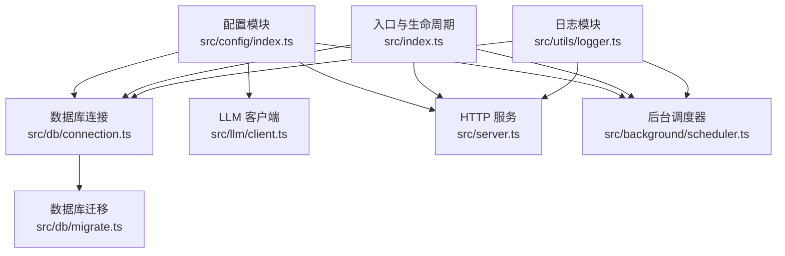
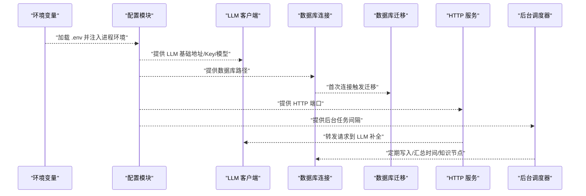
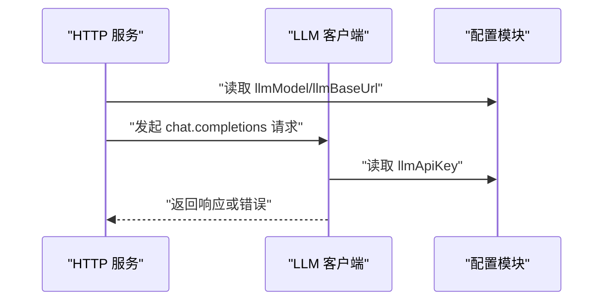
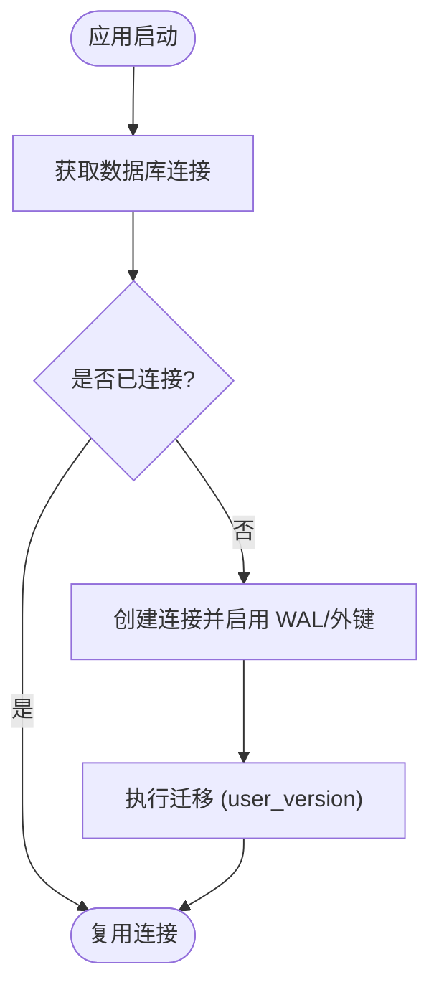
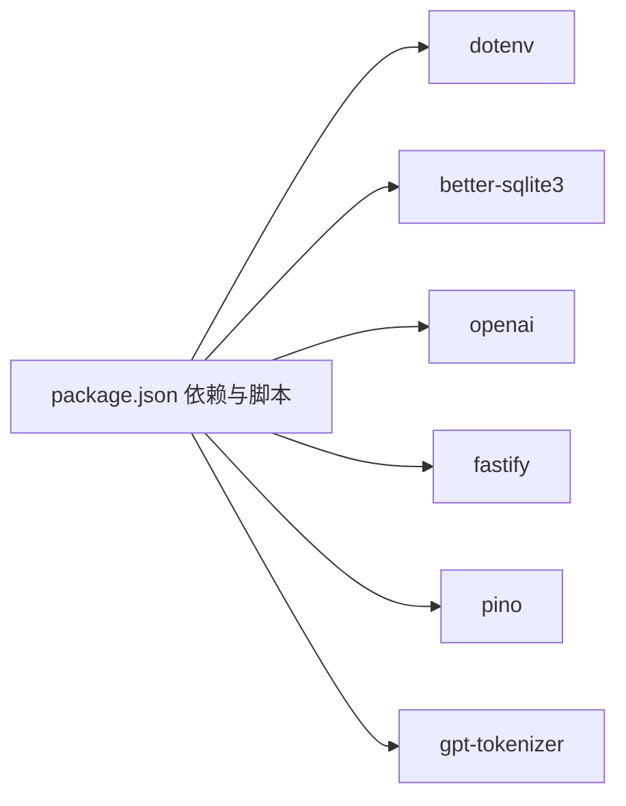
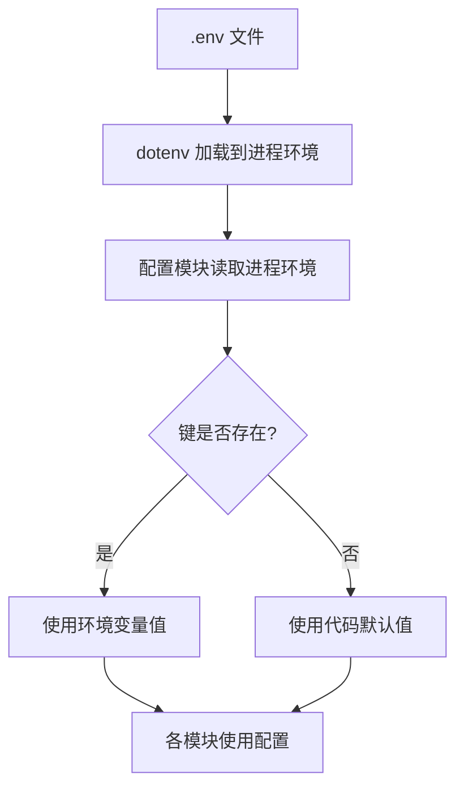

# 配置管理

<cite>
**本文引用的文件**
- [src/config/index.ts](file://src/config/index.ts)
- [src/db/connection.ts](file://src/db/connection.ts)
- [src/db/migrate.ts](file://src/db/migrate.ts)
- [src/llm/client.ts](file://src/llm/client.ts)
- [src/server.ts](file://src/server.ts)
- [src/index.ts](file://src/index.ts)
- [src/background/scheduler.ts](file://src/background/scheduler.ts)
- [src/utils/logger.ts](file://src/utils/logger.ts)
- [package.json](file://package.json)
- [.gitignore](file://.gitignore)
</cite>

## 目录
1. [简介](#简介)
2. [项目结构](#项目结构)
3. [核心组件](#核心组件)
4. [架构总览](#架构总览)
5. [详细组件分析](#详细组件分析)
6. [依赖分析](#依赖分析)
7. [性能考虑](#性能考虑)
8. [故障排查指南](#故障排查指南)
9. [结论](#结论)
10. [附录](#附录)

## 简介
本文件系统性梳理 TreeMemory 的配置管理体系，覆盖 LLM 供应商配置、数据库连接与迁移、内存与性能参数、日志与后台任务等关键配置项；明确配置加载顺序与优先级（环境变量为主）；给出开发/测试/生产三类环境的配置建议；说明安全注意事项（API 密钥与敏感数据）、配置验证与错误处理、热更新与动态调整现状、配置迁移与版本兼容策略，以及常见问题诊断。

## 项目结构
配置相关的核心位置集中在以下模块：
- 配置定义与加载：src/config/index.ts
- 数据库连接与迁移：src/db/connection.ts、src/db/migrate.ts
- LLM 客户端：src/llm/client.ts
- HTTP 服务与端口：src/server.ts
- 后台调度器：src/background/scheduler.ts
- 日志级别：src/utils/logger.ts
- 入口与进程生命周期：src/index.ts
- 依赖与脚本：package.json
- 忽略文件（含 .env）：.gitignore

图表来源
- [src/config/index.ts:1-30](file://src/config/index.ts#L1-L30)
- [src/db/connection.ts:1-26](file://src/db/connection.ts#L1-L26)
- [src/db/migrate.ts:1-88](file://src/db/migrate.ts#L1-L88)
- [src/llm/client.ts:1-56](file://src/llm/client.ts#L1-L56)
- [src/server.ts:1-165](file://src/server.ts#L1-L165)
- [src/background/scheduler.ts:1-46](file://src/background/scheduler.ts#L1-L46)
- [src/utils/logger.ts:1-10](file://src/utils/logger.ts#L1-L10)
- [src/index.ts:1-36](file://src/index.ts#L1-L36)

章节来源
- [src/config/index.ts:1-30](file://src/config/index.ts#L1-L30)
- [src/db/connection.ts:1-26](file://src/db/connection.ts#L1-L26)
- [src/db/migrate.ts:1-88](file://src/db/migrate.ts#L1-L88)
- [src/llm/client.ts:1-56](file://src/llm/client.ts#L1-L56)
- [src/server.ts:1-165](file://src/server.ts#L1-L165)
- [src/background/scheduler.ts:1-46](file://src/background/scheduler.ts#L1-L46)
- [src/utils/logger.ts:1-10](file://src/utils/logger.ts#L1-L10)
- [src/index.ts:1-36](file://src/index.ts#L1-L36)
- [package.json:1-34](file://package.json#L1-L34)
- [.gitignore:1-8](file://.gitignore#L1-L8)

## 核心组件
- 配置接口与默认值：集中于配置模块，提供 LLM 基础地址、API Key、模型名、上下文令牌上限、摘要阈值比例、数据库路径、HTTP 端口、后台任务间隔、活动衰减与提升等参数。
- LLM 客户端：基于配置中的 LLM 基础地址与 API Key 初始化 OpenAI 客户端，支持非流式与流式对话补全。
- 数据库连接与迁移：按配置的 dbPath 创建 SQLite 连接，启用 WAL 模式与外键约束，并在首次连接时执行迁移。
- HTTP 服务：监听配置的 httpPort，提供 OpenAI 兼容的聊天接口与内存/会话相关 API。
- 后台调度器：按配置的后台任务间隔周期运行时间树汇总与知识抽取等后台任务。
- 日志模块：日志级别由 LOG_LEVEL 控制，便于不同环境下的可观测性。

章节来源
- [src/config/index.ts:5-29](file://src/config/index.ts#L5-L29)
- [src/llm/client.ts:7-15](file://src/llm/client.ts#L7-L15)
- [src/db/connection.ts:8-17](file://src/db/connection.ts#L8-L17)
- [src/db/migrate.ts:4-87](file://src/db/migrate.ts#L4-L87)
- [src/server.ts:15-164](file://src/server.ts#L15-L164)
- [src/background/scheduler.ts:26-34](file://src/background/scheduler.ts#L26-L34)
- [src/utils/logger.ts:3-9](file://src/utils/logger.ts#L3-L9)

## 架构总览
下图展示配置在系统中的使用关系与数据流向：

图表来源
- [src/config/index.ts:1-30](file://src/config/index.ts#L1-L30)
- [src/llm/client.ts:7-15](file://src/llm/client.ts#L7-L15)
- [src/db/connection.ts:8-17](file://src/db/connection.ts#L8-L17)
- [src/db/migrate.ts:4-87](file://src/db/migrate.ts#L4-L87)
- [src/server.ts:15-164](file://src/server.ts#L15-L164)
- [src/background/scheduler.ts:26-34](file://src/background/scheduler.ts#L26-L34)

## 详细组件分析

### 配置接口与参数说明
- LLM 供应商配置
  - llmBaseUrl：LLM 服务基础地址，默认从环境变量读取，若未设置则采用常见默认值。
  - llmApiKey：LLM 服务 API Key，必须提供以启用外部 LLM 调用。
  - llmModel：模型名称，默认从环境变量读取。
- 上下文与摘要
  - maxContextTokens：最大上下文令牌数，用于控制对话上下文长度。
  - summarizeThresholdRatio：摘要阈值比例，用于判断何时对时间片段进行汇总。
- 数据库与持久化
  - dbPath：SQLite 数据库文件路径，默认位于项目根目录。
- 服务与网络
  - httpPort：HTTP 服务监听端口。
- 后台任务与内存
  - backgroundIntervalMs：后台任务轮询间隔。
  - activityDecayRate：节点活动分数衰减系数。
  - activityBoost：节点活动分数提升系数。

章节来源
- [src/config/index.ts:5-29](file://src/config/index.ts#L5-L29)

### 配置加载顺序与优先级
- 加载流程
  - 应用启动时自动加载 .env 文件至进程环境。
  - 配置模块从进程环境读取对应键值，未提供的键使用硬编码默认值。
- 优先级规则
  - 环境变量优先于代码默认值。
  - 代码默认值作为最终兜底。
- 注意事项
  - 若未设置 llmApiKey，LLM 调用将无法正常工作。
  - 若未设置 dbPath，将使用默认路径创建数据库文件。

章节来源
- [src/config/index.ts:1-3](file://src/config/index.ts#L1-L3)
- [src/config/index.ts:18-29](file://src/config/index.ts#L18-L29)

### LLM 客户端与配置集成
- 客户端初始化
  - 首次访问时根据配置创建客户端实例，避免重复初始化。
- 请求参数
  - 支持覆盖模型名、温度与最大生成 token 数。
- 错误处理
  - LLM 调用异常通过上层捕获并返回统一错误响应。

图表来源
- [src/server.ts:19-109](file://src/server.ts#L19-L109)
- [src/llm/client.ts:7-32](file://src/llm/client.ts#L7-L32)
- [src/config/index.ts:18-22](file://src/config/index.ts#L18-L22)

章节来源
- [src/llm/client.ts:7-32](file://src/llm/client.ts#L7-L32)
- [src/server.ts:19-109](file://src/server.ts#L19-L109)

### 数据库连接与迁移
- 连接行为
  - 首次访问时创建连接，启用 WAL 模式与外键约束。
  - 记录数据库路径日志，便于运维定位。
- 迁移策略
  - 首次连接时检查用户版本并执行初始模式迁移。
  - 迁移完成后记录完成日志。

图表来源
- [src/db/connection.ts:8-17](file://src/db/connection.ts#L8-L17)
- [src/db/migrate.ts:4-87](file://src/db/migrate.ts#L4-L87)

章节来源
- [src/db/connection.ts:8-25](file://src/db/connection.ts#L8-L25)
- [src/db/migrate.ts:4-87](file://src/db/migrate.ts#L4-L87)

### HTTP 服务与端口配置
- 端点与行为
  - 提供 OpenAI 兼容的聊天补全接口，支持流式与非流式两种模式。
  - 提供知识树与时间树查询、新增知识、会话列表与删除等接口。
- 监听配置
  - 服务监听配置的 httpPort，绑定到 0.0.0.0，便于容器与外部访问。

章节来源
- [src/server.ts:15-164](file://src/server.ts#L15-L164)
- [src/config/index.ts:24-25](file://src/config/index.ts#L24-L25)

### 后台调度器与性能参数
- 调度行为
  - 按配置的后台任务间隔定时执行时间树汇总与知识抽取。
  - 防止重叠执行，确保每次任务完成后才允许下次执行。
- 性能参数
  - backgroundIntervalMs：影响后台任务频率，越小越频繁但资源占用越高。
  - activityDecayRate/Boost：影响节点活跃度计算，决定检索与摘要的权重分配。

章节来源
- [src/background/scheduler.ts:9-34](file://src/background/scheduler.ts#L9-L34)
- [src/config/index.ts:26-28](file://src/config/index.ts#L26-L28)

### 日志与可观测性
- 日志级别
  - 由 LOG_LEVEL 控制，未设置时默认 info。
- 输出目标
  - 使用 pino 输出到标准输出，便于容器日志收集。

章节来源
- [src/utils/logger.ts:3-9](file://src/utils/logger.ts#L3-L9)

### 入口与生命周期
- 启动流程
  - 初始化数据库连接与后台调度器。
  - 根据命令行参数选择 CLI 或 Server 模式。
- 关闭流程
  - 捕获 SIGINT/SIGTERM，有序停止调度器与关闭数据库连接。

章节来源
- [src/index.ts:4-30](file://src/index.ts#L4-L30)

## 依赖分析
- 外部依赖与脚本
  - 依赖 dotenv、better-sqlite3、openai、fastify、pino、gpt-tokenizer 等。
  - 脚本提供 dev:cli、dev:server 等开发模式入口。
- 配置耦合
  - LLM 客户端、数据库连接、HTTP 服务、后台调度器均直接依赖配置模块。
  - 日志模块受环境变量 LOG_LEVEL 影响。

图表来源
- [package.json:17-32](file://package.json#L17-L32)

章节来源
- [package.json:17-32](file://package.json#L17-L32)

## 性能考虑
- LLM 上下文长度
  - 通过 maxContextTokens 控制上下文大小，避免超出模型限制导致失败。
- 摘要阈值
  - summarizeThresholdRatio 决定何时对时间片段进行汇总，合理设置可减少碎片化记忆。
- 后台任务频率
  - backgroundIntervalMs 越短，系统越“活跃”，但 CPU/IO 占用越高；应结合硬件与负载调优。
- 数据库模式
  - WAL 模式提升并发读写性能，外键约束保障一致性但可能带来写入开销。

章节来源
- [src/config/index.ts:22-23](file://src/config/index.ts#L22-L23)
- [src/config/index.ts:26-27](file://src/config/index.ts#L26-L27)
- [src/db/connection.ts:10-12](file://src/db/connection.ts#L10-L12)

## 故障排查指南
- LLM 无法访问
  - 检查 llmApiKey 是否设置；确认 llmBaseUrl 正确且网络可达。
- 数据库文件异常
  - 检查 dbPath 权限与磁盘空间；确认 .env 中 dbPath 设置正确。
- 服务端口占用
  - 修改 httpPort 或释放占用端口；确认防火墙放行。
- 后台任务不执行
  - 检查 backgroundIntervalMs 设置是否过长；查看日志中调度器启动与错误记录。
- 日志级别过低
  - 设置 LOG_LEVEL 为 debug/info/warn/error 以获得更详细输出。
- 环境变量未生效
  - 确认 .env 文件存在且被正确加载；重启进程使变更生效。

章节来源
- [src/config/index.ts:18-29](file://src/config/index.ts#L18-L29)
- [src/db/connection.ts:8-17](file://src/db/connection.ts#L8-L17)
- [src/server.ts:158-160](file://src/server.ts#L158-L160)
- [src/background/scheduler.ts:26-34](file://src/background/scheduler.ts#L26-L34)
- [src/utils/logger.ts:8](file://src/utils/logger.ts#L8)

## 结论
TreeMemory 的配置体系以环境变量为核心，配合少量硬编码默认值，实现简洁而可控的部署方式。通过配置模块集中管理 LLM、数据库、服务与后台任务的关键参数，既满足开发调试，也便于在测试与生产环境中快速切换。建议在生产中严格管理 .env 文件与密钥，结合日志与监控完善可观测性，并根据实际负载微调性能参数。

## 附录

### 配置参数一览表
- LLM 供应商
  - LLM_BASE_URL：LLM 基础地址
  - LLM_API_KEY：LLM API Key
  - LLM_MODEL：模型名称
- 上下文与摘要
  - MAX_CONTEXT_TOKENS：最大上下文令牌数
  - SUMMARIZE_THRESHOLD_RATIO：摘要阈值比例
- 数据库
  - DB_PATH：SQLite 文件路径
- 服务
  - HTTP_PORT：HTTP 监听端口
- 后台任务与内存
  - BACKGROUND_INTERVAL_MS：后台任务间隔（毫秒）
  - ACTIVITY_DECAY_RATE：活动衰减系数
  - ACTIVITY_BOOST：活动提升系数
- 日志
  - LOG_LEVEL：日志级别

章节来源
- [src/config/index.ts:5-29](file://src/config/index.ts#L5-L29)

### 配置加载与优先级流程图

图表来源
- [src/config/index.ts:1-3](file://src/config/index.ts#L1-L3)
- [src/config/index.ts:18-29](file://src/config/index.ts#L18-L29)

### 环境示例与最佳实践
- 开发环境
  - 设置较小的 BACKGROUND_INTERVAL_MS 以便快速观察后台效果；开启较低的 MAX_CONTEXT_TOKENS 便于调试。
- 测试环境
  - 使用独立的 DB_PATH，避免与本地冲突；设置 LOG_LEVEL=debug。
- 生产环境
  - 严格管理 LLM_API_KEY，避免明文泄露；设置合理的 HTTP_PORT 与安全组；根据负载调整 BACKGROUND_INTERVAL_MS 与 ACTIVITY_DECAY_RATE。

章节来源
- [src/config/index.ts:18-29](file://src/config/index.ts#L18-L29)
- [src/utils/logger.ts:8](file://src/utils/logger.ts#L8)

### 安全与敏感数据
- API 密钥管理
  - 仅通过环境变量注入，不在代码仓库中提交 .env；使用只读权限保护 .env 文件。
- 敏感数据处理
  - 不在日志中打印 API Key；避免将 dbPath 暴露在公网可访问的配置中。
- 文件忽略
  - .gitignore 已包含 .env 与日志文件，确保不会被纳入版本控制。

章节来源
- [.gitignore:7](file://.gitignore#L7)
- [src/utils/logger.ts:3-9](file://src/utils/logger.ts#L3-L9)

### 配置验证与错误处理
- 验证要点
  - 确保 LLM_API_KEY 存在；校验 DB_PATH 可写；确认 HTTP_PORT 未被占用。
- 错误处理
  - LLM 客户端与数据库连接均在首次访问时初始化，异常会被上层捕获并返回错误响应。
  - 后台调度器在执行 tick 时捕获异常并记录日志，避免中断循环。

章节来源
- [src/llm/client.ts:7-15](file://src/llm/client.ts#L7-L15)
- [src/db/connection.ts:8-17](file://src/db/connection.ts#L8-L17)
- [src/background/scheduler.ts:13-21](file://src/background/scheduler.ts#L13-L21)

### 配置热更新与动态调整
- 现状
  - 配置在应用启动时一次性读取并缓存；修改后需重启进程以生效。
- 建议
  - 对于 HTTP_PORT、LOG_LEVEL 等可在重启后立即生效的参数，可通过容器编排或进程管理器实现平滑重启。
  - 对于 LLM 参数与数据库路径等，建议在发布流程中统一变更并验证。

章节来源
- [src/config/index.ts:18-29](file://src/config/index.ts#L18-L29)
- [src/index.ts:14-21](file://src/index.ts#L14-L21)

### 配置迁移与版本兼容
- 迁移策略
  - 数据库迁移通过 user_version 版本号控制，首次连接时自动执行；后续升级请遵循迁移脚本规范。
- 兼容性
  - 新增配置项建议提供默认值，避免破坏既有部署；对现有字段变更需谨慎并在迁移脚本中处理。

章节来源
- [src/db/migrate.ts:4-87](file://src/db/migrate.ts#L4-L87)