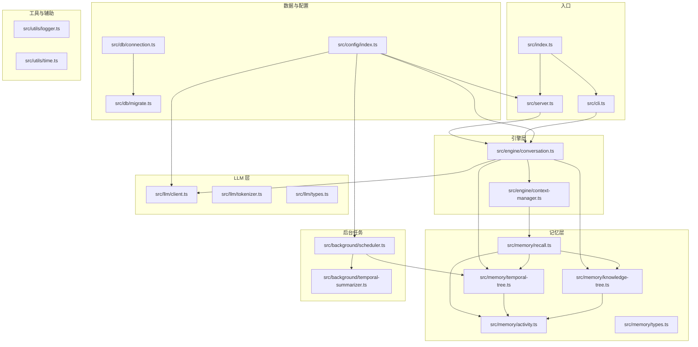
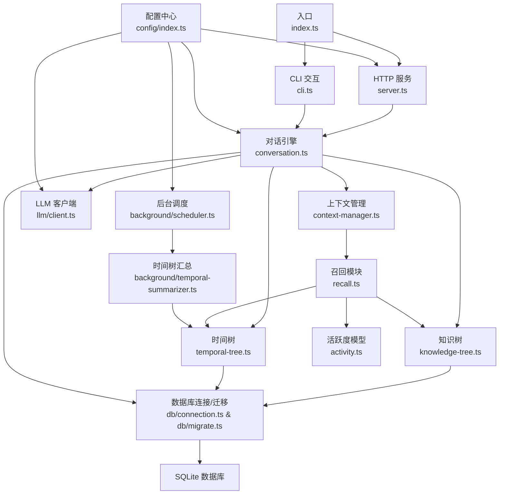
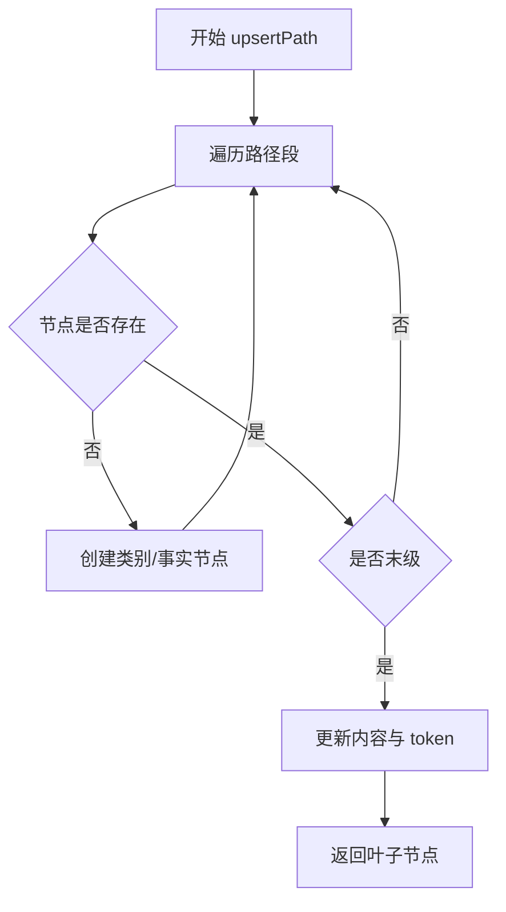
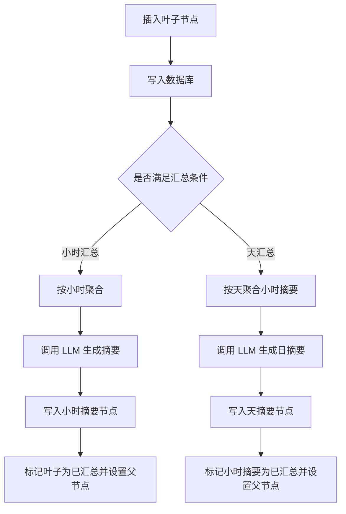
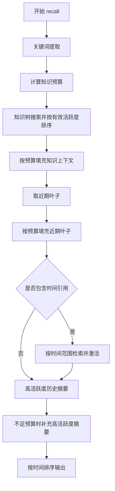
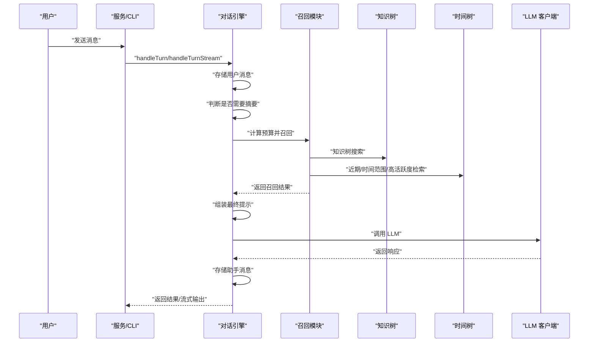
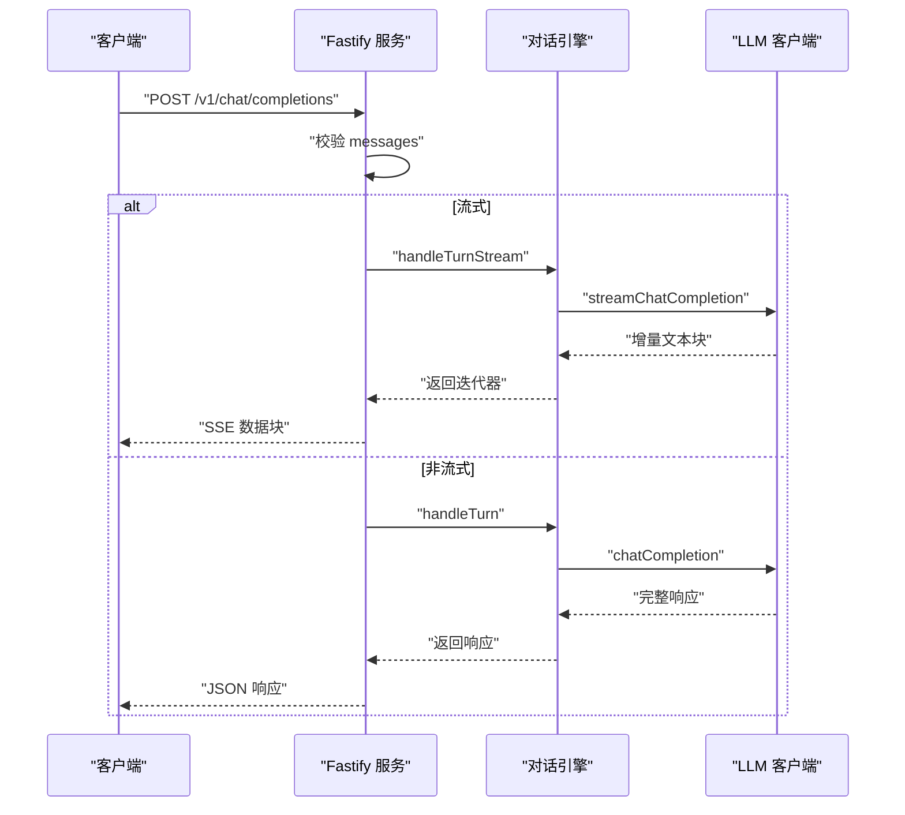
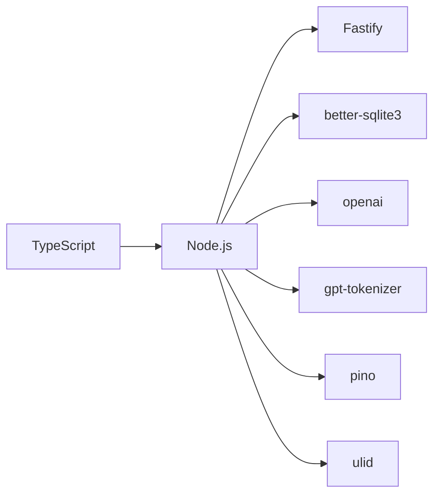

# 项目概述

<cite>
**本文引用的文件**
- [package.json](file://package.json)
- [tsconfig.json](file://tsconfig.json)
- [src/index.ts](file://src/index.ts)
- [src/server.ts](file://src/server.ts)
- [src/cli.ts](file://src/cli.ts)
- [src/config/index.ts](file://src/config/index.ts)
- [src/db/connection.ts](file://src/db/connection.ts)
- [src/db/migrate.ts](file://src/db/migrate.ts)
- [src/engine/conversation.ts](file://src/engine/conversation.ts)
- [src/engine/context-manager.ts](file://src/engine/context-manager.ts)
- [src/memory/knowledge-tree.ts](file://src/memory/knowledge-tree.ts)
- [src/memory/temporal-tree.ts](file://src/memory/temporal-tree.ts)
- [src/memory/recall.ts](file://src/memory/recall.ts)
- [src/memory/activity.ts](file://src/memory/activity.ts)
- [src/memory/types.ts](file://src/memory/types.ts)
- [src/llm/client.ts](file://src/llm/client.ts)
- [src/llm/tokenizer.ts](file://src/llm/tokenizer.ts)
- [src/llm/types.ts](file://src/llm/types.ts)
- [src/background/scheduler.ts](file://src/background/scheduler.ts)
- [src/background/temporal-summarizer.ts](file://src/background/temporal-summarizer.ts)
- [src/utils/logger.ts](file://src/utils/logger.ts)
- [src/utils/time.ts](file://src/utils/time.ts)
</cite>

## 目录
1. [引言](#引言)
2. [项目结构](#项目结构)
3. [核心组件](#核心组件)
4. [架构总览](#架构总览)
5. [详细组件分析](#详细组件分析)
6. [依赖分析](#依赖分析)
7. [性能考虑](#性能考虑)
8. [故障排查指南](#故障排查指南)
9. [结论](#结论)
10. [附录](#附录)

## 引言
TreeMemory 是一个基于双树状结构的智能对话记忆系统，通过“知识树”和“时间树”的协同记忆架构，结合智能活跃度衰减模型与多阶段记忆召回机制，实现对长程对话与知识的高效组织与检索。系统提供 OpenAI 兼容的 HTTP API 接口，支持流式与非流式响应，并提供 CLI 交互模式，便于本地开发与快速验证。

- 核心价值主张
  - 双树记忆架构：知识树用于语义知识的层次化组织，时间树用于对话历史的时间分层摘要。
  - 活跃度衰减模型：通过时间衰减与手动激活，动态维持上下文相关性。
  - 多阶段召回：按“近期叶子 → 时间范围 → 高活跃度摘要”的优先级填充上下文预算。
  - OpenAI 兼容接口：统一的聊天完成接口与内存查询接口，便于集成与迁移。
  - 轻量持久化：基于 SQLite 的本地数据库，无需外部依赖，易于部署。

- 目标用户
  - 需要长期对话记忆的开发者与研究者
  - 希望在本地或私有环境中运行的大模型应用集成者
  - 进行对话系统实验与产品原型的工程团队

- 应用场景
  - 长期对话助手与个人知识库
  - 企业内部智能问答与工单处理
  - 大模型应用的上下文增强与记忆扩展

- 差异化优势
  - 双树架构天然支持“事实记忆”和“历史记忆”的解耦与互补
  - 主动活跃度管理避免无关信息污染上下文
  - 多阶段召回兼顾时效性与历史完整性
  - OpenAI 兼容接口降低迁移成本

## 项目结构
项目采用按功能域划分的目录结构，核心模块包括引擎层（对话与上下文）、记忆层（知识树、时间树、召回与活跃度）、LLM 层（客户端与分词器）、后台任务（调度与滚动汇总）、配置与数据库迁移、以及 CLI 与 HTTP 服务入口。

图表来源
- [src/index.ts:1-36](file://src/index.ts#L1-L36)
- [src/server.ts:1-165](file://src/server.ts#L1-L165)
- [src/cli.ts:1-195](file://src/cli.ts#L1-L195)
- [src/engine/conversation.ts:1-280](file://src/engine/conversation.ts#L1-L280)
- [src/engine/context-manager.ts:1-105](file://src/engine/context-manager.ts#L1-L105)
- [src/memory/knowledge-tree.ts:1-239](file://src/memory/knowledge-tree.ts#L1-L239)
- [src/memory/temporal-tree.ts:1-362](file://src/memory/temporal-tree.ts#L1-L362)
- [src/memory/recall.ts:1-168](file://src/memory/recall.ts#L1-L168)
- [src/memory/activity.ts:1-51](file://src/memory/activity.ts#L1-L51)
- [src/llm/client.ts:1-56](file://src/llm/client.ts#L1-L56)
- [src/background/scheduler.ts:1-46](file://src/background/scheduler.ts#L1-L46)
- [src/background/temporal-summarizer.ts:1-34](file://src/background/temporal-summarizer.ts#L1-L34)
- [src/db/migrate.ts:1-88](file://src/db/migrate.ts#L1-L88)
- [src/config/index.ts:1-30](file://src/config/index.ts#L1-L30)

章节来源
- [src/index.ts:1-36](file://src/index.ts#L1-L36)
- [src/server.ts:1-165](file://src/server.ts#L1-L165)
- [src/cli.ts:1-195](file://src/cli.ts#L1-L195)

## 核心组件
- 双树记忆架构
  - 知识树：层次化的类别与事实节点，支持路径插入、搜索与上下文拼接。
  - 时间树：按叶子（消息）、小时摘要、天摘要三级组织，支持滚动汇总与时间窗口检索。
- 智能活跃度与衰减
  - 活跃度随时间指数衰减，支持节点与祖先链路的激活传播。
- 多阶段记忆召回
  - 知识召回（关键词搜索，按有效活跃度排序）→ 近期叶子 → 时间范围 → 高活跃度历史摘要。
- 上下文组装与摘要
  - 动态计算召回预算，组装系统提示、历史摘要、早期摘要与当前缓冲区。
  - 超阈值时对早期消息进行摘要，减少上下文开销。
- OpenAI 兼容接口
  - /v1/chat/completions 支持流式与非流式；/v1/memory/* 提供知识树与时间树查询；/v1/conversations 提供会话管理。
- 后台任务
  - 定时滚动汇总时间树（小时与天），触发知识抽取任务队列。

章节来源
- [src/memory/knowledge-tree.ts:1-239](file://src/memory/knowledge-tree.ts#L1-L239)
- [src/memory/temporal-tree.ts:1-362](file://src/memory/temporal-tree.ts#L1-L362)
- [src/memory/recall.ts:1-168](file://src/memory/recall.ts#L1-L168)
- [src/engine/context-manager.ts:1-105](file://src/engine/context-manager.ts#L1-L105)
- [src/engine/conversation.ts:1-280](file://src/engine/conversation.ts#L1-L280)
- [src/server.ts:1-165](file://src/server.ts#L1-L165)
- [src/background/scheduler.ts:1-46](file://src/background/scheduler.ts#L1-L46)
- [src/background/temporal-summarizer.ts:1-34](file://src/background/temporal-summarizer.ts#L1-L34)

## 架构总览
系统采用“入口 → 引擎 → 记忆/LLM → 数据库/后台”的分层设计。入口根据参数选择 CLI 或 HTTP 模式；引擎负责对话状态管理、上下文组装与调用 LLM；记忆层提供知识树与时间树的增删查改与召回；LLM 层封装 OpenAI 兼容客户端与分词；后台任务负责时间树滚动汇总与知识抽取；配置中心统一管理模型、端口、阈值与衰减参数。

图表来源
- [src/index.ts:1-36](file://src/index.ts#L1-L36)
- [src/server.ts:1-165](file://src/server.ts#L1-L165)
- [src/cli.ts:1-195](file://src/cli.ts#L1-L195)
- [src/engine/conversation.ts:1-280](file://src/engine/conversation.ts#L1-L280)
- [src/engine/context-manager.ts:1-105](file://src/engine/context-manager.ts#L1-L105)
- [src/memory/recall.ts:1-168](file://src/memory/recall.ts#L1-L168)
- [src/memory/knowledge-tree.ts:1-239](file://src/memory/knowledge-tree.ts#L1-L239)
- [src/memory/temporal-tree.ts:1-362](file://src/memory/temporal-tree.ts#L1-L362)
- [src/memory/activity.ts:1-51](file://src/memory/activity.ts#L1-L51)
- [src/llm/client.ts:1-56](file://src/llm/client.ts#L1-L56)
- [src/background/scheduler.ts:1-46](file://src/background/scheduler.ts#L1-L46)
- [src/background/temporal-summarizer.ts:1-34](file://src/background/temporal-summarizer.ts#L1-L34)
- [src/db/connection.ts](file://src/db/connection.ts)
- [src/db/migrate.ts:1-88](file://src/db/migrate.ts#L1-L88)
- [src/config/index.ts:1-30](file://src/config/index.ts#L1-L30)

## 详细组件分析

### 知识树（Knowledge Tree）
- 设计要点
  - 根节点固定存在，路径段逐级创建类别节点，末级为事实节点。
  - 支持按路径前缀查找与全文关键词搜索，按有效活跃度重排。
  - 提供上下文字符串格式化，便于注入系统提示。
- 关键流程
  - upsertPath：沿路径创建/更新节点，记录 token 数与时间戳。
  - search：关键词 LIKE 检索 + 有效活跃度二次排序。
  - toContextString：生成可读的上下文文本。
- 复杂度
  - upsertPath：O(k)（k 为路径长度）
  - search：O(n) 检索 + O(k log k) 重排（n 为候选数，k 为 topK）

图表来源
- [src/memory/knowledge-tree.ts:55-120](file://src/memory/knowledge-tree.ts#L55-L120)

章节来源
- [src/memory/knowledge-tree.ts:1-239](file://src/memory/knowledge-tree.ts#L1-L239)

### 时间树（Temporal Tree）
- 设计要点
  - 三级结构：叶子（消息）、小时摘要、天摘要；支持滚动汇总与时间窗口查询。
  - getContextWindow：按预算优先取近期叶子，再取小时摘要，最后取天摘要。
  - getRecentLeaves、getByTimeRange、getTopByActivity：支撑不同粒度的检索。
- 关键流程
  - insertLeaf：插入叶子节点并统计 token。
  - summarizeHour/summarizeDay：调用 LLM 生成摘要，建立父-子关系并标记已汇总。
  - getContextWindow：三阶段填充预算，避免重叠覆盖。
- 复杂度
  - summarizeHour：O(m)（m 为小时内的叶子数）
  - getContextWindow：O(L + H + D)（L/H/D 为对应层级的节点数）

图表来源
- [src/memory/temporal-tree.ts:96-216](file://src/memory/temporal-tree.ts#L96-L216)

章节来源
- [src/memory/temporal-tree.ts:1-362](file://src/memory/temporal-tree.ts#L1-L362)

### 记忆召回（Recall）
- 设计要点
  - 多阶段召回：知识树（关键词 + 有效活跃度）→ 近期叶子 → 时间范围 → 高活跃度历史摘要。
  - 关键词提取：中英文停用词过滤、中文分词与二字符子词生成。
  - 时间引用解析：支持“今天/昨天/上周”等自然语言时间表达。
- 关键流程
  - extractKeywords：清洗与切分关键词。
  - extractTimeReference：解析时间范围。
  - recall：按阶段填充预算并激活召回节点。
- 复杂度
  - recall：O(K + R + T + A)（K/R/T/A 为各阶段候选数）

图表来源
- [src/memory/recall.ts:95-167](file://src/memory/recall.ts#L95-L167)

章节来源
- [src/memory/recall.ts:1-168](file://src/memory/recall.ts#L1-L168)

### 对话引擎（Conversation Engine）
- 设计要点
  - 会话状态：内存缓存 + 持久化，支持标题自动生成、回合计数与早期摘要累积。
  - 上下文组装：系统提示 + 知识上下文 + 历史摘要 + 早期摘要 + 当前缓冲区。
  - 摘要策略：达到阈值比例时对早期消息进行摘要，减少上下文开销。
  - 流式与非流式：统一调用 LLM 客户端，流式实时输出增量。
- 关键流程
  - handleTurn/handleTurnStream：存储用户消息 → 判断摘要 → 召回 → 组装提示 → 调用 LLM → 存储助手回复 → 定期入队知识抽取。
  - listConversations/getConversationMessages/deleteConversation：会话生命周期管理。
- 复杂度
  - handleTurn：主要受 LLM 调用与数据库写入主导。

图表来源
- [src/engine/conversation.ts:103-219](file://src/engine/conversation.ts#L103-L219)
- [src/engine/context-manager.ts:53-104](file://src/engine/context-manager.ts#L53-L104)
- [src/memory/recall.ts:95-167](file://src/memory/recall.ts#L95-L167)
- [src/memory/knowledge-tree.ts:138-164](file://src/memory/knowledge-tree.ts#L138-L164)
- [src/memory/temporal-tree.ts:222-283](file://src/memory/temporal-tree.ts#L222-L283)
- [src/llm/client.ts:20-55](file://src/llm/client.ts#L20-L55)

章节来源
- [src/engine/conversation.ts:1-280](file://src/engine/conversation.ts#L1-L280)
- [src/engine/context-manager.ts:1-105](file://src/engine/context-manager.ts#L1-L105)

### HTTP 服务器与 OpenAI 兼容接口
- 设计要点
  - /v1/chat/completions：接收 messages、model、stream、conversation_id，支持 SSE 流式输出。
  - /v1/memory/*：知识树与时间树查询与写入。
  - /v1/conversations/*：会话列表、详情与删除。
  - 健康检查 /health。
- 实现细节
  - 流式响应：逐块写入 data: 行，结束时发送 [DONE]。
  - 非流式响应：构造标准 OpenAI 结构体字段。
  - 会话 ID：首次请求时自动分配，后续复用。

图表来源
- [src/server.ts:18-109](file://src/server.ts#L18-L109)
- [src/engine/conversation.ts:166-219](file://src/engine/conversation.ts#L166-L219)
- [src/llm/client.ts:37-55](file://src/llm/client.ts#L37-L55)

章节来源
- [src/server.ts:1-165](file://src/server.ts#L1-L165)

### CLI 交互模式
- 设计要点
  - 交互式命令行：/help、/memory、/history、/stats、/recall、/add、/new、/quit。
  - 实时流式输出：与 HTTP 流式逻辑一致。
  - 统计信息：显示会话、时间树、知识树与当前会话状态。
- 使用场景
  - 快速验证功能、调试记忆效果、手动添加知识。

章节来源
- [src/cli.ts:1-195](file://src/cli.ts#L1-L195)

### 配置与环境变量
- 关键配置项
  - LLM 基础地址、API Key、模型名
  - 上下文最大 token、摘要阈值比例
  - 数据库路径、HTTP 端口
  - 后台任务间隔、活跃度衰减率、活跃度提升幅度
- 默认值与来源
  - 通过 dotenv 加载环境变量，未设置时采用默认值。

章节来源
- [src/config/index.ts:1-30](file://src/config/index.ts#L1-L30)

### 数据库与迁移
- 表结构
  - temporal_nodes：时间树节点（叶子/小时/天摘要）
  - knowledge_nodes：知识树节点（类别/事实）
  - conversations：会话元数据
  - conversation_messages：会话消息缓冲区
  - background_tasks：后台任务队列
- 迁移策略
  - 初始化 schema 并设置 user_version，确保幂等执行。

章节来源
- [src/db/migrate.ts:1-88](file://src/db/migrate.ts#L1-L88)

## 依赖分析
- 技术栈选择与优势
  - TypeScript：强类型保障，提升可维护性与协作效率。
  - Node.js：生态丰富，适合快速构建与部署。
  - Fastify：高性能 HTTP 框架，内置严格模式与良好性能。
  - better-sqlite3：零依赖、高性能 SQLite 驱动，适合本地与嵌入式场景。
  - openai/gpt-tokenizer：OpenAI 兼容与准确的分词，便于成本控制。
  - pino：结构化日志，便于生产监控与问题定位。
  - ulid：全局唯一标识符，避免时钟回拨问题。
- 外部依赖与版本
  - 详见 package.json 中 dependencies 与 devDependencies。

图表来源
- [package.json:17-32](file://package.json#L17-L32)

章节来源
- [package.json:1-34](file://package.json#L1-L34)

## 性能考虑
- 记忆召回预算
  - 动态计算可用 token 预算，平衡系统提示、缓冲区与响应预留，避免超限。
- 时间衰减与活跃度
  - 指数衰减抑制陈旧信息，激活传播保证相关节点的可见性。
- 滚动汇总
  - 小时与天摘要显著降低历史检索成本，提升检索命中率与响应速度。
- 分词与上下文
  - 使用 gpt-tokenizer 精确估算 token，避免截断与浪费。
- I/O 优化
  - SQLite 事务与批量更新，减少磁盘写入次数。
- 并发与流式
  - 流式响应降低首字节延迟，提升用户体验。

## 故障排查指南
- 常见问题
  - LLM 请求失败：检查 LLM_BASE_URL、LLM_API_KEY、LLM_MODEL 是否正确配置。
  - 数据库无法初始化：确认 DB_PATH 权限与磁盘空间，查看迁移日志。
  - HTTP 端口占用：调整 HTTP_PORT 或释放端口。
  - 记忆召回为空：检查关键词提取与时间范围解析，确认知识树与时间树是否为空。
- 日志定位
  - 使用 pino 输出结构化日志，关注后台调度、摘要与召回过程中的错误信息。
- 资源监控
  - 观察数据库表规模与索引使用情况，必要时增加索引或清理历史数据。

章节来源
- [src/utils/logger.ts:1-10](file://src/utils/logger.ts#L1-L10)
- [src/background/scheduler.ts:9-21](file://src/background/scheduler.ts#L9-L21)
- [src/db/migrate.ts:4-87](file://src/db/migrate.ts#L4-L87)

## 结论
TreeMemory 通过双树记忆架构与智能活跃度管理，实现了对对话与知识的长期、有序与高效的组织。其多阶段召回与滚动汇总策略在保证上下文质量的同时，有效控制了计算与存储成本。OpenAI 兼容接口与 CLI 模式降低了使用门槛，适合从原型到生产的多种场景。建议在生产环境中结合资源监控与日志体系，持续优化阈值与索引策略，以获得更佳的稳定性与性能。

## 附录
- 术语对照
  - 知识树：语义知识的层次化存储结构
  - 时间树：按时间分层的历史摘要结构
  - 有效活跃度：考虑时间衰减后的节点权重
  - 回调预算：用于限制上下文大小的 token 预算
  - 摘要：对历史消息或摘要的压缩表示
- 快速启动
  - 设置环境变量后，分别运行 dev:cli 或 dev:server 脚本进入交互或 HTTP 模式。